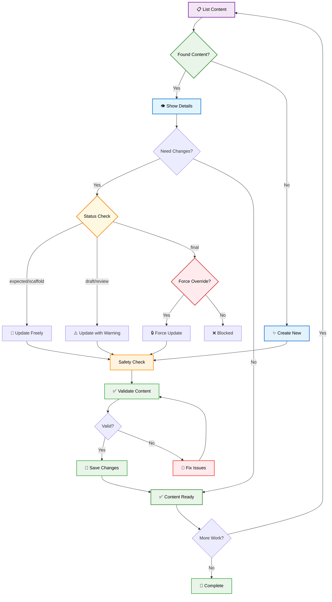

# Content Creator CLI - User Guide

> **📚 Content Creation Tool:**
>
> This guide explains how to use the **Content Creator CLI** - your command-line assistant for creating, managing, and organizing educational content for the cloud-native learning platform. This tool helps you create lessons, quizzes, study guides, and other educational materials with proper validation and structure.

---

## 1. OVERVIEW

### What is Content Creator?

Content Creator is a command-line tool that helps you:

- ✅ **Create** new educational content (lessons, quizzes, study guides)
- ✅ **List** and browse existing content
- ✅ **Update** content with safety checks
- ✅ **Validate** content structure and quality
- ✅ **Delete** outdated or incorrect content
- ✅ **Organize** content by units and types

### Content Management Workflow



---

## 2. INSTALLATION & SETUP

### Prerequisites

Make sure you have access to the learning platform project and the necessary permissions to create content.

### Quick Start

Open your terminal and navigate to the project directory. All Content Creator commands start with:

```bash
npx tsx src/scripts/content-creator.ts [command] [options]
```

### Getting Help

```bash
# Show all available commands
npx tsx src/scripts/content-creator.ts --help

# Get help for a specific command
npx tsx src/scripts/content-creator.ts create --help
```

---

## 3. COMMAND REFERENCE

### Command Structure

```
content-creator [global-flags] <command> [command-options]
```

### Global Flags

| Flag                | Description                                     | Example             |
| ------------------- | ----------------------------------------------- | ------------------- |
| `--dry-run`         | Preview what will happen without making changes | `--dry-run`         |
| `--force-overwrite` | Skip safety confirmations (use carefully!)      | `--force-overwrite` |
| `--help`            | Show help information                           | `--help`            |

### Available Commands

| Command         | Purpose                  | Input Options                                                         | Target Options                               |
| --------------- | ------------------------ | --------------------------------------------------------------------- | -------------------------------------------- |
| **list**        | Browse existing content  | Filters: `--unit`, `--type`, `--status`                               | Multiple content items                       |
| **show** (view) | Display detailed content | Target: `--id`, `--file`                                              | Single content item                          |
| **create**      | Add new content          | Data: `--file`, `--data`, inline JSON                                 | Output: `--output` path                      |
| **update**      | Modify existing content  | JSON paths: `--set`, Content: `--content`, `--content-file`, `--data` | Target: `--file`, `--id`, `--unit`, `--type` |
| **delete**      | Remove content           | Filters: `--unit`, `--type`, `--status`                               | Target: `--file`, `--id`, bulk               |
| **validate**    | Check content quality    | Content: `--file`, `--content`, `--data`                              | Single or multiple files                     |

#### **Command Input/Output Details:**

**Content Input Methods:**

- **File-based**: `--file path/to/content.ts` (existing content files)
- **ID-based**: `--id content_identifier` (lookup by unique ID)
- **Inline JSON**: `--content '{"title":"New Title"}'` (direct JSON)
- **Inline Data**: `--data 'title: New Title'` (JSON/YAML format)
- **External Files**: `--content-file updates.json` (JSON from file)
- **JSON Paths**: `--set status=review,metadata.difficulty=advanced` (dot notation)

**Target Selection:**

- **Single**: `--file`, `--id` (specific content)
- **Bulk**: `--unit=1,2`, `--type=lesson,quiz`, `--status=draft` (multiple items)
- **Filters**: Combine filters for precise targeting

**Output Options:**

- **Formats**: `--format json|yaml|yml|plain` (output format)
- **Safety**: `--dry-run` (preview), `--force-overwrite` (bypass protection)

### Content Safety & Protection Strategy

Content Creator implements a comprehensive safety strategy to protect your content based on its lifecycle status:

#### Protection Rules:

- **expected**: ✅ Can be created/updated freely
- **scaffold**: ✅ Can be overwritten/deleted freely
- **draft**: ⚠️ Can be modified with warning
- **review**: ⚠️ Can be modified with warning
- **final**: 🔒 **PROTECTED** - requires `--force-overwrite` flag
- **orphan**: ⚠️ Can be modified with warning

#### Safety Override:

Use `--force-overwrite` flag to override protection for final content:

```bash
npx tsx src/scripts/content-creator.ts update --file=lesson.ts --force-overwrite
```

---

## 4. FORMAT SUPPORT & CONTENT LIFECYCLE

### 4.1 Output Formats

Content Creator supports multiple output formats for flexible data consumption:

#### **Supported Formats:**

- `plain` - Human-readable table format (default for `list`)
- `json` - Structured JSON output (default for `view`, `status`, etc.)
- `yaml` - YAML format for configuration and readability
- `yml` - YAML alias (same as `yaml`)

#### **Format Options:**

**Unified Format (Simple):**

```bash
--format <format>     # Controls both input and output
```

**Granular Control (Advanced):**

```bash
--input-format <format>   # Specific input format
--output-format <format>  # Specific output format (overrides --format)
```

#### **Command Defaults:**

| Command       | Default Output  | Alternative Formats    | Notes                           |
| ------------- | --------------- | ---------------------- | ------------------------------- |
| `list`        | `plain` (table) | `json`, `yaml`, `yml`  | Paths hidden by default         |
| `show`/`view` | `json`          | `plain`, `yaml`, `yml` | Detailed content inspection     |
| `create`      | `json`          | `yaml`, `yml`          | Content creation results        |
| `update`      | `json`          | `yaml`, `yml`          | Supports multiple input methods |
| `delete`      | `json`          | `plain`, `yaml`, `yml` | Safety checks included          |
| `validate`    | `json`          | `yaml`, `yml`          | Content quality reports         |

#### **Format Examples:**

**Table Output (plain):**

```bash
npx tsx src/scripts/content-creator.ts list --unit=01 --format=plain
```

**JSON Output:**

```bash
npx tsx src/scripts/content-creator.ts list --unit=01 --format=json
```

Example JSON output:

```json
[
	{
		"unit": "01",
		"chapter": "1",
		"type": "lesson",
		"id": "01_01_lesson_development_environment",
		"title": "Setting Up Development Environment",
		"status": "draft",
		"fileExists": true,
		"estimatedTime": 30,
		"difficulty": "beginner"
	},
	{
		"unit": "01",
		"chapter": "2",
		"type": "quiz",
		"id": "01_02_quiz_environment_check",
		"title": "Environment Setup Quiz",
		"status": "final",
		"fileExists": true,
		"estimatedTime": 15,
		"difficulty": "intermediate"
	}
]
```

**YAML Output:**

```bash
npx tsx src/scripts/content-creator.ts list --unit=01 --format=yaml
```

Example YAML output:

```yaml
- unit: "01"
  chapter: "1"
  type: "lesson"
  id: "01_01_lesson_development_environment"
  title: "Setting Up Development Environment"
  status: "draft"
  fileExists: true
  estimatedTime: 30
  difficulty: "beginner"
- unit: "01"
  chapter: "2"
  type: "quiz"
  id: "01_02_quiz_environment_check"
  title: "Environment Setup Quiz"
  status: "final"
  fileExists: true
  estimatedTime: 15
  difficulty: "intermediate"
```

**Mixed Format (YAML input, JSON output):**

```bash
npx tsx src/scripts/content-creator.ts create \
  --input-format=yaml \
  --output-format=json \
  --data='unit: 1\ntype: lesson\ntitle: "My Lesson"'
```

### 4.2 Content Lifecycle Management

Content Creator manages a complete content lifecycle with status tracking:

#### **Content Status Lifecycle:**

```
expected → scaffold → draft → review → final
```

**Status Definitions:**

1. **`expected`** - Content planned/outlined but not yet created (exists in content-menu but no physical file)
2. **`scaffold`** - Basic structure generated with placeholder content
3. **`draft`** - Real content being developed and authored
4. **`review`** - Content ready for review, editing, and quality assurance
5. **`final`** - Approved, published content ready for production

**Additional Status:**

- **`orphan`** - Content exists in filesystem but not referenced in content-menu

#### **Status Management Commands:**

**View Status:**

```bash
# Show status of specific content
npx tsx src/scripts/content-creator.ts show --id=01_01_lesson_dev_env

# List content with status filtering
npx tsx src/scripts/content-creator.ts list --unit=1 --status=draft

# Show all lessons across units with their status
npx tsx src/scripts/content-creator.ts list --type=lesson
```

**Update Status:**

```bash
# Move specific content to next stage using JSON path
npx tsx src/scripts/content-creator.ts update --id=01_01_lesson_dev_env --set=status=review

# Move all Unit 1 content from draft to review
npx tsx src/scripts/content-creator.ts update --unit=1 --set=status=review --dry-run  # preview first
npx tsx src/scripts/content-creator.ts update --unit=1 --set=status=review             # actually update

# Easy transition from review to final
npx tsx src/scripts/content-creator.ts update --unit=2 --set=status=final --dry-run
```

**Safety Features:**

- **Dry-run mode** - Preview changes before applying
- **Final content protection** - Requires `--force-overwrite` to modify 'final' content
- **Bulk operation limits** - Prevents accidental mass operations

#### **Status Display:**

- ⏳ `expected` - Content planned but not created
- 🚧 `scaffold` - Basic structure in place
- 📝 `draft` - Content being authored
- 🔍 `review` - Ready for review
- ✅ `final` - Published and approved
- 🔶 `orphan` - File exists but not in content-menu

---

## 5. CONTENT SAFETY & PROTECTION STRATEGY

### 5.1 Safety Overview

Content Creator implements a comprehensive safety strategy based on the PLAN-CONTENT-GENERATION.md Section 4.3 to protect your content during operations. This ensures that valuable content is not accidentally modified or deleted.

### 5.2 Content Status Protection Rules

#### **Protection Levels:**

| Status     | Icon | Protection Level | Operations Allowed              |
| ---------- | ---- | ---------------- | ------------------------------- |
| `expected` | ⏳   | **None**         | ✅ Create/Update/Delete freely  |
| `scaffold` | 🚧   | **None**         | ✅ Create/Update/Delete freely  |
| `draft`    | 📝   | **Warning**      | ⚠️ Operations with warnings     |
| `review`   | 🔍   | **Warning**      | ⚠️ Operations with warnings     |
| `final`    | ✅   | **Protected**    | 🔒 Requires `--force-overwrite` |
| `orphan`   | 🔶   | **Warning**      | ⚠️ Operations with warnings     |

### 5.3 Safety Examples

**Safe Operations (No Protection):**

```bash
# Creating expected content - allowed
npx tsx src/scripts/content-creator.ts create --file=expected_lesson.ts

# Updating scaffold content - allowed
npx tsx src/scripts/content-creator.ts update --id=scaffold_quiz --set=status=draft
```

**Warning Operations (Proceed with Caution):**

```bash
# Updating draft content - warning shown but allowed
npx tsx src/scripts/content-creator.ts update --id=draft_lesson --set=title="New Title"

# Shows: ⚠️  Updating content with 'draft' status.
```

**Protected Operations (Require Force):**

```bash
# This will FAIL without --force-overwrite
npx tsx src/scripts/content-creator.ts update --id=final_lesson --set=title="Changed"

# This will SUCCEED with force flag
npx tsx src/scripts/content-creator.ts update --id=final_lesson --set=title="Changed" --force-overwrite
```

### 5.4 Safety Override Commands

**Global Force Override:**

```bash
# Apply to any command to override all safety checks
--force-overwrite
```

**Dry Run Preview:**

```bash
# Preview operations without making changes
--dry-run
```

**Examples with Safety Override:**

```bash
# Force update final content
npx tsx src/scripts/content-creator.ts update \
  --status=final \
  --set=metadata.lastUpdated="2024-01-15" \
  --force-overwrite

# Force delete final content
npx tsx src/scripts/content-creator.ts delete \
  --status=final \
  --force-overwrite

# Preview bulk operation safely
npx tsx src/scripts/content-creator.ts delete \
  --unit=1,2,3 \
  --dry-run
```

### 5.5 Safety Best Practices

1. **Always use `--dry-run` first** for bulk operations
2. **Be cautious with `--force-overwrite`** - only use when necessary
3. **Check content status** before making changes with `list` command
4. **Backup important content** manually before major changes
5. **Review warnings carefully** before proceeding

---

## 6. CREATING CONTENT

### 6.1 Create by Content ID (Recommended)

**Create content using inline JSON data:**

```bash
npx tsx src/scripts/content-creator.ts create \
  --id=01_01_lesson_containers \
  --data='{"title": "Introduction to Containers", "status": "draft", "type": "lesson", "summary": "Learn the fundamentals of containerization technology"}'
```

**Create content using inline YAML data:**

```bash
npx tsx src/scripts/content-creator.ts create \
  --id=01_02_quiz_containers \
  --format=yaml \
  --data='
title: "Container Fundamentals Quiz"
type: "quiz"
status: "draft"
difficulty: "beginner"
estimatedTime: 15
questions:
  - type: "multiple_choice"
    question: "What is a container?"
    options: ["Virtual machine", "Isolated process", "Database"]
    correct: 1
'
```

**Create from JSON file:**

```bash
npx tsx src/scripts/content-creator.ts create \
  --id=01_03_study_guide_containers \
  --file=input/study_guide_template.json
```

Example `input/study_guide_template.json`:

```json
{
	"title": "Container Technology Study Guide",
	"type": "study_guide",
	"status": "draft",
	"difficulty": "intermediate",
	"estimatedTime": 45,
	"summary": "Comprehensive study guide covering container fundamentals",
	"studyGuide": [
		{
			"term": "Container",
			"definition": "A lightweight, standalone, executable package that includes everything needed to run an application"
		},
		{
			"term": "Image",
			"definition": "A read-only template used to create containers"
		}
	],
	"keyTakeaways": [
		"Containers provide application isolation",
		"Images are immutable blueprints for containers",
		"Containers share the host OS kernel"
	]
}
```

**Create by merging file with inline data:**

```bash
npx tsx src/scripts/content-creator.ts create \
  --id=01_04_lesson_advanced \
  --file=templates/lesson_base.json \
  --data='{"title": "Advanced Container Networking", "difficulty": "advanced"}'
```

### 6.2 Create by Unit/Chapter/Type Structure

**Create lesson with complete structure:**

```bash
npx tsx src/scripts/content-creator.ts create \
  --unit=1 --chapter=1 --type=lesson \
  --data='{
    "title": "Container Fundamentals",
    "status": "draft",
    "difficulty": "beginner",
    "estimatedTime": 30,
    "summary": "Introduction to containerization concepts",
    "learningObjectives": [
      "Understand what containers are",
      "Learn container vs VM differences",
      "Create your first container"
    ],
    "sections": [
      {
        "title": "What are Containers?",
        "content": "Containers are lightweight, portable execution environments..."
      }
    ]
  }'
```

**Create quiz with detailed structure:**

```bash
npx tsx src/scripts/content-creator.ts create \
  --unit=2 --chapter=3 --type=quiz \
  --format=yaml \
  --data='
title: "Python Microservices Quiz"
status: "draft"
difficulty: "intermediate"
estimatedTime: 20
summary: "Test your knowledge of Python microservices"
questions:
  - type: "multiple_choice"
    question: "Which framework is commonly used for Python microservices?"
    options: ["Django", "Flask", "FastAPI", "All of the above"]
    correct: 3
    explanation: "All three frameworks can be used for microservices, each with different strengths"
  - type: "true_false"
    question: "Microservices must always use different databases"
    correct: false
    explanation: "Microservices can share databases, though separate databases are often preferred"
'
```

### 6.3 Create with Different Input Methods

**Using external YAML file:**

```bash
npx tsx src/scripts/content-creator.ts create \
  --unit=3 --chapter=2 --type=lesson \
  --file=input/kubernetes_lesson.yaml
```

Example `input/kubernetes_lesson.yaml`:

```yaml
title: "Kubernetes Fundamentals"
status: "draft"
difficulty: "intermediate"
estimatedTime: 45
summary: "Learn Kubernetes orchestration basics"
prerequisites:
  - "Docker containers"
  - "Basic networking"
learningObjectives:
  - "Deploy applications to Kubernetes"
  - "Understand pods and services"
  - "Manage container orchestration"
sections:
  - title: "Introduction to Orchestration"
    content: "Container orchestration automates deployment, scaling, and management..."
    codeBlocks:
      - language: "yaml"
        code: |
          apiVersion: v1
          kind: Pod
          metadata:
            name: my-app
          spec:
            containers:
            - name: app
              image: nginx:latest
  - title: "Kubernetes Architecture"
    content: "Kubernetes follows a master-worker architecture..."
    diagram: |
      graph LR
          A["Master Node"] --> B["Worker Node 1"]
          A --> C["Worker Node 2"]
          B --> D["Pod 1"]
          B --> E["Pod 2"]
```

**Merge template with custom data:**

```bash
npx tsx src/scripts/content-creator.ts create \
  --id=01_03_study_guide_containers \
  --file=templates/study_guide_template.json \
  --data='{"title": "Custom Study Guide", "status": "review", "difficulty": "advanced"}'
```

### Create Command Options

| Option      | Required | Description                     | Example                             |
| ----------- | -------- | ------------------------------- | ----------------------------------- |
| `--file`    | \*       | Path to content JSON file       | `--file=input/content.json`         |
| `--data`    | \*       | Inline content data (JSON/YAML) | `--data='{"title": "New Content"}'` |
| `--id`      | \*\*     | Content unique identifier       | `--id=01_01_lesson_containers`      |
| `--unit`    | \*\*     | Unit number (1-20)              | `--unit=1`                          |
| `--chapter` | \*\*     | Chapter number                  | `--chapter=1`                       |
| `--type`    | \*\*     | Content type                    | `--type=lesson`                     |
| `--format`  | ❌       | Input/output format             | `--format=yaml`                     |

**\* Required:** Either `--file` OR `--data` must be provided (or both for merging)
**\*\* Required:** Either `--id` OR `--unit/--chapter/--type` for automatic path mapping

**Content Types:**

- `lesson` - Educational content with explanations
- `quiz` - Interactive questions and assessments
- `study_guide` - Reference materials and summaries

---

## 7. BROWSING CONTENT

### 6.1 List All Content

**See everything:**

```bash
npx tsx src/scripts/content-creator.ts list
```

### 6.2 Filter by Unit

**Unit 1 content only:**

```bash
npx tsx src/scripts/content-creator.ts list --unit=1
```

**Multiple units:**

```bash
npx tsx src/scripts/content-creator.ts list --unit=1
npx tsx src/scripts/content-creator.ts list --unit=2
```

### 6.3 Filter by Content Type

**All lessons:**

```bash
npx tsx src/scripts/content-creator.ts list --type=lesson
```

**All quizzes:**

```bash
npx tsx src/scripts/content-creator.ts list --type=quiz
```

### 6.4 Combined Filters

**Unit 2 lessons only:**

```bash
npx tsx src/scripts/content-creator.ts list --unit=2 --type=lesson
```

### List Command Options

| Option     | Description              | Values                          | Example          |
| ---------- | ------------------------ | ------------------------------- | ---------------- |
| `--unit`   | Filter by unit number    | 1-20                            | `--unit=3`       |
| `--type`   | Filter by content type   | `lesson`, `quiz`, `study_guide` | `--type=quiz`    |
| `--status` | Filter by content status | `expected`, `scaffold`, etc.    | `--status=final` |

---

## 8. VIEWING CONTENT DETAILS

### 7.1 Show Specific Content

**Display detailed information about content:**

```bash
# Show content by ID
npx tsx src/scripts/content-creator.ts show --id=lesson_intro

# Show content by file path
npx tsx src/scripts/content-creator.ts show --file=tmp/content-creator/lesson.ts
```

**Using the view alias:**

```bash
# 'view' is an alias for 'show'
npx tsx src/scripts/content-creator.ts view --id=quiz_basics
```

### Show Command Options

| Option   | Description               | Example             |
| -------- | ------------------------- | ------------------- |
| `--id`   | Show content by ID        | `--id=lesson_intro` |
| `--file` | Show content by file path | `--file=lesson.ts`  |

---

## 9. UPDATING CONTENT

**The update command supports multiple ways to provide content updates:**

1. **JSON Path Updates** (`--set`): For specific field updates using dot notation
2. **JSON Content** (`--content`): For merging complete JSON objects
3. **Content Files** (`--content-file`): For updates from external JSON files
4. **Inline Data** (`--data`): For JSON/YAML content provided directly

### 9.1 JSON Path Updates (--set)

**Update specific fields using JSON path syntax:**

```bash
# Update status and metadata in one command
npx tsx src/scripts/content-creator.ts update \
  --file=src/data/book/unit01/01_01_lesson.ts \
  --set=status=review,metadata.difficulty=advanced
```

**Update nested properties with different data types:**

```bash
# Update various field types: strings, numbers, booleans, arrays
npx tsx src/scripts/content-creator.ts update \
  --id=lesson_intro \
  --set='metadata.estimatedTime=45,config.showHints=true,tags=["docker","containers","beginner"]'
```

**Bulk updates by filters:**

```bash
# Update all lessons in unit 1 to review status
npx tsx src/scripts/content-creator.ts update \
  --unit=1 --type=lesson \
  --set=status=review

# Update quiz configuration across all quizzes
npx tsx src/scripts/content-creator.ts update \
  --type=quiz \
  --set='config.timeLimit=600,config.showProgress=true,config.allowRetry=false'

# Update difficulty for all draft content
npx tsx src/scripts/content-creator.ts update \
  --status=draft \
  --set=difficulty=intermediate
```

### 9.2 JSON Values in Updates

**Parse JSON values correctly:**

```bash
# Boolean and numeric values
npx tsx src/scripts/content-creator.ts update \
  --file=quiz.ts \
  --set=config.enabled=true,config.maxAttempts=3

# Array values
npx tsx src/scripts/content-creator.ts update \
  --file=lesson.ts \
  --set='metadata.tags=["docker","containers","beginner"]'
```

### 9.3 Content File Updates

**Update using external JSON file:**

```bash
# Update from JSON file
npx tsx src/scripts/content-creator.ts update \
  --file=src/data/book/unit01/01_01_lesson.ts \
  --content-file=updates/lesson_improvements.json
```

Example `updates/lesson_improvements.json`:

```json
{
	"status": "review",
	"metadata": {
		"difficulty": "intermediate",
		"estimatedTime": 35,
		"lastUpdated": "2024-01-15"
	},
	"learningObjectives": [
		"Understand container isolation",
		"Learn Docker commands",
		"Build and run containers",
		"Manage container lifecycle"
	],
	"keyTakeaways": [
		"Containers provide process isolation",
		"Images are immutable blueprints",
		"Use multi-stage builds for optimization"
	]
}
```

**Update using external YAML file:**

```bash
# Update from YAML file
npx tsx src/scripts/content-creator.ts update \
  --id=quiz_fundamentals \
  --content-file=updates/quiz_enhancements.yaml \
  --format=yaml
```

Example `updates/quiz_enhancements.yaml`:

```yaml
status: "final"
difficulty: "beginner"
estimatedTime: 20
questions:
  - type: "multiple_choice"
    question: "What is the main benefit of containers?"
    options:
      - "Faster boot times"
      - "Application isolation"
      - "Reduced memory usage"
      - "Better graphics"
    correct: 1
    explanation: "Containers provide application isolation while sharing the host OS kernel"
  - type: "true_false"
    question: "Containers include their own operating system"
    correct: false
    explanation: "Containers share the host OS kernel, unlike virtual machines"
config:
  showExplanations: true
  allowRetry: true
  timeLimit: 300
```

**Update with inline JSON data:**

```bash
# Direct JSON content update
npx tsx src/scripts/content-creator.ts update \
  --id=lesson_01 \
  --content='{"status": "review", "metadata": {"difficulty": "intermediate", "tags": ["docker", "fundamentals"]}}'
```

**Update with inline YAML data:**

```bash
# Direct YAML content update
npx tsx src/scripts/content-creator.ts update \
  --file=src/data/book/unit02/02_01_lesson.ts \
  --format=yaml \
  --data='
status: "final"
summary: "Advanced container networking and service discovery"
sections:
  - title: "Container Networks"
    content: "Docker creates isolated networks for containers..."
  - title: "Service Discovery"
    content: "Services can discover each other using DNS..."
'
```

**Merge file content with inline data:**

```bash
# Combine external file with inline overrides
npx tsx src/scripts/content-creator.ts update \
  --id=study_guide_networking \
  --content-file=templates/networking_base.json \
  --data='{"status": "review", "difficulty": "advanced"}'
```

### 9.4 Safety and Preview

**Preview updates (recommended):**

```bash
npx tsx src/scripts/content-creator.ts update \
  --file=lesson.ts \
  --set=status=final \
  --dry-run
```

**Force updates for protected content:**

```bash
# Override protection for final content
npx tsx src/scripts/content-creator.ts update \
  --file=final_lesson.ts \
  --set=title="Updated Title" \
  --force-overwrite
```

### Update Command Options

| Option           | Description                     | Example                           |
| ---------------- | ------------------------------- | --------------------------------- |
| `--file`         | Specific file to update         | `--file=lesson.ts`                |
| `--id`           | Update by content ID            | `--id=lesson_intro`               |
| `--unit`         | Update all content in unit(s)   | `--unit=1,2`                      |
| `--type`         | Update all content of type(s)   | `--type=lesson,quiz`              |
| `--set`          | JSON path updates               | `--set=status=review`             |
| `--content`      | JSON content to merge           | `--content='{"status": "draft"}'` |
| `--content-file` | Path to JSON content file       | `--content-file=updates.json`     |
| `--data`         | Inline content data (JSON/YAML) | `--data='{"title": "New Title"}'` |

---

## 10. DELETING CONTENT

### 9.1 Delete by File Path

**Remove a specific content file:**

```bash
npx tsx src/scripts/content-creator.ts delete --file=lesson.ts
```

### 9.2 Delete by Content ID

**Remove content by its unique identifier:**

```bash
npx tsx src/scripts/content-creator.ts delete --id=lesson_intro
```

### 9.3 Bulk Delete Operations

**Delete by unit:**

```bash
# Delete all content in unit 1
npx tsx src/scripts/content-creator.ts delete --unit=1

# Delete content in multiple units
npx tsx src/scripts/content-creator.ts delete --unit=1,2,3
```

**Delete by content type:**

```bash
# Delete all quizzes
npx tsx src/scripts/content-creator.ts delete --type=quiz

# Delete multiple content types
npx tsx src/scripts/content-creator.ts delete --type=lesson,quiz
```

**Delete by status:**

```bash
# Delete all scaffold content
npx tsx src/scripts/content-creator.ts delete --status=scaffold

# Delete draft and review content
npx tsx src/scripts/content-creator.ts delete --status=draft,review
```

**Combined filters:**

```bash
# Delete all draft lessons in unit 1
npx tsx src/scripts/content-creator.ts delete --unit=1 --type=lesson --status=draft
```

### 9.4 Safety Protections

**Final content protection:**

```bash
# This will be blocked without --force-overwrite
npx tsx src/scripts/content-creator.ts delete --status=final

# Override protection for final content
npx tsx src/scripts/content-creator.ts delete --status=final --force-overwrite
```

**Bulk deletion safety:**

```bash
# Large bulk operations require confirmation
npx tsx src/scripts/content-creator.ts delete --unit=1,2,3 --force-overwrite
```

**Preview deletions (recommended):**

```bash
# See what would be deleted before committing
npx tsx src/scripts/content-creator.ts delete --unit=2 --dry-run
```

### Delete Command Options

| Option     | Description                   | Example                   |
| ---------- | ----------------------------- | ------------------------- |
| `--file`   | Delete specific file          | `--file=lesson.ts`        |
| `--id`     | Delete by content ID          | `--id=lesson_intro`       |
| `--unit`   | Delete all content in unit(s) | `--unit=1,2`              |
| `--type`   | Delete by content type(s)     | `--type=lesson,quiz`      |
| `--status` | Delete by content status      | `--status=scaffold,draft` |

---

## 11. VALIDATING CONTENT

### 8.1 Validate Everything

**Check all content:**

```bash
npx tsx src/scripts/content-creator.ts validate
```

### 8.2 Validate by Unit

**Check Unit 1 only:**

```bash
npx tsx src/scripts/content-creator.ts validate --unit=1
```

### 8.3 Validate by Type

**Check all lessons:**

```bash
npx tsx src/scripts/content-creator.ts validate --type=lesson
```

### 8.4 Validate Specific Content

**Validate specific file:**

```bash
npx tsx src/scripts/content-creator.ts validate \
  --file=src/data/book/unit01/01_01_lesson.ts
```

**Validate inline content:**

```bash
npx tsx src/scripts/content-creator.ts validate \
  --content='{
    "title": "Test Content",
    "type": "lesson",
    "status": "draft",
    "sections": [
      {
        "title": "Introduction",
        "content": "This is test content...",
        "diagram": "graph LR\n    A[\"Start\"] --> B[\"End\"]"
      }
    ]
  }'
```

**Validate YAML content:**

```bash
npx tsx src/scripts/content-creator.ts validate \
  --format=yaml \
  --data='
title: "Kubernetes Networking"
type: "lesson"
status: "draft"
sections:
  - title: "Pod Networking"
    content: "Pods communicate within the cluster..."
    diagram: |
      graph LR
          A["Pod A"] --> B["Service"]
          B --> C["Pod B"]
'
```

**Validate external file:**

```bash
npx tsx src/scripts/content-creator.ts validate \
  --file=input/new_content.yaml
```

### Validation Checks

The validator checks for:

- ✅ **Structure** - Proper content format and organization
- ✅ **Required Fields** - All necessary information is present
- ✅ **Content Quality** - Educational standards compliance
- ✅ **Technical Format** - Valid TypeScript and data structure
- ✅ **Cross-References** - Links and references work correctly
- ✅ **Mermaid Syntax** - Valid diagram syntax using mmdc (Mermaid CLI) validation

**Note on Mermaid Validation**: The validator uses **mmdc** (Mermaid Command Line Interface) for server-side validation, not Mermaid.js. This is crucial because:

- **Mermaid.js** requires browser environment (DOM, Canvas, etc.) which isn't available in Node.js/CLI contexts
- **mmdc** is a standalone executable that provides ~95%+ accuracy compared to browser Mermaid.js rendering
- **mmdc** ensures diagrams will work in production without requiring browser-specific dependencies

Additional best practices from MERMAID-STANDARDS.md (double quotes, mobile-first layout, etc.) are **recommendations for better user experience** rather than validation requirements. Debug capabilities for Mermaid diagrams are implemented in the `MermaidDiagram` component (`src/lib/components/demo/MermaidDiagram.svelte`).

### Validation Options

| Option   | Description            | Example         |
| -------- | ---------------------- | --------------- |
| `--unit` | Validate specific unit | `--unit=1`      |
| `--type` | Validate content type  | `--type=lesson` |

---

## 12. CONTENT STANDARDS & QUALITY

### Required Content Structure

All content must follow the standards defined in:

- **[CONTENT-STANDARDS.md](CONTENT-STANDARDS.md)** - Content creation workflows and quality requirements
- **[MERMAID-STANDARDS.md](MERMAID-STANDARDS.md)** - Diagram standards and formatting rules

### Quality Guidelines

**Lessons should include:**

- Clear learning objectives
- Step-by-step explanations
- Practical examples
- Key takeaways

**Quizzes should include:**

- Multiple choice questions
- Correct answers with explanations
- Difficulty progression
- Performance feedback

**Study Guides should include:**

- Key concept summaries
- Important terminology
- Quick reference materials
- Practice exercises

### Content Validation Rules

| Rule                  | Description                                 | Error Prevention        |
| --------------------- | ------------------------------------------- | ----------------------- |
| **Unique IDs**        | Each content item needs a unique identifier | Prevents conflicts      |
| **Valid Units**       | Unit numbers must be 1-20                   | Maintains organization  |
| **Required Fields**   | Title, content, metadata must be present    | Ensures completeness    |
| **Format Compliance** | Must follow TypeScript structure            | Technical compatibility |

---

## 13. TEMPLATE FILES AND COMMON PATTERNS

### 13.1 Template File Examples

**Basic Lesson Template (`templates/lesson_base.json`):**

```json
{
	"type": "lesson",
	"status": "scaffold",
	"difficulty": "beginner",
	"estimatedTime": 30,
	"summary": "",
	"prerequisites": [],
	"learningObjectives": [],
	"sections": [
		{
			"title": "Introduction",
			"content": "TODO: Add introduction content"
		},
		{
			"title": "Key Concepts",
			"content": "TODO: Add key concepts"
		},
		{
			"title": "Practical Examples",
			"content": "TODO: Add examples",
			"codeBlocks": []
		},
		{
			"title": "Summary",
			"content": "TODO: Add summary"
		}
	],
	"keyTakeaways": [],
	"additionalResources": []
}
```

**Quiz Template (`templates/quiz_base.yaml`):**

```yaml
type: "quiz"
status: "scaffold"
difficulty: "beginner"
estimatedTime: 15
summary: ""
questions: []
config:
  showExplanations: true
  allowRetry: true
  timeLimit: 300
  showProgress: true
  randomizeQuestions: false
```

**Study Guide Template (`templates/study_guide_base.json`):**

```json
{
	"type": "study_guide",
	"status": "scaffold",
	"difficulty": "beginner",
	"estimatedTime": 20,
	"summary": "",
	"studyGuide": [],
	"keyTakeaways": [],
	"flashcards": [
		{
			"front": "Sample term",
			"back": "Sample definition"
		}
	],
	"practiceQuestions": []
}
```

### 13.2 Common Content Creation Patterns

**Pattern 1: Scaffold then Enhance**

```bash
# 1. Create scaffold from template
npx tsx src/scripts/content-creator.ts create \
  --id=02_01_lesson_kubernetes \
  --file=templates/lesson_base.json \
  --data='{"title": "Kubernetes Introduction", "difficulty": "intermediate"}'

# 2. Add detailed content
npx tsx src/scripts/content-creator.ts update \
  --id=02_01_lesson_kubernetes \
  --content-file=content/kubernetes_details.json

# 3. Mark as draft when content is added
npx tsx src/scripts/content-creator.ts update \
  --id=02_01_lesson_kubernetes \
  --set=status=draft

# 4. Validate before review
npx tsx src/scripts/content-creator.ts validate \
  --id=02_01_lesson_kubernetes
```

**Pattern 2: Bulk Content Creation**

```bash
# Create multiple scaffolds for a unit
for chapter in 1 2 3; do
  npx tsx src/scripts/content-creator.ts create \
    --unit=3 --chapter=$chapter --type=lesson \
    --file=templates/lesson_base.json \
    --data="{\"title\": \"Unit 3 Chapter $chapter\", \"status\": \"scaffold\"}"
done

# Bulk update metadata
npx tsx src/scripts/content-creator.ts update \
  --unit=3 --type=lesson \
  --set=difficulty=intermediate,estimatedTime=45
```

**Pattern 3: Content Review Workflow**

```bash
# 1. List all draft content
npx tsx src/scripts/content-creator.ts list --status=draft --format=json

# 2. Move selected content to review
npx tsx src/scripts/content-creator.ts update \
  --unit=1 --status=draft \
  --set=status=review

# 3. Validate all review content
npx tsx src/scripts/content-creator.ts validate --status=review

# 4. Approve final content (with force if needed)
npx tsx src/scripts/content-creator.ts update \
  --id=01_01_lesson_containers \
  --set=status=final \
  --force-overwrite
```

## 14. GENERATED JSON SCHEMAS

### Schema Generation

JSON schemas are automatically generated from TypeScript Zod definitions using **Zod v4 native conversion** (`z.toJSONSchema()`).

**Architecture:**

- **Conversion Method**: Zod v4 native `z.toJSONSchema()` (no external libraries)
- **Source**: `src/lib/schemas/ContentSchemas.ts` (39+ Zod schema definitions)
- **Output**: `src/data/generated/content-schemas.json` (single consolidated file)
- **Format**: JSON Schema Draft 7 specification
- **Validation Preservation**: All Zod constraints preserved (minLength, maxLength, required, enum, etc.)

**Generation Commands:**

```bash
# Generate schemas
npx tsx src/scripts/generate-schemas.ts
make generate-schemas
pnpm run generate-schemas

# List available schemas
npx tsx src/scripts/generate-schemas.ts list

# Dry-run mode
npx tsx src/scripts/generate-schemas.ts --dry-run --verbose
```

### External Validation Tools

The generated JSON Schema can be used with standard validation tools for content validation:

#### Using AJV (Recommended)

**Installation:**

```bash
# Already installed as dev dependency
pnpm add -D ajv-cli ajv-formats
```

**Basic Validation:**

```bash
# Validate content file against schema
ajv validate \
  -s src/data/generated/content-schemas.json \
  -d src/data/book/unit01/01_01_lesson.ts \
  --spec=draft7

# Validate the schema itself (meta-validation)
ajv compile -s src/data/generated/content-schemas.json
```

**Advanced Validation:**

```bash
# Validate with specific definition
ajv validate \
  -s src/data/generated/content-schemas.json \
  -r "#/definitions/LessonContent" \
  -d lesson-data.json

# Validate multiple files
ajv validate \
  -s src/data/generated/content-schemas.json \
  -d "src/data/book/**/*.ts"
```

#### Using jsonschema (Alternative)

```bash
# Install globally
npm install -g jsonschema

# Validate content
jsonschema -i lesson.json src/data/generated/content-schemas.json
```

### Development Workflow

**1. Generate Schemas After Changes:**

```bash
# Make changes to ContentSchemas.ts
# Then regenerate schemas
make generate-schemas
```

**2. Validate Content Before Commit:**

```bash
# Validate all content files
ajv validate \
  -s src/data/generated/content-schemas.json \
  -d "src/data/book/unit01/*.ts"
```

**3. CI/CD Integration:**

```bash
# Add to CI/CD pipeline
ajv validate \
  -s src/data/generated/content-schemas.json \
  -d "src/data/book/**/*.ts" \
  --all-errors
```

### Content Creator Integration

**Validate After Creation:**

```bash
# Create content
npx tsx src/scripts/manage-content.ts create --id=new_lesson --data='...'

# Validate immediately with AJV
ajv validate \
  -s src/data/generated/content-schemas.json \
  -r "#/definitions/LessonContent" \
  -d path/to/new_lesson.ts
```

**Automated Validation Workflow:**

```bash
#!/bin/bash
# create-and-validate.sh

# Create content
npx tsx src/scripts/manage-content.ts create "$@"

# Extract file path from result
FILE_PATH=$(npx tsx src/scripts/manage-content.ts show --id="$1" --format=json | jq -r '.filePath')

# Validate with AJV
if [ -f "$FILE_PATH" ]; then
  ajv validate \
    -s src/data/generated/content-schemas.json \
    -d "$FILE_PATH" \
    --all-errors
fi
```

### Schema Testing

Run schema validation tests to verify external tool compatibility:

```bash
# Run schema validation tests
pnpm run test src/test/schemas-external.test.ts

# Run all schema-related tests
pnpm run test src/test/scripts/generate-schemas.test.ts src/test/schemas-external.test.ts
```

### Usage Examples

**Example 1: Validate Content Metadata**

```bash
# Create sample metadata file
cat > metadata.json << 'EOF'
{
  "title": "Docker Introduction",
  "summary": "Learn Docker containerization fundamentals",
  "keywords": ["docker", "containers", "devops"],
  "difficulty": "beginner",
  "learningObjectives": ["Understand Docker", "Create containers"]
}
EOF

# Validate against ContentMetadata schema
ajv validate \
  -s src/data/generated/content-schemas.json \
  -r "#/definitions/ContentMetadata" \
  -d metadata.json
```

**Example 2: Validate Complete Lesson**

```bash
# Validate lesson content
ajv validate \
  -s src/data/generated/content-schemas.json \
  -r "#/definitions/LessonContent" \
  -d src/data/book/unit01/01_01_lesson.ts \
  --all-errors --verbose
```

**Example 3: List Available Schemas**

```bash
# Show all available schema definitions
jq '.definitions | keys[]' src/data/generated/content-schemas.json

# Count schemas
jq '.definitions | keys | length' src/data/generated/content-schemas.json
```

### Troubleshooting

**Schema validation fails:**

```bash
# Check if schema is valid
ajv compile -s src/data/generated/content-schemas.json

# Regenerate schemas using Zod v4 native conversion
make generate-schemas
```

**Content validation errors:**

```bash
# Use verbose mode to see detailed errors
ajv validate \
  -s src/data/generated/content-schemas.json \
  -d content.ts \
  --all-errors --verbose

# Check specific definition
npx tsx src/scripts/generate-schemas.ts list | grep "SchemaName"
```

### Configuration Details

The schema generation is configured in `src/config/settings.ts`:

```typescript
schemas: {
  generation: {
    target: "draft-7",         // JSON Schema version
    io: "output",              // Zod IO mode
    unrepresentable: "any",    // Handle edge cases
    cycles: "ref"              // Resolve circular refs
  }
}
```

**Supported Validation Constraints:**

- ✅ String lengths (`minLength`, `maxLength`)
- ✅ Numeric ranges (`minimum`, `maximum`)
- ✅ Array constraints (`minItems`, `maxItems`)
- ✅ Required fields (`required: []`)
- ✅ Enums and constants (`enum`)
- ✅ Object properties with full nesting
- ✅ Format validators (`uri`, `email`, `uuid`, etc.)
- ✅ Additional properties control (`additionalProperties`)
- ✅ Type unions and discriminated unions

---

## 15. CONTENT SCHEMA ARCHITECTURE

### Overview

The content validation system uses **Zod schemas** for runtime validation of educational content. This section explains the architecture and separation of concerns.

### ContentSchemas.ts - Educational Content Only

**Location:** `src/lib/schemas/ContentSchemas.ts`

**Purpose:** Runtime validation schemas for **user-created educational content** ONLY.

**What's included:**

- ✅ **Content Types**: LessonContent, QuizContent, StudyGuideContent, ExamContent, ProjectContent
- ✅ **Content Blocks**: ParagraphBlock, CodeBlock, DiagramBlock, CalloutBlock, ImageBlock, VideoBlock, InteractiveBlock
- ✅ **Questions**: SingleChoiceQuestion, MultipleChoiceQuestion, CodeCompletionQuestion, TrueFalseQuestion, etc.
- ✅ **Rich Text**: TextNode, LinkNode, HeadingNode, RichParagraph (TASK 7B: Union-based)
- ✅ **Interactive**: FlipCard
- ✅ **Metadata**: ContentMetadata, BaseContent

**What's NOT included:**

- ❌ Navigation schemas (generated internally, TypeScript only)
- ❌ Menu/Search schemas (generated internally, TypeScript only)
- ❌ Scaffolding/CLI schemas (defined inline in CLI scripts)

### Generated JSON Schema

**Output:** `src/data/generated/content-schemas.json`

**Purpose:**

1. **User validation**: Users can validate their content locally before submitting to CLI
2. **IDE integration**: Provides autocomplete and validation in editors
3. **Documentation**: Serves as API contract for content structure

**Generation:**

```bash
npx tsx src/scripts/generate-schemas.ts
```

### Internal CLI Validation

**Where:** CLI scripts define their own validation schemas inline

**Examples:**

**generate-scaffold.ts:**

```typescript
const ScaffoldingArgsSchema = z.object({...});
const MenuStructureSchema = z.object({...});
```

**manage-content.ts:**

```typescript
const ContentGenerationResultSchema = z.object({...});
const SafetyCheckResultSchema = z.object({...});
```

**ValidationService.ts:**

```typescript
const ValidationConfigSchema = z.object({...});
```

**Rationale:**

- 🎯 **Separation of concerns**: User content vs internal operations
- 📦 **Smaller bundles**: `content-schemas.json` contains only user-facing schemas
- 🔒 **Encapsulation**: Internal validation details stay in respective modules
- 📝 **Clarity**: Clear distinction between what users create vs what system generates

### Validation Flow

**User creates content → manage-content:**

```
User writes lesson.ts
       ↓
Validates locally with content-schemas.json (optional)
       ↓
manage-content create --file=lesson.ts
       ↓
ValidationService.validateContent(content, LessonContentSchema)
       ↓
If valid → persist
```

**scaffold generates content → manage-content:**

```
scaffold --id=1.5 --type=lesson
       ↓
ValidationService validates args (inline schema)
       ↓
TemplateGenerator creates content
       ↓
manage-content.processGeneratedContent()
       ↓
ValidationService.validateContent(content, LessonContentSchema)
       ↓
If valid → persist
```

**Key insight:** Both flows use the **same ContentSchemas** for validating educational content, but different inline schemas for validating their respective CLI arguments.

---

## 16. WORKING WITH TEMPORARY FILES

### Using tmp/content-creator Directory

**Recommended workflow:**

```bash
# 1. Create content in temporary directory
npx tsx src/scripts/content-creator.ts create \
  --unit=1 \
  --type=lesson \
  --id=test_lesson \
  --file=tmp/content-creator/test_lesson.ts

# 2. Review and validate
npx tsx src/scripts/content-creator.ts validate --unit=1

# 3. If satisfied, content can be moved to final location
# 4. Clean up temporary files
rm tmp/content-creator/test_lesson.ts
```

### File Management

**Temporary directory structure:**

```
tmp/content-creator/
├── lessons/
│   ├── unit01_intro_lesson.ts
│   └── unit02_advanced_lesson.ts
├── quizzes/
│   ├── unit01_quiz.ts
│   └── unit02_quiz.ts
└── study_guides/
    ├── unit01_study_guide.ts
    └── unit02_study_guide.ts
```

**Best practices:**

- Always use `tmp/content-creator/` for testing
- Use descriptive file names
- Clean up when content is finalized
- Keep backups of important content

---

## 16. COMMON WORKFLOWS

### 11.1 Creating a Complete Unit

**Step 1: Create the lesson**

```bash
npx tsx src/scripts/content-creator.ts create \
  --unit=4 \
  --type=lesson \
  --id=microservices_intro \
  --file=tmp/content-creator/unit04_lesson.ts
```

**Step 2: Create the quiz**

```bash
npx tsx src/scripts/content-creator.ts create \
  --unit=4 \
  --type=quiz \
  --id=microservices_quiz \
  --file=tmp/content-creator/unit04_quiz.ts
```

**Step 3: Create study materials**

```bash
npx tsx src/scripts/content-creator.ts create \
  --unit=4 \
  --type=study_guide \
  --id=microservices_guide \
  --file=tmp/content-creator/unit04_study.ts
```

**Step 4: Validate everything**

```bash
npx tsx src/scripts/content-creator.ts validate --unit=4
```

### 11.2 Content Review Process

**Check what exists:**

```bash
npx tsx src/scripts/content-creator.ts list --unit=3
```

**Validate quality:**

```bash
npx tsx src/scripts/content-creator.ts validate --unit=3
```

**Update if needed:**

```bash
npx tsx src/scripts/content-creator.ts update \
  --file=tmp/content-creator/unit03_lesson.ts \
  --backup
```

### 11.3 Cleanup Workflow

**List all content:**

```bash
npx tsx src/scripts/content-creator.ts list
```

**Remove outdated quizzes:**

```bash
# First, list content to find quiz files
npx tsx src/scripts/content-creator.ts list --type=quiz

# Preview deletion of specific quiz files
npx tsx src/scripts/content-creator.ts delete --file=tmp/content-creator/unit01_quiz.ts --dry-run

# Delete specific quiz files one by one
npx tsx src/scripts/content-creator.ts delete --file=tmp/content-creator/unit01_quiz.ts
npx tsx src/scripts/content-creator.ts delete --file=tmp/content-creator/unit02_quiz.ts
```

**Validate remaining content:**

```bash
npx tsx src/scripts/content-creator.ts validate
```

---

## 17. TROUBLESHOOTING

### Common Issues and Solutions

**"Content validation failed"**

```bash
# Check specific validation errors
npx tsx src/scripts/content-creator.ts validate \
  --file=problematic_content.ts \
  --format=json

# Common fixes:
# 1. Check required fields are present
# 2. Verify Mermaid diagram syntax
# 3. Ensure proper JSON structure
```

**"File already exists"**

```bash
# Problem: Trying to create existing content
❌ npx tsx src/scripts/content-creator.ts create --id=existing_lesson

# Solutions:
✅ npx tsx src/scripts/content-creator.ts update --id=existing_lesson
✅ npx tsx src/scripts/content-creator.ts create --id=existing_lesson --force-overwrite
✅ npx tsx src/scripts/content-creator.ts create --id=new_unique_lesson
```

**"Invalid JSON/YAML input"**

```bash
# Problem: Malformed inline data
❌ --data='{"title": "Broken JSON"'  # Missing closing brace

# Solutions:
✅ --data='{"title": "Valid JSON"}'
✅ --file=external_file.json  # Use external file instead
✅ --format=yaml --data='title: "Valid YAML"'
```

**"Safety check failed - final content protected"**

```bash
# Problem: Trying to modify final content
❌ npx tsx src/scripts/content-creator.ts update --id=final_lesson --set=title="New"

# Solutions:
✅ npx tsx src/scripts/content-creator.ts update --id=final_lesson --set=title="New" --force-overwrite
✅ npx tsx src/scripts/content-creator.ts list --status=final  # Check status first
```

**"No matching content found"**

```bash
# Problem: Filters return no results
❌ npx tsx src/scripts/content-creator.ts update --unit=99 --set=status=draft

# Solutions:
✅ npx tsx src/scripts/content-creator.ts list --unit=1,2,3  # Check available units
✅ npx tsx src/scripts/content-creator.ts list                # See all content
✅ npx tsx src/scripts/content-creator.ts update --id=specific_id  # Use exact ID
```

**"Mermaid diagram validation failed"**

```bash
# Problem: Invalid diagram syntax
❌ diagram: 'graph TD\n    A[Missing quotes] --> B{Also missing}'

# Solutions:
✅ diagram: 'graph LR\n    A["Proper quotes"] --> B{"Also quoted"}'
✅ npx tsx src/scripts/content-creator.ts validate --content='{"diagram": "test_diagram"}'
```

### Example Error Outputs

**Validation Error Example:**

```
❌ Content validation failed:
   • Missing required field: title
   • Invalid diagram syntax on line 3: Expecting 'SOLID', got 'INVALID'
   • Status must be one of: expected, scaffold, draft, review, final
```

**Safety Error Example:**

```
❌ ERROR: Cannot update content with 'final' status without --force-overwrite flag.
💡 Hint: Use --force-overwrite to override this protection.
```

**JSON Parse Error Example:**

```
❌ Failed to parse JSON input: Unexpected token } in JSON at position 15
💡 Check your JSON syntax in --data or --content parameters
```

### Getting Help

**Command help:**

```bash
npx tsx src/scripts/content-creator.ts --help
npx tsx src/scripts/content-creator.ts create --help
```

**Validation details:**

```bash
npx tsx src/scripts/content-creator.ts validate --unit=1 --verbose
```

**Preview mode:**

```bash
# Add --dry-run to any command to see what it would do
npx tsx src/scripts/content-creator.ts delete --file=tmp/content-creator/sample_file.ts --dry-run
```

### File Recovery

**Automatic backups:**

- Backups are created in `tmp/` directory
- Look for files with timestamp suffixes
- Use `cp` command to restore if needed

**Manual backup:**

```bash
# Before making changes
cp tmp/content-creator/important_file.ts tmp/content-creator/important_file_backup.ts
```

---

## 18. ADVANCED USAGE

### Batch Operations

**Create multiple items:**

```bash
# Create several lessons in sequence
for unit in 1 2 3; do
  npx tsx src/scripts/content-creator.ts create \
    --unit=$unit \
    --type=lesson \
    --id=unit${unit}_intro \
    --file=tmp/content-creator/unit${unit}_lesson.ts
done
```

**Validate multiple units:**

```bash
# Validate units 1 through 5
for unit in {1..5}; do
  echo "Validating Unit $unit..."
  npx tsx src/scripts/content-creator.ts validate --unit=$unit
done
```

### Quality Assurance

**Complete validation workflow:**

```bash
# 1. List all content
npx tsx src/scripts/content-creator.ts list

# 2. Validate structure
npx tsx src/scripts/content-creator.ts validate

# 3. Check specific areas
npx tsx src/scripts/content-creator.ts validate --type=quiz
npx tsx src/scripts/content-creator.ts validate --type=lesson
```

### Integration with Other Tools

**Prepare for scaffolding:**

- Use Content Creator to create individual items
- Then use scaffold generator for bulk operations
- Content Creator focuses on quality, scaffolding on quantity

**Export and Import:**

- All content is stored in TypeScript format
- Can be easily version controlled
- Compatible with the platform's build system

---

This guide helps you create high-quality educational content efficiently. Remember to always validate your content and follow the established standards for the best learning experience!

For technical details about content structure and validation rules, refer to:

- **[CONTENT-STANDARDS.md](CONTENT-STANDARDS.md)**
- **[MERMAID-STANDARDS.md](MERMAID-STANDARDS.md)**
