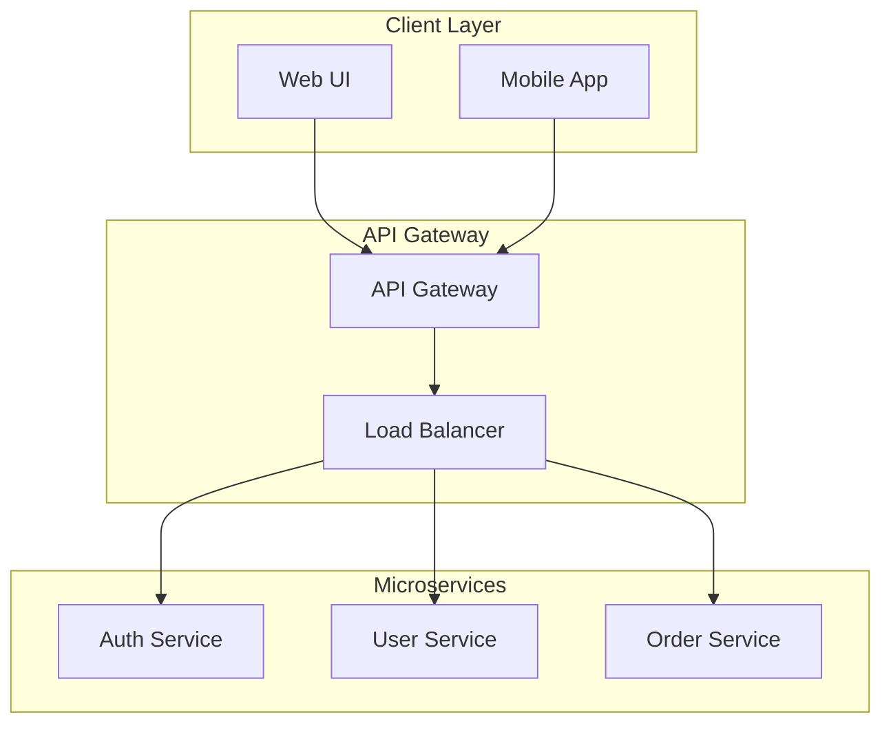
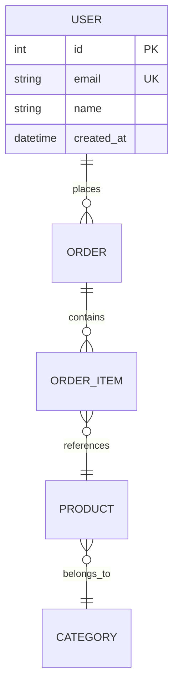

# Mermaid Diagram Standards

**🚨 CRITICAL**: Follow these rules exactly to prevent Mermaid rendering failures in all components and content generation.

> **📚 Related Documentation:**
>
> - [CLAUDE.md](CLAUDE.md) - Complete agent implementation guidelines
> - [CONTENT-STANDARDS.md](CONTENT-STANDARDS.md) - Content creation workflows
> - [TECHNICAL-SPECS.md](TECHNICAL-SPECS.md) - Technical architecture standards

---

## MANDATORY SYNTAX RULES

### Rule 1: Double Quote All Text

**ALL text in nodes and links MUST be enclosed in double quotes.**

```mermaid
<!-- ✅ CORRECT: All text in double quotes -->
graph TD
    A["User Login"] --> B{"Authentication Valid?"}
    B -->|"Yes"| C["Dashboard Access"]
    B -->|"No"| D["Error Message"]

<!-- ❌ INCORRECT: Missing quotes causes rendering failure -->
graph TD
    A[User Login] --> B{Authentication Valid?}
    B -->|Yes| C[Dashboard Access]
    B -->|No| D[Error Message]
```

### Rule 2: HTML Entity Encoding in Text

**Use HTML entities for special characters: `<`, `>`, `&`**

```mermaid
<!-- ✅ CORRECT: HTML entities for special characters -->
graph LR
    A["API Call &lt;request&gt;"] --> B["Process &amp; Validate"]
    B --> C["Response &lt;data&gt;"]

<!-- ❌ INCORRECT: Raw HTML breaks rendering -->
graph LR
    A["API Call <request>"] --> B["Process & Validate"]
```

### Rule 3: Escape Special Characters

**Escape quotes and symbols within text using backslashes.**

```mermaid
<!-- ✅ CORRECT: Escaped quotes and symbols -->
graph TD
    A["Function: \"getName()\""] --> B["Return: \"User Name\""]

<!-- ❌ INCORRECT: Unescaped quotes break parsing -->
graph TD
    A["Function: "getName()""] --> B["Return: "User Name""]
```

### Rule 4: Consistent Node Shape Syntax

**Use consistent bracket syntax for different node shapes.**

```mermaid
<!-- ✅ CORRECT: Consistent bracket usage -->
graph TB
    A["Rectangle Node"]     <!-- Rectangle: [] -->
    B("Round Edge Node")    <!-- Round edges: () -->
    C{"Diamond Node"}       <!-- Diamond: {} -->
    D[["Stadium Node"]]     <!-- Stadium: [[]] -->
    E[("Circle Node")]      <!-- Circle: [()] -->

<!-- ❌ INCORRECT: Mixed or incorrect bracket usage -->
graph TB
    A["Rectangle Node"]
    B("Round Edge Node"     <!-- Missing closing bracket -->
    C{Diamond Node}         <!-- Missing closing quote -->
```

### Rule 5: Link Text Format

**All link text must be enclosed in double quotes.**

```mermaid
<!-- ✅ CORRECT: Proper link text syntax -->
graph LR
    A["Start"] -->|"Process Data"| B["Middle"]
    B -.->|"Optional Flow"| C["End"]

<!-- ❌ INCORRECT: Missing quotes on link text -->
graph LR
    A["Start"] -->|Process Data| B["Middle"]
```

---

## COMPONENT DEBUG REQUIREMENTS

**CRITICAL: All Mermaid components MUST include debug capabilities**

### Mandatory Debug Features

1. **Debug Flag Support**: Components must accept a `debug` prop or check URL parameter `?debug=true`
2. **Error Logging**: Log all rendering errors to console with full diagram source code
3. **Fallback Content**: Display error message with diagram source when rendering fails
4. **Testing Requirements**: Generate tests that validate both successful renders and error handling

### Implementation Examples

**Svelte Component Debug Implementation:**

```typescript
// MermaidDiagram.svelte
<script lang="ts">
  import { page } from '$app/stores';

  interface Props {
    diagram: string;
    debug?: boolean;
  }

  let { diagram, debug = false }: Props = $props();

  // Check URL parameter for debug mode
  $: debugMode = debug || $page.url.searchParams.has('debug');

  // Error handling with debug logging
  function handleMermaidError(error: Error) {
    if (debugMode) {
      console.error('Mermaid render failed:', {
        diagram,
        error: error.message,
        stack: error.stack
      });
    }
    return `Error rendering diagram: ${error.message}`;
  }
</script>
```

**Debug Flag Usage:**

```svelte
<!-- URL parameter approach -->
<MermaidDiagram {diagram} debug={$page.url.searchParams.has("debug")} />

<!-- Direct prop approach -->
<MermaidDiagram {diagram} debug={true} />
```

---

## VALIDATION CHECKLIST

### Pre-Render Validation

Before implementing any Mermaid diagram, verify:

- ✅ All node text enclosed in double quotes
- ✅ All link text enclosed in double quotes
- ✅ HTML entities used for `<`, `>`, `&` characters
- ✅ Escaped quotes within text using `\"`
- ✅ Consistent bracket syntax for node shapes
- ✅ No raw HTML tags in text content

### Component Requirements

For all Mermaid components, ensure:

- ✅ Debug mode implemented in component
- ✅ Error handling and fallback content
- ✅ Console logging for debugging
- ✅ Tests for both success and failure scenarios
- ✅ Accessibility attributes (ARIA labels)
- ✅ Responsive design considerations

---

## TESTING STANDARDS

### Required Tests

**1. Successful Rendering Tests**

```javascript
// Test valid diagram syntax renders correctly
test("renders valid mermaid diagram", async () => {
	const validDiagram = `graph TD
    A["Start"] --> B["Process"]
    B --> C["End"]`;

	// Test successful render
});
```

**2. Error Handling Tests**

```javascript
// Test malformed diagram shows fallback
test("handles malformed diagram with fallback", async () => {
	const invalidDiagram = `graph TD
    A[Invalid syntax without quotes]`;

	// Test error fallback displays
});
```

**3. Debug Mode Tests**

```javascript
// Test debug mode logs errors correctly
test("debug mode logs rendering errors", async () => {
	const consoleSpy = vi.spyOn(console, "error");

	// Test debug logging
	expect(consoleSpy).toHaveBeenCalledWith("Mermaid render failed:", expect.any(Object));
});
```

### Testing Commands

```bash
# Validate Mermaid syntax and error handling
pnpm run dev    # Check rendering in browser console
pnpm run test   # Run component tests including error scenarios
pnpm run check  # TypeScript validation
```

---

## COMMON PATTERNS

### Cloud-Native Architecture Diagrams



### Database Relationships



### Development Workflows

```mermaid
gitgraph
    commit id: "Initial"
    branch feature
    checkout feature
    commit id: "Feature A"
    commit id: "Feature B"
    checkout main
    commit id: "Hotfix"
    merge feature
    commit id: "Release"
```

---

## ERROR PREVENTION CHECKLIST

### Before Content Generation

- [ ] Review syntax rules in this document
- [ ] Validate all text uses double quotes
- [ ] Check for special characters requiring HTML entities
- [ ] Verify bracket consistency for node shapes

### Before Component Implementation

- [ ] Implement debug flag support
- [ ] Add error logging functionality
- [ ] Create fallback content for render failures
- [ ] Write comprehensive test cases

### Before Deployment

- [ ] Test all diagrams in browser
- [ ] Verify debug mode works correctly
- [ ] Check console for rendering errors
- [ ] Validate accessibility compliance

---

**💡 Remember**: Mermaid rendering failures can break entire pages. Always follow these standards to ensure reliable diagram rendering across all components and content.
