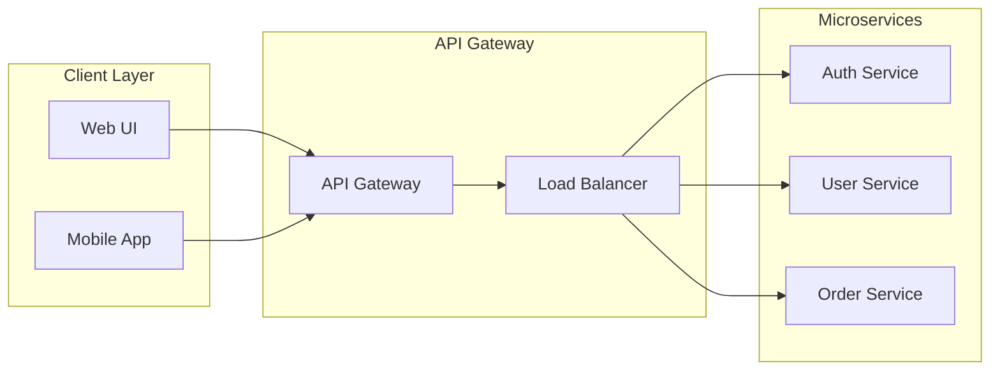
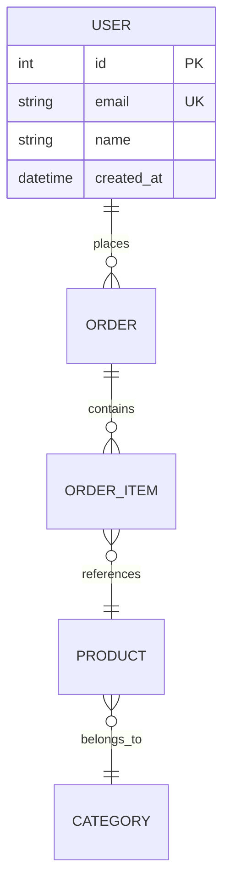

# Mermaid Diagram Standards

**🚨 CRITICAL**: Follow these rules exactly to prevent Mermaid rendering failures in all components and content generation.

> **📚 Related Documentation:**
>
> - [CLAUDE.md](CLAUDE.md) - Complete agent implementation guidelines
> - [CONTENT-STANDARDS.md](CONTENT-STANDARDS.md) - Content creation workflows
> - [TECHNICAL-SPECS.md](TECHNICAL-SPECS.md) - Technical architecture standards

---

## MANDATORY SYNTAX RULES

### Rule 1: Double Quote All Text

**ALL text in nodes and links MUST be enclosed in double quotes.**

```mermaid
<!-- ✅ CORRECT: All text in double quotes -->
graph TD
    A["User Login"] --> B{"Authentication Valid?"}
    B -->|"Yes"| C["Dashboard Access"]
    B -->|"No"| D["Error Message"]

<!-- ❌ INCORRECT: Missing quotes causes rendering failure -->
graph TD
    A[User Login] --> B{Authentication Valid?}
    B -->|Yes| C[Dashboard Access]
    B -->|No| D[Error Message]
```

### Rule 2: Prefer Raw Special Characters in Text

**Prefer using raw special characters `<`, `>`, `&` in node and link text. Avoid HTML entities unless absolutely necessary.**

```mermaid
<!-- ✅ PREFERRED: Raw special characters -->
graph LR
    A["API Call <request>"] --> B["Process & Validate"]
    B --> C["Response <data>"]

<!-- ⚠️ LESS PREFERRED: HTML entities -->
graph LR
    A["API Call &lt;request&gt;"] --> B["Process &amp; Validate"]
    B --> C["Response &lt;data&gt;"]
```

> **Note:** Raw special characters produce clearer, more readable diagrams and are supported by the latest Mermaid renderer. Use HTML entities only if you encounter rendering issues in specific environments.

### Rule 3: Escape Special Characters

**Escape quotes and symbols within text using backslashes.**

```mermaid
<!-- ✅ CORRECT: Escaped quotes and symbols -->
graph TD
    A["Function: \"getName()\""] --> B["Return: \"User Name\""]

<!-- ❌ INCORRECT: Unescaped quotes break parsing -->
graph TD
    A["Function: "getName()""] --> B["Return: "User Name""]
```

### Rule 4: Consistent Node Shape Syntax

**Use consistent bracket syntax for different node shapes.**

```mermaid
<!-- ✅ CORRECT: Consistent bracket usage -->
graph TB
    A["Rectangle Node"]     <!-- Rectangle: [] -->
    B("Round Edge Node")    <!-- Round edges: () -->
    C{"Diamond Node"}       <!-- Diamond: {} -->
    D[["Stadium Node"]]     <!-- Stadium: [[]] -->
    E[("Circle Node")]      <!-- Circle: [()] -->

<!-- ❌ INCORRECT: Mixed or incorrect bracket usage -->
graph TB
    A["Rectangle Node"]
    B("Round Edge Node"     <!-- Missing closing bracket -->
    C{Diamond Node}         <!-- Missing closing quote -->
```

### Rule 5: Link Text Format

**All link text must be enclosed in double quotes.**

```mermaid
<!-- ✅ CORRECT: Proper link text syntax -->
graph LR
    A["Start"] -->|"Process Data"| B["Middle"]
    B -.->|"Optional Flow"| C["End"]

<!-- ❌ INCORRECT: Missing quotes on link text -->
graph LR
    A["Start"] -->|Process Data| B["Middle"]
```

---

## DIAGRAM TYPES AND LAYOUT STANDARDS

### Common Mermaid Diagram Types

Mermaid supports multiple diagram types, each optimized for different use cases:

**Flowcharts (`graph`)**
- **Purpose**: Process flows, decision trees, system workflows
- **Best for**: Business logic, algorithms, user journeys
- **Syntax**: `graph TD` or `graph LR`

**Sequence Diagrams (`sequenceDiagram`)**
- **Purpose**: Time-ordered interactions between participants
- **Best for**: API calls, user authentication flows, microservice communication
- **Syntax**: `sequenceDiagram`

**Class Diagrams (`classDiagram`)**
- **Purpose**: Object-oriented system structure and relationships
- **Best for**: Software architecture, domain modeling, inheritance patterns
- **Syntax**: `classDiagram`

**Entity Relationship Diagrams (`erDiagram`)**
- **Purpose**: Database schema and entity relationships
- **Best for**: Database design, data modeling, foreign key relationships
- **Syntax**: `erDiagram`

**State Diagrams (`stateDiagram-v2`)**
- **Purpose**: State transitions and system behavior over time
- **Best for**: Application states, user session management, order lifecycles
- **Syntax**: `stateDiagram-v2`

**Git Graphs (`gitgraph`)**
- **Purpose**: Version control branching and merging strategies
- **Best for**: Development workflows, release planning, branch visualization
- **Syntax**: `gitgraph`

**User Journey Maps (`journey`)**
- **Purpose**: User experience flows with satisfaction scoring
- **Best for**: Customer experience design, touchpoint analysis, service design
- **Syntax**: `journey`

### Layout Direction for Mobile Readability

**STANDARD: Prefer `direction LR` (Left to Right) for better mobile experience.**

```mermaid
<!-- ✅ PREFERRED: Left-to-right layout for mobile -->
graph LR
    A["Start Process"] --> B["Validate Input"]
    B --> C["Process Data"]
    C --> D["Return Result"]

<!-- ⚠️ LESS OPTIMAL: Top-down can cause horizontal scrolling -->
graph TD
    A["Start Process"] --> B["Validate Input"]
    B --> C["Process Data"]
    C --> D["Return Result"]
```

**Rationale**: Left-to-right orientation encourages a linear, horizontal flow that reflows into a more manageable, vertically-scrollable format on narrow mobile screens (≤390px). This prevents the need for horizontal scrolling, which degrades the mobile user experience significantly.

**Exception**: Use `graph TD` (Top Down) only when vertical hierarchy is essential to the diagram's meaning, such as organizational charts or layered architecture diagrams where the vertical relationship is semantically important.

---

## COMPONENT DEBUG REQUIREMENTS

**CRITICAL: All Mermaid components MUST include debug capabilities**

### Mandatory Debug Features

1. **Debug Flag Support**: Components must accept a `debug` prop or check URL parameter `?debug=true`
2. **Error Logging**: Log all rendering errors to console with full diagram source code
3. **Fallback Content**: Display error message with diagram source when rendering fails
4. **Testing Requirements**: Generate tests that validate both successful renders and error handling

### Implementation Examples

**Svelte Component Debug Implementation:**

```typescript
// MermaidDiagram.svelte
<script lang="ts">
  import { page } from '$app/stores';

  interface Props {
    diagram: string;
    debug?: boolean;
  }

  let { diagram, debug = false }: Props = $props();

  // Check URL parameter for debug mode
  $: debugMode = debug || $page.url.searchParams.has('debug');

  // Error handling with debug logging
  function handleMermaidError(error: Error) {
    if (debugMode) {
      console.error('Mermaid render failed:', {
        diagram,
        error: error.message,
        stack: error.stack
      });
    }
    return `Error rendering diagram: ${error.message}`;
  }
</script>
```

**Debug Flag Usage:**

```svelte
<!-- URL parameter approach -->
<MermaidDiagram {diagram} debug={$page.url.searchParams.has("debug")} />

<!-- Direct prop approach -->
<MermaidDiagram {diagram} debug={true} />
```

---

## DIAGRAM EMBEDDING BEST PRACTICES

### HTML Content

- **Preferred:** Embed Mermaid diagrams inside `<script type="text/plain">` tags. This allows raw special characters (`<`, `>`, `&`) and avoids HTML validation errors.

  Example:

  ```html
  <script type="text/plain">
  	graph LR
  	        A["API Call <request>"] --> B["Process & Validate"]
  	        B --> C["Response <data>"]
  </script>
  ```

- **Fallback:** Only use HTML entities (`&lt;`, `&gt;`, `&amp;`) if you cannot use a plain text block and encounter validation errors. This is rare and mostly for legacy content.

### TypeScript Data Sources

- Store Mermaid diagrams as raw strings in `.ts` files (no HTML entities needed).
- Use single or double quotes, and support multiline strings (template literals).
- Example:

  ```typescript
  export const diagramExample = {
  	type: "diagram",
  	diagramType: "mermaid",
  	definition: `graph LR\n    A["API Call <request>"] --> B["Process & Validate"]\n    B --> C["Response <data>"]`
  };
  ```

- Svelte components should handle rendering, error handling, and debug mode. No HTML entity encoding is needed in TypeScript sources.

---

## VALIDATING DIAGRAMS IN TYPESCRIPT

### Why Validation is Essential

Mermaid diagrams with syntax errors can break entire page renders, causing silent failures or rendering exceptions that impact user experience. Automated validation prevents these issues by catching syntax errors before deployment, ensuring all diagrams follow the mandatory syntax rules defined in this document.

### Recommended Technology: Node.js/TypeScript

**Rationale**: For SvelteKit/TypeScript projects, Node.js with TypeScript provides the optimal validation solution because:

- **Native TypeScript Support**: Direct parsing of `.ts` files without additional transpilation
- **Ecosystem Integration**: Seamless integration with existing build tools and CI/CD pipelines
- **Mermaid Library Access**: Direct access to Mermaid's JavaScript parser for accurate validation
- **Consistency**: Uses the same runtime environment as the application itself

### Mandatory Naming Convention

To enable automated detection, all Mermaid diagram variables MUST follow this naming pattern:

```typescript
// ✅ VALID: Will be detected by validation script
export const flowchartExample = {
  diagram: `graph LR...`
};

export const sequenceDiagramAuth = {
  diagram: `sequenceDiagram...`
};

// ✅ VALID: Alternative property names
export const paymentFlow = {
  definition: `graph TD...`
};

// ❌ INVALID: Will be missed by validation
export const myChart = {
  mermaidCode: `graph LR...`
};
```

**Required Property Names**: The validation script will search for objects containing properties named: `diagram`, `definition`, or `diagramDefinition`.

### Validation Script Implementation Steps

The recommended validation script should perform these operations:

1. **Input Handling**: Accept either a single file path or directory path as argument
2. **File Discovery**: If directory provided, recursively scan for `.ts` files; if file provided, validate single file
3. **TypeScript Parsing**: Use TypeScript compiler API to parse files into AST
4. **Pattern Detection**: Identify exported objects with required property names (`diagram`, `definition`, `diagramDefinition`)
5. **Diagram Extraction**: Extract string values from identified properties, handling template literals and concatenated strings
6. **Mermaid Parser Validation**: Pass each diagram string directly to Mermaid's JavaScript parser
7. **Error Reporting**: For each validation failure, output:
   - **File path**: Relative path to the TypeScript file
   - **Variable name**: The exported variable/property containing the diagram
   - **Line number**: Where the diagram definition starts
   - **Parser error message**: Raw error from Mermaid parser

**Example Output:**
```
❌ src/data/diagrams/auth-flow.ts:15 - Variable 'loginSequence.diagram'
   Error: Parse error on line 3: Expecting 'SOLID', 'SEMI', 'NEWLINE', 'EOF', got 'INVALID'

✅ src/data/diagrams/user-journey.ts:8 - Variable 'onboardingFlow.definition'
   Valid diagram parsed successfully
```

### Integration Points

- **Pre-commit Hook**: Run validation before code commits
- **Build Process**: Integrate into `pnpm run build` for deployment validation
- **CI/CD Pipeline**: Include in automated testing workflows
- **Development**: Provide `pnpm run validate-diagrams` command for manual validation

This validation strategy ensures diagram quality while maintaining consistency with the project's TypeScript-first architecture and existing development workflows.

---

## TESTING STANDARDS

### Required Tests

**1. Successful Rendering Tests**

```javascript
// Test valid diagram syntax renders correctly
test("renders valid mermaid diagram", async () => {
	const validDiagram = `graph TD
    A["Start"] --> B["Process"]
    B --> C["End"]`;

	// Test successful render
});
```

**2. Error Handling Tests**

```javascript
// Test malformed diagram shows fallback
test("handles malformed diagram with fallback", async () => {
	const invalidDiagram = `graph TD
    A[Invalid syntax without quotes]`;

	// Test error fallback displays
});
```

**3. Debug Mode Tests**

```javascript
// Test debug mode logs errors correctly
test("debug mode logs rendering errors", async () => {
	const consoleSpy = vi.spyOn(console, "error");

	// Test debug logging
	expect(consoleSpy).toHaveBeenCalledWith("Mermaid render failed:", expect.any(Object));
});
```

### Testing Commands

```bash
# Validate Mermaid syntax and error handling
pnpm run dev    # Check rendering in browser console
pnpm run test   # Run component tests including error scenarios
pnpm run check  # TypeScript validation
```

---

## VALIDATION CHECKLIST

> **Note**: The validation script automatically verifies syntax compliance using Mermaid's parser. This checklist includes both automated checks (for reference) and manual validation requirements.

### Pre-Render Validation

Before implementing any Mermaid diagram, verify:

**Automated by validation script:**
- ✅ All node text enclosed in double quotes
- ✅ All link text enclosed in double quotes
- ✅ Proper bracket syntax for node shapes
- ✅ Escaped quotes within text using `\"`
- ✅ Valid Mermaid syntax per parser

**Manual validation required:**
- ✅ **Layout direction optimized for mobile** (`direction LR` preferred unless vertical hierarchy is semantically important)
- ✅ **Diagram type matches intended use case** (flowchart vs sequence vs class vs ER, etc.)
- ✅ **Content clarity**: Node labels are concise and descriptive
- ✅ **Logical flow**: Connections represent actual relationships/processes
- ✅ **Visual balance**: Diagram doesn't have too many nodes causing overcrowding
- ✅ **Raw special characters used** (prefer `<`, `>`, `&` over HTML entities)

### Component Integration Requirements

For all Mermaid components, ensure:

- ✅ Debug mode implemented in component
- ✅ Error handling and fallback content
- ✅ Console logging for debugging
- ✅ Tests for both success and failure scenarios
- ✅ Accessibility attributes (ARIA labels)
- ✅ Responsive design considerations

### Content Standards Compliance

Before content generation:

- ✅ **Variable naming** follows required convention (`diagram`, `definition`, `diagramDefinition`)
- ✅ **Educational metadata** included (complexity, learning objectives, use cases)
- ✅ **Mobile-first approach**: Layout works well on narrow screens (≤390px)

---

## COMMON PATTERNS

### Cloud-Native Architecture Diagrams



### Database Relationships



### Development Workflows

```mermaid
gitgraph
    commit id: "Initial"
    branch feature
    checkout feature
    commit id: "Feature A"
    commit id: "Feature B"
    checkout main
    commit id: "Hotfix"
    merge feature
    commit id: "Release"
```

---

## ERROR PREVENTION CHECKLIST

### Before Content Generation

- [ ] Review syntax rules in this document
- [ ] Validate all text uses double quotes
- [ ] Check layout direction for mobile optimization
- [ ] Verify variable naming convention compliance
- [ ] Confirm diagram type matches use case

### Before Component Implementation

- [ ] Implement debug flag support
- [ ] Add error logging functionality
- [ ] Create fallback content for render failures
- [ ] Write comprehensive test cases
- [ ] Ensure mobile-responsive layout

### Before Deployment

- [ ] **Run automated validation**: `pnpm run validate-diagrams src/data/` to check syntax compliance
- [ ] **Test rendering in browser**: Verify diagrams render correctly with debug mode enabled
- [ ] **Mobile verification**: Test mobile rendering (≤390px width) for layout responsiveness
- [ ] **Console monitoring**: Check browser console for rendering errors or warnings
- [ ] **Accessibility compliance**: Validate ARIA labels and screen reader compatibility

---

**💡 Remember**: Mermaid rendering failures can break entire pages. Always follow these standards to ensure reliable diagram rendering across all components and content, with special attention to mobile user experience.