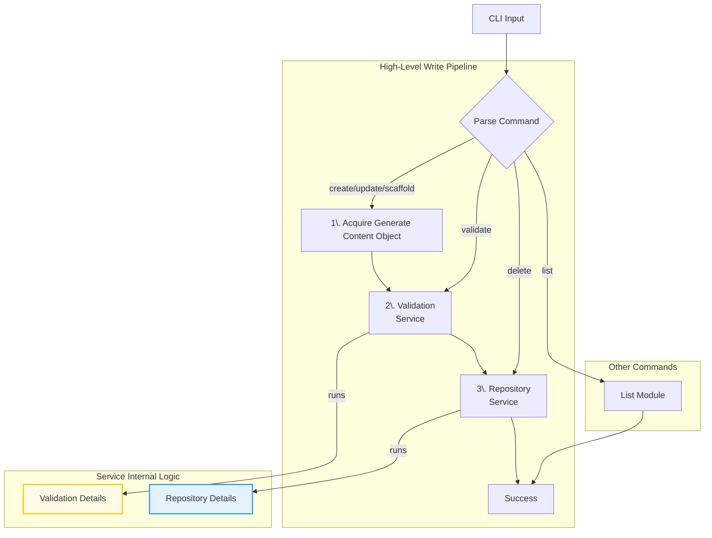
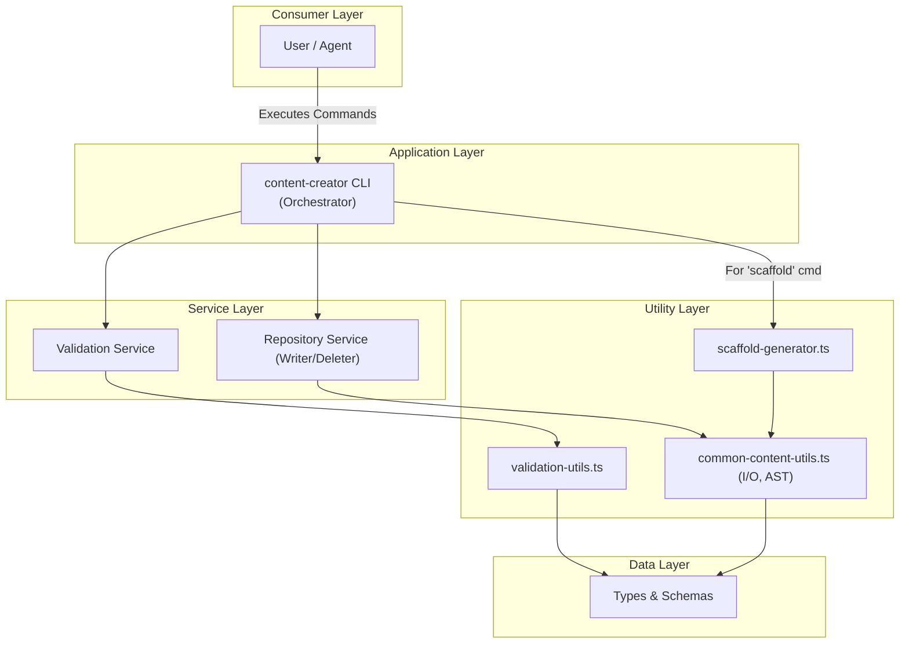
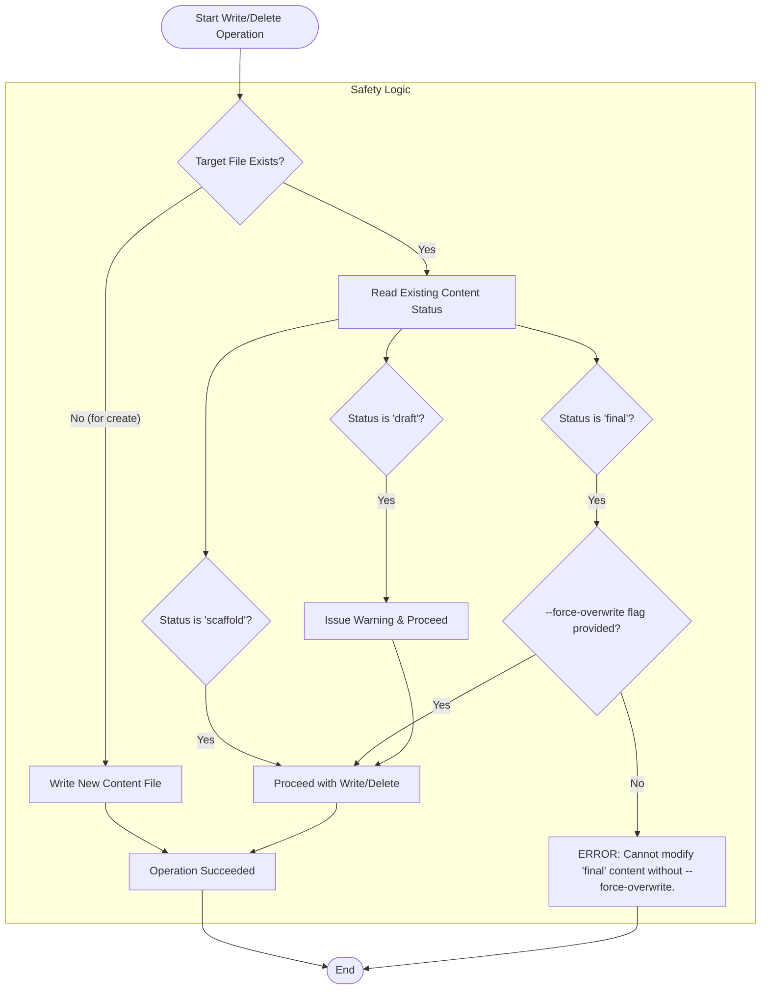

# Content Generation & Validation Plan

## 1. Architecture Overview

This document outlines a robust, service-oriented architecture for the `content-creator` CLI. The design is centered around a unified pipeline for validation and file I/O, ensuring that all content, whether auto-generated or user-provided, is processed with the same rules and safety checks.

### 1.1 Core CLI Workflow

This diagram shows the high-level data flow. The main sequence for write operations is shown as a simple pipeline, with the internal complexity of the services detailed in separate subgraphs.

- **Validation Details:** The `Validation Service` performs a multi-stage check: 1. Zod Schema & Business Rules, 2. Content-Specific checks like Mermaid syntax.
- **Repository Details:** The `Repository Service` handles the Overwrite/Delete Safety Logic before performing any file I/O.

---

### 1.2 Layered Tooling Architecture

This diagram illustrates the layered dependencies of the new architecture, from the high-level CLI down to the low-level utilities.

---

## 2. Analysis & Justification

- **Unified Pipeline:** A single validation and write pipeline for all content modifications ensures maximum consistency and reliability.
- **Layered Architecture:** The design separates concerns effectively: The CLI orchestrates, Services contain business logic, and Utilities handle low-level tasks. This makes the system easier to maintain and test.
- **Robust Validation:** The multi-layered validation pipeline (Schema, Business Rules, Content-Specific) is now a shared service, guaranteeing that no content—not even placeholders—can be written to disk in an invalid state.
- **Repository Pattern:** The `Repository Service` acts as a gatekeeper to the filesystem, centralizing all write/update/delete logic, including the critical overwrite and delete safety strategy.

---

## 3. Implementation Plan: Phased Approach

This project will be implemented in three distinct phases, building from the lowest-level utilities up to the user-facing CLI.

### **Phase 1: Foundational Modules (Utilities & Data)**

This phase focuses on creating the low-level, reusable building blocks of the application.

#### **Task 1.1: Zod Schemas & Schema Generation Script**

- **Details:**
  1. In a new directory `src/lib/validation/`, create Zod schema definitions for all content types (`LessonContent`, `QuizContent`, etc.).
  2. Embed business rules directly into the schemas using Zod's validation methods (e.g., `z.array(questionSchema).min(10)` for quizzes).
  3. Create a new script, `src/scripts/generate-json-schemas.ts`, which imports the Zod schemas and uses `zod-to-json-schema` to export them as `.json` files into the `src/schema/` directory.
  4. Add a corresponding script to `package.json`: `"generate-schemas": "tsx src/scripts/generate-json-schemas.ts"`.
- **Expected Output:**
  - Zod schema files in `src/lib/validation/`.
  - A `generate-schemas` script in `package.json`.
  - Generated JSON schema files in `src/schema/`.
- **Validation:**
  - ✅ The Zod schemas accurately reflect the TypeScript interfaces.
  - ✅ `pnpm run generate-schemas` executes successfully.

#### **Task 1.2: Core & Specialized Utilities**

- **Details:**
  1. Create `src/lib/utils/common-content-utils.ts` for general-purpose file I/O (reading, writing) and AST manipulation using `ts-morph`.
  2. Create `src/lib/utils/scaffold-generator.ts` to house the logic for creating placeholder data objects (e.g., `generatePlaceholderLesson()`).
  3. Create `src/lib/utils/validation-utils.ts` to contain the reusable Mermaid syntax validator function, which must return a structured result (`{ isValid: boolean; error?: string; }`).
- **Expected Output:**
  - `common-content-utils.ts`, `scaffold-generator.ts`, `validation-utils.ts`.
- **Validation:**
  - ✅ All utility functions are type-safe and exported.
  - ✅ The Mermaid validator correctly identifies valid and invalid syntax.

---

### **Phase 2: Service Layer Implementation**

This phase builds the core business logic on top of the foundational utilities.

#### **Task 2.1: Validation Service**

- **Details:**
  1. Create `src/lib/services/ValidationService.ts`.
  2. Expose a primary method, `validate(contentObject)`, that orchestrates the full validation pipeline (Zod schemas, then content-specific checks like the Mermaid validator).
  3. The service should return a structured result, like `{ success: boolean, errors: string[] }`.
- **Expected Output:**
  - `ValidationService.ts` file.
- **Validation:**
  - ✅ The service correctly validates or rejects content objects based on the full pipeline.
  - ✅ Error messages are clear and indicate the path of the error.

#### **Task 2.2: Repository Service**

- **Details:**
  1. Create `src/lib/services/RepositoryService.ts`.
  2. Expose methods like `writeFile(path, contentObject)` and `deleteFile(path)`.
  3. This service **must** be the sole gatekeeper for all filesystem modifications, implementing the full "Overwrite/Delete Safety Strategy" before calling the low-level I/O utilities.
- **Expected Output:**
  - `RepositoryService.ts` file.
- **Validation:**
  - ✅ The safety logic for `scaffold`, `draft`, and `final` statuses works exactly as specified.
  - ✅ Attempting to modify a `final` file without `--force-overwrite` fails as expected.

---

### **Phase 3: Application Layer (CLI)**

This phase builds the user-facing tool that orchestrates the services.

#### **Task 3.1: CLI Implementation**

- **Details:**
  1. Create the main CLI entrypoint at `src/scripts/content-creator.ts`.
  2. Use a library like `commander` to define all subcommands (`scaffold`, `list`, `create`, etc.) and global flags (`--dry-run`, `--force-overwrite`).
  3. Wire up each command to the appropriate services:
     - `scaffold`: Uses `scaffold-generator` to create objects, then passes them to the `ValidationService` and `RepositoryService`.
     - `create`/`update`: Gets user content, then passes it to the `ValidationService` and `RepositoryService`.
     - `delete`: Gets a file path and passes it directly to the `RepositoryService`.
     - `validate`: Gets a file path and passes it to the `ValidationService`.
     - `list`: Implements the read-only discovery workflow.
  4. Implement the `--dry-run` logic at this layer.
- **Expected Output:**
  - A fully functional `content-creator.ts` script.
  - A `package.json` script to run it: `"content-creator": "tsx src/scripts/content-creator.ts"`.
- **Validation:**
  - ✅ Each command and flag works as documented in the command reference table.
  - ✅ The `--dry-run` mode accurately reports intended actions without changing files.

---

## 4. API/CLI Strategy

The `content-creator` CLI is the unified interface for all content manipulation.

### 4.1 Command & Flag Reference

| Command          | Description                                                                | Options & Flags                                                                        |
| :--------------- | :------------------------------------------------------------------------- | :------------------------------------------------------------------------------------- |
| `scaffold`       | Auto-generates placeholder content for all missing files.                  | (None)                                                                                 |
| `list`           | Lists existing content with filtering capabilities.                        | `--unit <num>`, `--chapter <id>`, `--type <type>`, `--status <status>`                 |
| `create`         | Creates a new content file with real, user-provided content.               | `--type <type>`, `--unit <num>`, `--chapter <id>`, `--input <file>`, `--inline <json>` |
| `update`         | Updates an existing content file.                                          | `--file <path>`, `--inline <json>`, `--force-overwrite`                                |
| `validate`       | Validates a content file against the full validation pipeline.             | `--file <path>`                                                                        |
| `delete`         | Deletes a content file, respecting the safety strategy.                    | `--file <path>`, `--force-overwrite`                                                   |
| **Global Flags** |                                                                            |                                                                                        |
|                  | Simulates a command and logs the intended actions without writing to disk. | `--dry-run`                                                                            |
|                  | Required to overwrite or delete content with `final` status.               | `--force-overwrite`                                                                    |

### 4.2 Shared Validation Pipeline

All commands that generate or accept content (`scaffold`, `create`, `update`) **MUST** process it through the shared `Validation Service` before any write operation. The `validate` command also uses this service directly. The pipeline runs in this order:

1.  **Unified Zod Validation:** The primary validation uses a single, comprehensive Zod schema for the given content type. These schemas are designed to enforce both the **data structure** (correct properties, types, etc.) and **business rules** (e.g., using `.min(10)` on an array of questions to ensure a quiz is long enough). This makes Zod the single source of truth for most validation.

2.  **Content-Specific Validation:** After passing the Zod schema, the service runs specialized validators for specific content blocks, such as the **Mermaid syntax validator** (from TASK 3C) on all diagram definitions.

### 4.3 Shared Repository Service & Safety Strategy

The `Repository Service` is the single point of entry for all filesystem modifications, including deletion. It enforces the safety rules before performing any write, update, or delete operation.

1.  **If `status` is `"scaffold"`:** The file can be overwritten or deleted freely.
2.  **If `status` is `"draft"`:** The file can be overwritten or deleted, but a prominent warning will be displayed.
3.  **If `status` is `"final"`:** The operation will **fail by default**. Modifying or deleting requires the `--force-overwrite` flag. For updates, the new content must also have a `status` of `"final"`.

---

## 5. Module Design: `scaffold` Command

The `scaffold` command is now a simple client of the shared services.

- **Responsibility:** Its sole job is to determine which files are missing and use the `scaffold-generator.ts` utility to create placeholder content objects.
- **Workflow:**
  1. It generates a list of placeholder objects.
  2. It passes each object to the shared `Validation Service`.
  3. If valid, it passes the object and target file path to the shared `Repository Service`, which then handles the write logic and safety checks.

---

## 6. Summary of Key Principles

- **Unified Pipeline:** A single validation and write/delete pipeline for all content modifications ensures maximum consistency and reliability.
- **Layered Architecture:** The design separates concerns effectively: The CLI orchestrates, Services contain business logic, and Utilities handle low-level tasks.
- **Validate First, Write Last:** No file is ever created, modified, or deleted until it has passed all necessary validation and safety checks.
- **Design for Safety:** The CLI is powerful yet safe, with a discovery command (`list`), a simulation mode (`--dry-run`), and a strict, centralized safety policy managed by the Repository Service.
