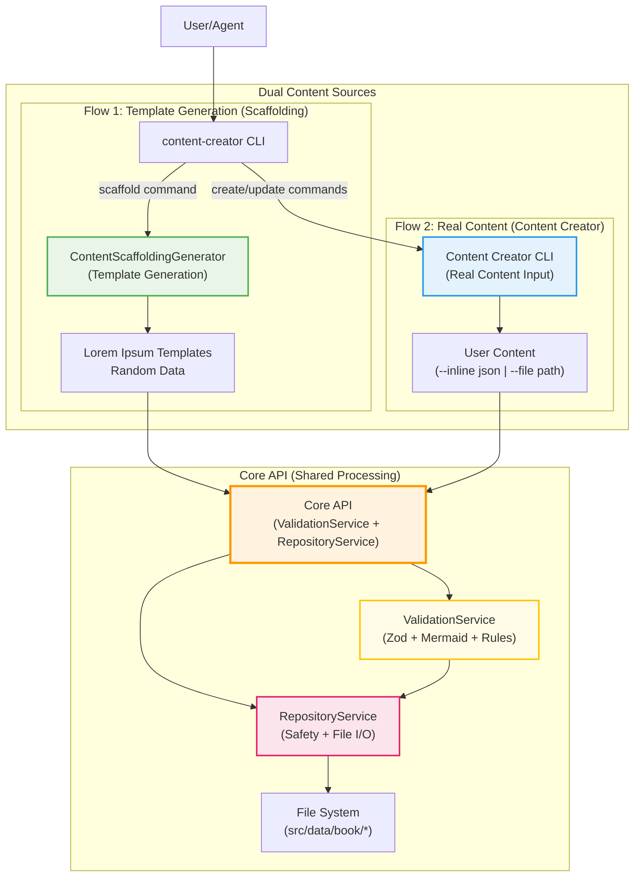
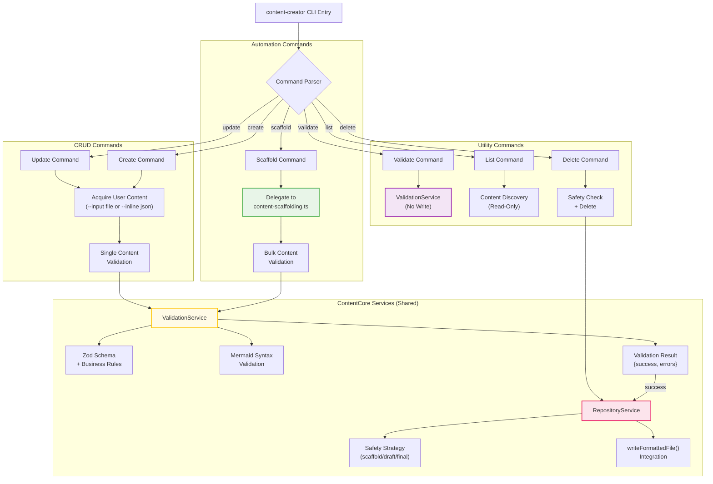
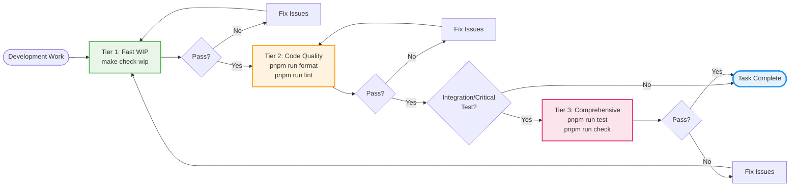
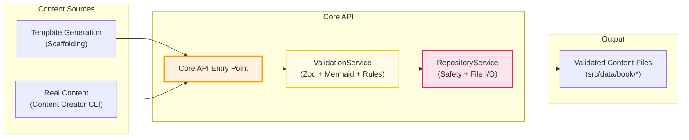
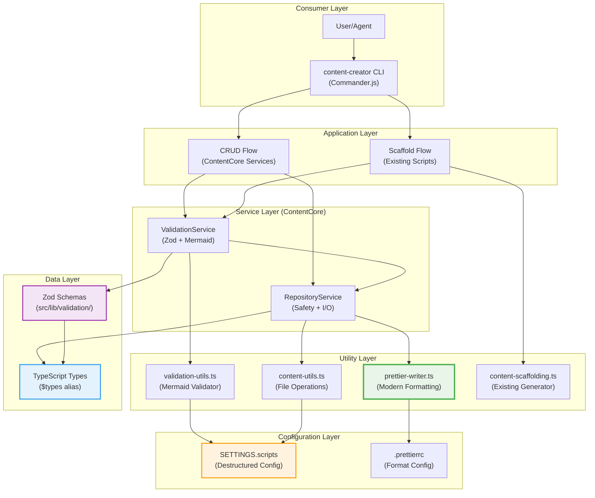
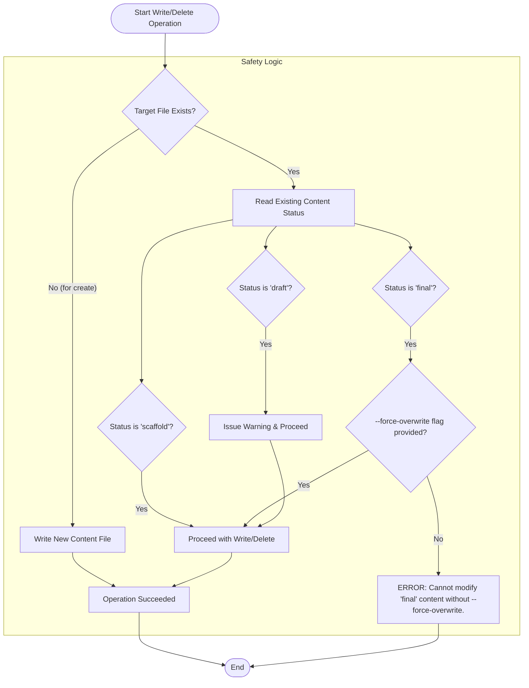

# Content Generation & Validation Plan

## 1. Architecture Overview

This document outlines a robust, service-oriented architecture for the `content-creator` CLI with **dual-flow support**. The design supports both automated scaffold generation and manual content CRUD operations, ensuring all content follows unified validation and safety standards.

### 1.1 Dual-Flow Architecture

The system supports two distinct content workflows that converge on shared validation and repository services:



**Key Architecture Principles:**

- **Clear Separation of Concerns**:
  - **Template Generation**: ContentScaffoldingGenerator creates lorem ipsum placeholders
  - **Real Content Input**: Content Creator CLI accepts actual user content
  - **Core API**: Unified ValidationService + RepositoryService for all content processing
- **Single Processing Pipeline**: Both template and real content use identical Core API
- **Unified Safety**: Single RepositoryService enforces safety strategy across all operations
- **Modern Integration**: Leverages Prettier formatting, TestSetup isolation, and settings destructuring

### 1.1.1 Implementation Phases (Reengineering Approach)

This architecture implementation follows a **3-phase reengineering approach** that includes modernization of existing scripts alongside new ContentCore development:

**Phase 1: Foundation Modernization & Service Layer (Task 3F1) ✅ COMPLETED**

- ✅ Consolidate types: Move reusable interfaces to `$types` (ValidatedScaffoldingArgs, UnitIdentification, ScaffoldingStats)
- ✅ Refactor content-scaffolding.ts to class-based architecture (ContentScaffoldingGenerator - hybrid implementation)
- ✅ Implement ContentCore services: ValidationService, RepositoryService, Zod schemas
- ✅ Apply optimized TestSetup patterns with `runAfterGeneration: false` by default
- ✅ Maintain backward compatibility with function exports

**Phase 2: Core API Integration & Complete Refactoring (Task 3F2)**

- **Complete ContentScaffoldingGenerator Modernization**:
  - Remove all standalone functions (parseCliArguments, executeDataDrivenMode, etc.)
  - Refactor class to use Core API exclusively (ValidationService + RepositoryService)
  - Keep only template generation logic, delegate all validation/I/O to Core API
- **content-creator CLI Implementation**:
  - Commander.js CLI with commands: scaffold, create, update, validate, list, delete
  - scaffold command: Uses ContentScaffoldingGenerator (templates) → Core API
  - create/update commands: Accepts real content (--inline/--file) → Core API
  - All commands converge on ValidationService + RepositoryService
- **3-Tier Validation Requirements**:
  - Mandatory `make check-wip` before any operation
  - Code quality: `pnpm run format` + `pnpm run lint`
  - Comprehensive: `pnpm run test` + `pnpm run check` (integration tests only)
- **TestSetup Optimization Standards**:
  - 96% tests use `TestSetup` (validation disabled)
  - 4% tests use `TestSetupWithValidation` (full validation)
  - All test suites follow optimization pattern

**Phase 3: Legacy Integration & Architecture Finalization (Task 3F3)**

- **Legacy Script Integration**:
  - Refactor mermaid-validator.ts to use ValidationService
  - Apply 3-tier validation pattern across all legacy test files
  - Ensure all scripts use Core API for content operations
- **Package.json Workflow Scripts**:
  - Complete automation workflows with 3-tier validation
  - Integration scripts that enforce architectural standards
- **Final Architecture Validation**:
  - Zero standalone functions in content generation scripts
  - All content operations flow through Core API
  - TestSetup optimization applied project-wide
  - Documentation and migration guides

### 1.2 Content Creator CLI Command Flow

This diagram shows the detailed command routing and service integration:



---

### 1.3 Optimized Testing Strategy

The ContentCore implementation leverages the **validation optimization patterns** developed for existing generator scripts to ensure fast test execution while maintaining comprehensive validation coverage:

#### **Test Performance Optimization Pattern**

```typescript
// Base TestSetup - validation disabled by default for speed
class TestSetup {
	protected configureValidation(): void {
		(SETTINGS.scripts.validation.generated as any).runAfterGeneration = false;
	}

	cleanup(): void {
		// Always restore original setting
		(SETTINGS.scripts.validation.generated as any).runAfterGeneration = true;
	}
}

// Specialized setup - validation enabled for specific tests
class TestSetupWithValidation extends TestSetup {
	protected configureValidation(): void {
		(SETTINGS.scripts.validation.generated as any).runAfterGeneration = true;
	}
}
```

#### **Testing Strategy Distribution**

- **96% Fast Tests**: Use `TestSetup` with validation disabled for unit tests and basic functionality
- **4% Validation Tests**: Use `TestSetupWithValidation` for integration tests and validation scenarios
- **Result**: Significant performance improvement while maintaining comprehensive validation coverage

This pattern is applied consistently across:

- Existing optimized generators: `flatnav-generator`, `search-indexer`, `content-menu-generator`
- New ContentCore services: `ValidationService`, `RepositoryService` tests
- content-creator CLI comprehensive test suite

#### **3-Tier Validation Requirements**

**ALL development workflows MUST follow the 3-tier validation pattern before considering any task complete:**



**Tier Definitions:**

- **Tier 1 (Fast WIP - ~5-15s)**: `make check-wip` - Validates only modified/untracked files
- **Tier 2 (Code Quality - ~30-45s)**: `pnpm run format` + `pnpm run lint` - Complete project formatting and linting
- **Tier 3 (Comprehensive - ~1-3m)**: `pnpm run test` + `pnpm run check` - Full test suite and TypeScript validation

**Application Rules:**

- **Tier 1**: MANDATORY for ALL development work
- **Tier 2**: Required before commits and pull requests
- **Tier 3**: Only for integration tests and critical functionality changes

---

### 1.4 Core API Architecture

The **Core API** represents the unified processing layer that handles all content operations, regardless of whether content originates from template generation (scaffolding) or real user input (content creator CLI).

#### **Core API Components**



#### **Core API Interface**

```typescript
// Core API unified interface
interface ContentCoreAPI {
	// Primary content processing pipeline
	processContent(content: ContentObject): Promise<ValidationResult>;

	// Validation layer
	validation: ValidationService;

	// Repository layer
	repository: RepositoryService;
}

// Usage by ContentScaffoldingGenerator
class ContentScaffoldingGenerator {
	constructor(private coreAPI: ContentCoreAPI) {}

	async generate(args: ValidatedScaffoldingArgs): Promise<boolean> {
		// 1. Generate template content (lorem ipsum, random data)
		const templateContent = this.generateTemplateContent(args);

		// 2. Send to Core API for validation and storage
		const result = await this.coreAPI.processContent(templateContent);
		return result.success;
	}
}

// Usage by Content Creator CLI
async function createContent(options: CreateOptions): Promise<boolean> {
	// 1. Get real content from user (--inline or --file)
	const userContent = await getUserContent(options);

	// 2. Send to Core API (same pipeline as scaffolding)
	const result = await coreAPI.processContent(userContent);
	return result.success;
}
```

#### **Key Benefits**

- **Unified Pipeline**: Single validation and storage flow for all content
- **Consistency**: Template and real content follow identical validation rules
- **Maintainability**: Changes to validation/storage logic affect both flows
- **Testability**: Core API can be tested independently of content sources

---

### 1.5 Layered Service Architecture

This diagram illustrates the complete layered dependencies from CLI to utilities, showing modern pattern integration:



**Modern Pattern Integration Highlights:**

- **Prettier Integration**: `writeFormattedFile()` with .prettierrc configuration resolution
- **Settings Destructuring**: `const { validation: validationSettings } = SETTINGS.scripts;`
- **Type Safety**: Unified `$types` alias for consistent imports across the project
- **Test Isolation**: TestSetup pattern with unique directories and config IDs
- **Performance Optimization**: Selective validation enabling in tests vs global settings

---

## 2. Analysis & Justification

- **Unified Pipeline:** A single validation and write pipeline for all content modifications ensures maximum consistency and reliability.
- **Layered Architecture:** The design separates concerns effectively: The CLI orchestrates, Services contain business logic, and Utilities handle low-level tasks. This makes the system easier to maintain and test.
- **Robust Validation:** The multi-layered validation pipeline (Schema, Business Rules, Content-Specific) is now a shared service, guaranteeing that no content—not even placeholders—can be written to disk in an invalid state.
- **Repository Pattern:** The `Repository Service` acts as a gatekeeper to the filesystem, centralizing all write/update/delete logic, including the critical overwrite and delete safety strategy.

---

## 3. Implementation Plan: Phased Approach

This project will be implemented in three distinct phases, building from the lowest-level utilities up to the user-facing CLI.

### **Phase 1: Foundational Modules (Utilities & Data)**

This phase focuses on creating the low-level, reusable building blocks of the application.

#### **Task 1.1: Zod Schemas & Schema Generation Script**

- **Details:**
  1. In a new directory `src/lib/validation/`, create Zod schema definitions for all content types (`LessonContent`, `QuizContent`, etc.).
  2. Embed business rules directly into the schemas using Zod's validation methods (e.g., `z.array(questionSchema).min(10)` for quizzes).
  3. Create a new script, `src/scripts/generate-json-schemas.ts`, which imports the Zod schemas and uses `zod-to-json-schema` to export them as `.json` files into the `src/schema/` directory.
  4. Add a corresponding script to `package.json`: `"generate-schemas": "tsx src/scripts/generate-json-schemas.ts"`.
- **Expected Output:**
  - Zod schema files in `src/lib/validation/`.
  - A `generate-schemas` script in `package.json`.
  - Generated JSON schema files in `src/schema/`.
- **Validation:**
  - ✅ The Zod schemas accurately reflect the TypeScript interfaces.
  - ✅ `pnpm run generate-schemas` executes successfully.

#### **Task 1.2: Core & Specialized Utilities**

- **Details:**
  1. Create `src/lib/utils/common-content-utils.ts` for general-purpose file I/O (reading, writing) and AST manipulation using `ts-morph`.
  2. Create `src/lib/utils/scaffold-generator.ts` to house the logic for creating placeholder data objects (e.g., `generatePlaceholderLesson()`).
  3. Create `src/lib/utils/validation-utils.ts` to contain the reusable Mermaid syntax validator function, which must return a structured result (`{ isValid: boolean; error?: string; }`).
- **Expected Output:**
  - `common-content-utils.ts`, `scaffold-generator.ts`, `validation-utils.ts`.
- **Validation:**
  - ✅ All utility functions are type-safe and exported.
  - ✅ The Mermaid validator correctly identifies valid and invalid syntax.

---

### **Phase 2: Service Layer Implementation**

This phase builds the core business logic on top of the foundational utilities.

#### **Task 2.1: Validation Service**

- **Details:**
  1. Create `src/lib/services/ValidationService.ts`.
  2. Expose a primary method, `validate(contentObject)`, that orchestrates the full validation pipeline (Zod schemas, then content-specific checks like the Mermaid validator).
  3. The service should return a structured result, like `{ success: boolean, errors: string[] }`.
- **Expected Output:**
  - `ValidationService.ts` file.
- **Validation:**
  - ✅ The service correctly validates or rejects content objects based on the full pipeline.
  - ✅ Error messages are clear and indicate the path of the error.

#### **Task 2.2: Repository Service**

- **Details:**
  1. Create `src/lib/services/RepositoryService.ts`.
  2. Expose methods like `writeFile(path, contentObject)` and `deleteFile(path)`.
  3. This service **must** be the sole gatekeeper for all filesystem modifications, implementing the full "Overwrite/Delete Safety Strategy" before calling the low-level I/O utilities.
- **Expected Output:**
  - `RepositoryService.ts` file.
- **Validation:**
  - ✅ The safety logic for `scaffold`, `draft`, and `final` statuses works exactly as specified.
  - ✅ Attempting to modify a `final` file without `--force-overwrite` fails as expected.

---

### **Phase 3: Application Layer (CLI)**

This phase builds the user-facing tool that orchestrates the services.

#### **Task 3.1: CLI Implementation**

- **Details:**
  1. Create the main CLI entrypoint at `src/scripts/content-creator.ts`.
  2. Use a library like `commander` to define all subcommands (`scaffold`, `list`, `create`, etc.) and global flags (`--dry-run`, `--force-overwrite`).
  3. Wire up each command to the appropriate services:
     - `scaffold`: Uses `scaffold-generator` to create objects, then passes them to the `ValidationService` and `RepositoryService`.
     - `create`/`update`: Gets user content, then passes it to the `ValidationService` and `RepositoryService`.
     - `delete`: Gets a file path and passes it directly to the `RepositoryService`.
     - `validate`: Gets a file path and passes it to the `ValidationService`.
     - `list`: Implements the read-only discovery workflow.
  4. Implement the `--dry-run` logic at this layer.
- **Expected Output:**
  - A fully functional `content-creator.ts` script.
  - A `package.json` script to run it: `"content-creator": "tsx src/scripts/content-creator.ts"`.
- **Validation:**
  - ✅ Each command and flag works as documented in the command reference table.
  - ✅ The `--dry-run` mode accurately reports intended actions without changing files.

---

## 4. API/CLI Strategy

The `content-creator` CLI is the unified interface for all content manipulation.

### 4.1 Command & Flag Reference

| Command          | Description                                                                | Options & Flags                                                                        |
| :--------------- | :------------------------------------------------------------------------- | :------------------------------------------------------------------------------------- |
| `scaffold`       | Auto-generates placeholder content for all missing files.                  | (None)                                                                                 |
| `list`           | Lists existing content with filtering capabilities.                        | `--unit <num>`, `--chapter <id>`, `--type <type>`, `--status <status>`                 |
| `create`         | Creates a new content file with real, user-provided content.               | `--type <type>`, `--unit <num>`, `--chapter <id>`, `--input <file>`, `--inline <json>` |
| `update`         | Updates an existing content file.                                          | `--file <path>`, `--inline <json>`, `--force-overwrite`                                |
| `validate`       | Validates a content file against the full validation pipeline.             | `--file <path>`                                                                        |
| `delete`         | Deletes a content file, respecting the safety strategy.                    | `--file <path>`, `--force-overwrite`                                                   |
| **Global Flags** |                                                                            |                                                                                        |
|                  | Simulates a command and logs the intended actions without writing to disk. | `--dry-run`                                                                            |
|                  | Required to overwrite or delete content with `final` status.               | `--force-overwrite`                                                                    |

### 4.2 Shared Validation Pipeline

All commands that generate or accept content (`scaffold`, `create`, `update`) **MUST** process it through the shared `Validation Service` before any write operation. The `validate` command also uses this service directly. The pipeline runs in this order:

1.  **Unified Zod Validation:** The primary validation uses a single, comprehensive Zod schema for the given content type. These schemas are designed to enforce both the **data structure** (correct properties, types, etc.) and **business rules** (e.g., using `.min(10)` on an array of questions to ensure a quiz is long enough). This makes Zod the single source of truth for most validation.

2.  **Content-Specific Validation:** After passing the Zod schema, the service runs specialized validators for specific content blocks, such as the **Mermaid syntax validator** (from TASK 3C) on all diagram definitions.

### 4.3 Shared Repository Service & Safety Strategy

The `Repository Service` is the single point of entry for all filesystem modifications, including deletion. It enforces the safety rules before performing any write, update, or delete operation.



1.  **If `status` is `"scaffold"`:** The file can be overwritten or deleted freely.
2.  **If `status` is `"draft"`:** The file can be overwritten or deleted, but a prominent warning will be displayed.
3.  **If `status` is `"final"`:** The operation will **fail by default**. Modifying or deleting requires the `--force-overwrite` flag. For updates, the new content must also have a `status` of `"final"`.

---

## 5. Module Design: `scaffold` Command

The `scaffold` command is now a simple client of the shared services.

- **Responsibility:** Its sole job is to determine which files are missing and use the `scaffold-generator.ts` utility to create placeholder content objects.
- **Workflow:**
  1. It generates a list of placeholder objects.
  2. It passes each object to the shared `Validation Service`.
  3. If valid, it passes the object and target file path to the shared `Repository Service`, which then handles the write logic and safety checks.

---

## 6. Summary of Key Principles

- **Unified Pipeline:** A single validation and write/delete pipeline for all content modifications ensures maximum consistency and reliability.
- **Layered Architecture:** The design separates concerns effectively: The CLI orchestrates, Services contain business logic, and Utilities handle low-level tasks.
- **Validate First, Write Last:** No file is ever created, modified, or deleted until it has passed all necessary validation and safety checks.
- **Design for Safety:** The CLI is powerful yet safe, with a discovery command (`list`), a simulation mode (`--dry-run`), and a strict, centralized safety policy managed by the Repository Service.
