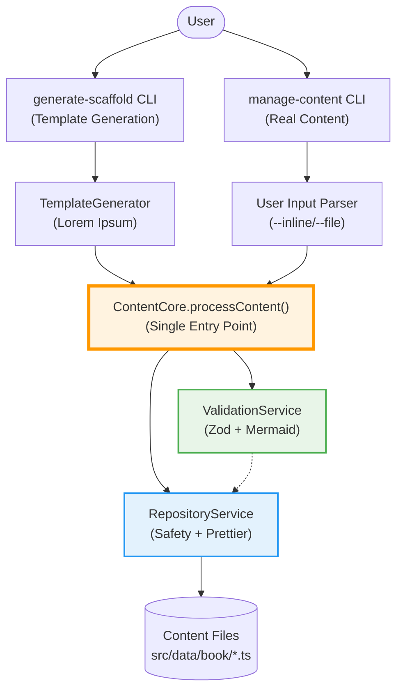
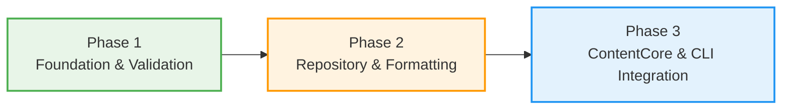
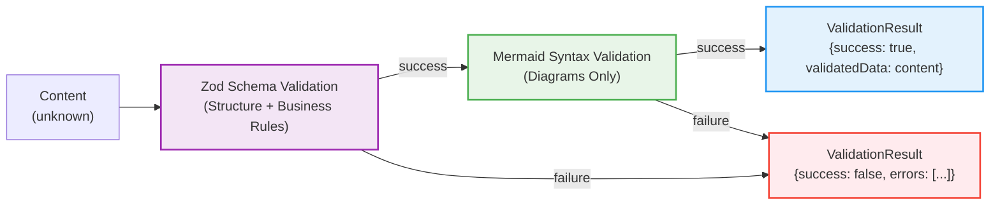
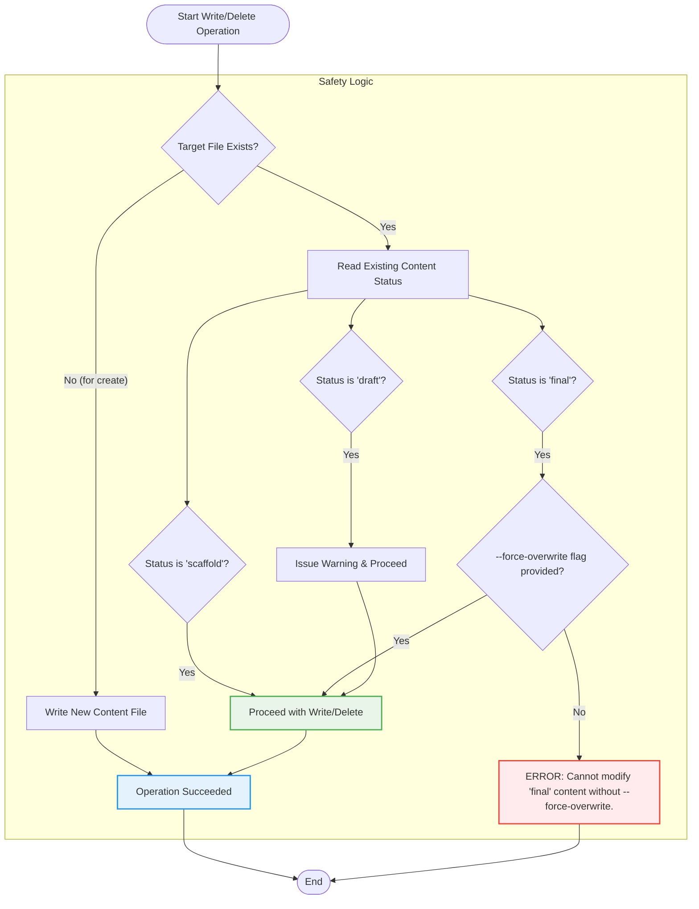

# Content Generation & Validation Plan

> **Architecture documentation for the content-creator CLI with dual-flow support**
>
> This document outlines a robust, service-oriented architecture that supports both automated scaffold generation and manual content CRUD operations, ensuring all content follows unified validation and safety standards.

---

## 1. CORE ARCHITECTURE

### 1.1 System Overview

The system follows a **4-layer architecture** with clear separation of concerns:

1. **CLI Layer**: Commander.js parsers (generate-scaffold, manage-content)
2. **Orchestration Layer**: ContentCore class (single entry point for all content operations)
3. **Service Layer**: ValidationService (Zod + Mermaid) + RepositoryService (Safety + Formatting)
4. **Storage Layer**: File system operations (src/data/book/\*.ts)



**Key Principle**: CLIs parse user input → ContentCore orchestrates validation & persistence → Services execute → Files written

**Dual-Flow Support**: Two distinct content sources (template generation vs real content) converge on the **same** ContentCore pipeline, ensuring unified validation and safety rules.

---

### 1.2 ContentCore: The Orchestrator

**Location**: `src/lib/services/ContentCore.ts` (standalone file)

**Responsibility**: Single entry point for all content persistence operations. Acts as the orchestration layer between CLIs and services.

#### Interface

```typescript
interface ContentCoreAPI {
	/**
	 * Primary content processing pipeline
	 * Orchestrates: Validation → Repository → File Write
	 */
	processContent(
		filePath: string,
		content: unknown,
		options?: ProcessOptions
	): Promise<ValidationResult>;

	/**
	 * Validate content without writing (for validate command)
	 */
	validateContent(content: unknown): Promise<ValidationResult>;

	// Service layer access
	validation: ValidationService;
	repository: RepositoryService;
}
```

#### Processing Flow

```typescript
// ContentCore orchestrates the pipeline
async processContent(filePath: string, content: unknown, options: ProcessOptions) {
	// 1. Validate with Zod schemas + Mermaid
	const validationResult = await this.validation.validate(content);

	if (!validationResult.success) {
		return validationResult;
	}

	// 2. Write with safety checks + Prettier formatting
	const writeResult = await this.repository.writeFormattedContent(
		filePath,
		validationResult.validatedData,
		options
	);

	return { success: writeResult.success, errors: [...] };
}
```

#### Why ContentCore?

- **CLIs don't know HOW**: They parse user input and delegate to ContentCore
- **Services don't know WHEN**: They execute validation/writing when told by ContentCore
- **Single Orchestration Point**: ContentCore coordinates the entire pipeline

---

### 1.3 Service Layer

#### ValidationService

**Location**: `src/lib/services/ValidationService.ts`

**Purpose**: Validate content structure (Zod schemas) and syntax (Mermaid diagrams)

**Primary Method**:

```typescript
validate(content: unknown): Promise<ValidationResult>
```

**Responsibilities**:

1. Validate content against Zod discriminated union (`CONTENT_SCHEMAS.AnyContent`)
2. Validate Mermaid diagram syntax within content
3. Return structured validation result with errors/warnings

**Key Principle**: Business rules are encoded in Zod schemas (e.g., `z.array(questionSchema).min(10)`), NOT in hardcoded switch statements.

---

#### RepositoryService

**Location**: `src/lib/services/RepositoryService.ts`

**Purpose**: Enforce safety rules, format code, and write files to disk

**Primary Method**:

```typescript
writeFormattedContent(
	filePath: string,
	content: BaseContent | AnyContent,
	options: WriteOptions
): Promise<WriteResult>
```

**Responsibilities**:

1. Check safety rules via ContentSafetyService (scaffold/draft/final status)
2. Format content with Prettier (TypeScript formatting)
3. Write formatted content to file system

**Key Principle**: RepositoryService is the **sole gatekeeper** for filesystem modifications. No other component writes directly.

---

### 1.4 Key Architectural Principles

1. **Single Entry Point**: All content persistence flows through `ContentCore.processContent()`
2. **Unified Validation**: Same Zod schemas validate both template and real content
3. **Separation of Concerns**:
   - CLIs: Parse user input (commander.js)
   - ContentCore: Orchestrate validation → persistence
   - Services: Execute validation and writing
4. **Type Safety**: All content flows through `BaseContent → AnyContent` (discriminated union on `type` field)
5. **Safety First**: RepositoryService enforces scaffold/draft/final rules before any write/delete operation

---

## 2. IMPLEMENTATION PHASES

### Phase Overview



**Critical Path**: Phases are sequential. Each phase depends on completion of previous phase(s).

---

### 2.1 Phase 1: Foundation & Validation

**Goal**: Enable runtime content validation using Zod schemas

**Why First?**: Validation is the foundation. Cannot build repository layer without knowing content is valid.

#### Components to Build

1. **ValidationService.validate()**: Generic validation using Zod schemas
2. **CONTENT_SCHEMAS Integration**: Use existing 35+ Zod schemas for runtime validation
3. **MermaidValidator Integration**: Validate Mermaid diagram syntax
4. **Remove Hardcoded Logic**: Eliminate `validateBusinessRules()` (rules are in Zod schemas)

#### Success Criteria

- ✅ `ValidationService.validate()` uses `CONTENT_SCHEMAS.AnyContent.safeParse()`
- ✅ All business rules enforced via Zod schemas (no switch statements)
- ✅ Mermaid diagrams validated automatically within content
- ✅ Tests pass: valid content accepted, invalid content rejected with clear errors
- ✅ `make check-wip` passes

#### Dependencies

**None** (foundation layer)

#### Deliverables

- Refactored `ValidationService.ts` with `validate()` method
- Unit tests for ValidationService
- Integration tests for Zod + Mermaid validation pipeline

---

### 2.2 Phase 2: Repository & Formatting

**Goal**: Enable safe, formatted content persistence

**Why Second?**: Requires validated content from Phase 1. Cannot write without validation.

#### Components to Build

1. **RepositoryService.writeFormattedContent()**: Write with Prettier formatting
2. **Type-Safe Signatures**: Change from `unknown` to `BaseContent | AnyContent`
3. **Prettier Integration**: Format TypeScript before writing
4. **ContentSafetyService Integration**: Enforce scaffold/draft/final safety rules

#### Success Criteria

- ✅ RepositoryService formats with Prettier before every write
- ✅ Safety checks enforce scaffold/draft/final rules correctly
- ✅ Type errors caught at compile time (no `unknown` types)
- ✅ Tests pass: formatted output matches .prettierrc configuration
- ✅ `make check-wip` passes

#### Dependencies

**Phase 1** (needs ValidationService to validate content before writing)

#### Deliverables

- Refactored `RepositoryService.ts` with Prettier integration
- Updated type signatures (`BaseContent | AnyContent`)
- Unit tests for RepositoryService
- Integration tests for safety strategy

---

### 2.3 Phase 3: ContentCore & CLI Integration

**Goal**: Unify all content operations through ContentCore orchestrator

**Why Last?**: Requires both ValidationService (Phase 1) and RepositoryService (Phase 2) to be complete.

#### Components to Build

1. **ContentCore Class**: Standalone orchestrator in `src/lib/services/ContentCore.ts`
2. **CLI Updates**: Refactor generate-scaffold and manage-content to use ContentCore
3. **Type Cleanup**: Remove duplicate types (ContentStatus, SafetyCheckResult)
4. **End-to-End Integration**: Both CLIs use `ContentCore.processContent()`

#### Success Criteria

- ✅ ContentCore orchestrates ValidationService → RepositoryService
- ✅ Both CLIs (generate-scaffold, manage-content) use ContentCore.processContent()
- ✅ No duplicate types (single ContentStatus, single SafetyCheckResult)
- ✅ End-to-end tests pass for both template and real content flows
- ✅ `make check-wip test` passes

#### Dependencies

**Phase 1 + Phase 2** (needs both ValidationService and RepositoryService)

#### Deliverables

- New `src/lib/services/ContentCore.ts`
- Refactored `generate-scaffold.ts` (uses ContentCore)
- Refactored `manage-content.ts` (uses ContentCore)
- Type cleanup in `$types` directory
- End-to-end integration tests

---

## 3. OPERATIONAL DESIGN

### 3.1 CLI Command Reference

| Command          | Description                                                                | Options & Flags                                                                        |
| :--------------- | :------------------------------------------------------------------------- | :------------------------------------------------------------------------------------- |
| `scaffold`       | Auto-generates placeholder content for all missing files.                  | (None)                                                                                 |
| `list`           | Lists existing content with filtering capabilities.                        | `--unit <num>`, `--chapter <id>`, `--type <type>`, `--status <status>`                 |
| `create`         | Creates a new content file with real, user-provided content.               | `--type <type>`, `--unit <num>`, `--chapter <id>`, `--input <file>`, `--inline <json>` |
| `update`         | Updates an existing content file.                                          | `--file <path>`, `--inline <json>`, `--force-overwrite`                                |
| `validate`       | Validates a content file against the full validation pipeline.             | `--file <path>`                                                                        |
| `delete`         | Deletes a content file, respecting the safety strategy.                    | `--file <path>`, `--force-overwrite`                                                   |
| **Global Flags** |                                                                            |                                                                                        |
|                  | Simulates a command and logs the intended actions without writing to disk. | `--dry-run`                                                                            |
|                  | Required to overwrite or delete content with `final` status.               | `--force-overwrite`                                                                    |

---

### 3.2 Validation Pipeline

All content operations flow through the unified validation pipeline:



**Pipeline Steps**:

1. **Zod Schema Validation**: Validates structure and business rules
   - Uses `CONTENT_SCHEMAS.AnyContent` discriminated union
   - Business rules: `.min(10)` for quiz questions, `.min(5)` for lesson sections, etc.
   - Returns clear error messages with field paths

2. **Content-Specific Validation**: Validates specialized content
   - Mermaid diagram syntax validation
   - Only runs if Zod validation succeeds

---

### 3.3 Safety Strategy

The RepositoryService enforces safety rules before any write/delete operation:



**Safety Rules**:

1. **`scaffold` status**: Can be overwritten or deleted freely
2. **`draft` status**: Can be overwritten or deleted with warning
3. **`final` status**: Cannot be modified/deleted without `--force-overwrite` flag

---

## 4. IMPLEMENTATION DETAILS

### 4.1 File Structure & Naming Conventions

#### ContentCore & Services

```
src/lib/services/
├── ContentCore.ts           # Orchestrator class
├── ValidationService.ts     # Zod + Mermaid validation
├── RepositoryService.ts     # Safety + Prettier + Write
└── ContentSafetyService.ts  # Safety rule enforcement
```

#### Schemas & Types

```
src/lib/schemas/
└── ContentSchemas.ts        # 35+ Zod schemas with business rules

src/lib/types/
├── index.ts                 # Public type exports (AnyContent union)
├── content.ts               # BaseContent interface, content type interfaces
├── scripts.ts               # Script-specific types (SafetyCheckResult, FileOperationStats)
└── scaffolding.ts           # Scaffolding-specific types (ValidatedScaffoldingArgs)
```

#### CLIs

```
src/scripts/
├── generate-scaffold.ts     # Template generation CLI
└── manage-content.ts        # Real content CRUD CLI
```

---

### 4.2 Testing Strategy

#### Test Performance Optimization Pattern

```typescript
// Base TestSetup - validation disabled by default for speed
class TestSetup {
	protected configureValidation(): void {
		(SETTINGS.scripts.validation.generated as any).runAfterGeneration = false;
	}

	cleanup(): void {
		// Always restore original setting
		(SETTINGS.scripts.validation.generated as any).runAfterGeneration = true;
	}
}

// Specialized setup - validation enabled for specific tests
class TestSetupWithValidation extends TestSetup {
	protected configureValidation(): void {
		(SETTINGS.scripts.validation.generated as any).runAfterGeneration = true;
	}
}
```

#### Testing Strategy Distribution

- **96% Fast Tests**: Use `TestSetup` (validation disabled) for unit tests and basic functionality
- **4% Validation Tests**: Use `TestSetupWithValidation` for integration tests and validation scenarios
- **Result**: Significant performance improvement while maintaining comprehensive validation coverage

#### Test Coverage by Component

| Component         | Test Type   | Setup                   | Focus                              |
| ----------------- | ----------- | ----------------------- | ---------------------------------- |
| ValidationService | Unit        | TestSetup               | Zod schema validation logic        |
| ValidationService | Integration | TestSetupWithValidation | Full validation pipeline           |
| RepositoryService | Unit        | TestSetup               | Safety checks, Prettier formatting |
| ContentCore       | Integration | TestSetupWithValidation | End-to-end pipeline                |
| CLIs              | Integration | TestSetupWithValidation | Full user workflows                |

---

### 4.3 Development Workflow

#### 3-Tier Validation Requirements

**ALL development workflows MUST follow the 3-tier validation pattern before considering any task complete:**

**Tier Definitions:**

- **Tier 1 (Fast WIP - ~5-15s)**: `make check-wip` - Validates only modified/untracked files
- **Tier 2 (Code Quality - ~30-45s)**: `pnpm run format` + `pnpm run lint` - Complete project formatting and linting
- **Tier 3 (Comprehensive - ~1-3m)**: `pnpm run test` + `pnpm run check` - Full test suite and TypeScript validation

**Application Rules:**

- **Tier 1**: MANDATORY for ALL development work
- **Tier 2**: Required before commits and pull requests
- **Tier 3**: Only for integration tests and critical functionality changes

---

### 4.4 Detailed Task Breakdown

#### Phase 1 Tasks

**Task 1.1: Refactor ValidationService**

1. Import `CONTENT_SCHEMAS` from ContentSchemas.ts
2. Remove `validateBusinessRules()` method (business rules are in Zod schemas)
3. Remove `validateComprehensive()` method (ContentCore orchestrates)
4. Add `validate(content: unknown)` method using `CONTENT_SCHEMAS.AnyContent.safeParse()`
5. Keep `validateMermaidContent()` as internal validator
6. Update tests to validate with Zod schemas

**Task 1.2: Test ValidationService**

1. Unit tests for `validate()` with valid content (all types: lesson, quiz, etc.)
2. Unit tests for `validate()` with invalid content (missing fields, wrong types)
3. Unit tests for business rule violations (too few questions, sections, etc.)
4. Integration tests for Mermaid validation
5. Performance tests with TestSetup optimization

---

#### Phase 2 Tasks

**Task 2.1: Refactor RepositoryService**

1. Update `writeFormattedContent()` signature: `content: BaseContent | AnyContent`
2. Add Prettier import and configuration resolution
3. Format content with Prettier before write
4. Remove any validation logic (ContentCore handles this)
5. Update imports to use correct types (remove scaffolding.ts imports)

**Task 2.2: Test RepositoryService**

1. Unit tests for safety checks (scaffold/draft/final)
2. Unit tests for Prettier formatting
3. Integration tests for write operations
4. Tests for `--force-overwrite` flag behavior

**Task 2.3: Fix Type Duplication**

1. Remove `ContentStatus` from scaffolding.ts (use types.ts canonical version)
2. Unify `SafetyCheckResult` (move to types/scripts.ts)
3. Rename `ScaffoldingStats` to `FileOperationStats`
4. Update all imports across codebase

---

#### Phase 3 Tasks

**Task 3.1: Create ContentCore**

1. Create `src/lib/services/ContentCore.ts`
2. Implement `ContentCoreAPI` interface
3. Implement `processContent()` method (orchestrate validation → write)
4. Implement `validateContent()` method (validation only)
5. Add constructor dependency injection for ValidationService and RepositoryService

**Task 3.2: Refactor CLIs**

1. Update `generate-scaffold.ts` to use ContentCore
2. Update `manage-content.ts` to use ContentCore
3. Remove duplicate validation logic from CLIs
4. Simplify CLIs to focus on user input parsing

**Task 3.3: End-to-End Testing**

1. Integration tests for template generation flow
2. Integration tests for real content flow
3. End-to-end tests for all CLI commands
4. Performance benchmarks

---

## Summary

This architecture provides:

- **Unified Pipeline**: Single validation and write pipeline for all content modifications
- **Layered Architecture**: Clear separation (CLI → ContentCore → Services → Storage)
- **Type Safety**: BaseContent → AnyContent (discriminated union)
- **Safety First**: Centralized safety strategy in RepositoryService
- **Testability**: Independent testing of each layer with optimization patterns
- **Maintainability**: Changes to validation/storage logic affect both template and real content flows identically

**Next Steps**: Begin Phase 1 implementation (ValidationService refactoring).
