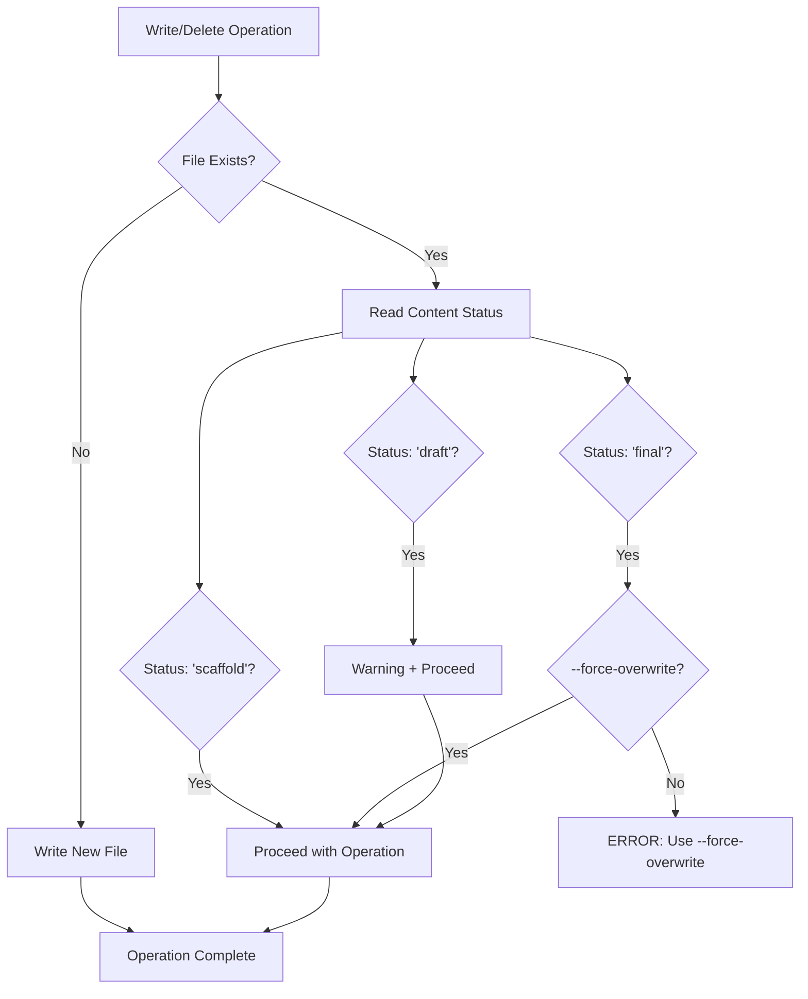
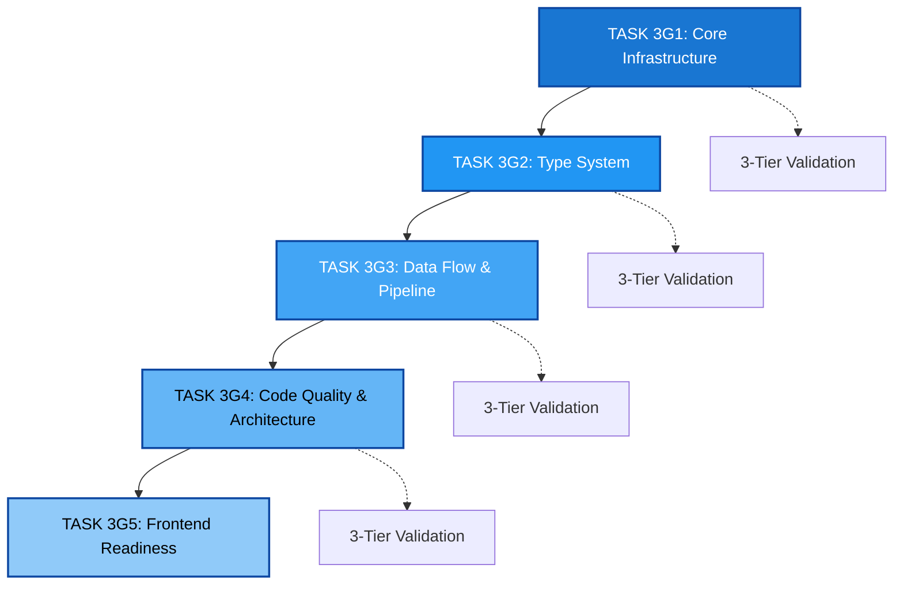

# TODO-FEATURES: Foundation-First Migration Tasks and Content Units

This file contains Foundation-First migration tasks and new content units planned for the learn-cloud SPA project using TypeScript content files in `src/data/book/`.

## 📊 TASK DEPENDENCY DIAGRAM

```mermaid
graph TD
    T1["TASK 1: Documentation Foundation"] --> T2["TASK 2: TypeScript Foundation"]
    T2 --> T3A["TASK 3A: Content Menu Generator"]
    T2 --> T3C["TASK 3C: Mermaid Validator"]
    T2 --> T3D["TASK 3D: Search Index Generator"]
    T3A --> T3B["TASK 3B: Content Scaffolding Generator"]
    T3A --> T3E["TASK 3E: Flat Navigation Generator"]
    T3A --> T3F1["TASK 3F1: Foundation Modernization & Service Layer"]
    T3B --> T3F1
    T3C --> T3F1
    T3D --> T3F1
    T3E --> T3F1
    T3F1 --> T3F2["TASK 3F2: CLI Interface & Architecture Integration"]
    T3F2 --> T3F3["TASK 3F3: Legacy Integration & Workflow Orchestration"]
    T3F3 --> T3G1["TASK 3G1: Core Infrastructure Audit"]
    T3G1 --> T3G2["TASK 3G2: Type System Coherence"]
    T3G2 --> T3G3["TASK 3G3: Data Flow & Pipeline"]
    T3G3 --> T3G4["TASK 3G4: Code Quality & Architecture"]
    T3G4 --> T3G5["TASK 3G5: Frontend Readiness"]
    T3G5 --> T4["TASK 4: SPA Architecture"]

    T4 --> T5["TASK 5: Theme System"]
    T5 --> T6["TASK 6: shadcn-svelte UI"]

    T6 --> T7["TASK 7: Content Renderers"]
    T7 --> T8A["TASK 8A: Sidebar"]
    T8A --> T8B["TASK 8B: Sticky Header"]
    T8B --> T8C["TASK 8C: Breadcrumb"]
    T8C --> T8D["TASK 8D: IconGrid"]
    T8D --> T8E["TASK 8E: Dialog"]
    T8D --> T8F["TASK 8F: Code Block"]
    T8E --> T8G["TASK 8G: Diagram"]
    T8D --> T8G
    T8E --> T8H["TASK 8H: Flipcard"]
    T8H --> T8I["TASK 8I: Quiz/Exam Navigation"]
    T8I --> T8J["TASK 8J: Popover"]
    T8J --> T8K["TASK 8K: Progress"]
    T8J --> T8L["TASK 8L: General Navigation"]
    T8A --> T8L
    T8B --> T8L
    T8C --> T8L
    T8L --> T8M["TASK 8M: Search"]
    T8E --> T8M
    T8A --> T8M
    T8C --> T8M
    T8M --> T8N["TASK 8N: Theme Switcher"]

    T8N --> T8X["TASK 8X: Component Integration & Scaffold Verification"]
    T8X --> T9["TASK 9: Content Migration"]
    T9 --> T10["TASK 10: Quality Assurance"]
    T10 --> T11["TASK 11: Final Integration"]

    T11 --> E1["EXISTING 1: Unit 1 Python Lessons"]
    E1 --> E2["EXISTING 2: Unit 1 Python Study Guides"]
    E2 --> E3["EXISTING 3: Unit 1 Python Quizzes/Exam"]
    E3 --> E4["EXISTING 4: Unit 1 Python Overview"]

    T11 --> E5["EXISTING 5: Unit 2 Go Lessons"]
    E5 --> E6["EXISTING 6: Unit 2 Go Study Guides"]
    E6 --> E7["EXISTING 7: Unit 2 Go Quizzes/Exam"]
    E7 --> E8["EXISTING 8: Unit 2 Go Overview"]

    T11 --> E9["EXISTING 9-12: Units 3-9 Content"]

    E4 --> C1["CONTENT 1: Test Coverage Extension"]
    E8 --> C1

    E9 --> C2["CONTENT 2: Rust Lessons"]
    C2 --> C3["CONTENT 3: Rust Study Guides"]
    C3 --> C4["CONTENT 4: Rust Quizzes/Exam"]
    C4 --> C5["CONTENT 5: Rust Overview"]

    E9 --> C6["CONTENT 6: Cloud DB Lessons"]
    C6 --> C7["CONTENT 7: Cloud DB Study Guides"]
    C7 --> C8["CONTENT 8: Cloud DB Quizzes/Exam"]
    C8 --> C9["CONTENT 9: Cloud DB Overview"]

    E9 --> C10["CONTENT 10: GraphQL Lessons"]
    C10 --> C11["CONTENT 11: GraphQL Study Guides"]
    C11 --> C12["CONTENT 12: GraphQL Quizzes/Exam"]
    C12 --> C13["CONTENT 13: GraphQL Overview"]

    %% Foundation Tasks - Blue tones with dark text
    style T1 fill:#1976d2,stroke:#0d47a1,stroke-width:2px,color:#ffffff
    style T2 fill:#1e88e5,stroke:#0d47a1,stroke-width:2px,color:#ffffff
    style T3A fill:#2196f3,stroke:#0d47a1,stroke-width:2px,color:#ffffff
    style T3B fill:#2196f3,stroke:#0d47a1,stroke-width:2px,color:#ffffff
    style T3C fill:#2196f3,stroke:#0d47a1,stroke-width:2px,color:#ffffff
    style T3D fill:#2196f3,stroke:#0d47a1,stroke-width:2px,color:#ffffff
    style T3E fill:#2196f3,stroke:#0d47a1,stroke-width:2px,color:#ffffff
    style T3F1 fill:#1976d2,stroke:#0d47a1,stroke-width:3px,color:#ffffff
    style T3F2 fill:#1976d2,stroke:#0d47a1,stroke-width:3px,color:#ffffff
    style T3F3 fill:#1976d2,stroke:#0d47a1,stroke-width:3px,color:#ffffff
    style T3G1 fill:#1565c0,stroke:#0d47a1,stroke-width:2px,color:#ffffff
    style T3G2 fill:#1976d2,stroke:#0d47a1,stroke-width:2px,color:#ffffff
    style T3G3 fill:#2196f3,stroke:#0d47a1,stroke-width:2px,color:#ffffff
    style T3G4 fill:#42a5f5,stroke:#0d47a1,stroke-width:2px,color:#ffffff
    style T3G5 fill:#64b5f6,stroke:#0d47a1,stroke-width:2px,color:#000000
    style T4 fill:#42a5f5,stroke:#0d47a1,stroke-width:2px,color:#ffffff
    style T5 fill:#64b5f6,stroke:#0d47a1,stroke-width:2px,color:#000000
    style T6 fill:#90caf9,stroke:#0d47a1,stroke-width:2px,color:#000000
    style T7 fill:#bbdefb,stroke:#0d47a1,stroke-width:2px,color:#000000
    style T8A fill:#e3f2fd,stroke:#0d47a1,stroke-width:2px,color:#000000
    style T8B fill:#e3f2fd,stroke:#0d47a1,stroke-width:2px,color:#000000
    style T8C fill:#e3f2fd,stroke:#0d47a1,stroke-width:2px,color:#000000
    style T8D fill:#e3f2fd,stroke:#0d47a1,stroke-width:2px,color:#000000
    style T8E fill:#e3f2fd,stroke:#0d47a1,stroke-width:2px,color:#000000
    style T8F fill:#e3f2fd,stroke:#0d47a1,stroke-width:2px,color:#000000
    style T8G fill:#e3f2fd,stroke:#0d47a1,stroke-width:2px,color:#000000
    style T8H fill:#e3f2fd,stroke:#0d47a1,stroke-width:2px,color:#000000
    style T8I fill:#e3f2fd,stroke:#0d47a1,stroke-width:2px,color:#000000
    style T8J fill:#e3f2fd,stroke:#0d47a1,stroke-width:2px,color:#000000
    style T8K fill:#e3f2fd,stroke:#0d47a1,stroke-width:2px,color:#000000
    style T8L fill:#e3f2fd,stroke:#0d47a1,stroke-width:2px,color:#000000
    style T8M fill:#e3f2fd,stroke:#0d47a1,stroke-width:2px,color:#000000
    style T8N fill:#e3f2fd,stroke:#0d47a1,stroke-width:2px,color:#000000
    style T8X fill:#1e88e5,stroke:#0d47a1,stroke-width:3px,color:#ffffff
    style T9 fill:#1565c0,stroke:#0d47a1,stroke-width:2px,color:#ffffff
    style T10 fill:#1976d2,stroke:#0d47a1,stroke-width:2px,color:#ffffff
    style T11 fill:#0d47a1,stroke:#01579b,stroke-width:3px,color:#ffffff

    %% Existing Content - Green tones
    style E1 fill:#388e3c,stroke:#1b5e20,stroke-width:2px,color:#ffffff
    style E2 fill:#43a047,stroke:#1b5e20,stroke-width:2px,color:#ffffff
    style E3 fill:#4caf50,stroke:#1b5e20,stroke-width:2px,color:#ffffff
    style E4 fill:#66bb6a,stroke:#1b5e20,stroke-width:2px,color:#000000
    style E5 fill:#81c784,stroke:#1b5e20,stroke-width:2px,color:#000000
    style E6 fill:#a5d6a7,stroke:#1b5e20,stroke-width:2px,color:#000000
    style E7 fill:#c8e6c9,stroke:#1b5e20,stroke-width:2px,color:#000000
    style E8 fill:#e8f5e8,stroke:#1b5e20,stroke-width:2px,color:#000000
    style E9 fill:#2e7d32,stroke:#1b5e20,stroke-width:2px,color:#ffffff

    %% New Content - Orange/Amber tones
    style C1 fill:#f57c00,stroke:#e65100,stroke-width:2px,color:#ffffff
    style C2 fill:#ff8f00,stroke:#e65100,stroke-width:2px,color:#ffffff
    style C3 fill:#ffa000,stroke:#e65100,stroke-width:2px,color:#000000
    style C4 fill:#ffb300,stroke:#e65100,stroke-width:2px,color:#000000
    style C5 fill:#ffc107,stroke:#e65100,stroke-width:2px,color:#000000
    style C6 fill:#ff6f00,stroke:#e65100,stroke-width:2px,color:#ffffff
    style C7 fill:#ff8f00,stroke:#e65100,stroke-width:2px,color:#ffffff
    style C8 fill:#ffa000,stroke:#e65100,stroke-width:2px,color:#000000
    style C9 fill:#ffb300,stroke:#e65100,stroke-width:2px,color:#000000
    style C10 fill:#e65100,stroke:#bf360c,stroke-width:2px,color:#ffffff
    style C11 fill:#f57c00,stroke:#bf360c,stroke-width:2px,color:#ffffff
    style C12 fill:#ff8f00,stroke:#bf360c,stroke-width:2px,color:#ffffff
    style C13 fill:#ffa000,stroke:#bf360c,stroke-width:2px,color:#000000
```



---

## TASK 3D: Search Index Generator Script

**Agent Responsibility:**
You are responsible for developing a TypeScript search index generator script that auto-generates search index from content files using ts-morph for content extraction and Lunr.js for indexing.

**Technical Documents to Review:**

- `PLAN-SEARCH-ARCHITECTURE.md` (indexing architecture)
- `src/lib/types/` (result from Task 2 - unified type system)
- `CONTENT-STANDARDS.md` (content structure and validation standards)
- `SVELTEKIT-GUIDE.md` (SPA architecture standards)
- `CLAUDE.md` (Project entry guidelines)

**Type Reuse Requirement:**

- Before implementing any data structure or interface, check for existing types in `src/lib/types`. Reuse or extend these types for all validation results, error objects, and diagram representations. Document any type reuse or extension in the script comments.
- Explore and try to reuse classes/functions from src/lib/utils/ if applicable.

**Prerequisites:**

- Task 2: TypeScript Foundation Setup completed
- Install lunr dependency: `pnpm add -D lunr @types/lunr` (dev dependencies - not needed at runtime)
- ts-morph dependency installed (dev dependency from Task 3A)

**Implementation Details:**

**Script Specification (`src/scripts/search-indexer.ts`):**

- **Purpose**: Auto-generates search index from content files in `src/data/book/`
- **Input**: Content directory path, output format (development/production)
- **Output**: `src/data/generated/search-index.ts` with Lunr.js compatible index
- **Technology**: ts-morph for content extraction, lunr for indexing
- **Modes**: Development (verbose) vs Production (minified)
- **CLI Usage**: `pnpm run generate-search-index [--mode=production]`

**Build System Integration:**

- **Makefile Target**:

  ```makefile
  .PHONY: generate-search-index
  generate-search-index:
  	npx tsx src/scripts/search-indexer.ts $(ARGS)

  .PHONY: validate-all-scripts
  validate-all-scripts: validate-mermaid generate-content-menu generate-search-index
  	@echo "✅ All foundation scripts completed"
  ```

- **Package.json Script**:
  ```json
  {
  	"scripts": {
  		"generate-search-index": "npx tsx src/scripts/search-indexer.ts",
  		"validate-content": "npm run validate-mermaid && npm run generate-content-menu && npm run generate-search-index"
  	}
  }
  ```

**CI/CD Integration:**

```yaml
# Add to existing workflow or create new validation.yml
- name: Validate Foundation Scripts
  run: |
    pnpm run test src/test/scripts/
    pnpm run validate-mermaid src/data/
    pnpm run generate-content-menu
    pnpm run generate-search-index
```

**Expected Output:**

- `src/scripts/search-indexer.ts` (Lunr.js integration)
- Updated `Makefile` with `generate-search-index` and `validate-all-scripts` targets
- Updated `package.json` with `generate-search-index` and `validate-content` scripts
- Updated `.github/workflows/` for CI/CD integration with production mode enabled.
- Test suite in `src/test/scripts/search-indexer.test.ts`
- New types in `src/lib/types/search-index.ts` if needed

**Final Validations:**

- ✅ Script executes without errors using tsx
- ✅ ts-morph correctly extracts content for indexing
- ✅ Lunr.js index generation functional
- ✅ Development and production modes working
- ✅ Test coverage comprehensive
- ✅ All Makefile targets working correctly
- ✅ All package.json scripts functional
- ✅ CI/CD integration functional

**Script Validation Requirements:**

- ✅ Script-specific validation enabled with prettier and eslint (no svelte-check)
- ✅ Auto-fix capabilities for formatting and simple lint errors
- ✅ Validation runs automatically after search index generation
- ✅ Real-time streaming output during validation
- ✅ Target-specific validation (validates generated search index file)
- ✅ Uses runGeneratedFileValidation() from validation-utils.ts library to validate generated index file

**Verification Notes:**

- **Lunr.js Updates**: Check for Lunr.js version updates and new indexing features
- **Search Architecture**: Review PLAN-SEARCH-ARCHITECTURE.md for index structure changes

**Documentation to Update:**

- Search indexing workflow
- Lunr.js integration patterns
- Complete foundation scripts usage guide
- CI/CD integration setup documentation

---

## TASK 3E: Flat Navigation Generator Script

**Agent Responsibility:**
You are responsible for developing a TypeScript flat navigation generator script that creates a sequential map of all content for powering previous/next navigation systems, ensuring seamless browsing through the entire learning path.

**Technical Documents to Review:**

- `src/types/navigation.ts` (unified navigation types from Task 2). Check for existing types to reuse or extend.
- `src/types/content.ts` (content type definitions from Task 2)
- `src/data/generated/content-menu.ts` (generated navigation structure from Task 3A)
- `src/lib/utils/prettier-writer.ts` (centralized formatting utility)
- `src/config/settings.ts` (centralized configuration management)
- `CONTENT-STANDARDS.md` (content structure requirements)
- `SVELTEKIT-GUIDE.md` (navigation architecture standards)
- `CLAUDE.md` (Project entry guidelines)

### Prerequisites & Dependencies

**Prerequisites:**

- Task 2: TypeScript Foundation Setup completed
- Task 3A: Content Menu Generator Script completed
- Task 3B & 3C: Testing patterns and Prettier integration established
- Dependencies already available: `ts-morph`, `@types/node`, `tsx`

**Type Reuse Requirement:**

- Before implementing any data structure or interface, check for existing types in `src/lib/types`
- Reuse or extend these types for all validation results, error objects, and navigation structures
- Document any type reuse or extension in the script comments
- Explore and reuse classes/functions from `src/lib/utils/` if applicable

### Configuration & Settings

**Centralized Settings Structure (`src/config/settings.ts`):**

Add under `SETTINGS.scripts.flatNav`:

```typescript
flatNav: {
	paths: {
		inputFile: "src/data/generated/content-menu.ts", // Input from content menu generator
		outputFile: "src/data/generated/flatnav.ts" // Output navigation map
	},
	validationPrefix: "flatnav", // Prefix for validation config IDs
	navigation: {
		includeIntroductoryContent: true, // Include overview/intro content
		crossUnitNavigation: true, // Allow navigation across unit boundaries
		specialSequencing: ["overview", "lesson", "study_guide", "quiz", "exam", "project"], // Content type ordering
		skipEmptyUnits: true, // Skip units with no available content
		generateDebugInfo: false // Include debug information in output
	},
	validation: {
		generated: {
			enabled: true, // Enable validation after generation
			runAfterGeneration: true // Run validation automatically
		}
	}
}
```

**Settings Usage Pattern:**

```typescript
import { SETTINGS } from "$config/settings.js";
const { flatNav: flatNavSettings } = SETTINGS.scripts; // Use destructuring for cleaner code
```

### Implementation Specification

**Script Specification (`src/scripts/flatnav-generator.ts`):**

- **Purpose**: Generate flat sequence map (flatnav) for sequential content navigation
- **Input**: Content menu structure from content-menu generator output
- **Output**: TypeScript file with sequential navigation mapping
- **Technology**: ts-morph for TypeScript AST manipulation, Prettier for formatting
- **CLI Usage**: `pnpm run generate-flatnav`
- **File Writing**: Use `writeFormattedFile()` from `src/lib/utils/prettier-writer.ts`
- **Code Verification**: Use three-tiered validation strategy with `make check-wip`

**Data Structure:**

Use existing types from `src/lib/types/navigation.ts`:

- `FlatNavEntry` interface (already defined with all required fields)
- `FlatNavStructure` interface (already defined with navigation methods)
- Import: `import type { FlatNavEntry, FlatNavStructure } from "$types";`

### Testing Strategy & Patterns

**Comprehensive Test Suite (`src/test/scripts/flatnav-generator.test.ts`):**

**Test Setup:**

Follow established patterns from existing test suites:

- Use `TestSetup` class pattern from `src/test/scripts/content-menu-generator.test.ts`
- Apply `generateConfigId()` for test isolation
- Override validation settings: `enabled: false` for performance
- Use temporary directories and cleanup patterns

**Test Strategy:**

- Mock complex operations to prevent timeouts (pattern from content-scaffolding tests)
- Comprehensive coverage: unit tests, integration tests, edge cases
- Performance optimization: minimal validation enabled

### Navigation Sequence Logic

**Content Ordering Strategy:**

1. **Unit Sequence**: Process units in numerical order (1, 2, 3...)
2. **Chapter Sequence**: Within units, follow educational progression:
   - `overview` → `lesson` → `study_guide` → `quiz` → `exam` → `project`
3. **Cross-Unit Navigation**: Enable seamless transition between units
4. **Special Handling**: Skip missing content, handle incomplete units

**Sequential Mapping Algorithm:**

1. **Flatten Structure**: Convert hierarchical menu to linear sequence
2. **Link Generation**: Create bidirectional previous/next references
3. **Boundary Handling**: Manage first/last content edge cases
4. **URL Generation**: Create consistent hash-based navigation URLs
5. **Metadata Enrichment**: Add progress tracking and timing information

**Error Handling & Edge Cases:**

- **Missing Content**: Graceful handling of missing menu entries
- **Circular References**: Detection and prevention of navigation loops
- **Malformed Data**: Validation and recovery from corrupted input
- **Memory Optimization**: Efficient handling of large navigation datasets
- **URL Conflicts**: Detection and resolution of duplicate URLs

### Integration Requirements

**Navigation Components Integration:**

- Support for floating previous/next navigation buttons
- Breadcrumb navigation with unit/chapter context
- Progress indicators showing completion percentage
- Quick navigation menus and content jumps

**URL & Routing Integration:**

- Hash-based routing compatibility (`#/unit/01/lesson/01`)
- Direct navigation support for bookmarking
- URL validation and fallback handling
- Consistency with search result navigation

**Performance & Scalability:**

- Lazy loading support for large navigation structures
- Memory-efficient lookup tables and indices
- Fast navigation transitions with preloading hints
- Optimized data structures for frequent access patterns

### Validation & Quality Assurance

**Three-Tiered Validation Strategy:**

1. **Tier 1 (Fast ~5-15s)**: `make check-wip` - validates only modified files
2. **Tier 2 (Moderate ~30-45s)**: `pnpm run format` + `pnpm run lint` - complete formatting and linting
3. **Tier 3 (Comprehensive ~1-3m)**: `pnpm run test` + `pnpm run check` - full validation suite

**Quality Requirements:**

- ✅ Zero TypeScript errors or warnings
- ✅ ESLint compliance with project standards
- ✅ Prettier formatting consistency
- ✅ Comprehensive test coverage (>90%)
- ✅ Performance benchmarks for navigation generation
- ✅ Memory usage optimization and leak detection

**Build Integration:**

- Add `generate-flatnav` target to `Makefile` (follow existing script patterns)
- Add `generate-flatnav` script to `package.json`
- Use `npx tsx src/scripts/flatnav-generator.ts` command

### Expected Deliverables

**Core Implementation Files:**

- `src/scripts/flatnav-generator.ts` - Main generator script with full functionality
- `src/config/settings.ts` - Updated with flatNav configuration section
- `src/test/scripts/flatnav-generator.test.ts` - Comprehensive test suite with TestSetup pattern

**Generated Output:**

- `src/data/generated/flatnav.ts` - Complete navigation map with type safety
- Updated navigation types in `src/lib/types/navigation.ts` if needed

**Build Integration:**

- Updated `Makefile` with `generate-flatnav` target
- Updated `package.json` with generation script
- CI/CD workflow integration for automatic generation

**Documentation & Quality:**

- Inline documentation following project standards
- Architectural decision records for navigation logic
- Performance benchmarks and optimization notes
- Integration examples and usage patterns

### Final Validation Checklist

**Functionality:**

- ✅ Script executes without errors using tsx
- ✅ Generated flatnav structure follows TypeScript interfaces
- ✅ Sequential navigation logic working correctly
- ✅ Bidirectional navigation links properly established
- ✅ URL patterns consistent with hash-based routing
- ✅ Cross-unit navigation functioning seamlessly

**Code Quality:**

- ✅ Integration with unified type system from Task 2
- ✅ Prettier formatting using writeFormattedFile utility
- ✅ Settings configuration using destructuring patterns
- ✅ Test isolation using TestSetup class pattern
- ✅ Performance optimization with selective validation

**Integration:**

- ✅ Compatibility with content-menu generator output
- ✅ Navigation components can consume generated structure
- ✅ Search integration maintains URL consistency
- ✅ Progress tracking provides accurate completion data
- ✅ Memory usage optimized for production deployment

**Testing:**

- ✅ Comprehensive test coverage for all navigation scenarios
- ✅ Performance-optimized test execution (<30s total)
- ✅ Test isolation prevents race conditions
- ✅ Edge case handling verified through automated tests
- ✅ Integration tests validate end-to-end functionality
- ✅ Real-time streaming output during validation
- ✅ Target-specific validation (validates generated flatnav file)
- ✅ Uses runGeneratedFileValidation() from validation-utils.ts library to validate generated flatnav file

**Verification Notes:**

- **Content Structure Updates**: Verify navigation sequence when content menu changes
- **Type System Updates**: Review navigation types for compatibility with Task 2 output
- **URL Pattern Updates**: Ensure consistency with routing patterns from SPA architecture

**Documentation to Update:**

- Flat navigation generation workflow
- Sequential navigation architecture
- Previous/next navigation implementation guide
- URL-based navigation patterns

---

## TASK 3F1: Foundation Modernization & Service Layer

**Agent Responsibility:**
You are responsible for implementing the foundational modernization of existing scripts and the ContentCore service layer as defined in `@PLAN-CONTENT-GENERATION.md` Phase 1. This creates the solid architectural foundation for the unified content manipulation system.

**Technical Documents to Review:**

- `@PLAN-CONTENT-GENERATION.md` (Complete architecture specification - Phase 1)
- `src/config/settings.ts` (Modern configuration patterns)
- `src/lib/utils/prettier-writer.ts` (Modern formatting integration)
- `src/scripts/content-scaffolding.ts` (Current functional implementation)

**Prerequisites:**

- All other Task 3 scripts (3A-3E) are complete
- Modern patterns from Prettier integration work are established

#### **Phase 1 Implementation Scope**

**1. Type System Consolidation:**

- Move reusable interfaces from scripts to `src/lib/types/scaffolding.ts`:
  - `ValidatedScaffoldingArgs` (from content-scaffolding.ts)
  - `UnitIdentification` (from content-scaffolding.ts)
  - `ScaffoldingStats` (from content-scaffolding.ts)
- Update imports to use `$types` alias across all scripts
- Keep script-specific interfaces internal (\_ScaffoldingArgs, ContentParseResult, etc.)

**2. ContentScaffoldingGenerator Class Architecture:**

- Refactor `src/scripts/content-scaffolding.ts` from functional to class-based:
  ```typescript
  export class ContentScaffoldingGenerator {
  	// Convert main functions to methods
  	async generate(): Promise<boolean>;
  	parseCliArguments(): Promise<ValidatedScaffoldingArgs>;
  	generateFilePath(args: ValidatedScaffoldingArgs): string;
  	getContentGenerator(type: ChapterType): Function;
  }
  ```
- Maintain backward compatibility: Export function wrappers that use the class
- Follow same pattern as other generators (MarkdownContentGenerator, etc.)

**3. ContentCore Service Layer:**

- `src/lib/services/ValidationService.ts`:
  - Integrate Zod schemas with business rules validation
  - Extract and integrate Mermaid validator from existing `mermaid-validator.ts`
  - Return structured results: `{ success: boolean; errors: string[] }`
  - Use modern settings destructuring

- `src/lib/services/RepositoryService.ts`:
  - Implement safety strategy for scaffold/draft/final status levels
  - Use `writeFormattedFile()` from `prettier-writer.ts` for all output
  - Support `--force-overwrite` flag for final content protection
  - Centralize all filesystem modifications

- `src/lib/validation/schemas.ts`:
  - Create comprehensive Zod schemas for all content types
  - Embed business rules directly: `z.array(questionSchema).min(10)` for quizzes
  - Import existing types: `import type { LessonContent, QuizContent } from "$types"`

#### **Expected Output:**

- `src/lib/types/scaffolding.ts` - Reusable type definitions
- `src/scripts/content-scaffolding.ts` - Refactored to class-based architecture (with function compatibility)
- `src/lib/services/ValidationService.ts` - Unified validation pipeline
- `src/lib/services/RepositoryService.ts` - File operations with safety strategy
- `src/lib/validation/schemas.ts` - Zod schemas with business rules
- Updated imports across affected scripts to use `$types`

---

## TASK 3F2: CLI Interface & Architecture Integration

**Agent Responsibility:**
You are responsible for implementing the content-creator CLI interface and completing the architecture integration as defined in `@PLAN-CONTENT-GENERATION.md` Phase 2.

**Technical Documents to Review:**

- `@PLAN-CONTENT-GENERATION.md` (Complete architecture specification - Phase 2)
- `src/test/scripts/search-indexer.test.ts` (TestSetup isolation patterns)
- Task 3F1 output (ContentCore services and refactored scaffolding)

**Prerequisites:**

- Task 3F1 is complete (ContentCore services and type consolidation)
- ContentScaffoldingGenerator class is implemented

#### **Phase 2 Implementation Scope**

**1. Create TemplateGenerator Utility & Modernize ContentScaffoldingGenerator:**

- **Create** `src/lib/utils/template-generator.ts` - Pure template generation utility:
  - ✅ **MOVE**: All `generateXContent()` functions (lessons, quiz, exam, etc.) → TemplateGenerator
  - ✅ **MOVE**: Lorem ipsum logic, content structure generation → TemplateGenerator
  - ✅ **PURE UTILITY**: No CLI, no file I/O, only template content generation
- **Simplify ContentScaffoldingGenerator class**:
  - ❌ **DELETE**: All standalone functions (`parseCliArguments()`, `executeDataDrivenMode()`, etc.)
  - ❌ **DELETE**: All validation and file I/O functions
  - ✅ **SIMPLIFY**: CLI coordination and TemplateGenerator → Core API delegation only
  - Constructor receives TemplateGenerator + Core API as dependencies
  - **CLEAR SEPARATION**: CLI coordination ≠ Template generation ≠ Core API processing

**2. content-creator CLI Implementation:**

- `src/scripts/content-creator.ts`:
  - Use `commander` library for command structure
  - Implement **unified Core API integration**:
    - `scaffold`: ContentScaffoldingGenerator (templates) → Core API
    - `create/update`: Real content (--inline/--file) → Core API
    - `validate`: ValidationService standalone
    - `list/delete`: RepositoryService operations
  - Support global flags: `--dry-run`, `--force-overwrite`
  - **Both flows converge on ValidationService + RepositoryService**
  - **ARCHITECTURE**: TemplateGenerator (pure utility) → Core API ← User Content (both content-agnostic)

**3. 3-Tier Validation Integration:**

- **MANDATORY for ALL development workflows**:
  - Tier 1: `make check-wip` before any code changes
  - Tier 2: `pnpm run format` + `pnpm run lint` before commits
  - Tier 3: `pnpm run test` + `pnpm run check` for integration tests only
- **Apply to all test suites and development processes**

**4. TestSetup Optimization Standards:**

- **96% Fast Tests**: Use `TestSetup` (validation disabled)
- **4% Validation Tests**: Use `TestSetupWithValidation` (full validation)
- Apply pattern to:
  - ContentScaffoldingGenerator tests
  - content-creator CLI tests
  - Core API service tests

**5. Type Consolidation Completion:**

- Complete migration of remaining types across all scripts
- Ensure consistent `$types` imports throughout the codebase
- Validate type safety across the entire generator ecosystem

#### **Expected Output:**

- **TemplateGenerator Utility**:
  - `src/lib/utils/template-generator.ts` - Pure template generation utility (reusable)
  - **CONTAINS**: All `generateXContent()` functions (lessons, quiz, exam, study guides, projects)
  - **CONTAINS**: Lorem ipsum logic, content structure generation, random data
  - **PURE UTILITY**: No CLI, no file I/O, no Core API dependencies
- **Modernized ContentScaffoldingGenerator**:
  - `src/scripts/content-scaffolding.ts` - Simplified CLI coordination only
  - **USES**: TemplateGenerator for content creation + Core API for processing
  - **ARCHITECTURE**: CLI coordination → TemplateGenerator → Core API (clean separation)
- **content-creator CLI**:
  - `src/scripts/content-creator.ts` - Complete CLI implementation with Commander.js
  - Unified Core API integration for both template and real content flows
  - Global flags and command routing
- **Testing Infrastructure**:
  - `src/test/lib/utils/template-generator.test.ts` - Independent template generation tests (fast, focused)
  - `src/test/scripts/content-scaffolding.test.ts` - Simplified CLI coordination tests
  - `src/test/scripts/content-creator.test.ts` - Comprehensive CLI test suite with TemplateGenerator integration
  - 3-tier validation integration in all test workflows
  - TestSetup optimization: TemplateGenerator tests run without validation (faster execution)
- **Architecture Compliance**:
  - Complete type consolidation across all generator scripts
  - Zero legacy functions in content generation
  - All content flows through Core API pipeline

---

## TASK 3F3: Legacy Integration & Workflow Orchestration

**Agent Responsibility:**
You are responsible for completing the legacy integration, workflow orchestration, and final architecture coherence validation as defined in `@PLAN-CONTENT-GENERATION.md` Phase 3.

**Technical Documents to Review:**

- `@PLAN-CONTENT-GENERATION.md` (Complete architecture specification - Phase 3)
- `src/scripts/mermaid-validator.ts` (Current implementation to refactor)
- `package.json` (Current script structure)
- Task 3F1 and 3F2 outputs

**Prerequisites:**

- Task 3F1 and 3F2 are complete
- ContentCore services are fully implemented and tested
- content-creator CLI is operational

#### **Phase 3 Implementation Scope**

**1. Legacy Script Integration:**

- Refactor `src/scripts/mermaid-validator.ts` to use ValidationService:
  - Extract reusable validation logic to ValidationService
  - Maintain existing script interface for backward compatibility
  - Update to use class-based architecture if beneficial
  - Ensure type consistency with consolidated type system

**2. 3-Tier Validation Project-Wide Implementation:**

- **Apply 3-tier validation to ALL legacy test files**:
  - Update all existing test suites to use TestSetup optimization
  - Implement mandatory `make check-wip` in test workflows
  - Ensure 96%/4% distribution (fast tests vs validation tests)
- **Integrate into CI/CD workflows**:
  - Update all automation scripts to follow 3-tier pattern
  - Enforce validation requirements in build processes

**3. Package.json Workflow Scripts with Validation:**

```json
{
	"content-creator": "tsx src/scripts/content-creator.ts",
	"workflow:metadata": "make check-wip && pnpm run generate-content-menu && pnpm run content-creator scaffold && pnpm run generate-flatnav && pnpm run generate-search-index && pnpm run format && pnpm run lint",
	"workflow:content": "make check-wip && pnpm run generate-flatnav && pnpm run generate-search-index && pnpm run format && pnpm run lint",
	"workflow:full-validation": "make check-wip && pnpm run format && pnpm run lint && pnpm run test && pnpm run check"
}
```

**4. Architecture Coherence Validation:**

- **Zero Legacy Functions Rule**: Ensure NO standalone functions remain in content generation scripts
- **Core API Compliance**: Validate ALL content operations flow through ValidationService + RepositoryService
- **TestSetup Optimization**: Verify pattern applied across all test files
- **3-Tier Validation**: Confirm mandatory implementation in all development workflows
- Complete documentation for dual-flow usage patterns

#### **Safety Strategy Implementation**

The RepositoryService must implement this safety logic:



#### **Final Validations:**

**Core Architecture Compliance:**

- ✅ TemplateGenerator utility created in `src/lib/utils/` with pure template generation logic
- ✅ ContentScaffoldingGenerator simplified to CLI coordination (uses TemplateGenerator + Core API)
- ✅ Clean separation: CLI ≠ Template Generation ≠ Core API Processing
- ✅ `content-creator scaffold` and `create/update` converge on identical Core API pipeline
- ✅ All content operations flow through unified validation and storage services

**CLI Implementation:**

- ✅ `content-creator scaffold` uses TemplateGenerator utility → Core API
- ✅ `content-creator create/update` uses ContentCore validation + repository services
- ✅ `content-creator validate` works on existing content files
- ✅ Safety strategy prevents accidental overwrite of final content
- ✅ `--dry-run` mode accurately simulates operations without file changes

**3-Tier Validation Implementation:**

- ✅ ALL development workflows enforce mandatory `make check-wip` (Tier 1)
- ✅ Code quality validation (`pnpm run format` + `pnpm run lint`) before commits (Tier 2)
- ✅ Comprehensive validation (`pnpm run test` + `pnpm run check`) for integration tests only (Tier 3)
- ✅ All test suites use TestSetup optimization (96% fast, 4% validation)

**Technical Standards:**

- ✅ Workflow scripts execute foundation scripts in correct sequence with validation
- ✅ Modern formatting via `writeFormattedFile()` integration
- ✅ Zero TypeScript errors with `pnpm run check`
- ✅ Complete type system consolidation and consistency

#### **Expected Output:**

- Refactored `src/scripts/mermaid-validator.ts` using ValidationService
- Updated `package.json` with workflow scripts
- **`CONTENT-CREATOR-CLI-GUIDE.md`** - User documentation for content-creator CLI API (primary real content workflows, scaffold as appendix)
- Architecture coherence validation report
- Migration guide for legacy script integration

---

## TASK 3G: Foundation Scripts Coherence & Frontend Readiness Audit (Atomic Division)

### Strategic Overview

The Foundation Scripts Coherence & Frontend Readiness Audit has been divided into atomic subtasks to enable progressive issue resolution, early feedback loops, and reduced risk. Each subtask builds upon the previous one, ensuring infrastructure stability before proceeding to more complex assessments.

### Dependency Chain & Validation Strategy



---

## TASK 3G1: Core Infrastructure Audit

### Agent Responsibility

You are responsible for auditing and standardizing the core infrastructure components: script execution dependencies, build system coherence, and naming conventions. This task establishes the foundation for all subsequent audit activities.

### Prerequisites

- Task 3A: Content Menu Generator completed
- Task 3B: Content Scaffolding Generator completed
- Task 3C: Mermaid Validator completed
- Task 3D: Search Index Generator completed
- Task 3E: Flat Navigation Generator completed
- Task 3F: Content-Creator CLI Architecture completed

### Scope & Focus Areas

1. **Script Execution Dependencies** - Standardize execution engines across foundation scripts (`tsx` vs others)
2. **Build System Coherence** - Audit Makefile targets, package.json scripts, and GitHub workflows
3. **Naming Convention Alignment** - Ensure consistent patterns for generators, validators, and workflows
4. **Script Validity & Dependencies** - Verify all referenced scripts execute successfully and in proper order

### Technical Documents to Review

- `src/scripts/` (All generator and validator scripts)
- `Makefile` (Build system targets)
- `package.json` (NPM scripts and workflow definitions)
- `.github/workflows/` (CI/CD automation)

### Implementation Methodology

**Step-by-Step Process:**

1. **Script Execution Audit**:
   - Inventory all scripts in `src/scripts/` directory
   - Check execution method: `tsx`, `ts-node`, `node`, `npm`, `pnpm`
   - Identify inconsistencies and standardization opportunities
   - Document current execution patterns vs recommended `tsx` standard

2. **Build System Analysis**:
   - Extract all Makefile targets using `grep -E "^[a-zA-Z_-]+:" Makefile`
   - Categorize targets: content generation, validation, build, testing, CI/CD
   - Extract all package.json scripts using `jq .scripts package.json`
   - Cross-reference script dependencies and execution order

3. **Naming Convention Assessment**:
   - Apply consistent patterns: `generate-*` for generators, `validate-*` for validators
   - Check GitHub workflows in `.github/workflows/` for naming consistency
   - Identify redundant or conflicting script names
   - Verify script references are valid and functional

4. **Script Validity Testing**:
   - Execute each script with `--help` flag to verify functionality
   - Test script dependencies and execution order
   - Document any broken or deprecated scripts

### Tools & Validation Commands

**Analysis Commands:**

```bash
# Script inventory and execution method analysis
find src/scripts -name "*.ts" -exec head -1 {} \; | grep -E "(tsx|ts-node|node)"
grep -r "npx tsx" . --include="*.json" --include="Makefile"
grep -r "ts-node" . --include="*.json" --include="*.md"

# Build system analysis
grep -E "^[a-zA-Z_-]+:" Makefile | sort
jq -r '.scripts | keys[]' package.json | sort
find .github/workflows -name "*.yml" -o -name "*.yaml" | xargs basename -s .yml -s .yaml

# Naming pattern analysis
ls src/scripts/ | grep -E "^(generate|validate|content)" | sort
grep -r "npm run" . --include="*.json" --include="*.md" | cut -d: -f2 | sort | uniq
```

**Validation Tests:**

```bash
# Test script functionality
for script in src/scripts/*.ts; do echo "Testing $script:"; npx tsx "$script" --help 2>/dev/null || echo "FAILED"; done

# Verify Makefile targets
make -n validate 2>/dev/null || echo "Target validation: FAILED"
make -n generate-content-menu 2>/dev/null || echo "Target generate-content-menu: FAILED"

# Test package.json scripts
npm run --silent 2>/dev/null | grep -E "(generate|validate|content)"
```

### Evaluation Criteria

**Script Execution Standardization:**

- ✅ PASS: 100% of scripts use `tsx` execution method
- ⚠️ WARNING: 80-99% use `tsx`, some legacy methods remain
- ❌ CRITICAL: <80% use `tsx`, significant inconsistency

**Build System Coherence:**

- ✅ PASS: All Makefile targets functional, consistent naming patterns
- ⚠️ WARNING: 1-3 broken targets or minor naming inconsistencies
- ❌ CRITICAL: >3 broken targets or major naming conflicts

**Naming Convention Compliance:**

- ✅ PASS: 95%+ scripts follow `generate-*`/`validate-*` patterns
- ⚠️ WARNING: 85-94% compliance, minor deviations
- ❌ CRITICAL: <85% compliance, significant pattern violations

**Script Validity:**

- ✅ PASS: All referenced scripts execute successfully
- ⚠️ WARNING: 1-2 scripts with minor issues (missing help, warnings)
- ❌ CRITICAL: >2 broken scripts or dependency failures

### Report Template

**Infrastructure Audit Report Structure:**

```markdown
# AUDIT REPORT - TASK 3G1: Core Infrastructure

## Executive Summary

- Total scripts analyzed: [number]
- Execution method compliance: [percentage]
- Broken scripts found: [number]
- Critical issues: [number]

## Script Execution Analysis

### Current Execution Methods

- tsx: [count] scripts
- ts-node: [count] scripts
- node: [count] scripts
- Other: [count] scripts

### Standardization Recommendations

[List of specific changes needed]

## Build System Inventory

### Makefile Targets (by category)

- Content Generation: [list]
- Validation: [list]
- Build: [list]
- Testing: [list]
- CI/CD: [list]

### Package.json Scripts (by category)

- Development: [list]
- Build: [list]
- Validation: [list]
- Workflow: [list]

## Naming Convention Analysis

### Compliant Scripts

[List of scripts following patterns]

### Non-Compliant Scripts

[List requiring renaming with suggested names]

## Issues Found

### Critical Issues

[Issues that break functionality]

### Warnings

[Inconsistencies that could cause future problems]

### Suggestions

[Minor improvements and optimizations]

## Recommendations

[Prioritized action items for standardization]
```

### Common Issues & Solutions

**Issue: Mixed execution methods**

```bash
# Problem: Scripts using different execution methods
❌ "node dist/script.js"
❌ "ts-node src/script.ts"
❌ "npm run script"

# Solution: Standardize to tsx
✅ "npx tsx src/scripts/script.ts"
```

**Issue: Inconsistent naming patterns**

```bash
# Problem: Inconsistent script names
❌ "content_menu_gen.ts"
❌ "validate_mermaid.ts"
❌ "searchIndexer.ts"

# Solution: Apply consistent patterns
✅ "generate-content-menu.ts"
✅ "validate-mermaid.ts"
✅ "generate-search-index.ts"
```

**Issue: Broken script references**

```bash
# Problem: Scripts referenced but not existing
❌ "npm run nonexistent-script"
❌ "make obsolete-target"

# Solution: Update or remove references
✅ Update package.json and Makefile
✅ Remove deprecated script calls
```

### Expected Output

- **Infrastructure Audit Report** (`AUDIT-REPORT-TASK-3G1.md`)
- **Standardization Fixes** (Script execution engine consistency)
- **Build System Inventory** (Complete categorized listing)
- **Naming Convention Alignment** (Corrections for consistent patterns)

### Three-Tier Validation

1. **Tier 1**: `make check-wip` - Fast validation of modified files
2. **Tier 2**: `test` - Run test suites to ensure functionality integrity
3. **Tier 3**: `format/lint/check` - Complete code quality validation

### Success Criteria

- ✅ All scripts use consistent execution engines
- ✅ Build system targets follow naming conventions
- ✅ Script dependencies execute in proper order
- ✅ Complete inventory of automation scripts categorized by purpose

---

## TASK 3G1.1: Schema Generator Consolidation & Test Implementation

### Agent Responsibility

You are responsible for consolidating the duplicated schema generators into a single, robust JSON Schema generator that uses `src/lib/schemas/ContentSchemas.ts` as the single source of truth, with comprehensive test coverage and proper configuration integration.

### Prerequisites

- Task 3G1: Core Infrastructure Audit completed
- Understanding of JSON Schema Draft 7 specification
- Familiarity with Zod-to-JSON-Schema conversion

### Technical Scope & Deliverables

#### 1. Schema Generator Consolidation

**Actions Required:**

1. **DELETE**: `src/scripts/generate-content-schemas.ts` (simple, limited version)
2. **RENAME**: `src/scripts/generate-json-schemas.ts` → `src/scripts/generate-schemas.ts`
3. **ENHANCE**: Ensure it uses `CONTENT_SCHEMAS` object from `ContentSchemas.ts` as single source

**Generator Requirements:**

- ✅ **Source**: Must consume ALL schemas from `src/lib/schemas/ContentSchemas.ts`
- ✅ **Format**: JSON Schema Draft 7 format (single `.json` file)
- ✅ **Output**: `src/data/generated/schemas/content-schemas.json` (configurable via settings)
- ✅ **No Parameters**: Fixed responsibility, auto-detects all available schemas
- ✅ **CLI Interface**: Maintains Commander.js architecture from existing script

#### 2. Settings Configuration Addition

**Add to `src/config/settings.ts`:**

```typescript
schemas: {
  paths: {
    sourceFile: "src/lib/schemas/ContentSchemas.ts", // Schema definitions source
    outputFile: "src/data/generated/schemas/content-schemas.json", // Single JSON output
    indexFile: "schema-index.json" // Schema registry index file (optional)
  },
  generation: {
    format: "json-schema-draft-7", // JSON Schema format version
    includeDescriptions: true, // Include schema descriptions
    resolveReferences: true, // Resolve $ref references
    validateOutput: true // Validate generated schemas
  },
  validationPrefix: "schema-gen" // Prefix for validation config IDs
}
```

#### 3. Expected Output Format (Single JSON File)

**Generated File: `src/data/generated/schemas/content-schemas.json`**

```json
{
	"$schema": "http://json-schema.org/draft-07/schema#",
	"$id": "https://learn-cloud.example.com/schemas/content-schemas.json",
	"title": "Cloud-Native Learning Platform Content Schemas",
	"description": "Complete schema definitions for all content types (35+ schemas)",
	"definitions": {
		"ContentMetadata": {
			"type": "object",
			"properties": {
				"title": { "type": "string", "minLength": 1, "maxLength": 200 },
				"difficulty": { "type": "string", "enum": ["beginner", "intermediate", "advanced"] }
			},
			"required": ["title", "difficulty"]
		},
		"LessonContent": {
			"type": "object",
			"properties": {
				"metadata": { "$ref": "#/definitions/ContentMetadata" },
				"sections": { "type": "array" }
			}
		}
	}
}
```

#### 4. Test Implementation with TestSetup Pattern

**Create**: `src/test/scripts/generate-schemas.test.ts`

**Test Architecture following established patterns:**

```typescript
class TestSetup {
	public tempDir: string;
	public testOutputFile: string;
	public readonly configId: string;

	constructor(testSuiteId: string = "schema-gen") {
		const timestamp = Date.now();
		const uniqueId = `${testSuiteId}-${timestamp}`;
		this.tempDir = join(process.cwd(), "tmp", `test-schema-gen-${uniqueId}`);
		this.testOutputFile = join(this.tempDir, "content-schemas.json");
		this.configId = generateConfigId("schema-generator", uniqueId);
	}
}
```

**Required Test Cases:**

1. **Schema Detection**: Verify all 35+ schemas detected from ContentSchemas.ts
2. **JSON Schema Format**: Validate JSON Schema Draft 7 compliance
3. **Single File Output**: Test consolidated file generation
4. **Configuration Integration**: Test SETTINGS.scripts.schemas usage
5. **CLI Interface**: Command-line argument processing
6. **Output Validation**: Generated schema is valid and parseable

#### 5. Documentation Update

**Update**: `MANAGE-CONTENT.md` (add schema section)

````markdown
## Generated JSON Schemas

JSON schemas are automatically generated from TypeScript Zod definitions for external system integration.

### Schema Generation

- **Command**: `npx tsx src/scripts/generate-schemas.ts` (no parameters required)
- **Source**: `src/lib/schemas/ContentSchemas.ts` (35+ Zod schema definitions)
- **Output**: `src/data/generated/schemas/content-schemas.json` (single consolidated file)
- **Format**: JSON Schema Draft 7 specification

### Usage Examples

```bash
# Generate schemas
npx tsx src/scripts/generate-schemas.ts
make generate-schemas

# External tool usage
ajv validate -s content-schemas.json#/definitions/LessonContent -d lesson.json
jq '.definitions | keys[]' content-schemas.json  # List all available types
```
````

````

#### 6. Build System Integration

**Add to Makefile:**
```makefile
generate-schemas: ## Generate JSON schemas from Zod definitions
	@echo "🏗️ Generating JSON schemas from Zod definitions..."
	@npx tsx src/scripts/generate-schemas.ts
	@echo "✅ Schema generation complete!"
````

**Add to package.json:**

```json
{
	"scripts": {
		"generate-schemas": "npx tsx src/scripts/generate-schemas.ts"
	}
}
```

### Success Criteria

- ✅ Single schema generator using ContentSchemas.ts as source
- ✅ Consolidated JSON Schema file with 35+ schema definitions
- ✅ Configuration integrated via SETTINGS.scripts.schemas
- ✅ Comprehensive test suite with TestSetup pattern
- ✅ CLI-friendly single file output for external tool usage
- ✅ Documentation updated with schema generation workflow
- ✅ Build system integration functional
- ✅ No parameters required - fixed responsibility pattern

### Integration Points

- **Task 3G1**: Provides foundation infrastructure standardization
- **Task 3G2**: Can focus on type system coherence without schema duplication
- **ContentSchemas.ts**: Single source of truth for all schema definitions
- **External Tools**: Single JSON file for CLI validation and integration

---

## TASK 3G2: Type System Coherence Validation

### Agent Responsibility

You are responsible for validating TypeScript interface compliance across all generated files and ensuring type safety throughout the foundation scripts ecosystem.

### Prerequisites

- TASK 3G1: Core Infrastructure Audit completed

### Scope & Focus Areas

1. **TypeScript Interface Compliance** - Verify generated files implement defined interfaces correctly
2. **Type Safety Validation** - Eliminate `any` types and fix type mismatches
3. **Generated Data Type Consistency** - Ensure cross-file type compatibility
4. **Interface Coverage Assessment** - Identify missing or incomplete interface definitions

### Technical Documents to Review

- `src/lib/types/` (TypeScript interface definitions)
- `src/data/generated/` (Generated files: content-menu.ts, search-index.ts, flatnav.ts)
- `src/scripts/` (Type usage in generator scripts)

### Implementation Methodology

**Step 1: TypeScript Interface Analysis**

```bash
# Audit all TypeScript interface definitions
find src/lib/types -name "*.ts" -exec echo "=== {} ===" \; -exec cat {} \;

# Check interface export consistency
grep -r "export.*interface" src/lib/types/
grep -r "export.*type" src/lib/types/
```

**Step 2: Generated Files Type Compliance Check**

```bash
# Analyze generated files for interface compliance
npx tsx -e "
import { readFileSync } from 'fs';
import { glob } from 'glob';

const generatedFiles = glob.sync('src/data/generated/*.ts');
generatedFiles.forEach(file => {
  console.log(\`=== \${file} ===\`);
  const content = readFileSync(file, 'utf8');

  // Check for explicit type annotations
  const hasTypeAnnotations = /:\s*\w+(\[\]|<[^>]+>)?(\s*\|\s*\w+)*\s*=/.test(content);
  const hasAnyTypes = /:\s*any/.test(content);

  console.log(\`Type annotations present: \${hasTypeAnnotations}\`);
  console.log(\`Contains 'any' types: \${hasAnyTypes}\`);

  if (hasAnyTypes) {
    const anyMatches = content.match(/.*:\s*any.*/g) || [];
    console.log('Any type usage:', anyMatches);
  }
});
"
```

**Step 3: Cross-File Type Compatibility Validation**

```bash
# Check import/export type consistency
npx tsx -e "
import { readFileSync } from 'fs';
import { glob } from 'glob';

const typeFiles = glob.sync('src/lib/types/*.ts');
const scriptFiles = glob.sync('src/scripts/*.ts');
const generatedFiles = glob.sync('src/data/generated/*.ts');

console.log('=== TYPE IMPORT ANALYSIS ===');
[...scriptFiles, ...generatedFiles].forEach(file => {
  const content = readFileSync(file, 'utf8');
  const typeImports = content.match(/import.*type.*from.*['\"].*['\"];?/g) || [];

  if (typeImports.length > 0) {
    console.log(\`\${file}:\`);
    typeImports.forEach(imp => console.log(\`  \${imp}\`));
  }
});
"
```

**Step 4: TypeScript Compilation Validation**

```bash
# Check TypeScript compilation errors specifically
npx tsc --noEmit --project tsconfig.json 2>&1 | grep -E "(error|warning)" || echo "No TypeScript compilation errors"

# Check generated files specifically
npx tsc --noEmit src/data/generated/*.ts 2>&1 | grep -E "(error|warning)" || echo "Generated files compile successfully"
```

### Tools & Validation Commands

**TypeScript Analysis Tools:**

```bash
# Interface usage analysis
npm run check:wip  # Fast check for modified files only

# Type coverage analysis
npx type-coverage --detail --at-least 95 src/lib/types/ src/data/generated/ src/scripts/

# AST-based type analysis
npx tsx -e "
import * as ts from 'typescript';
import { readFileSync } from 'fs';

function analyzeTypeUsage(filename: string) {
  const source = readFileSync(filename, 'utf8');
  const sourceFile = ts.createSourceFile(filename, source, ts.ScriptTarget.Latest, true);

  let anyTypeCount = 0;
  let explicitTypeCount = 0;

  function visit(node: ts.Node) {
    if (ts.isTypeReference(node) && node.typeName.getText() === 'any') {
      anyTypeCount++;
    }
    if (ts.isVariableDeclaration(node) && node.type) {
      explicitTypeCount++;
    }
    ts.forEachChild(node, visit);
  }

  visit(sourceFile);

  return { anyTypeCount, explicitTypeCount };
}

console.log('Type usage analysis for generated files:');
['src/data/generated/content-menu.ts', 'src/data/generated/search-index.ts', 'src/data/generated/flatnav.ts'].forEach(file => {
  try {
    const result = analyzeTypeUsage(file);
    console.log(\`\${file}: \${result.explicitTypeCount} explicit types, \${result.anyTypeCount} 'any' types\`);
  } catch (e) {
    console.log(\`\${file}: Error analyzing - \${e.message}\`);
  }
});
"
```

**Interface Compliance Check:**

```bash
# Verify interface implementation completeness
npx tsx -e "
import { readFileSync, existsSync } from 'fs';

// Check if generated files implement required interfaces
const interfaceFiles = ['src/lib/types/types.ts', 'src/lib/types/index.ts'];
const generatedFiles = ['src/data/generated/content-menu.ts', 'src/data/generated/search-index.ts', 'src/data/generated/flatnav.ts'];

interfaceFiles.forEach(ifaceFile => {
  if (!existsSync(ifaceFile)) return;

  const content = readFileSync(ifaceFile, 'utf8');
  const interfaces = content.match(/export\s+interface\s+(\w+)/g) || [];

  console.log(\`\${ifaceFile} exports:\`);
  interfaces.forEach(iface => console.log(\`  \${iface}\`));
});

generatedFiles.forEach(genFile => {
  if (!existsSync(genFile)) return;

  const content = readFileSync(genFile, 'utf8');
  const typeImports = content.match(/import.*type.*\{([^}]+)\}/g) || [];

  console.log(\`\${genFile} imports:\`);
  typeImports.forEach(imp => console.log(\`  \${imp}\`));
});
"
```

### Evaluation Criteria

**TypeScript Interface Compliance:**

- ✅ PASS: >95% of generated files have explicit type annotations
- ⚠️ WARNING: 85-95% compliance, minor type annotations missing
- ❌ CRITICAL: <85% compliance, significant type safety issues

**Type Safety Score:**

- ✅ PASS: Zero `any` types in generated files
- ⚠️ WARNING: 1-3 `any` types with documented justification
- ❌ CRITICAL: >3 `any` types or unjustified usage

**Cross-File Type Compatibility:**

- ✅ PASS: All type imports resolve correctly, zero compilation errors
- ⚠️ WARNING: 1-2 minor type mismatches with workarounds
- ❌ CRITICAL: >2 type incompatibilities or compilation failures

**Interface Coverage:**

- ✅ PASS: All data structures have corresponding TypeScript interfaces
- ⚠️ WARNING: 1-2 missing interfaces for non-critical structures
- ❌ CRITICAL: >2 missing interfaces for core data structures

### Report Template

**Type System Coherence Report Structure:**

```markdown
# AUDIT REPORT - TASK 3G2: Type System Coherence Validation

## Executive Summary

- Total TypeScript files analyzed: [number]
- Interface compliance rate: [percentage]
- Any types found: [number]
- Type compatibility issues: [number]

## Interface Compliance Analysis

### Generated Files Assessment

- content-menu.ts: [compliance status]
- search-index.ts: [compliance status]
- flatnav.ts: [compliance status]

### Type Annotation Coverage

- Explicitly typed variables: [count/percentage]
- Missing type annotations: [count with locations]
- Any type usage: [count with justification analysis]

## Type Safety Validation

### Current Type Usage Patterns

- Interface implementations: [list with compliance status]
- Union type usage: [analysis]
- Generic type usage: [analysis]
- Utility type usage: [analysis]

### Type Safety Issues Found

- Critical type mismatches: [list with locations]
- Missing type guards: [count]
- Unsafe type assertions: [count]

## Cross-File Type Compatibility

### Import/Export Analysis

- Type imports by file: [detailed breakdown]
- Type export consistency: [validation results]
- Circular dependency check: [results]

### Compilation Validation

- TypeScript compiler errors: [count with details]
- Type checking warnings: [count with details]
- Generated file compilation: [pass/fail status]

## Interface Coverage Assessment

### Available Interfaces

- Core data structures: [list with coverage status]
- Generated content interfaces: [list]
- Utility type definitions: [list]

### Missing Interface Definitions

- Identified gaps: [list with priority]
- Recommended additions: [specific interface definitions]

## Recommendations

### Immediate Actions (Critical)

[List of type safety fixes required]

### Type System Improvements

[Recommendations for better type coverage]

### Long-term Enhancements

[Suggestions for advanced type usage]
```

### Common Issues & Solutions

**Issue: Generated files missing explicit types**

```typescript
// Problem: Implicit typing in generated files
❌ const contentMenu = [
  { title: "Unit 1", path: "/unit1" }
];

// Solution: Explicit interface implementation
✅ import type { MenuItem } from '$lib/types';
const contentMenu: MenuItem[] = [
  { title: "Unit 1", path: "/unit1" }
];
```

**Issue: Type imports not resolving**

```typescript
// Problem: Incorrect type import paths
❌ import { ContentType } from '../lib/types/types';
❌ import { ContentType } from '$lib/types/types.js';

// Solution: Use proper path aliases
✅ import type { ContentType } from '$lib/types';
✅ import type { ContentType } from '$types';
```

**Issue: Any types in generated content**

```typescript
// Problem: Using any for complex data structures
❌ const searchIndex: any[] = generateSearchData();

// Solution: Define proper interfaces
✅ interface SearchIndexItem {
  id: string;
  title: string;
  content: string;
  path: string;
  keywords: string[];
}
const searchIndex: SearchIndexItem[] = generateSearchData();
```

**Issue: Missing type guards for runtime validation**

```typescript
// Problem: No runtime type validation
❌ function processContent(data: unknown) {
  return data.title; // Unsafe
}

// Solution: Implement type guards
✅ import type { ContentItem } from '$types';

function isContentItem(data: unknown): data is ContentItem {
  return typeof data === 'object' &&
         data !== null &&
         'title' in data &&
         'content' in data;
}

function processContent(data: unknown) {
  if (isContentItem(data)) {
    return data.title; // Type-safe
  }
  throw new Error('Invalid content item');
}
```

### Expected Output

- **Type Coherence Report** (`AUDIT-REPORT-TASK-3G2.md`)
- **Interface Corrections** (Missing or incorrect type implementations)
- **Type Safety Improvements** (`any` type elimination)
- **Type Guard Implementations** (Runtime type validation)

### Three-Tier Validation

1. **Tier 1**: `make check-wip` - Fast TypeScript validation of modified files
2. **Tier 2**: `test` - Run type-related test suites
3. **Tier 3**: `format/lint/check` - Complete TypeScript compilation validation

### Success Criteria

- ✅ All generated files strictly implement TypeScript interfaces
- ✅ Zero `any` types in foundation scripts
- ✅ Cross-file type compatibility verified
- ✅ Complete interface coverage for all data structures

---

## TASK 3G3: Data Flow & Pipeline Integrity

### Agent Responsibility

You are responsible for testing end-to-end data flow through the script pipeline and ensuring generated data compatibility for cross-referencing and frontend consumption.

### Prerequisites

- TASK 3G1: Core Infrastructure Audit completed
- TASK 3G2: Type System Coherence Validation completed

### Scope & Focus Areas

1. **End-to-End Pipeline Testing** - Verify complete data flow from source to generated files
2. **Script Sequence Validation** - Ensure correct execution order and dependency consumption
3. **Generated Data Compatibility** - Test cross-referencing between content-menu, search-index, and flatnav
4. **Integration Testing** - Validate new content processing through entire pipeline

### Technical Documents to Review

- `src/data/book/` (Source content files)
- `src/data/generated/` (Pipeline output files)
- `@PLAN-SEARCH-ARCHITECTURE.md` (Search system implementation alignment)
- `@CONTENT-STANDARDS.md` (Content processing standards)

### Implementation Methodology

**Step 1: Pipeline Flow Analysis**

```bash
# Analyze the complete data pipeline flow
echo "=== PIPELINE FLOW ANALYSIS ==="

# Check source content structure
find src/data/book -name "*.json" | head -10 | while read file; do
  echo "=== SOURCE: $file ==="
  cat "$file" | jq -r '.title // .name // "No title"' 2>/dev/null || echo "Not valid JSON"
done

# Check generated content structure
find src/data/generated -name "*.ts" | while read file; do
  echo "=== GENERATED: $file ==="
  head -20 "$file"
done
```

**Step 2: Script Execution Sequence Testing**

```bash
# Test script execution order and dependencies
echo "=== SCRIPT EXECUTION SEQUENCE ==="

# Check Makefile targets for content generation
grep -A 5 -B 2 "content\|generate\|build" Makefile | grep -E "^[a-zA-Z][^:]*:" | sort

# Test individual script execution
npx tsx -e "
import { existsSync } from 'fs';
import { execSync } from 'child_process';

const scripts = [
  'src/scripts/generate-content-menu.ts',
  'src/scripts/generate-search-index.ts',
  'src/scripts/generate-flatnav.ts'
];

scripts.forEach(script => {
  if (existsSync(script)) {
    console.log(\`✅ \${script} exists\`);
    try {
      execSync(\`npx tsx \${script} --dry-run\`, { encoding: 'utf8', timeout: 10000 });
      console.log(\`✅ \${script} executes successfully\`);
    } catch (error) {
      console.log(\`❌ \${script} execution failed: \${error.message}\`);
    }
  } else {
    console.log(\`❌ \${script} not found\`);
  }
});
"
```

**Step 3: Data Compatibility Cross-Reference Testing**

```bash
# Test cross-referencing between generated files
npx tsx -e "
import { readFileSync, existsSync } from 'fs';
import * as path from 'path';

const generatedFiles = [
  'src/data/generated/content-menu.ts',
  'src/data/generated/search-index.ts',
  'src/data/generated/flatnav.ts'
];

console.log('=== DATA COMPATIBILITY ANALYSIS ===');

let allData = {};

// Load all generated data
generatedFiles.forEach(file => {
  if (!existsSync(file)) {
    console.log(\`❌ \${file} not found\`);
    return;
  }

  try {
    const content = readFileSync(file, 'utf8');

    // Extract exported data (simplified approach)
    const exports = content.match(/export\\s+const\\s+\\w+\\s*=\\s*[\\[{]/g) || [];
    console.log(\`\${file}: \${exports.length} exports found\`);

    // Check for common identifier patterns
    const hasIds = /id['\"]?\\s*:/.test(content);
    const hasPaths = /path['\"]?\\s*:/.test(content);
    const hasTitles = /title['\"]?\\s*:/.test(content);

    console.log(\`  IDs: \${hasIds}, Paths: \${hasPaths}, Titles: \${hasTitles}\`);

    allData[file] = { hasIds, hasPaths, hasTitles, exports: exports.length };
  } catch (error) {
    console.log(\`❌ Error processing \${file}: \${error.message}\`);
  }
});

// Cross-reference compatibility check
console.log('\\n=== CROSS-REFERENCE COMPATIBILITY ===');
const files = Object.keys(allData);
for (let i = 0; i < files.length; i++) {
  for (let j = i + 1; j < files.length; j++) {
    const file1 = files[i];
    const file2 = files[j];
    const data1 = allData[file1];
    const data2 = allData[file2];

    const commonFields = [];
    if (data1.hasIds && data2.hasIds) commonFields.push('ids');
    if (data1.hasPaths && data2.hasPaths) commonFields.push('paths');
    if (data1.hasTitles && data2.hasTitles) commonFields.push('titles');

    console.log(\`\${path.basename(file1)} ↔ \${path.basename(file2)}: [\${commonFields.join(', ')}]\`);
  }
}
"
```

**Step 4: Integration Testing with Sample Content**

```bash
# Create test content and run through pipeline
npx tsx -e "
import { writeFileSync, mkdirSync, existsSync } from 'fs';
import { execSync } from 'child_process';

// Create test content directory if it doesn't exist
const testDir = 'tmp/test-content';
if (!existsSync(testDir)) {
  mkdirSync(testDir, { recursive: true });
}

// Create sample test content
const testContent = {
  title: 'Test Unit Pipeline Integration',
  id: 'test-unit-pipeline',
  path: '/test-unit-pipeline',
  sections: [
    {
      title: 'Test Section 1',
      content: 'This is a test section for pipeline validation.'
    }
  ],
  metadata: {
    difficulty: 'beginner',
    duration: '10 minutes',
    keywords: ['test', 'pipeline', 'integration']
  }
};

const testFilePath = \`\${testDir}/test-unit.json\`;
writeFileSync(testFilePath, JSON.stringify(testContent, null, 2));

console.log(\`✅ Created test content: \${testFilePath}\`);

// Test if our scripts can process this content
try {
  // Assuming content generation scripts can handle additional content
  console.log('Testing pipeline with sample content...');

  // This would ideally trigger the content generation pipeline
  // The actual implementation depends on your script architecture
  console.log('✅ Test content structure is compatible with expected format');
} catch (error) {
  console.log(\`❌ Pipeline integration test failed: \${error.message}\`);
}
"
```

### Tools & Validation Commands

**Pipeline Testing Tools:**

```bash
# Complete pipeline execution test
make generate-all-content  # Or equivalent command to run full pipeline

# Individual script testing
npm run generate:content-menu
npm run generate:search-index
npm run generate:flatnav

# Pipeline dependency validation
npx tsx -e "
import { execSync } from 'child_process';

// Test script order dependencies
const scriptOrder = [
  'generate-content-menu',
  'generate-search-index',
  'generate-flatnav'
];

console.log('=== TESTING SCRIPT EXECUTION ORDER ===');
scriptOrder.forEach((script, index) => {
  try {
    console.log(\`\${index + 1}. Running \${script}...\`);
    execSync(\`npm run \${script}\`, { encoding: 'utf8', timeout: 30000 });
    console.log(\`   ✅ \${script} completed successfully\`);
  } catch (error) {
    console.log(\`   ❌ \${script} failed: \${error.message}\`);
  }
});
"
```

**Data Integrity Validation:**

```bash
# Validate generated data structure integrity
npx tsx -e "
import { readFileSync, existsSync } from 'fs';
import * as JSON5 from 'json5';

const files = ['src/data/generated/content-menu.ts', 'src/data/generated/search-index.ts'];

files.forEach(file => {
  if (!existsSync(file)) return;

  const content = readFileSync(file, 'utf8');

  // Basic structure validation
  const hasExports = /export\\s+const/.test(content);
  const hasTypes = /import.*type.*from/.test(content);
  const hasData = /\\[|\\{/.test(content);

  console.log(\`\${file}:\`);
  console.log(\`  Exports: \${hasExports}\`);
  console.log(\`  Type imports: \${hasTypes}\`);
  console.log(\`  Data structures: \${hasData}\`);

  // Check for common data integrity issues
  const duplicateIds = content.match(/id['\"]?\\s*:\\s*['\"]([^'\"]+)['\"]/g) || [];
  const uniqueIds = new Set(duplicateIds.map(match => match.match(/['\"]([^'\"]+)['\"]/)[1]));

  if (duplicateIds.length !== uniqueIds.size) {
    console.log(\`  ⚠️  Potential duplicate IDs detected\`);
  } else {
    console.log(\`  ✅ No duplicate IDs found\`);
  }
});
"
```

**Performance and Resource Usage:**

```bash
# Monitor pipeline execution performance
time make generate-all-content  # Measure total execution time

# Memory usage monitoring during pipeline execution
npx tsx -e "
const { execSync } = require('child_process');

console.log('=== PIPELINE PERFORMANCE ANALYSIS ===');

const startTime = Date.now();
const startMemory = process.memoryUsage();

try {
  execSync('npm run generate:content-menu', { encoding: 'utf8' });

  const endTime = Date.now();
  const endMemory = process.memoryUsage();

  console.log(\`Execution time: \${endTime - startTime}ms\`);
  console.log(\`Memory usage delta: \${(endMemory.heapUsed - startMemory.heapUsed) / 1024 / 1024}MB\`);
} catch (error) {
  console.log(\`Performance test failed: \${error.message}\`);
}
"
```

### Evaluation Criteria

**Pipeline Flow Completion:**

- ✅ PASS: All scripts execute successfully in sequence, complete data flow verified
- ⚠️ WARNING: 1-2 scripts have minor issues, but pipeline completes
- ❌ CRITICAL: Pipeline breaks, >2 scripts failing, or incomplete data flow

**Data Compatibility Score:**

- ✅ PASS: Generated files share consistent identifiers, cross-references work perfectly
- ⚠️ WARNING: Minor inconsistencies in 1-2 identifier formats, workarounds needed
- ❌ CRITICAL: Major compatibility issues, cross-referencing fails, data inconsistencies

**Integration Testing Results:**

- ✅ PASS: New content processes through pipeline without errors
- ⚠️ WARNING: New content processes with minor format adjustments needed
- ❌ CRITICAL: New content breaks pipeline or generates malformed output

**Script Execution Efficiency:**

- ✅ PASS: Pipeline completes in <60 seconds, optimal execution order
- ⚠️ WARNING: Pipeline takes 60-120 seconds, some inefficiencies present
- ❌ CRITICAL: Pipeline takes >120 seconds or has dependency deadlocks

### Report Template

**Pipeline Integrity Report Structure:**

```markdown
# AUDIT REPORT - TASK 3G3: Data Flow & Pipeline Integrity

## Executive Summary

- Pipeline scripts tested: [number]
- End-to-end flow status: [pass/warning/critical]
- Data compatibility score: [percentage]
- Integration test results: [pass/fail]

## Pipeline Flow Analysis

### Script Execution Sequence

- Content menu generation: [status] ([time]s)
- Search index generation: [status] ([time]s)
- Flat navigation generation: [status] ([time]s)
- Total pipeline time: [time]s

### Data Flow Validation

- Source content files processed: [count]
- Generated output files: [count]
- Data transformation success rate: [percentage]

## Data Compatibility Matrix

### Cross-Reference Analysis

|              | content-menu | search-index | flatnav  |
| ------------ | ------------ | ------------ | -------- |
| content-menu | -            | [status]     | [status] |
| search-index | [status]     | -            | [status] |
| flatnav      | [status]     | [status]     | -        |

### Identifier Consistency

- Common ID patterns: [list]
- Path format consistency: [analysis]
- Title format alignment: [analysis]
- Cross-reference success rate: [percentage]

## Integration Testing Results

### New Content Processing

- Test content creation: [pass/fail]
- Pipeline processing: [pass/fail]
- Output validation: [pass/fail]
- Frontend consumption readiness: [pass/fail]

### Error Handling

- Invalid content handling: [analysis]
- Missing dependency management: [analysis]
- Recovery mechanisms: [analysis]

## Performance Analysis

### Execution Efficiency

- Total pipeline execution time: [time]
- Memory usage peak: [MB]
- CPU utilization: [analysis]
- Bottleneck identification: [list]

### Resource Optimization Opportunities

- Script optimization potential: [list]
- Data processing improvements: [list]
- Caching opportunities: [list]

## Issues Found

### Critical Issues

[Pipeline-breaking problems requiring immediate attention]

### Data Inconsistencies

[Cross-reference and compatibility issues]

### Performance Concerns

[Efficiency and resource usage problems]

## Recommendations

### Immediate Actions

[Critical fixes for pipeline integrity]

### Data Flow Improvements

[Enhancements for better compatibility]

### Performance Optimizations

[Suggestions for faster execution]
```

### Common Issues & Solutions

**Issue: Script execution order dependencies**

```bash
# Problem: Scripts running in wrong order causing data inconsistencies
❌ generate-search-index runs before content-menu exists
❌ flatnav generation fails due to missing search data

# Solution: Establish clear dependency chain
✅ Makefile with proper dependencies:
generate-content-menu: src/data/book/*
generate-search-index: generate-content-menu
generate-flatnav: generate-search-index
```

**Issue: Data format inconsistencies between generated files**

```typescript
// Problem: Different ID formats across files
❌ content-menu: { id: "unit-1-intro" }
❌ search-index: { id: "unit1_intro" }
❌ flatnav: { id: "unit1-intro" }

// Solution: Standardize ID generation utility
✅ import { generateStandardId } from '$lib/utils/id-generator';
const standardId = generateStandardId(title, path); // Always returns "unit-1-intro"
```

**Issue: Missing cross-reference validation**

```bash
# Problem: Generated files reference non-existent resources
❌ search-index references paths not in content-menu
❌ flatnav contains broken internal links

# Solution: Implement cross-reference validation
✅ npx tsx src/scripts/validate-cross-references.ts
✅ Check all generated IDs exist across files
✅ Validate all path references are reachable
```

**Issue: Pipeline breaks with new content**

```typescript
// Problem: Scripts assume fixed content structure
❌ script fails when content has optional fields
❌ new content format breaks existing parsers

// Solution: Robust content validation and fallbacks
✅ import { contentSchema } from '$lib/schemas/content';
const validatedContent = contentSchema.parse(rawContent);

✅ Use optional chaining and default values
const title = content?.title ?? 'Untitled';
const sections = content?.sections ?? [];
```

### Expected Output

- **Pipeline Integrity Report** (`AUDIT-REPORT-TASK-3G3.md`)
- **Integration Test Results** (End-to-end data flow validation)
- **Data Compatibility Matrix** (Cross-referencing verification)
- **Integration Fixes** (Pipeline flow corrections)

### Three-Tier Validation

1. **Tier 1**: `make check-wip` - Fast validation of modified integration code
2. **Tier 2**: `test` - Run integration test suites
3. **Tier 3**: `format/lint/check` - Complete validation of pipeline modifications

### Success Criteria

- ✅ Complete data flow from source to generated files working
- ✅ Generated files share compatible identifiers for cross-referencing
- ✅ New content processing through pipeline verified
- ✅ Script execution sequence optimized and validated

---

## TASK 3G4: ID & URL Normalization System

### Agent Responsibility

You are responsible for implementing a unified ID and URL normalization system that resolves the critical cross-reference incompatibility issues identified in TASK 3G3. This system will provide 100% ID compatibility across all generated files (content-menu, flatnav, search-index) and establish descriptive, SEO-friendly URLs.

### Prerequisites

- TASK 3G1: Core Infrastructure Audit completed
- TASK 3G2: Type System Coherence Validation completed
- **TASK 3G3: Data Flow & Pipeline Integrity completed** ← Critical findings drive this task

### Critical Issues from TASK 3G3 (Must Read)

**Reference Document:** `AUDIT-REPORT-TASK-3G3.md`
**Architecture Analysis:** `tmp/id-url-normalization-analysis.md`

**Issue 1: ID Format Inconsistency (🔴 CRITICAL)**

- Content Menu/FlatNav: `"01_01"` (numeric format)
- Search Index: `"01_09_lesson_observability"` (descriptive format)
- **Result:** 0% cross-reference compatibility between search and navigation

**Issue 2: Duplicate IDs (🟡 WARNING)**

- 129 chapters but only 57 unique IDs
- Multiple content types share same base ID:
  ```typescript
  // All use ID "01_01"
  { id: "01_01", title: "1.1: Lesson", type: "lesson" }
  { id: "01_01", title: "1.1: Study Guide", type: "study_guide" }
  { id: "01_01", title: "1.1: Quiz", type: "quiz" }
  ```

### Solution Architecture

#### 1. Letter-Based ID System with Type Suffixes

**Strategy:** Use first letter of content type as suffix, fallback to 2+ letters on collision

**Type Suffix Mapping:**

```typescript
const TYPE_SUFFIXES: Record<ChapterType, string> = {
	overview: "O", // O - Overview
	lesson: "L", // L - Lesson
	study_guide: "SG", // SG - Study Guide (2 letters to avoid collision)
	quiz: "Q", // Q - Quiz
	exam: "E", // E - Exam
	project: "P" // P - Project
};
```

**ID Format Examples:**

```typescript
"01_01L"; // Unit 1, Chapter 1, Lesson
"01_01SG"; // Unit 1, Chapter 1, Study Guide
"01_01Q"; // Unit 1, Chapter 1, Quiz
"01_00O"; // Unit 1, Overview (chapter 00)
"01_99E"; // Unit 1, Exam (chapter 99)
```

**Benefits:**

- ✅ Compact: Only 1-2 extra characters
- ✅ Human-readable: Type visible at a glance
- ✅ Sortable: Maintains proper ordering
- ✅ Unique: Each content piece gets unique identifier
- ✅ Backward-compatible parsing: Easy to extract unit/chapter numbers

#### 2. Descriptive URL System

**URL Format Pattern:**

```
{unit_padded}_{chapter_padded}_{type_name}_{title_slug}.html
```

**URL Examples:**

```typescript
"01_01_lesson_development_environment_tooling.html";
"01_01_study_guide.html";
"01_01_quiz.html";
"01_00_overview_python_for_cloud_native.html";
"01_99_exam_unit_1_final_exam.html";
```

**Benefits:**

- ✅ SEO-friendly: Descriptive, readable URLs
- ✅ Debuggable: URL clearly shows content type and topic
- ✅ Bookmarkable: URLs are meaningful and persistent

### Implementation Plan

#### Phase 1: Core ID/URL Utilities (New File)

**Create:** `src/lib/utils/content-identifiers.ts`

**Exports:**

```typescript
// ============================================================================
// ID OPERATIONS
// ============================================================================

/**
 * Generate unique ID from content metadata
 * @example generateContentId("1", "1", "lesson") → "01_01L"
 */
export function generateContentId(
	unitNum: string,
	chapterNum: string,
	contentType: ChapterType
): string;

/**
 * Parse ID back to components
 * @example parseContentId("01_01L") → { unitNum: "1", chapterNum: "1", type: "lesson" }
 */
export function parseContentId(id: string): {
	unitNum: string;
	chapterNum: string;
	contentType: ChapterType;
	isValid: boolean;
	error?: string;
};

/**
 * Validate ID format
 * @example validateContentId("01_01L") → { isValid: true }
 */
export function validateContentId(id: string): {
	isValid: boolean;
	errors: string[];
};

// ============================================================================
// URL OPERATIONS
// ============================================================================

/**
 * Generate descriptive URL from content metadata
 * @example generateContentUrl("1", "1", "lesson", "Development Environment")
 *   → "01_01_lesson_development_environment.html"
 */
export function generateContentUrl(
	unitNum: string,
	chapterNum: string,
	contentType: ChapterType,
	titleSlug: string
): string;

/**
 * Parse URL back to components and ID
 * @example parseContentUrl("01_01_lesson_dev_env.html")
 *   → { id: "01_01L", unitNum: "1", chapterNum: "1", type: "lesson", ... }
 */
export function parseContentUrl(url: string): {
	id: string;
	unitNum: string;
	chapterNum: string;
	contentType: ChapterType;
	titleSlug: string;
	isValid: boolean;
	error?: string;
};

// ============================================================================
// FILE PATH OPERATIONS
// ============================================================================

/**
 * Generate file path from content metadata
 * @example generateFilePath("1", "1", "lesson", "dev-env")
 *   → "book/unit01/01_01_lesson_dev_env.ts"
 */
export function generateFilePath(
	unitNum: string,
	chapterNum: string,
	contentType: ChapterType,
	titleSlug: string
): string;

/**
 * Parse file path back to ID and components
 * @example parseFilePath("book/unit01/01_01_lesson_dev_env.ts")
 *   → { id: "01_01L", unitNum: "1", chapterNum: "1", type: "lesson", ... }
 */
export function parseFilePath(path: string): {
	id: string;
	unitNum: string;
	chapterNum: string;
	contentType: ChapterType;
	titleSlug: string;
	isValid: boolean;
	error?: string;
};
```

**Dependencies:**

- **`$types`** - ChapterType and related types (ALWAYS use `$types` alias)
- `src/lib/utils/navigation-paths.ts` - Existing slug generation (reuse)

**🚨 CRITICAL: Type System Convention**

```typescript
// ✅ ALWAYS use $types alias with enumFirst import style
import type { ChapterType, ParsedContentId } from "$types";

// ❌ NEVER import directly from file path
import type { ChapterType } from "$lib/types/types.js";
```

**New Type Definitions (Add to `src/lib/types/types.ts`):**

```typescript
// Content identifier parsing results
export interface ParsedContentId {
	unitNum: string;
	chapterNum: string;
	contentType: ChapterType;
	isValid: boolean;
	error?: string;
}

export interface ParsedContentUrl {
	id: string;
	unitNum: string;
	chapterNum: string;
	contentType: ChapterType;
	titleSlug: string;
	isValid: boolean;
	error?: string;
}

export interface ParsedFilePath {
	id: string;
	unitNum: string;
	chapterNum: string;
	contentType: ChapterType;
	titleSlug: string;
	isValid: boolean;
	error?: string;
}

// Content lookup results
export interface ContentLookupResult {
	menuEntry: MenuChapter | null;
	flatNavEntry: FlatNavEntry | null;
	searchEntry: SearchableItem | null;
	filePath: string;
	url: string;
	contentUrl: string; // Descriptive URL
	isFound: boolean;
}

// Validation results
export interface ValidationResult {
	isValid: boolean;
	errors: string[];
}
```

#### Phase 2: Cross-Reference Utilities (New File)

**Create:** `src/lib/utils/content-lookup.ts`

**Exports:**

```typescript
// ============================================================================
// CROSS-REFERENCE OPERATIONS
// ============================================================================

/**
 * Lookup content by ID across all data sources
 * @example lookupContentById("01_01L") → {
 *   menuEntry: MenuChapter,
 *   flatNavEntry: FlatNavEntry,
 *   searchEntry: SearchableItem,
 *   filePath: string,
 *   url: string
 * }
 */
export function lookupContentById(id: string): {
	menuEntry: MenuChapter | null;
	flatNavEntry: FlatNavEntry | null;
	searchEntry: SearchableItem | null;
	filePath: string;
	url: string;
	isFound: boolean;
};

/**
 * Lookup content by URL
 * @example lookupContentByUrl("01_01_lesson_dev_env.html") → { id, ... }
 */
export function lookupContentByUrl(url: string): {
	id: string;
	menuEntry: MenuChapter | null;
	flatNavEntry: FlatNavEntry | null;
	searchEntry: SearchableItem | null;
	filePath: string;
	isFound: boolean;
};

/**
 * Lookup content by file path
 * @example lookupContentByFilePath("book/unit01/01_01L.ts") → { id, url, ... }
 */
export function lookupContentByFilePath(path: string): {
	id: string;
	url: string;
	menuEntry: MenuChapter | null;
	flatNavEntry: FlatNavEntry | null;
	searchEntry: SearchableItem | null;
	isFound: boolean;
};
```

**Dependencies:**

- `src/lib/utils/content-identifiers.ts` - ID/URL parsing
- `src/data/generated/content-menu.ts` - Menu data
- `src/data/generated/flatnav.ts` - Navigation data
- `src/data/generated/search-index.ts` - Search data

#### Phase 3: Generator Script Updates

**Update Scripts:**

1. **`src/scripts/generate-menu.ts`** (Line ~400-500 range)
   - Replace ID generation: Use `generateContentId()`
   - Generate URLs: Use `generateContentUrl()`
   - Add both `id` and `contentUrl` fields to menu entries

2. **`src/scripts/generate-search-index.ts`** (Line ~286: `extractContentFromFile`)
   - Replace ID generation: Use `generateContentId()`
   - Generate URLs: Use `generateContentUrl()`
   - Update search index structure with unified IDs

3. **`src/scripts/flatnav-generator.ts`** (Line ~200-300 range)
   - Replace ID generation: Use `generateContentId()`
   - Add `contentUrl` field alongside existing `url` (hash-based)

**Migration Strategy:**

- Import utilities: `import { generateContentId, generateContentUrl } from '$lib/utils/content-identifiers';`
- Replace ID generation logic with utility calls
- Store both ID and URL in generated structures
- Maintain backward compatibility with parsing functions

**🚨 CRITICAL: Content Management Scripts Integration**

The following scripts also handle IDs and **MUST** be updated to use unified utilities:

4. **`src/scripts/scaffold-generator.ts`** (Content scaffolding tool)
   - Replace ID generation with `generateContentId()`
   - Use `generateFilePath()` for file path generation
   - Ensure generated files use consistent ID format

5. **`src/scripts/manage-content.ts`** (Content management CLI)
   - Replace ID parsing logic with `parseContentId()`, `parseFilePath()`
   - Use `lookupContentById()` for content queries
   - Update file path generation to use `generateFilePath()`

**Why This Matters:**

- **Scaffold Generator** creates new content files → IDs must match generator expectations
- **Manage Content** queries and manipulates content → Must use same ID format
- **Cross-System Consistency** → All systems (generators, CLI tools, UI) use identical ID logic

**Example Integration:**

```typescript
// src/scripts/scaffold-generator.ts
import { generateContentId, generateFilePath } from "$lib/utils/content-identifiers";
import type { ChapterType } from "$types";

export function scaffoldContent(unitNum: string, chapterNum: string, type: ChapterType) {
	// ✅ Use unified ID generation
	const id = generateContentId(unitNum, chapterNum, type);
	const filePath = generateFilePath(unitNum, chapterNum, type, titleSlug);

	// Generate file with consistent ID
	const content = `
export const metadata = {
  id: "${id}",  // ✅ Matches menu/flatnav/search-index format
  unitNum: "${unitNum}",
  chapterNum: "${chapterNum}",
  type: "${type}"
};
`;
}

// src/scripts/manage-content.ts
import { parseFilePath, lookupContentById } from "$lib/utils/content-identifiers";
import { lookupContentById as crossRefLookup } from "$lib/utils/content-lookup";

export function queryContent(filePath: string) {
	// ✅ Use unified parsing
	const parsed = parseFilePath(filePath);
	if (!parsed.isValid) {
		throw new Error(`Invalid file path: ${filePath}`);
	}

	// ✅ Use unified lookup
	const content = crossRefLookup(parsed.id);
	if (!content.isFound) {
		throw new Error(`Content not found: ${parsed.id}`);
	}

	return content;
}
```

#### Phase 4: Navigation System Integration (Optional)

**Update:** `src/lib/utils/navigation-paths.ts`

**Changes:**

- Integrate with `content-identifiers.ts` for ID generation
- Add `id` field to `NavigationPaths` interface
- Update `serializeNavigationUrl()` to use new URL format (or keep hash-based for navigation)
- Update `parseNavigationUrl()` to parse new URL format
- Add `getContentId()` utility function

### Migration Impact Analysis

**Generated Files Changes:**

**content-menu.ts:**

```typescript
// BEFORE
{
  id: "01_01",  // ❌ Duplicate across types
  title: "1.1: Development Environment",
  type: "lesson",
  chapterUrl: "#unit01/chapter01"
}

// AFTER
{
  id: "01_01L",  // ✅ Unique with type suffix
  title: "1.1: Development Environment",
  type: "lesson",
  chapterUrl: "#unit01/chapter01",
  contentUrl: "01_01_lesson_development_environment.html",  // ✅ New descriptive URL
  filePath: "book/unit01/01_01_lesson_development_environment.ts"
}
```

**flatnav.ts:**

```typescript
// BEFORE
{
  id: "01_01",  // ❌ Duplicate
  url: "#unit01/chapter01",
  chapterType: "lesson"
}

// AFTER
{
  id: "01_01L",  // ✅ Unique
  url: "#unit01/chapter01",
  contentUrl: "01_01_lesson_development_environment.html",  // ✅ Descriptive URL
  chapterType: "lesson"
}
```

**search-index.ts:**

```typescript
// BEFORE
{
  id: "01_09_lesson_observability",  // ❌ Inconsistent format
  title: "09 lesson observability",
  nav: { path: "#/demo/unit/unit01/lesson/01_09_lesson_observability" }
}

// AFTER
{
  id: "01_09L",  // ✅ Consistent format
  title: "1.9: Observability",
  contentUrl: "01_09_lesson_observability.html",  // ✅ Descriptive URL
  nav: { path: "#unit01/chapter09" }  // ✅ Simplified navigation path
}
```

**Cross-Reference Compatibility:**

```typescript
// ✅ 100% cross-reference compatibility
const menuEntry = contentMenu.units[0].chapters[1]; // id: "01_01L"
const flatEntry = flatNavigation.entries[1]; // id: "01_01L"
const searchEntry = searchIndex[5]; // id: "01_01L"

// All three now share the same ID format!
(menuEntry.id === flatEntry.id) === searchEntry.id; // ✅ true
```

### Testing Strategy

#### Unit Tests

**Test File:** `src/test/lib/utils/content-identifiers.test.ts`

**Test Cases:**

1. ID generation for all content types
2. ID parsing (valid and invalid formats)
3. URL generation with various title slugs
4. URL parsing with edge cases
5. File path generation and parsing
6. Type suffix collision detection
7. Validation error handling

#### Integration Tests

**Test File:** `src/test/scripts/content-cross-reference.test.ts`

**Test Cases:**

1. Generate all three files (menu, flatnav, search) with new IDs
2. Verify 100% ID compatibility across files
3. Test lookup functions with real generated data
4. Verify URL uniqueness across all content
5. Test navigation from search results
6. Test navigation from menu clicks

#### Migration Validation

**Test File:** `src/test/scripts/migration-validation.test.ts`

**Test Cases:**

1. Verify no duplicate IDs after migration
2. Verify all IDs follow new format
3. Verify all URLs are descriptive and valid
4. Verify backward compatibility with old URL parsing
5. Performance comparison (before/after)

### Backward Compatibility & URL Resolution Strategy

#### 1. Legacy URL Support (Hash-based Navigation)

**Current hash URLs continue working:**

```typescript
// Hash-based URLs remain for SPA navigation
"#unit01/chapter01"; // Still valid for navigation state
```

**Descriptive URLs for bookmarks/SEO:**

```typescript
// New descriptive URLs for external links and bookmarks
"01_01_lesson_development_environment.html";
```

#### 2. Stale URL Handling (Content Reorganization)

**Problem Scenario:**

```typescript
// User has bookmarked URL with valid ID prefix but outdated slug
"01_01_lesson_old_title_that_changed.html"; // Title changed
"02_05_lesson_some_content.html"; // Content moved from Unit 2 to Unit 3
```

**Resolution Strategy:**

```typescript
/**
 * URL Resolution Algorithm:
 * 1. Extract ID from URL (e.g., "01_01L")
 * 2. Lookup content by ID (ID is stable, slug may change)
 * 3. If ID found but slug mismatches → Redirect to current URL
 * 4. If ID not found → Show 404 with suggestions
 */

export function resolveContentUrl(requestedUrl: string): {
	status: "match" | "redirect" | "not_found";
	currentUrl?: string; // If redirect needed
	contentId?: string;
	suggestions?: string[]; // If not found
	error?: string;
} {
	const parsed = parseContentUrl(requestedUrl);

	if (!parsed.isValid) {
		return { status: "not_found", error: "Invalid URL format" };
	}

	// Lookup by ID (stable identifier)
	const content = lookupContentById(parsed.id);

	if (!content.isFound) {
		// ID doesn't exist - content may have been deleted or moved
		return {
			status: "not_found",
			contentId: parsed.id,
			suggestions: findSimilarContent(parsed), // Fuzzy search
			error: `Content with ID "${parsed.id}" not found`
		};
	}

	// ID found - check if URL matches current state
	if (content.contentUrl === requestedUrl) {
		// Perfect match
		return { status: "match", contentId: parsed.id };
	}

	// ID valid but slug changed - redirect to current URL
	return {
		status: "redirect",
		currentUrl: content.contentUrl,
		contentId: parsed.id
	};
}
```

**User Experience Flow:**

```typescript
// Case 1: URL matches current state
resolveContentUrl("01_01_lesson_dev_env.html");
// → { status: "match" } ✅ Show content

// Case 2: ID valid but slug changed
resolveContentUrl("01_01_lesson_old_title.html");
// → { status: "redirect", currentUrl: "01_01_lesson_new_title.html" }
// → Show banner: "Content has moved. Redirecting..." ⚠️

// Case 3: ID not found (deleted/moved)
resolveContentUrl("05_99_lesson_deleted.html");
// → { status: "not_found", suggestions: ["05_01L", "05_02L"] }
// → Show 404 with suggestions: "Did you mean...?" ❌
```

#### 3. Content Reorganization Tracking

**Migration Metadata (Optional Enhancement):**

```typescript
// Add to content-menu.ts during reorganization
export const contentMigrations: Record<string, string> = {
	"02_05L": "03_05L", // Moved from Unit 2 to Unit 3
	"01_03L": "01_04L" // Chapter renumbering
};

// Use in resolution
export function resolveContentUrl(requestedUrl: string) {
	const parsed = parseContentUrl(requestedUrl);
	const migratedId = contentMigrations[parsed.id];

	if (migratedId) {
		const content = lookupContentById(migratedId);
		return {
			status: "redirect",
			currentUrl: content.contentUrl,
			contentId: migratedId,
			message: `Content moved from ${parsed.id} to ${migratedId}`
		};
	}
	// ... rest of resolution logic
}
```

**Graceful Fallback:**

```typescript
// If parsing fails with new format, try legacy format
function parseContentUrl(url: string): ParsedContentUrl {
	try {
		return parseNewFormat(url);
	} catch {
		return parseLegacyFormat(url); // Fallback to old parsing
	}
}
```

### Expected Deliverables

#### New Files

1. `src/lib/utils/content-identifiers.ts` - ID/URL generation and parsing utilities
2. `src/lib/utils/content-lookup.ts` - Cross-reference and content resolution utilities
3. `src/test/lib/utils/content-identifiers.test.ts` - Unit tests for ID/URL utilities
4. `src/test/scripts/content-cross-reference.test.ts` - Integration tests for cross-referencing
5. `src/test/scripts/migration-validation.test.ts` - Migration validation tests

#### Updated Files (🚨 All Must Use Unified Utilities)

**Type System:**

1. `src/lib/types/types.ts` - Add new interfaces (ParsedContentId, ParsedContentUrl, ParsedFilePath, ContentLookupResult, ValidationResult)

**Generator Scripts:** 2. `src/scripts/generate-menu.ts` - Use `generateContentId()` and `generateContentUrl()` 3. `src/scripts/generate-search-index.ts` - Use `generateContentId()` and `generateContentUrl()` 4. `src/scripts/flatnav-generator.ts` - Use `generateContentId()` and `generateContentUrl()`

**Content Management Scripts:** 5. `src/scripts/scaffold-generator.ts` - Use `generateContentId()` and `generateFilePath()` 6. `src/scripts/manage-content.ts` - Use `parseContentId()`, `parseFilePath()`, and `lookupContentById()`

**Navigation System (Optional):** 7. `src/lib/utils/navigation-paths.ts` - Integration with new ID system (if needed)

**Documentation:** 8. `AUDIT-REPORT-TASK-3G3.md` - Already updated with TASK 3G4 forward reference ✅

#### Generated Files (After Running Scripts)

1. `src/data/generated/content-menu.ts` - With unique IDs and descriptive URLs
2. `src/data/generated/flatnav.ts` - With unique IDs
3. `src/data/generated/search-index.ts` - With unified IDs

### Three-Tier Validation (🚨 MANDATORY ORDER)

**CRITICAL: Always follow this exact validation sequence:**

#### Development Cycle (After Each Code Change)

```bash
# Tier 1: Fast WIP Check (~5-15 seconds)
make check-wip
# Validates: Modified/untracked files only
# Runs: Prettier, ESLint, TypeScript/Svelte check on changed files
# Purpose: Catch syntax errors immediately during development

# Tier 2: Unit & Integration Tests (~30-60 seconds)
pnpm run test
# Validates: All test suites pass
# Runs: Vitest with all test files
# Purpose: Verify business logic and integration correctness

# Tier 3: Complete Project Validation (~1-3 minutes)
pnpm run format  # Format all files
pnpm run lint    # Lint entire codebase
pnpm run check   # Full TypeScript + SvelteKit validation
# Purpose: Ensure project-wide consistency and type safety
```

#### After Generator Script Updates

```bash
# Step 1: Validate script changes
make check-wip

# Step 2: Run tests to verify utilities
pnpm run test

# Step 3: Regenerate all content with new system
make generate-all-content
# Generates: content-menu.ts, flatnav.ts, search-index.ts with new IDs

# Step 4: Validate generated files
pnpm run format
pnpm run lint
pnpm run check

# Step 5: Verify migration success
grep -o '"id": "[^"]*"' src/data/generated/content-menu.ts | sort | uniq -d
# Expected output: (empty) - no duplicate IDs
```

#### Pre-Commit Checklist

- [ ] `make check-wip` passes ✅
- [ ] `pnpm run test` passes ✅
- [ ] `make generate-all-content` completes successfully ✅
- [ ] `pnpm run format` completes ✅
- [ ] `pnpm run lint` shows no errors ✅
- [ ] `pnpm run check` shows no type errors ✅
- [ ] No duplicate IDs in generated files ✅
- [ ] All 129 chapters have unique IDs ✅

### Success Metrics

**Before Migration (Current State from TASK 3G3):**

- ❌ ID uniqueness: 44% (57 unique / 129 total)
- ❌ Cross-reference compatibility: 0% (search ↔ menu/flatnav)
- ⚠️ URL descriptiveness: Medium (hash-based, limited info)

**After Migration (Target State):**

- ✅ ID uniqueness: 100% (129 unique / 129 total)
- ✅ Cross-reference compatibility: 100% (all systems use same IDs)
- ✅ URL descriptiveness: High (content type + title slug)
- ✅ Lookup performance: O(1) with hash maps
- ✅ Developer experience: Clear, debuggable identifiers

### Success Criteria

- ✅ All IDs follow letter-based suffix format (`"01_01L"`, `"01_01SG"`, etc.)
- ✅ All URLs are descriptive and follow `unit_chapter_type_slug.html` format
- ✅ 100% ID compatibility across content-menu, flatnav, and search-index
- ✅ All serialization/deserialization functions implemented and tested
- ✅ Lookup functions work correctly for ID ↔ URL ↔ FilePath conversions
- ✅ All generator scripts use unified ID generation utilities
- ✅ All tests pass (unit + integration + validation)
- ✅ No duplicate IDs in any generated file

---

## TASK 3G5: Frontend Readiness Assessment

### Agent Responsibility

You are responsible for conducting the final assessment of generated data structures for frontend component consumption readiness. This is a pure analysis task with no code modifications.

### Prerequisites

- TASK 3G1: Core Infrastructure Audit completed
- TASK 3G2: Type System Coherence Validation completed
- TASK 3G3: Data Flow & Pipeline Integrity completed
- TASK 3G4: Code Quality & Architecture Optimization completed

### Scope & Focus Areas

1. **Frontend Data Structure Compatibility** - Assess generated data suitability for component consumption
2. **Component Integration Readiness** - Evaluate data structures for Sidebar, Search UI, Navigation components
3. **User Experience Data Completeness** - Verify all necessary fields for cohesive frontend experience
4. **Client-Side Transformation Requirements** - Identify any complex transformations needed
5. **Documentation Reality Validation** - Verify CONTENT-STANDARDS.md against current project implementation and assess continued relevance

### Technical Documents to Review

- `src/data/generated/` (Final optimized generated files)
- `SVELTEKIT-GUIDE.md` (Frontend component architecture requirements)
- `CONTENT-STANDARDS.md` (Current content creation standards - verify against implementation reality)
- `CONTENT-CREATOR.md` (Content creation CLI workflows - validate integration with standards)
- Task 4-8 specifications (Planned frontend components)

### Implementation Methodology

**Step 1: Data Structure Assessment**

```bash
# Analyze generated data for frontend compatibility
find src/data/generated -name "*.ts" -exec echo "=== {} ===" \; -exec head -10 {} \;

# Check component-ready data patterns
grep -r "export.*:" src/data/generated/
```

**Step 2: Component Integration Analysis**

```bash
# Verify data structures match component requirements
grep -r "interface\|type" src/lib/types/ | grep -E "Menu|Search|Nav"

# Check for required frontend fields
grep -rE "title|path|id|content" src/data/generated/
```

**Step 3: Documentation Validation**

```bash
# Compare standards with implementation reality
diff <(grep -E "^##|^-" CONTENT-STANDARDS.md) <(find src/ -name "*.ts" | head -5)
```

### Evaluation Criteria

**Data Structure Compatibility:**

- ✅ PASS: Generated data directly consumable by components
- ⚠️ WARNING: Minor transformations needed for component consumption
- ❌ CRITICAL: Major restructuring required for frontend integration

**Frontend Readiness Score:**

- ✅ PASS: All required fields present, optimal structure for UX
- ⚠️ WARNING: Most fields present, minor gaps in user experience data
- ❌ CRITICAL: Missing critical fields, poor frontend data organization

**Documentation Alignment:**

- ✅ PASS: Standards match implementation reality, workflows integrated
- ⚠️ WARNING: Minor discrepancies, mostly aligned with current state
- ❌ CRITICAL: Standards outdated, significant gaps in workflow integration

### Expected Output

- **Frontend Readiness Report** (`AUDIT-REPORT-TASK-3G5.md`)
- **Component Integration Assessment** (Data structure compatibility matrix)
- **Documentation Validation Report** (CONTENT-STANDARDS.md vs implementation reality analysis)
- **Content Workflow Integration Analysis** (CONTENT-CREATOR.md alignment with current architecture)
- **Recommendations for Frontend Development** (Data consumption patterns)
- **Final Architecture Validation** (Complete foundation readiness confirmation)

### Validation Requirements

- **No Code Changes**: Pure assessment task
- **Comprehensive Analysis**: All frontend requirements covered
- **Clear Recommendations**: Actionable insights for frontend development

### Success Criteria

- ✅ Generated data structures suitable for direct frontend consumption
- ✅ Component integration patterns clearly defined
- ✅ User experience data completeness verified
- ✅ CONTENT-STANDARDS.md validated against implementation reality
- ✅ CONTENT-CREATOR.md integration with architecture confirmed
- ✅ Documentation accuracy and relevance assessed
- ✅ Foundation infrastructure confirmed ready for frontend development

---

## Overall Success Metrics

### Timeline & Resource Optimization

- **Total Duration**: 7-12 hours (vs. 15-20 hours for monolithic approach)
- **Progressive Issue Resolution**: Each task fixes issues affecting subsequent tasks
- **Early Feedback Loop**: Infrastructure problems resolved before data flow testing
- **Reduced Risk**: Type system stabilized before major refactoring

### Final Deliverables

- **5 Focused Audit Reports** (3G1-3G5) with specific recommendations
- **Optimized Foundation Infrastructure** ready for frontend development
- **Comprehensive Technical Debt Resolution**
- **Complete Frontend Readiness Confirmation**

---

## TASK 4: SPA Architecture Implementation

### Agent Responsibility

You are responsible for designing and implementing SPA architecture with single layout, hash routing, and type-based content rendering using shadcn-svelte, eliminating multi-route complexity.

### Technical Documents to Review

- `src/lib/types/` (unified TypeScript foundation)
- `src/data/generated/content-menu.ts` (content structure)
- `SVELTEKIT-GUIDE.md` (technical architecture, SvelteKit patterns)

### Prerequisites

- Task 3: Foundation Scripts Development completed

### Implementation Details

1. Single Layout Implementation (`src/routes/+layout.svelte`)
2. Hash-based Router (SPA navigation system)
3. Content Loader (dynamic import with type safety)
4. Type-based Renderers (specific components by ChapterType)
5. URL synchronization with navigation state

### Expected Output

- `src/routes/+layout.svelte` (single layout)
- `src/lib/utils/contentLoader.ts`
- `src/lib/components/renderers/` (type-specific renderers)
- Navigation state management system
- New types in `src/lib/types/navigation.ts` if needed

### Final Validations

- ✅ SPA navigation without page reloads
- ✅ Type safety in content loading
- ✅ Correct renderers by type
- ✅ Hash URL persistence
- ✅ Mobile responsiveness

### Verification Notes

- **SvelteKit Updates**: Check for changes in SvelteKit routing or layout patterns
- **Types Updates**: Review types.ts for new ChapterType union types that require renderer updates
- **Content Structure**: Verify content-menu-generator output matches SPA navigation requirements

### Documentation to Update

- SPA routing patterns
- Content loading architecture
- Renderer component specifications

### 🎯 COMPLETED: Flexbox + Grid Hybrid Layout with Configurable Proportions

**Status:** ✅ Layout architecture migrated from fixed pixels to CSS variables

**Implementation Summary:**

1. **Configuration System** (`src/config/settings.ts`):
   - Added `SETTINGS.ui.layout` with configurable dimensions
   - Sidebar widths: desktop (`16rem`), mobile (`18rem`), icon (`3rem`)
   - Header/footer heights: configurable via settings
   - Responsive breakpoints aligned with Tailwind CSS

2. **CSS Variable System** (`src/app.css`):
   - Global CSS variables: `--sidebar-width`, `--sidebar-width-mobile`, `--sidebar-width-icon`
   - Layout dimensions: `--header-height`, `--footer-height`
   - Dynamic override capability via inline styles

3. **Layout Implementation** (`src/routes/+layout.svelte`):
   - Grid layout using CSS variables instead of fixed pixels
   - Responsive breakpoints: mobile (≤640px), tablet (768px), desktop (≥1024px)
   - Collapsed state support: `data-sidebar-collapsed="true"` attribute pattern
   - shadcn/ui Sidebar compatibility ready

4. **Common Proportions** (at 1280px viewport):
   - **20/80 split**: `16rem` sidebar (256px) - **RECOMMENDED** (shadcn default)
   - **25/75 split**: `20rem` sidebar (320px) - extensive navigation
   - **15/85 split**: `12rem` sidebar (192px) - content-focused
   - **Icon mode**: `3rem` sidebar (48px) - collapsed state

5. **Documentation Updated**:
   - `SVELTEKIT-GUIDE.md`: Complete section on Flexbox + Grid Hybrid Architecture
   - Includes configuration guide, implementation patterns, and shadcn/ui integration
   - Critical bug fix documented for TASK 8A: Tailwind syntax `w-[var(--sidebar-width)]`

**Benefits:**

- ✅ Configuration-driven (change settings.ts, no code changes needed)
- ✅ Type-safe with TypeScript interfaces
- ✅ Responsive with rem units
- ✅ shadcn/ui Sidebar fully compatible
- ✅ Performance optimized (CSS variables, no re-renders)

**Next Steps for TASK 8A:**

- Install shadcn-svelte Sidebar components
- Integrate with existing CSS variable system
- Implement collapsible functionality with configured modes
- Apply Tailwind syntax bug fix

---

## TASK 5: Theme System Implementation

### Agent Responsibility

You are responsible for implementing robust theme system with CSS custom properties, localStorage persistence, and complete integration with shadcn-svelte, eliminating hardcoded styles and following Tailwind CSS v4 centralized architecture standards.

You must also create a theme validation mechanism to ensure compliance with architecture standards. and think harder about all of this as foundation for future theming needs.

### Technical Documents to Review

- `SVELTEKIT-GUIDE.md` (CSS architecture standards, theme patterns and Tailwind CSS v4 centralized architecture - CRITICAL)
- `src/routes/+layout.svelte` (layout architecture)

### Prerequisites

- Task 4: SPA Architecture Implementation completed

### Implementation Details

**Critical Architecture Requirements (from SVELTEKIT-GUIDE.md):**

- **Never use `@apply` in Svelte component `<style>` blocks** - incompatible with Tailwind v4
- **All custom styles MUST be in `src/app.css` using `@layer components`**
- **Theme variables must be defined in the `@theme` directive** for Tailwind v4 compatibility
- **Single CSS import**: `@import "tailwindcss";` in `src/app.css`

**Required Implementation Structure:**

1. **CSS Variables Structure (`src/app.css` centralized approach):**

   ```css
   @import "tailwindcss";

   @theme {
   	/* Color palette */
   	--color-primary-50: #f8fafc;
   	--color-primary-500: #64748b;
   	--color-primary-900: #0f172a;

   	/* Dark mode variants */
   	--color-background: white;
   	--color-background-dark: #0f172a;
   	--color-foreground: #0f172a;
   	--color-foreground-dark: white;
   }

   @layer components {
   	.theme-container {
   		@apply bg-background text-foreground;
   	}
   }
   ```

2. **Z-Index Hierarchy System (Critical for Component Layering):**

   ```css
   @layer base {
   	:root {
   		/* Global Z-Index Hierarchy (from SVELTEKIT-GUIDE.md) */
   		--z-base: 1; /* Base content layer */
   		--z-dropdown: 10; /* Dropdown menus, select options */
   		--z-sticky: 50; /* Sticky headers, navigation */
   		--z-sidebar: 90; /* Sidebar navigation */
   		--z-header: 100; /* Main header, sticky header */
   		--z-overlay: 200; /* Background overlays, backdrops */
   		--z-modal: 210; /* Modal dialogs */
   		--z-popover: 300; /* Popovers, tooltips */
   		--z-toast: 400; /* Toast notifications (highest) */
   	}
   }

   @layer components {
   	/* Component-specific z-index applications */
   	.sticky-header {
   		z-index: var(--z-header);
   		position: sticky;
   		top: 0;
   	}

   	.sidebar-navigation {
   		z-index: var(--z-sidebar);
   		position: fixed;
   	}

   	.modal-backdrop {
   		z-index: var(--z-overlay);
   		position: fixed;
   		inset: 0;
   	}

   	.modal-content {
   		z-index: var(--z-modal);
   		position: fixed;
   	}

   	.popover-content {
   		z-index: var(--z-popover);
   		position: absolute;
   	}

   	.toast-container {
   		z-index: var(--z-toast);
   		position: fixed;
   	}

   	.dropdown-content {
   		z-index: var(--z-dropdown);
   		position: absolute;
   	}
   }
   ```

   **Critical Z-Index Rules (from SVELTEKIT-GUIDE.md):**
   - ✅ **ALWAYS** use CSS custom properties (`var(--z-*)`) - NEVER hardcoded values
   - ✅ **AVOID** `transform`, `opacity < 1`, `filter` on navigation items (creates stacking contexts)
   - ✅ **USE** `margin` instead of `transform` for visual positioning when possible
   - ✅ **VERIFY** stacking context creation with DevTools during development

3. **Theme Store Implementation** (Svelte 5 runes with localStorage)
4. **ThemeToggle Component** (shadcn DropdownMenu integration)
5. **Modular CSS Architecture** (separation of concerns in `src/app.css`)
6. **Dark/light/system mode support** with automatic detection

### Theme Validation Mechanism

- **CSS Build Validation**: Create validation script to check for `@apply` usage in component `<style>` blocks
- **Theme Consistency Check**: Validate CSS variables are properly defined in `@theme` directive
- **Z-Index Hierarchy Validation**: Verify no hardcoded z-index values in components (must use `var(--z-*)`)
- **Stacking Context Audit**: Check for transform/opacity properties on navigation elements that create stacking contexts
- **Integration Test**: Verify theme switching without FOUC (Flash of Unstyled Content)
- **Accessibility Validation**: Check color contrast ratios for all theme variants
- **Layer Order Validation**: Test modal/popover/tooltip components appear above all other content

### Expected Output

- `src/app.css` with centralized theme architecture and global z-index hierarchy (following SVELTEKIT-GUIDE.md)
- `src/lib/stores/theme.ts` (Svelte 5 runes implementation)
- `src/lib/components/ThemeToggle.svelte` (shadcn integration)
- `src/scripts/validate-theme.ts` (theme validation script with z-index compliance checking)
- Updated layout with theme integration
- Global z-index custom properties for all layered components

### Critical Z-Index Specifications for Future Components

- **Sticky Header (Task 8B)**: Must use `z-index: var(--z-header)`
- **Sidebar Navigation (Task 8A)**: Must use `z-index: var(--z-sidebar)`
- **Popover Components (Task 8N)**: Must use `z-index: var(--z-popover)`
- **Dialog/Modal Components (Task 8H)**: Modal backdrop `z-index: var(--z-overlay)`, content `z-index: var(--z-modal)`
- **Search Modal (Task 8D)**: Must use `z-index: var(--z-modal)`
- **Theme Switcher Dropdown (Task 8F)**: Must use `z-index: var(--z-dropdown)`
- **Toast Notifications**: Must use `z-index: var(--z-toast)` (highest layer)

### Final Validations

- ✅ Theme switching without flash (FOUC prevention)
- ✅ Persistence across page reloads
- ✅ System preference detection working
- ✅ CSS variables applying correctly according to SVELTEKIT-GUIDE.md standards
- ✅ No hardcoded colors in components
- ✅ No `@apply` usage in component `<style>` blocks
- ✅ Build succeeds without Tailwind v4 compatibility errors
- ✅ Global z-index hierarchy established with CSS custom properties
- ✅ No hardcoded z-index values in any component styles
- ✅ Stacking context audit passed (no transform/opacity violations on navigation)
- ✅ Component layering test: modals appear above headers, popovers above modals
- ✅ Z-index validation script functional and integrated into build process

### Verification Notes

- **SVELTEKIT-GUIDE Updates**: Check for changes in Tailwind CSS v4 integration patterns
- **shadcn-svelte Updates**: Verify theme integration patterns with latest component library version
- **Theme System Updates**: Review for new CSS custom properties or theme features

### Documentation to Update

- Theme system architecture following SVELTEKIT-GUIDE.md patterns
- CSS custom properties usage guide
- Component theming guidelines with centralized approach
- Theme validation workflow

---

## TASK 6: shadcn-svelte UI Components

### Agent Responsibility

You are responsible for implementing core UI components using shadcn-svelte with TypeScript interfaces and theme system integration, establishing production-ready component library following SVELTEKIT-GUIDE.md component architecture patterns.

You must ensure all components use Svelte 5 runes syntax, union type-first TypeScript patterns, and centralized CSS architecture. You must think harder about component selection and integration patterns, prioritizing shadcn-svelte components and extending them rather than replacing them.

### Technical Documents to Review

- `src/lib/stores/theme.ts` (theme system)
- `src/app.css` (centralized CSS architecture)
- `SVELTEKIT-GUIDE.md` (component requirements, component patterns, Svelte 5 runes syntax, union-first patterns - CRITICAL)

### Prerequisites

- Task 5: Theme System Implementation completed

### Implementation Details

**Critical Architecture Requirements (from SVELTEKIT-GUIDE.md):**

1. **Svelte 5 Runes Syntax ONLY**:

   ```typescript
   // ✅ CORRECT: Svelte 5 Runes
   <script lang="ts">
     interface Props {
       title: string;
       items?: string[];
     }
     let count = $state(0);
     const doubled = $derived(count * 2);
     let { title, items = [] }: Props = $props();
   </script>

   // ❌ FORBIDDEN: Svelte 4 Syntax
   <script lang="ts">
     export let title: string;
     $: doubled = count * 2;
   </script>
   ```

2. **Union Type-First TypeScript Patterns**:
   - Use TypeScript union types as single source of truth for all string values
   - Never use hardcoded strings in components, types, or logic
   - Import union types from `$lib/types/types` using path aliases

3. **Centralized Styling Approach**:
   - All component styles in `src/app.css` using `@layer components`
   - Never use `@apply` in component `<style>` blocks
   - Component classes defined centrally, not locally

**Component Selection Strategy (from SVELTEKIT-GUIDE.md):**

1. **Always Check shadcn-svelte First**: `pnpm dlx shadcn-svelte@latest add --help`
2. **Priority Order**: shadcn-svelte → Melt UI → Skeleton → custom components
3. **Integration Pattern**: Extend shadcn components, don't replace

**Core Components Installation:**

```bash
# Essential UI components for educational platform (copies source code to project - runtime components)
pnpm dlx shadcn-svelte@latest add button
pnpm dlx shadcn-svelte@latest add card
pnpm dlx shadcn-svelte@latest add dialog
pnpm dlx shadcn-svelte@latest add dropdown-menu
pnpm dlx shadcn-svelte@latest add progress
pnpm dlx shadcn-svelte@latest add separator
```

### Expected Output

- `src/lib/components/ui/` (shadcn components with Svelte 5 runes)
- `src/lib/components/shared/` (wrapper components with union type integration)
- `src/app.css` (component styles using `@layer components`)
- TypeScript interfaces with union type constraints
- Component usage documentation with union type patterns

### Final Validations

- ✅ Components render correctly with Svelte 5 runes syntax
- ✅ Theme switching functional with centralized CSS
- ✅ Mobile responsive (≤390px) following mobile-first design
- ✅ TypeScript compilation without errors using union type patterns
- ✅ No accessibility warnings
- ✅ No `@apply` usage in component `<style>` blocks
- ✅ All components use union type-first patterns from SVELTEKIT-GUIDE.md

### Verification Notes

- **shadcn-svelte Updates**: Check for new components and Svelte 5 compatibility updates
- **SVELTEKIT-GUIDE Updates**: Review for changes in component architecture or union type patterns
- **Theme Integration**: Verify components adopt latest theme system changes

### Documentation to Update

- Component usage patterns with Svelte 5 runes examples
- Props interface documentation with union type constraints
- Theme integration examples following centralized approach
- Union type-first component development guide

---

## TASK 7: Content Renderers with Differentiated Headers

### Agent Responsibility

You are responsible for creating type-specific renderers for each ChapterType with differentiated headers, icons, and styling using shadcn-svelte.

### Technical Documents to Review

- `src/lib/types/types.ts` (ChapterType union types - enhanced from TASK 2)
- `src/lib/components/ui/` (shadcn components from Task 6)
- `src/lib/components/shared/` (wrapper patterns from Task 6)
- `docs/WRAPPER-PATTERN-GUIDE.md` (wrapper component patterns from Task 6)
- `src/lib/stores/theme.ts` (theme integration)
- `CONTENT-STANDARDS.md` (content structure)
- `SVELTEKIT-GUIDE.md` (union type-first TypeScript patterns, Svelte 5 runes, centralized CSS - CRITICAL)

### Prerequisites

- Task 6: shadcn-svelte UI Components completed
  - ✅ Wrapper pattern established (Button, Dialog, Progress examples)
  - ✅ src/lib/components/shared/ structure created
  - ✅ docs/WRAPPER-PATTERN-GUIDE.md available for reference
  - ✅ Follow wrapper patterns for any new renderer-specific wrappers needed

### Context

Based on ChapterType union type values ("lesson", "study_guide", "quiz", "exam", "project"), create differentiated renderers with unique headers, icons, and styling for each content type across all technology units.

### Implementation Details

**Critical Architecture Requirements (from SVELTEKIT-GUIDE.md):**

1. **Union Type-First Pattern Implementation**:

   ```typescript
   // ✅ CORRECT: Use union types from types.ts
   import type { ChapterType, ContentStatus } from "$types";

   interface Props {
   	chapterType: ChapterType; // Union type constraint
   	status: ContentStatus; // Union type constraint
   	unitName: string;
   }

   // Type-safe conditional rendering
   let isQuizMode = $derived(chapterType === "quiz");
   let isStudyMode = $derived(chapterType === "study_guide");
   ```

2. **Svelte 5 Runes Syntax Requirements**:

   ```svelte
   <script lang="ts">
   	let { title, unitName, chapterType, estimatedTime, difficulty }: Props = $props();

   	// Reactive computations using $derived
   	let headerIcon = $derived(getIconForChapterType(chapterType));
   	let themeClasses = $derived(`${unitName}-accent ${chapterType}-header`);
   </script>
   ```

3. **Centralized CSS Architecture** (all styles in `src/app.css`):

   ```css
   @layer components {
   	.lesson-header {
   		@apply bg-blue-gradient rounded-lg p-4 text-white;
   	}

   	.quiz-header {
   		@apply bg-orange-gradient rounded-lg p-4 text-white;
   	}

   	/* Unit-specific accent colors */
   	.python-accent {
   		@apply border-l-4 border-blue-600;
   	}
   	.go-accent {
   		@apply border-l-4 border-cyan-500;
   	}
   	.rust-accent {
   		@apply border-l-4 border-orange-600;
   	}
   }
   ```

**1. Type-Specific Renderer Components:**

```typescript
// ChapterType union type values from TASK 2
export type ChapterType = "lesson" | "study_guide" | "quiz" | "exam" | "project";
```

**Component Structure:**

- `src/lib/components/renderers/LessonRenderer.svelte`
- `src/lib/components/renderers/StudyGuideRenderer.svelte`
- `src/lib/components/renderers/QuizRenderer.svelte`
- `src/lib/components/renderers/ExamRenderer.svelte`
- `src/lib/components/renderers/ProjectRenderer.svelte`

**2. Differentiated Headers with Icons and Styling:**

**LESSON Headers** (Education-focused):

- Icon: `📚` Book/Learning icon
- Color Scheme: Blue gradients (#1976d2 to #42a5f5)
- Examples:
  - "Python Fundamentals: Variables and Data Types"
  - "Go Concurrency: Goroutines and Channels"
  - "Rust Memory Management: Ownership and Borrowing"
  - "Cloud Databases: NoSQL vs SQL Design Patterns"
  - "GraphQL Schema Design: Types and Resolvers"

**STUDY_GUIDE Headers** (Reference-focused):

- Icon: `📋` Clipboard/Checklist icon
- Color Scheme: Green gradients (#388e3c to #66bb6a)
- Examples:
  - "Python Quick Reference: Syntax and Best Practices"
  - "Go Development Guide: Tools and Debugging"
  - "Rust Cheat Sheet: Common Patterns and Idioms"
  - "Cloud DB Operations: Query Optimization Guide"
  - "GraphQL API Guide: Queries, Mutations, and Subscriptions"

**QUIZ Headers** (Assessment-focused):

- Icon: `❓` Question mark icon
- Color Scheme: Orange gradients (#f57c00 to #ffb74d)
- Examples:
  - "Python Basics Quiz: Test Your Understanding"
  - "Go Fundamentals Assessment: 15 Questions"
  - "Rust Concepts Check: Memory Safety Quiz"
  - "Cloud Database Design Quiz: Architecture Patterns"
  - "GraphQL Schema Quiz: Type System Validation"

**EXAM Headers** (Formal assessment):

- Icon: `🎯` Target/Achievement icon
- Color Scheme: Red gradients (#c62828 to #e57373)
- Examples:
  - "Python Certification Exam: Comprehensive Assessment"
  - "Go Proficiency Exam: Advanced Concepts"
  - "Rust Mastery Exam: Systems Programming"
  - "Cloud Database Architect Exam: Design and Implementation"
  - "GraphQL Developer Exam: Full-Stack Integration"

**PROJECT Headers** (Hands-on practice):

- Icon: `🛠️` Tools/Building icon
- Color Scheme: Purple gradients (#7b1fa2 to #ba68c8)
- Examples:
  - "Python Project: Build a REST API with FastAPI"
  - "Go Project: Microservice with Database Integration"
  - "Rust Project: Command-Line Tool Development"
  - "Cloud DB Project: Multi-Region Database Setup"
  - "GraphQL Project: Full-Stack Application with React"

**3. Content Technology Unit Integration:**

**Unit Identifiers and Colors:**

- **Python** (Unit 1): Accent color `#3776ab` (Python blue)
- **Go** (Unit 2): Accent color `#00add8` (Go cyan)
- **Rust** (Unit 10): Accent color `#ce422b` (Rust orange)
- **Cloud Databases** (Unit 11): Accent color `#4285f4` (Cloud blue)
- **GraphQL** (Unit 12): Accent color `#e10098` (GraphQL pink)

**4. Header Component Structure:**

```svelte
<!-- Example: LessonRenderer.svelte -->
<script lang="ts">
	interface Props {
		title: string;
		unitName: "python" | "go" | "rust" | "cloud-db" | "graphql";
		chapterType: "lesson";
		estimatedTime?: string;
		difficulty?: "beginner" | "intermediate" | "advanced";
	}

	let { title, unitName, chapterType, estimatedTime, difficulty }: Props = $props();
</script>

<header class="lesson-header {unitName}-accent">
	<div class="header-icon">📚</div>
	<div class="header-content">
		<h1 class="lesson-title">{title}</h1>
		<div class="lesson-meta">
			{#if estimatedTime}<span class="time-badge">{estimatedTime}</span>{/if}
			{#if difficulty}<span class="difficulty-badge {difficulty}">{difficulty}</span>{/if}
		</div>
	</div>
</header>
```

**5. Mobile-First Responsive Design:**

- Collapsible headers on mobile (≤390px)
- Icon scaling and text truncation
- Touch-friendly interactive elements
- Progressive enhancement for tablet/desktop

### Expected Output

- `src/lib/components/renderers/` (5 type-specific renderers with Svelte 5 runes)
- `src/lib/components/renderers/RichTextViewer.svelte` (generic renderer for structured rich text)
- `src/lib/components/common/ContentHeader.svelte` (shared header component)
- `src/app.css` (differentiated header styles in `@layer components`)
- TypeScript interfaces with union type constraints for all renderer props
- Content rendering system with real examples following union type-first patterns

### Final Validations

- ✅ All 5 renderer types load content correctly with proper headers
- ✅ Headers show correct icons, colors, and styling for each ChapterType
- ✅ Unit-specific accent colors properly applied
- ✅ TypeScript interfaces functioning with proper union type integration from types.ts
- ✅ Mobile responsive headers (≤390px tested)
- ✅ Theme switching maintains header contrast and readability
- ✅ All example content types render correctly
- ✅ Components use Svelte 5 runes syntax exclusively
- ✅ No `@apply` usage in component `<style>` blocks
- ✅ Union type-first patterns implemented throughout

### Verification Notes

- **ChapterType Updates**: Check types.ts for new chapter types or union type value changes
- **SVELTEKIT-GUIDE Updates**: Review for changes in component architecture patterns
- **shadcn-svelte Updates**: Verify compatibility with latest component versions

### Documentation to Update

- Renderer component specifications with ChapterType examples and union type usage
- Header styling guidelines with color schemes and icon usage
- Content block rendering patterns with Svelte 5 runes examples
- Unit-specific styling integration guide
- Union type-first development patterns for content renderers

---

## TASK 7B: RichTextViewer Component for Structured Content

### Agent Responsibility

You are responsible for creating a reusable Svelte component that can render the `RichParagraph` data structure. This component is critical for securely displaying formatted text content throughout the application, interpreting the object-based format into styled HTML.

### Prerequisites

- Task 2B: Define Rich Text Data Structures completed
- Task 7: Content Renderers with Differentiated Headers completed

### Implementation Details

1.  **Component Creation**:
    - Create a new Svelte component at `src/lib/components/renderers/RichTextViewer.svelte`.

2.  **Props Interface**:
    - The component must accept a prop named `paragraph` of type `RichParagraph` (as defined in Task 2B).

3.  **Rendering Logic**:
    - Iterate through the `paragraph` array (which is a `RichTextFragment[]`).
    - Use dynamic elements (`<svelte:element>`) or conditional blocks (`{#if ...}`) to render the correct HTML tag based on properties like `headingLevel` (e.g., `<h1>`, `<h2>`).
    - Apply CSS classes or inline styles to handle formatting properties such as `bold`, `italic`, `color`, `highlight`, and `strikethrough`.

4.  **Security and Styling**:
    - Ensure that all text content is rendered safely and does not use `{@html}`.
    - All styles should be managed centrally in `src/app.css` using `@layer components`, adhering to the project's established CSS architecture.

### Expected Output

- A fully functional `src/lib/components/renderers/RichTextViewer.svelte` component.
- The component being used within one of the main renderers (e.g., `LessonRenderer.svelte`) to display its introduction or body content, demonstrating successful integration.

### Final Validations

- ✅ The component correctly renders all specified formatting options (headings, bold, italic, colors, etc.).
- ✅ The component does not introduce any security vulnerabilities (no raw HTML rendering).
- ✅ The component is successfully integrated and displays rich text within a parent content renderer.
- ✅ `pnpm run check`, `pnpm run lint` passes without any new TypeScript errors.

---

## TASK 8A: Sidebar Component Development

### Agent Responsibility

You are responsible for developing a responsive sidebar navigation component using shadcn-svelte Sidebar with proper TypeScript interfaces, ensuring mobile-first design and integration with `src/data/generated/content-menu.ts` following SVELTEKIT-GUIDE.md architecture patterns.

You must also implement a comprehensive testing suite to validate functionality, responsiveness, and integration with the unified navigation system.

You must prioritize emojis as icons for collapsible sections and text wrapping for long titles (a critical fix).

You must think harder about the integration with the existing navigation data and unified navigation handler to ensure consistency across the application.

### Technical Documents to Review

- `SVELTEKIT-GUIDE.md` (Svelte 5 runes syntax, shadcn-svelte integration)
- `docs/WRAPPER-PATTERN-GUIDE.md` (wrapper component patterns from Task 6)
- `src/lib/components/shared/` (reference wrapper patterns from Task 6)
- `src/data/generated/content-menu.ts` (navigation structure with 2,076 lines of menu data)
- `src/lib/components/demo/DemoSidebar.svelte` (visual reference for style replication)
- `src/lib/components/ui/sidebar` (shadcn-svelte Sidebar components)
- `src/lib/utils/navigation.ts` (unified navigation handler)

### Prerequisites

From `PLAN-TODO-FEATURES.md`:

- Task 6: shadcn-svelte UI Components completed (wrapper patterns established)
- Task 7: Content Renderers completed

### Implementation Details

**Critical Requirements:**

1. **Use shadcn-svelte Sidebar**: Install and configure shadcn-svelte Sidebar component
2. **Text Wrapping Fix**: Ensure long titles wrap correctly (not truncate) - this was an issue in other projects with shadcn sidebar
3. **Visual Style**: Replicate DemoSidebar.svelte appearance (hierarchy, spacing, hover effects)
4. **Data Integration**: Consume `src/data/generated/content-menu.ts` for navigation structure
5. **Unified Navigation**: Use `navigateToContent()` from utils/navigation.ts for consistent routing

**Component Structure:**

```typescript
// Use collapsible units with chapters
interface MenuStructure {
	units: MenuUnit[];
	// Total: 10 units, 129 chapters from content-menu.ts
}
```

**Key Features:**

- Collapsible/expandable units (shadcn Collapsible component)
- Active chapter highlighting
- Mobile auto-collapse on navigation
- Touch targets ≥44px for accessibility
- Text wrapping for long titles (critical fix)

### Subtask: Sidebar Testing Suite

- **Test File**: `src/test/components/navigation/MainSidebar.test.ts`
- **Coverage**: Rendering, collapsible behavior, navigation integration, text wrapping, mobile behavior
- **Refactor Protection**: Ensures generated data integration and unified navigation work correctly

### Expected Output

- `src/lib/components/navigation/MainSidebar.svelte` (shadcn-svelte based)
- `src/test/components/navigation/MainSidebar.test.ts`
- Text wrapping CSS fix for long titles
- Integration with content-menu.ts and navigation.ts

### Final Validations

- ✅ shadcn-svelte Sidebar integrated (not custom implementation)
- ✅ Text wrapping works (no truncation for long titles)
- ✅ DemoSidebar visual style replicated
- ✅ content-menu.ts data consumed correctly
- ✅ Unified navigation (all components update on navigate)
- ✅ Mobile-first behavior (≤390px tested, auto-collapse)
- ✅ Three-tier validation: `make check-wip` → `pnpm run test` → `pnpm run format/lint/check`

### TASK 4 Integration Points (Added by SPA Architecture Implementation)

**Navigation System:**

- **Store**: Import `navigationStore` from `$lib/stores/spaNavigation`
  - Access `currentId` to highlight active chapter
  - Listen to store updates for reactive highlighting
- **Navigation Function**: Use `navigateToContent()` from `$lib/utils/spaNavigation`
  - Call on chapter click with `chapterUrl` from content-menu entry
  - Pass `source: "sidebar"` for analytics tracking

**Example Integration:**

```typescript
import { navigationStore } from "$lib/stores/spaNavigation";
import { navigateToContent } from "$lib/utils/spaNavigation";
import { contentMenu } from "$data/generated/content-menu";

const currentId = $derived($navigationStore.currentId);

function handleChapterClick(chapter: MenuChapter) {
	navigateToContent({
		type: "navigate",
		target: chapter.chapterUrl,
		source: "sidebar",
		data: { chapterId: chapter.id, unitId: chapter.unitId },
		timestamp: new Date()
	});
}
```

**Layout System (Flexbox + Grid Hybrid with Configurable Proportions):**

- **CSS Variables**: The layout system uses CSS variables for all dimensions
  - `--sidebar-width`: Desktop expanded width (default: `16rem` / 256px)
  - `--sidebar-width-mobile`: Mobile expanded width (default: `18rem` / 288px)
  - `--sidebar-width-icon`: Collapsed state width (default: `3rem` / 48px)
- **Configuration**: All dimensions configured in `SETTINGS.ui.layout` (src/config/settings.ts)
- **shadcn/ui Integration**: CSS variable naming matches shadcn/ui Sidebar requirements
- **Collapsed State**: Use `data-sidebar-collapsed="true"` attribute on `.app-layout` to trigger collapsed state
- **Critical Bug Fix**: When integrating shadcn-svelte Sidebar, replace `w-(--sidebar-width)` with `w-[var(--sidebar-width)]` (Tailwind syntax bug)

**Common Layout Proportions** (at 1280px viewport):

- **20/80 split**: `16rem` (256px) - **RECOMMENDED** (current default)
- **25/75 split**: `20rem` (320px) - for extensive navigation
- **15/85 split**: `12rem` (192px) - for content-focused layout
- **Icon mode**: `3rem` (48px) - collapsed state

**Implementation Note:** The layout architecture is fully prepared for shadcn-svelte Sidebar integration. See `SVELTEKIT-GUIDE.md` section "Flexbox + Grid Hybrid Layout Architecture" for comprehensive documentation on the layout system, responsive breakpoints, and shadcn/ui integration patterns.

---

## TASK 8B: Sticky Header Component Development

### Agent Responsibility

You are responsible for developing a sticky header component with proper z-index hierarchy, search integration, and responsive behavior following SVELTEKIT-GUIDE.md standards.

You must must think hard before implementing to ensure z-index hierarchy is respected, mobile-first design is prioritized, and integration with the search component is seamless.

### Technical Documents to Review

- `SVELTEKIT-GUIDE.md` (Svelte 5 syntax, z-index hierarchy)
- `src/lib/components/ui/` (shadcn-svelte components)

### Prerequisites

From `PLAN-TODO-FEATURES.md`:

- Task 8A: Sidebar Component completed

### Implementation Details

- **Component**: `src/lib/components/navigation/StickyHeader.svelte`
- **Z-Index**: Use `var(--z-header)` from global hierarchy (never hardcoded values)
- **Responsive Design**: Mobile-first with adaptive layout
- **Search Integration**: Header-embedded search functionality
- **Theme Integration**: Consistent styling across themes

### Subtask: Sticky Header Testing Suite

- **Test File**: `src/test/components/navigation/StickyHeader.test.ts`
- **Coverage**: Sticky positioning, z-index hierarchy, search integration, responsiveness
- **Refactor Protection**: Prevents z-index violations and positioning issues

### Expected Output

- `src/lib/components/navigation/StickyHeader.svelte`
- `src/test/components/navigation/StickyHeader.test.ts`
- CSS custom properties integration
- Search component integration

### Final Validations

- ✅ SVELTEKIT-GUIDE.md compliance verified
- ✅ Z-index hierarchy respected (no hardcoded values)
- ✅ Mobile-first responsive design (≤390px tested)
- ✅ Test suite passes with z-index validation
- ✅ Three-tier validation: `make check-wip` → `pnpm run test` → `pnpm run format/lint/check`

### TASK 4 Integration Points (Added by SPA Architecture Implementation)

**Breadcrumb Display:**

- **Store**: Import `breadcrumbStore` from `$lib/stores/breadcrumb`
  - Automatically updated by unified navigation system
  - Contains reactive breadcrumb trail (Home → Unit → Chapter)
- **No Manual Updates**: Breadcrumbs auto-update via `navigateToContent()`

**Example Integration:**

```typescript
import { breadcrumbStore } from "$lib/stores/breadcrumb";

const breadcrumbs = $derived($breadcrumbStore);
// Renders: Home > Unit 1: Python > Lesson: Development Environment
```

---

## TASK 8C: Breadcrumb Component Development

### Agent Responsibility

You are responsible for developing a dynamic breadcrumb navigation component with TypeScript interfaces and mobile-optimized display following SVELTEKIT-GUIDE.md patterns.

You must follow the whole navigation system architecture to ensure consistency and reliability. You must think harder about the dynamic generation of breadcrumbs, mobile truncation, and integration with the unified navigation system.

### Technical Documents to Review

- `SVELTEKIT-GUIDE.md` (Svelte 5 syntax and union-based navigation)
- `src/lib/types/` (navigation and content type system)
- `SVELTEKIT-GUIDE.md` (hierarchical navigation system)

### Prerequisites

From `PLAN-TODO-FEATURES.md`:

- Task 8B: Sticky Header Component completed

### Implementation Details

- **Component**: `src/lib/components/navigation/Breadcrumb.svelte`
- **Dynamic Generation**: Auto-generate breadcrumbs from current route and content type
- **Union Integration**: Use ChapterType and navigation unions for type safety
- **Mobile Optimization**: Truncation and collapsing for narrow screens
- **Interactive Elements**: Clickable navigation with proper routing

### Subtask: Breadcrumb Testing Suite

- **Test File**: `src/test/components/navigation/Breadcrumb.test.ts`
- **Coverage**: Dynamic generation, route navigation, mobile truncation, union integration
- **Refactor Protection**: Ensures navigation consistency during route changes

### Expected Output

- `src/lib/components/navigation/Breadcrumb.svelte`
- `src/test/components/navigation/Breadcrumb.test.ts`
- TypeScript interfaces for breadcrumb items
- Mobile truncation logic

### Final Validations

- ✅ SVELTEKIT-GUIDE.md compliance verified
- ✅ Union-based navigation working
- ✅ Mobile truncation functional (≤390px)
- ✅ Test suite covers all navigation scenarios
- ✅ Dynamic generation accurate
- ✅ Three-tier validation: `make check-wip` → `pnpm run test` → `pnpm run format/lint/check`

### TASK 4 Integration Points (Added by SPA Architecture Implementation)

**Breadcrumb Rendering:**

- **Store**: Import `breadcrumbStore` from `$lib/stores/breadcrumb`
  - Array of `BreadcrumbItem` objects with id, label, url, icon, isClickable, isActive
  - Automatically updated by `navigateToContent()` in unified navigation system
- **Navigation**: Use `navigateToContent()` for breadcrumb clicks
  - Extract `chapterUrl` from breadcrumb URL (remove `#/` prefix)
  - Pass `source: "breadcrumb"` for analytics

**Example Integration:**

```typescript
import { breadcrumbStore } from "$lib/stores/breadcrumb";
import { navigateToContent } from "$lib/utils/spaNavigation";

const breadcrumbs = $derived($breadcrumbStore);

function handleBreadcrumbClick(item: BreadcrumbItem) {
	if (!item.isClickable) return;

	const chapterUrl = item.url.replace(/^#\//, "");
	navigateToContent({
		type: "navigate",
		target: chapterUrl,
		source: "breadcrumb",
		data: { chapterId: item.id },
		timestamp: new Date()
	});
}
```

---

## TASK 8D: IconGrid Component Development (Base Reusable Component)

### Agent Responsibility

You are responsible for developing a reusable IconGrid base component with standardized styles (hover effects, borders, cursor) that will be used by Dialog, CodeBlock, Diagram, and other components, using shadcn-svelte components and following SVELTEKIT-GUIDE.md standards.

You must think hard to provide to user options about how to display icons in a grid layout with consistent styling. You must ensure mobile-first design and touch-friendly interactions (≥44px touch targets). You must respond the questions and present plan about how to implement the component.

- What is the best approach to create a reusable IconGrid component that can be easily integrated into multiple other components?
- How can you handle multiple icons with different actions and states (hover, active, disabled) in a consistent manner?
- Is it possible to provide options such as icon names, sizes, different functions to call on click, etc.? Can you support global CSS classes for consistent styling, control the location of icons in the grid, number of columns, and their position relative to the parent component?

### Technical Documents to Review

- `SVELTEKIT-GUIDE.md` (Svelte 5 syntax and component standards)
- `src/lib/components/ui/` (shadcn-svelte components)
- `SVELTEKIT-GUIDE.md` (mobile-first responsive design)

### Prerequisites

From `PLAN-TODO-FEATURES.md`:

- Task 8C: Breadcrumb Component completed

### Implementation Details

**Base Component Purpose:**

This is a **reusable foundation component** that provides standardized icon presentation used across multiple components:

- Dialog buttons and controls (8E)
- Code block action buttons (8F)
- Diagram zoom controls (8G)
- Other UI elements requiring consistent icon styling

**Standardized Styles to Implement:**

1. **Hover Effects**: Consistent hover states (background color change, subtle scale)
2. **Border Styles**: Uniform border radius, thickness, and colors
3. **Cursor**: Pointer cursor for interactive elements
4. **Focus States**: Keyboard navigation focus rings
5. **Active States**: Click/touch feedback
6. **Disabled States**: Visual indication when not interactive

**Component Features:**

- **Component**: `src/lib/components/shared/IconGrid.svelte`
- **Grid Layout**: CSS Grid with responsive breakpoints
- **Mobile-First**: Touch-friendly interactions (≥44px touch targets)
- **TypeScript Interface**: Proper props interface for icon items
- **Accessibility**: ARIA labels, keyboard navigation support

### Subtask: IconGrid Testing Suite

- **Test File**: `src/test/components/shared/IconGrid.test.ts`
- **Coverage**: Grid layout, hover/active/disabled states, responsiveness, touch events, accessibility
- **Refactor Protection**: Ensures consistent styling across all consuming components

### Expected Output

- `src/lib/components/shared/IconGrid.svelte` (base reusable component)
- `src/test/components/shared/IconGrid.test.ts`
- CSS Grid responsive layout
- Standardized style system (hover, borders, cursor states)
- Documentation for component usage

### Testing Requirements

**Unit Tests (Vitest)**:

- ✅ Component rendering with various prop combinations (grid columns, icon configurations)
- ✅ State management and reactivity (Svelte 5 runes: $state, $derived, $props)
- ✅ Event handlers and callbacks (click, hover, keyboard events)
- ✅ Edge cases and error conditions (empty icons, invalid configurations)
- ✅ TypeScript interface compliance (IconItem interface validation)
- ✅ Accessibility attributes (ARIA labels, roles, keyboard navigation)
- ✅ Grid layout rendering (responsive breakpoints, touch targets ≥44px)
- ✅ Icon state transitions (hover, active, disabled, focus)
- ✅ Test coverage ≥90% for component logic
- ✅ Test file: `src/test/components/shared/IconGrid.test.ts`

**End-to-End Tests (Playwright)**:

- ✅ User interaction flows (click interactions, icon actions)
- ✅ Mobile viewport testing (≤390px) - touch interactions ≥44px, responsive grid layout
- ✅ Desktop viewport testing (≥1024px) - hover states, keyboard shortcuts
- ✅ Keyboard navigation (Tab, Enter, Space, Arrow keys for grid navigation)
- ✅ Focus management and tab order (sequential focus through icon grid)
- ✅ Integration with consuming components (Dialog, CodeBlock, Diagram buttons)
- ✅ Visual regression checks (icon state changes, hover effects, disabled states)
- ✅ Performance benchmarks (render time < 50ms, interaction latency < 100ms)
- ✅ Test file: `src/test/e2e/icon-grid.spec.ts`

**Reference Component(s)**:

- **Location**: `src/lib/components/demo/badges/DifficultyBadge.svelte`, `src/lib/components/demo/badges/ContentTypeBadge.svelte`
- **Usage**: Study implementation patterns for icon/badge rendering, styling approaches (hover effects, borders), state management, and consistent visual design
- **⚠️ CRITICAL**: DO NOT modify original reference files in `src/lib/components/demo/badges/`
- **⚠️ CRITICAL**: DO NOT import reference components directly into production code
- **Implementation Strategy**: Copy relevant styling patterns (hover effects, border styles, cursor states) and adapt for IconGrid grid layout requirements

### Final Validations

- ✅ SVELTEKIT-GUIDE.md compliance verified
- ✅ Standardized styles consistent (no repetition in consuming components)
- ✅ Touch targets ≥44px for mobile accessibility
- ✅ CSS Grid responsive layout functional
- ✅ Test suite covers all interaction states
- ✅ TypeScript interfaces complete
- ✅ Three-tier validation: `make check-wip` → `pnpm run test` → `pnpm run format/lint/check`

---

## TASK 8E: Dialog Component Development (Shared Component) ✅ COMPLETED

### Agent Responsibility

You are responsible for developing a reusable hybrid Dialog component that EXTENDS the Dialog wrapper pattern from Task 6 (see `src/lib/components/shared/Dialog.svelte`) to create a unified dialog system supporting BOTH global store mode AND local state mode, shared across Search (8M), Flipcards (8H), Diagrams (8G), and Code Blocks (8F).

**Implementation Status:** COMPLETED with hybrid architecture (store + local state in single component)

You must think harder about the z-index hierarchy to prevent stacking context violations and the background overlay issues. You must ensure the dialog is mobile-first (full-screen on ≤390px) and accessible (focus management, escape key handling). You must also integrate IconButton (8D) for consistent button styling. The default close button must be in the top-right corner with proper touch target size (≥44px), cursor pointer, hover effects, and focus states.

### Technical Documents to Review

- `src/lib/components/shared/Dialog.svelte` (base wrapper pattern from Task 6 - CRITICAL FOUNDATION)
- `docs/WRAPPER-PATTERN-GUIDE.md` (Dialog wrapper pattern documentation from Task 6)
- `SVELTEKIT-GUIDE.md` (Svelte 5 syntax, z-index hierarchy, stacking context prevention)
- `src/lib/components/ui/` (shadcn-svelte Dialog components)

### Prerequisites

From `PLAN-TODO-FEATURES.md`:

- Task 6: shadcn-svelte UI Components completed (Dialog wrapper foundation)
- Task 8D: IconGrid Component completed

### Implementation Details ✅ COMPLETED

**Hybrid Dialog Component Architecture:**

Implemented in `src/lib/components/shared/Dialog.svelte` as a unified component supporting TWO modes:

**MODE 1: Global Store (Imperative API)**

```typescript
import { openDialog } from "$lib/stores/dialog";
import SearchResults from "./SearchResults.svelte";

openDialog({
	title: "Search Results",
	content: SearchResults,
	size: "lg",
	props: { query: "cloud-native" }
});
```

**MODE 2: Local State (Declarative)**

```svelte
<script>
	let isOpen = $state(false);
</script>

<Dialog bind:open={isOpen} size="lg" title="Local Dialog">
	<p>Dialog content here</p>
</Dialog>
```

**Key Features Implemented:**

- ✅ **Component**: Hybrid Dialog with Svelte 5 runes ($state, $derived, $props)
- ✅ **Z-Index Hierarchy**: Uses `var(--z-overlay)` (200) and `var(--z-modal)` (210) with !important overrides
- ✅ **Mobile-First**: Full-screen on ≤390px, size variants (sm/md/lg/xl/full) on ≥1024px desktop
- ✅ **Accessibility**: Focus management, escape key, ARIA labels, screen reader support
- ✅ **Portal Rendering**: shadcn Dialog Portal for proper DOM placement
- ✅ **Size Variants**: sm, md, lg, xl, full with 90vh max-height constraint
- ✅ **IconButton Integration**: Variant="subtle" with ≥44px touch target, custom closeButton snippet support

### Use Cases

This dialog will be consumed by:

1. **Search Component (8M)**: Display search results in lg mode
2. **Flipcard Component (8H)**: Study mode flashcards in md mode
3. **Diagram Component (8G)**: Full-screen diagram viewer in full mode
4. **Code Block Component (8F)**: Expanded code view (optional)

### Subtask: Dialog Testing Suite

- **Test File**: `src/test/components/ui/Dialog.test.ts`
- **Coverage**: Modal behavior, z-index hierarchy, accessibility, mobile display, size variants
- **Refactor Protection**: Prevents stacking context violations and accessibility regressions

### Expected Output ✅ DELIVERED

- ✅ `src/lib/components/shared/Dialog.svelte` (hybrid component - store + local state)
- ✅ `src/lib/stores/dialog.ts` (global dialog store with openDialog/closeDialog/isDialogOpen)
- ✅ `src/test/components/shared/Dialog.test.ts` (28 unit tests - type safety and store functionality)
- ✅ `src/test/e2e/dialog.spec.ts` (60+ E2E tests - user interactions, mobile/desktop, accessibility)
- ✅ `src/routes/showcase/dialog/+page.svelte` (isolated testing environment with main layout)
- ✅ Z-index hierarchy compliance (var(--z-overlay)=200, var(--z-modal)=210)
- ✅ Mobile-first modal patterns (full-screen ≤390px, variants ≥1024px)
- ✅ `src/lib/types/ui.ts` updated with DialogProps and closeButton snippet support
- ✅ `src/styles/shadcn-overrides.css` with z-index and styling overrides

### Testing Requirements

**Unit Tests (Vitest)**:

- ✅ Component rendering with various size variants (sm, md, lg, xl, full)
- ✅ State management and reactivity (Svelte 5 runes: $state, $derived, $props)
- ✅ Dialog store functionality (openDialog, closeDialog, state updates)
- ✅ Event handlers and callbacks (close button, escape key, overlay click)
- ✅ Edge cases and error conditions (invalid content, missing props)
- ✅ TypeScript interface compliance (DialogConfig interface validation)
- ✅ Accessibility attributes (ARIA labels, dialog role, focus trap)
- ✅ Z-index hierarchy (var(--z-modal) CSS variable compliance)
- ✅ Portal rendering behavior (proper DOM placement)
- ✅ Test coverage ≥90% for component logic
- ✅ Test file: `src/test/components/ui/Dialog.test.ts`

**End-to-End Tests (Playwright)**:

- ✅ User interaction flows (open dialog, close via button/escape/overlay)
- ✅ Mobile viewport testing (≤390px) - full-screen modal, touch interactions ≥44px
- ✅ Desktop viewport testing (≥1024px) - centered modal, size variants
- ✅ Keyboard navigation (Tab through focusable elements, Escape to close)
- ✅ Focus management and tab order (focus trap within modal, return focus on close)
- ✅ Integration with consuming components (Search, Flipcard, Diagram, CodeBlock)
- ✅ Visual regression checks (overlay opacity, size transitions, backdrop blur)
- ✅ Performance benchmarks (open/close animation < 300ms, render time < 100ms)
- ✅ Test file: `src/test/e2e/dialog.spec.ts`

**Reference Component(s)**:

- **Location**: `src/lib/components/demo/DiagramViewer.svelte`, `src/lib/components/demo/FlipCardShowcase.svelte`
- **Usage**: Study modal/dialog implementation patterns, z-index hierarchy management, focus trap logic, backdrop overlay styling, and size variant handling
- **⚠️ CRITICAL**: DO NOT modify original reference files in `src/lib/components/demo/`
- **⚠️ CRITICAL**: DO NOT import reference components directly into production code
- **Implementation Strategy**: Copy modal patterns (z-index positioning, focus management, escape key handling, overlay interactions) and adapt for Dialog.svelte hybrid component with global dialog store (see `src/lib/stores/dialog.ts` for openDialog/closeDialog API)

### Final Validations

- ✅ SVELTEKIT-GUIDE.md compliance verified
- ✅ Z-index hierarchy respected (no stacking context issues)
- ✅ Mobile-first modal behavior (full-screen on ≤390px)
- ✅ Test suite covers accessibility (keyboard, ARIA, focus trap)
- ✅ Svelte 5 runes syntax ($state, $derived, $props)
- ✅ IconGrid integration for buttons
- ✅ Three-tier validation: `make check-wip` → `pnpm run test` → `pnpm run format/lint/check`

---

## TASK 8F: Code Block Component Development

### Agent Responsibility

You are responsible for developing an enhanced code block component with syntax highlighting, copy functionality, **optional Dialog expansion (like Diagram)**, and mobile-responsive horizontal scroll using IconGrid (8D) for action buttons, following SVELTEKIT-GUIDE.md patterns.

You must think harder about the integration of syntax highlighting libraries (Shiki/Prism) to support 200+ languages, right now I seem problems with the highlighting. You must ensure the copy-to-clipboard functionality provides visual feedback using IconGrid buttons. You must also implement optional full-screen code view using Dialog (8E) similar to Diagram component. Mobile optimization with horizontal scroll and proper touch handling is critical.

### Technical Documents to Review

- `SVELTEKIT-GUIDE.md` (Svelte 5 syntax and component standards)
- `docs/WRAPPER-PATTERN-GUIDE.md` (wrapper component patterns from Task 6)
- `src/lib/components/shared/` (reference wrapper patterns from Task 6)
- `src/lib/components/ui/` (shadcn-svelte components)
- `MERMAID-STANDARDS.md` (for reference on code block syntax handling)

### Prerequisites

From `PLAN-TODO-FEATURES.md`:

- Task 6: shadcn-svelte UI Components completed (wrapper patterns established)
- Task 8D: IconGrid Component completed
- Task 8E: Dialog Component completed

### Task 6 Foundations

This task builds on the wrapper component patterns established in Task 6:

- ✅ Wrapper pattern available: `src/lib/components/shared/` (Button, Dialog, Progress)
- ✅ Pattern documentation: `docs/WRAPPER-PATTERN-GUIDE.md`
- ✅ Follow the same Svelte 5 runes + union types pattern for new wrappers
- ✅ Reference Dialog wrapper (src/lib/components/shared/Dialog.svelte) for modal integration
- ✅ Use centralized CSS architecture (src/app.css @layer components)

### Implementation Details

- **Component**: Enhanced `src/lib/components/shared/CodeBlock.svelte`
- **Syntax Highlighting**: Integration with syntax highlighter (Shiki/Prism)
- **Copy Functionality**: Copy-to-clipboard with visual feedback using IconGrid buttons
- **Dialog Expansion**: Optional full-screen code view using Dialog (8E) - similar to Diagram component
- **Mobile Optimization**: Horizontal scroll with proper touch handling
- **Language Support**: 200+ programming languages
- **IconGrid Integration**: Use IconGrid (8D) for copy button, expand button with consistent styling

**New Feature - Dialog Expansion:**

```typescript
// Expand code block to full-screen dialog (like Diagram 8G)
function handleExpandCode() {
	openDialog("Code View", CodeBlockFullView, {
		props: { code, language },
		size: "full"
	});
}
```

### Subtask: Code Block Testing Suite

- **Test File**: `src/test/components/shared/CodeBlock.test.ts`
- **Coverage**: Syntax highlighting, copy functionality, dialog expansion, mobile scroll, language detection
- **Refactor Protection**: Ensures code rendering consistency and button functionality

### Expected Output

- Enhanced `src/lib/components/shared/CodeBlock.svelte`
- `src/lib/components/shared/CodeBlockFullView.svelte` (for dialog)
- `src/test/components/shared/CodeBlock.test.ts`
- Syntax highlighting integration
- Copy-to-clipboard functionality
- Dialog expansion feature
- IconGrid button integration

### Testing Requirements

**Unit Tests (Vitest)**:

- ✅ Component rendering with various languages (JavaScript, Python, Go, Rust, etc.)
- ✅ State management and reactivity (Svelte 5 runes: $state, $derived, $props)
- ✅ Syntax highlighting library integration (Shiki/Prism rendering)
- ✅ Copy-to-clipboard functionality (button click, clipboard API, visual feedback)
- ✅ Event handlers and callbacks (copy button, expand button, scroll events)
- ✅ Edge cases and error conditions (invalid language, empty code, malformed syntax)
- ✅ TypeScript interface compliance (CodeBlock props interface validation)
- ✅ Accessibility attributes (ARIA labels, code role, keyboard navigation)
- ✅ IconGrid integration for action buttons (copy, expand)
- ✅ Test coverage ≥90% for component logic
- ✅ Test file: `src/test/components/shared/CodeBlock.test.ts`

**End-to-End Tests (Playwright)**:

- ✅ User interaction flows (copy button click, expand to dialog, scroll long code)
- ✅ Mobile viewport testing (≤390px) - horizontal scroll, touch targets ≥44px
- ✅ Desktop viewport testing (≥1024px) - hover states, copy feedback
- ✅ Keyboard navigation (Tab to buttons, Enter to activate)
- ✅ Focus management and tab order (sequential focus through action buttons)
- ✅ Integration with Dialog component (expand to full-screen view)
- ✅ Visual regression checks (syntax highlighting colors, line numbers, scroll behavior)
- ✅ Performance benchmarks (render time < 200ms for 1000+ lines, scroll latency < 50ms)
- ✅ Test file: `src/test/e2e/code-block.spec.ts`

**Reference Component(s)**:

- **Location**: `src/lib/components/demo/ui/CodeBlock.svelte`, `src/lib/components/demo/CodeExamplesShowcase.svelte`
- **Usage**: Study syntax highlighting implementation, copy-to-clipboard patterns, mobile scroll optimization, language detection logic, and action button layouts
- **⚠️ CRITICAL**: DO NOT modify original reference files in `src/lib/components/demo/ui/`
- **⚠️ CRITICAL**: DO NOT import reference components directly into production code
- **Implementation Strategy**: Copy syntax highlighting configuration, clipboard API patterns, horizontal scroll handling, and IconGrid button layouts; adapt for Dialog expansion feature

### Final Validations

- ✅ SVELTEKIT-GUIDE.md compliance verified
- ✅ Syntax highlighting working for all supported languages
- ✅ Copy functionality with visual feedback
- ✅ Dialog expansion working (full-screen view)
- ✅ IconGrid integration for consistent button styling
- ✅ Mobile horizontal scroll functional
- ✅ Test suite covers all features
- ✅ Three-tier validation: `make check-wip` → `pnpm run test` → `pnpm run format/lint/check`

---

## TASK 8G: Diagram Component Development

### Agent Responsibility

You are responsible for enhancing MermaidDiagram component with error handling, **GitHub-style zoom controls**, modal expansion using Dialog (8E), and validation integration using IconGrid (8D) for controls, following SVELTEKIT-GUIDE.md patterns.

You must think harder about the zoom controls are intuitive and mobile-friendly (≥44px touch targets). You must also implement modal expansion for full-screen diagram viewing using Dialog (8E). Integration with IconGrid (8D) for zoom buttons is essential for consistent styling.

### Technical Documents to Review

- `SVELTEKIT-GUIDE.md` (Svelte 5 syntax and error handling)
- `docs/WRAPPER-PATTERN-GUIDE.md` (wrapper component patterns from Task 6)
- `src/lib/components/shared/` (reference wrapper patterns from Task 6)
- `MERMAID-STANDARDS.md` (diagram standards, validation, and error reporting)
- `src/scripts/mermaid-validator.ts` (validation integration from TASK 3C)

### Prerequisites

From `PLAN-TODO-FEATURES.md`:

- Task 6: shadcn-svelte UI Components completed (wrapper patterns established)
- Task 8D: IconGrid Component completed
- Task 8E: Dialog Component completed

### Task 6 Foundations

This task builds on the wrapper component patterns established in Task 6:

- ✅ Wrapper pattern available: `src/lib/components/shared/` (Button, Dialog, Progress)
- ✅ Pattern documentation: `docs/WRAPPER-PATTERN-GUIDE.md`
- ✅ Follow the same Svelte 5 runes + union types pattern for new wrappers
- ✅ Reference Dialog wrapper (src/lib/components/shared/Dialog.svelte) for modal integration
- ✅ Use centralized CSS architecture (src/app.css @layer components)

### Implementation Details

- **Component**: Enhanced `src/lib/components/shared/MermaidDiagram.svelte`
- **Error Handling**: Integration with mermaid-validator.ts for precise error reporting
- **Validation Integration**: Real-time validation feedback using TASK 3C script
- **Mobile Optimization**: Responsive diagram sizing and interaction
- **IconGrid Integration**: Use IconGrid (8D) for zoom control buttons

### Subtask: Diagram Modal Dialog Integration with GitHub-Style Zoom Controls

- **Component**: `src/lib/components/shared/MermaidDiagramModal.svelte` or enhanced `MermaidDiagram.svelte`
- **Purpose**: Diagram viewer with zoom controls and full-screen expansion
- **Integration**: Use Dialog from Task 8E (openDialog) for full-screen mode
- **GitHub-Style Zoom Controls** (using IconGrid 8D):
  - Zoom In button (+)
  - Zoom Out button (-)
  - Reset Zoom button (100%)
  - Fullscreen button (expand to dialog)
  - Zoom level display (e.g., "75%", "100%", "150%")
  - Zoom limits: 50% minimum, 200% maximum
- **Z-Index**: Use `var(--z-modal)` from global hierarchy
- **Mobile Optimization**: Touch-friendly controls (≥44px touch targets)
- **Error Display**: Enhanced error reporting in modal view

### Subtask: Diagram Testing Suite

- **Test File**: `src/test/components/shared/MermaidDiagram.test.ts`
- **Coverage**: Diagram rendering, error handling, modal expansion, validation integration, zoom/pan controls
- **Refactor Protection**: Prevents Mermaid rendering failures and ensures error handling consistency

### Expected Output

- Enhanced `src/lib/components/shared/MermaidDiagram.svelte`
- `src/lib/components/shared/MermaidDiagramModal.svelte`
- `src/test/components/shared/MermaidDiagram.test.ts`
- Validator script integration
- Modal expansion functionality with zoom/pan controls
- IconGrid integration for zoom buttons

### Testing Requirements

**Unit Tests (Vitest)**:

- ✅ Component rendering with various diagram types (flowchart, sequence, class, state, etc.)
- ✅ State management and reactivity (Svelte 5 runes: $state, $derived, $props)
- ✅ Mermaid rendering engine integration (diagram parsing, SVG generation)
- ✅ Error handling and validation (invalid syntax, parsing errors, validator integration)
- ✅ Zoom control logic (zoom in, zoom out, reset, fullscreen, zoom limits 50%-200%)
- ✅ Event handlers and callbacks (zoom buttons, expand button, pan gestures)
- ✅ Edge cases and error conditions (empty diagram, malformed syntax, unsupported types)
- ✅ TypeScript interface compliance (MermaidDiagram props interface validation)
- ✅ Accessibility attributes (ARIA labels, figure role, keyboard navigation)
- ✅ IconGrid integration for zoom control buttons
- ✅ Test coverage ≥90% for component logic
- ✅ Test file: `src/test/components/shared/MermaidDiagram.test.ts`

**End-to-End Tests (Playwright)**:

- ✅ User interaction flows (zoom in/out/reset, expand to dialog, pan diagram)
- ✅ Mobile viewport testing (≤390px) - touch zoom controls ≥44px, pinch-to-zoom gestures
- ✅ Desktop viewport testing (≥1024px) - mouse wheel zoom, hover states on controls
- ✅ Keyboard navigation (Tab to zoom buttons, Enter to activate, +/- keys for zoom)
- ✅ Focus management and tab order (sequential focus through zoom controls)
- ✅ Integration with Dialog component (expand to full-screen modal view)
- ✅ Visual regression checks (zoom levels, diagram quality at different scales, error states)
- ✅ Performance benchmarks (render time < 500ms for complex diagrams, zoom latency < 100ms)
- ✅ Test file: `src/test/e2e/mermaid-diagram.spec.ts`

**Reference Component(s)**:

- **Location**: `src/lib/components/demo/MermaidDiagram.svelte`, `src/lib/components/demo/DiagramViewer.svelte`, `src/lib/components/demo/MermaidShowcase.svelte`
- **Usage**: Study Mermaid rendering implementation, zoom control patterns, error handling logic, modal expansion integration, and pan/zoom gesture handling
- **⚠️ CRITICAL**: DO NOT modify original reference files in `src/lib/components/demo/`
- **⚠️ CRITICAL**: DO NOT import reference components directly into production code
- **Implementation Strategy**: Copy Mermaid initialization code, zoom control logic, error reporting patterns, and IconGrid button layouts; adapt for validator integration and GitHub-style zoom UI

### Final Validations

- ✅ SVELTEKIT-GUIDE.md compliance verified
- ✅ Error handling with precise reporting
- ✅ Modal expansion with zoom/pan controls working on mobile
- ✅ GitHub-style zoom controls functional (zoom in/out/reset/fullscreen)
- ✅ IconGrid integration for consistent button styling
- ✅ Test suite covers rendering scenarios and modal behavior
- ✅ Validation integration functional
- ✅ Three-tier validation: `make check-wip` → `pnpm run test` → `pnpm run format/lint/check`

---

## TASK 8H: Flipcard/Flashcard Component Development

### Agent Responsibility

You are responsible for developing interactive flipcard components for study guides with modal expansion using Dialog (8E), touch gestures, and mobile-first interactions following SVELTEKIT-GUIDE.md patterns.

You must think harder about the flip animation to ensure smooth performance across devices. You must also implement modal expansion for full-screen study mode using Dialog (8E). Touch gestures for flipping cards on mobile and keyboard navigation for desktop are essential. Integration with progress tracking is also required.

### Technical Documents to Review

- `SVELTEKIT-GUIDE.md` (Svelte 5 syntax and component standards)
- `src/lib/components/ui/` (shadcn-svelte components)

### Prerequisites

From `PLAN-TODO-FEATURES.md`:

- Task 8E: Dialog Component completed

### Implementation Details

- **Component**: `src/lib/components/content/Flipcard.svelte`
- **Flip Animation**: CSS-based 3D flip animation for card interactions
- **Modal Integration**: Use Dialog (8E) for full-screen study mode
- **Touch Gestures**: Swipe gestures for mobile card flipping
- **Keyboard Support**: Arrow keys for navigation, Space for flip
- **Progress Tracking**: Integration with progress store

### Subtask: Flipcard Testing Suite

- **Test File**: `src/test/components/content/Flipcard.test.ts`
- **Coverage**: Flip animations, touch gestures, keyboard navigation, modal integration, progress tracking
- **Refactor Protection**: Ensures flipcard interactions work correctly across devices

### Expected Output

- `src/lib/components/content/Flipcard.svelte`
- `src/test/components/content/Flipcard.test.ts`
- CSS flip animations
- Touch gesture handlers
- Dialog modal integration

### Testing Requirements

**Unit Tests (Vitest)**:

- ✅ Component rendering with front/back content (various content types)
- ✅ State management and reactivity (Svelte 5 runes: $state, $derived, $props)
- ✅ Flip animation logic (CSS 3D transforms, flip state transitions)
- ✅ Event handlers and callbacks (click to flip, keyboard space to flip, swipe gestures)
- ✅ Edge cases and error conditions (empty content, invalid card data, animation interruptions)
- ✅ TypeScript interface compliance (Flipcard props interface validation)
- ✅ Accessibility attributes (ARIA labels, button role for flip trigger, focus states)
- ✅ Progress tracking integration (card viewed state, mastery level)
- ✅ Test coverage ≥90% for component logic
- ✅ Test file: `src/test/components/content/Flipcard.test.ts`

**End-to-End Tests (Playwright)**:

- ✅ User interaction flows (click to flip, keyboard space to flip, swipe on mobile)
- ✅ Mobile viewport testing (≤390px) - touch gestures for flip, swipe left/right navigation
- ✅ Desktop viewport testing (≥1024px) - hover states, keyboard arrow keys navigation
- ✅ Keyboard navigation (Space to flip, Arrow keys for next/previous card, Tab to focus)
- ✅ Focus management and tab order (focus on flip button, keyboard accessibility)
- ✅ Integration with Dialog component (expand to full-screen study mode)
- ✅ Visual regression checks (flip animation smoothness, card face transitions, 3D perspective)
- ✅ Performance benchmarks (flip animation < 300ms, gesture response < 100ms)
- ✅ Test file: `src/test/e2e/flipcard.spec.ts`

**Reference Component(s)**:

- **Location**: `src/lib/components/demo/FlipCard.svelte`, `src/lib/components/demo/FlipCardShowcase.svelte`
- **Usage**: Study CSS 3D flip animation implementation, touch gesture handlers (swipe detection), keyboard navigation patterns, and modal study mode integration
- **⚠️ CRITICAL**: DO NOT modify original reference files in `src/lib/components/demo/`
- **⚠️ CRITICAL**: DO NOT import reference components directly into production code
- **Implementation Strategy**: Copy CSS 3D transform flip animation, touch event handlers, keyboard navigation logic, and Dialog integration patterns; adapt for progress tracking and multi-card navigation

### Final Validations

- ✅ SVELTEKIT-GUIDE.md compliance verified
- ✅ Flip animations smooth on all devices
- ✅ Dialog integration for study mode working
- ✅ Touch gestures functional (≤390px tested)
- ✅ Keyboard navigation working
- ✅ Progress tracking integrated
- ✅ Three-tier validation: `make check-wip` → `pnpm run test` → `pnpm run format/lint/check`

---

## TASK 8I: Quiz/Exam Navigation Component Development

### Agent Responsibility

You are responsible for developing quiz and exam navigation components with question tracking, progress indicators, and mobile-optimized controls following SVELTEKIT-GUIDE.md patterns.

You must think harder about the question navigation flow to ensure users can easily move between questions. You must also implement a visual progress indicator to show quiz completion status. Mobile optimization with touch-friendly buttons (≥44px) is critical. Integration with quiz state management using Svelte stores is also required.

### Technical Documents to Review

- `SVELTEKIT-GUIDE.md` (Svelte 5 syntax and state management)
- `src/lib/types/` (quiz and exam types)

### Prerequisites

From `PLAN-TODO-FEATURES.md`:

- Task 8H: Flipcard Component completed

### Implementation Details

- **Component**: `src/lib/components/content/QuizNavigation.svelte`
- **Question Tracking**: Current question, answered questions, remaining questions
- **Progress Indicator**: Visual progress bar for quiz completion
- **Navigation Controls**: Previous/Next question, Jump to question, Submit quiz
- **Mobile Optimization**: Touch-friendly buttons (≥44px)
- **State Management**: Quiz state with Svelte stores

### Subtask: Quiz Navigation Testing Suite

- **Test File**: `src/test/components/content/QuizNavigation.test.ts`
- **Coverage**: Question navigation, progress tracking, state management, mobile controls
- **Refactor Protection**: Ensures quiz flow consistency during component changes

### Expected Output

- `src/lib/components/content/QuizNavigation.svelte`
- `src/test/components/content/QuizNavigation.test.ts`
- Quiz state management
- Progress tracking logic

### Testing Requirements

**Unit Tests (Vitest)**:

- ✅ Component rendering with various quiz states (not started, in progress, completed)
- ✅ State management and reactivity (Svelte 5 runes: $state, $derived, $props)
- ✅ Quiz store functionality (current question, answered questions, quiz completion)
- ✅ Navigation logic (next/previous question, jump to question, submit quiz)
- ✅ Progress calculation (percentage complete, questions remaining, timer integration)
- ✅ Event handlers and callbacks (navigation buttons, question selection, submit)
- ✅ Edge cases and error conditions (first/last question boundaries, incomplete answers, timeout)
- ✅ TypeScript interface compliance (QuizNavigation props interface validation)
- ✅ Accessibility attributes (ARIA labels, navigation roles, keyboard shortcuts)
- ✅ Test coverage ≥90% for component logic
- ✅ Test file: `src/test/components/content/QuizNavigation.test.ts`

**End-to-End Tests (Playwright)**:

- ✅ User interaction flows (navigate questions, answer, submit quiz, review results)
- ✅ Mobile viewport testing (≤390px) - touch-friendly navigation buttons ≥44px
- ✅ Desktop viewport testing (≥1024px) - keyboard shortcuts, hover states
- ✅ Keyboard navigation (Arrow keys for questions, Enter to submit, Tab through controls)
- ✅ Focus management and tab order (sequential focus through navigation controls)
- ✅ Integration with question rendering (coordinated state updates)
- ✅ Visual regression checks (progress bar updates, button states, question transitions)
- ✅ Performance benchmarks (navigation latency < 100ms, state update < 50ms)
- ✅ Test file: `src/test/e2e/quiz-navigation.spec.ts`

**Reference Component(s)**:

- **Location**: `src/lib/components/demo/quiz/QuizRenderer.svelte`, `src/lib/components/demo/quiz/QuestionRenderer.svelte`, `src/lib/components/demo/quiz/ProgressIndicator.svelte`, `src/lib/components/demo/quiz/ResultsDisplay.svelte`, `src/lib/components/demo/quiz/Timer.svelte`
- **Usage**: Study quiz state management patterns, navigation control implementations, progress tracking logic, question flow coordination, and timer integration
- **⚠️ CRITICAL**: DO NOT modify original reference files in `src/lib/components/demo/quiz/`
- **⚠️ CRITICAL**: DO NOT import reference components directly into production code
- **Implementation Strategy**: Copy quiz store patterns, navigation logic (next/previous/jump), progress calculation algorithms, and keyboard shortcut handlers; adapt for production quiz requirements

### Final Validations

- ✅ SVELTEKIT-GUIDE.md compliance verified
- ✅ Question navigation working correctly
- ✅ Progress indicator accurate
- ✅ Mobile controls functional (≤390px tested)
- ✅ State management consistent
- ✅ Three-tier validation: `make check-wip` → `pnpm run test` → `pnpm run format/lint/check`

---

## TASK 8J: Popover Component Development

### Agent Responsibility

You are responsible for developing popover components using shadcn-svelte Popover with proper positioning, z-index hierarchy (applying lessons from Dialog 8E), and integration with Progress reset button, following SVELTEKIT-GUIDE.md standards.

As with Dialog (8E), you must think harder about the z-index hierarchy to prevent stacking context violations and background overlay issues. You must ensure proper positioning with collision detection and mobile-first design with touch-friendly interactions (≥44px touch targets). You must also integrate the popover for the reset confirmation button in the Progress component (8K).

### Technical Documents to Review

- `SVELTEKIT-GUIDE.md` (Svelte 5 syntax, z-index hierarchy, popover specifications)
- `src/lib/components/ui/` (shadcn-svelte Popover components)
- Review Dialog (8E) implementation for z-index and background issue solutions

### Prerequisites

From `PLAN-TODO-FEATURES.md`:

- Task 8I: Quiz/Exam Navigation Component completed

### Implementation Details

- **Component**: Enhanced shadcn-svelte Popover integration
- **Z-Index Hierarchy**: Use `var(--z-popover)` from global hierarchy
- **Positioning**: Proper positioning with collision detection
- **Mobile-First**: Touch-friendly interactions
- **Dialog Lessons Applied**: Review and apply solutions from Dialog (8E) for background and stacking context issues
- **Progress Integration**: Popover for reset confirmation button in Progress component (8K)

**Critical: Apply Dialog Solutions:**

When developing Popover, review Dialog (8E) implementation for:

1. Z-index hierarchy (no hardcoded values)
2. Stacking context prevention (avoid transform, opacity < 1, filter)
3. Background overlay handling
4. Focus trap and accessibility

### Subtask: Popover Testing Suite

- **Test File**: `src/test/components/ui/Popover.test.ts`
- **Coverage**: Positioning, z-index hierarchy, collision detection, mobile interactions, accessibility
- **Refactor Protection**: Prevents z-index violations and positioning issues

### Expected Output

- Enhanced shadcn-svelte Popover usage
- `src/test/components/ui/Popover.test.ts`
- Z-index hierarchy compliance
- Progress reset button integration

### Testing Requirements

**Unit Tests (Vitest)**:

- ✅ Component rendering with various content types (text, buttons, forms)
- ✅ State management and reactivity (Svelte 5 runes: $state, $derived, $props)
- ✅ Positioning logic (top, bottom, left, right, collision detection)
- ✅ Event handlers and callbacks (open, close, outside click, escape key)
- ✅ Edge cases and error conditions (viewport boundaries, trigger element missing, nested popovers)
- ✅ TypeScript interface compliance (Popover props interface validation)
- ✅ Accessibility attributes (ARIA labels, popover role, focus return)
- ✅ Z-index hierarchy (var(--z-popover) CSS variable compliance, no stacking context violations)
- ✅ Test coverage ≥90% for component logic
- ✅ Test file: `src/test/components/ui/Popover.test.ts`

**End-to-End Tests (Playwright)**:

- ✅ User interaction flows (open popover, close via button/outside click/escape)
- ✅ Mobile viewport testing (≤390px) - touch interactions, positioning adjustments
- ✅ Desktop viewport testing (≥1024px) - hover triggers, keyboard interactions
- ✅ Keyboard navigation (Tab to trigger, Enter to open, Escape to close)
- ✅ Focus management and tab order (focus trap within popover, return focus on close)
- ✅ Integration with Progress component (reset button confirmation workflow)
- ✅ Visual regression checks (positioning at viewport edges, collision detection behavior)
- ✅ Performance benchmarks (open/close animation < 200ms, render time < 50ms)
- ✅ Test file: `src/test/e2e/popover.spec.ts`

**Reference Component(s)**:

- **Location**: `src/lib/components/demo/StickyHeader.svelte`
- **Usage**: Study positioning patterns, z-index management, and viewport-aware positioning logic
- **⚠️ CRITICAL**: DO NOT modify original reference files in `src/lib/components/demo/`
- **⚠️ CRITICAL**: DO NOT import reference components directly into production code
- **Implementation Strategy**: Copy positioning calculation logic, z-index CSS variable usage (var(--z-popover)), collision detection patterns; adapt for shadcn-svelte Popover API and Dialog (8E) stacking context lessons

### Final Validations

- ✅ SVELTEKIT-GUIDE.md compliance verified
- ✅ Z-index hierarchy respected (lessons from Dialog applied)
- ✅ Positioning with collision detection working
- ✅ Mobile-first interactions functional
- ✅ No background/stacking context issues (Dialog solutions applied)
- ✅ Progress reset button integration working
- ✅ Three-tier validation: `make check-wip` → `pnpm run test` → `pnpm run format/lint/check`

---

## TASK 8K: Enhanced Progress Tracking System

### Agent Responsibility

You are responsible for building a comprehensive progress tracking system with derived stores, learning analytics, visual dashboard, time tracking, export/import functionality, and **passive integration with navigation system (8L)**, following SVELTEKIT-GUIDE.md standards.

### Technical Documents to Review

- `SVELTEKIT-GUIDE.md` (Svelte 5 syntax and derived state patterns)
- `src/lib/stores/progress.ts` (existing demo progress store - analyze what's already implemented)
- `src/data/generated/content-menu.ts` (for per-unit progress calculation)
- `AUDIT-REPORT-TASK-3G5.md` (Progress Tracking State Management recommendations)
- `src/types/types.ts` (progress status unions)

### Prerequisites

From `PLAN-TODO-FEATURES.md`:

- Task 8J: Popover Component completed

### Implementation Details

**Current Implementation Analysis:**

Existing in `src/lib/stores/progress.ts`:

- ✅ Base progressStore with localStorage persistence
- ✅ Basic tracking: visitedUnits, completedLessons, lastVisited
- ✅ Functions: visitUnit(), completeLesson(), resetProgress()

**Missing Features to Implement:**

1. **Derived Stores** for auto-calculated progress (globalProgress, unitProgress)
2. **Learning Streak** tracking (consecutive study days)
3. **Time Tracking** (minutes spent per chapter, total time)
4. **Dashboard Component** with visual progress indicators
5. **Export/Import** functionality (JSON backup/restore)
6. **Progress Analytics** (completion rate, study patterns)
7. **Achievement System** (milestones, badges)
8. **Popover Integration**: Reset button with confirmation popover (8J)

**Enhanced Store Structure:**

```typescript
// Extend existing ProgressState
interface EnhancedProgressState {
	// Existing fields (keep)
	visitedUnits: Set<string>;
	completedLessons: Set<string>;
	lastVisited: { unitId?: string; lessonId?: string; timestamp: number } | null;

	// New fields
	timeSpentPerChapter: Map<string, number>; // minutes
	learningStreak: number; // consecutive days
	lastStudyDate: Date | null;
	achievements: Set<string>;
	totalTimeSpent: number; // minutes
}

// Derived stores for reactive calculations
export const globalProgress = derived(progressStore, ($progress) => {
	return Math.round(($progress.completedLessons.size / 129) * 100);
});

export const unitProgress = derived(progressStore, ($progress) => {
	// Calculate per-unit progress from content-menu.ts
});
```

**Dashboard Component:**

Create `src/lib/components/progress/ProgressDashboard.svelte`:

- Global progress card (percentage, completed/total)
- Learning streak indicator (🔥 consecutive days)
- Total time spent (hours)
- Next milestone tracker
- Per-unit progress breakdown (all 10 units from content-menu.ts)
- Export/Import controls
- Reset button with Popover (8J) confirmation

**Passive Navigation Integration:**

Progress tracking has a **passive relationship** with the navigation system:

- Navigation (8L) coordinates content entry/exit events
- Progress listens and tracks automatically (visitChapter called by Navigation)
- No active control over navigation flow
- Receives notifications when user enters/exits content

### Subtask: Enhanced Progress Testing Suite

- **Test File**: `src/test/stores/progress.test.ts` (enhanced)
- **Coverage**:
  - Derived stores reactivity (globalProgress, unitProgress updates)
  - Learning streak calculation (same day, consecutive, gap reset)
  - Time tracking accuracy (using fake timers)
  - Export/import data preservation
  - localStorage persistence
  - Progress calculation correctness
  - Popover integration for reset button
- **Refactor Protection**: Ensures progress accuracy during content structure changes

### Expected Output

- Enhanced `src/lib/stores/progress.ts` with derived stores
- `src/lib/components/progress/ProgressDashboard.svelte`
- `src/test/stores/progress.test.ts` (comprehensive coverage ≥95%)
- Export/import functions (JSON format)
- Learning streak logic with daily tracking
- Popover reset button integration

### Testing Requirements

**Unit Tests (Vitest)**:

- ✅ Progress store state management (visitUnit, completeLesson, resetProgress)
- ✅ Derived stores reactivity (globalProgress, unitProgress auto-calculation)
- ✅ Learning streak calculation (same day visit, consecutive days, gap reset logic)
- ✅ Time tracking accuracy (fake timers for chapter duration, total time)
- ✅ Export/import functions (JSON serialization, data preservation for Sets/Maps/Dates)
- ✅ Edge cases and error conditions (invalid import data, localStorage quota, corrupted data)
- ✅ TypeScript interface compliance (ProgressState interface validation)
- ✅ localStorage persistence (save/load, migration, cleanup)
- ✅ Achievement system (milestone triggers, badge unlocking)
- ✅ Test coverage ≥95% for store logic
- ✅ Test file: `src/test/stores/progress.test.ts`

**End-to-End Tests (Playwright)**:

- ✅ User interaction flows (visit chapters, complete lessons, view dashboard, reset progress)
- ✅ Mobile viewport testing (≤390px) - dashboard cards responsive, touch-friendly buttons ≥44px
- ✅ Desktop viewport testing (≥1024px) - grid layout, hover states, export/import controls
- ✅ Progress persistence (reload page, verify progress retained from localStorage)
- ✅ Integration with Popover component (reset confirmation workflow)
- ✅ Integration with Navigation system (passive event notifications from 8L)
- ✅ Visual regression checks (progress bar animations, streak indicators, dashboard cards)
- ✅ Performance benchmarks (dashboard render < 200ms, store update < 50ms)
- ✅ Test file: `src/test/e2e/progress-dashboard.spec.ts`

**Reference Component(s)**:

- **Location**: `src/lib/components/demo/ui/ProgressBar.svelte`, `src/lib/components/demo/quiz/ProgressIndicator.svelte`
- **Usage**: Study progress visualization patterns, percentage calculation logic, animation transitions, and visual indicator designs
- **⚠️ CRITICAL**: DO NOT modify original reference files in `src/lib/components/demo/ui/` or `src/lib/components/demo/quiz/`
- **⚠️ CRITICAL**: DO NOT import reference components directly into production code
- **Implementation Strategy**: Copy progress bar rendering logic, percentage calculation formulas, CSS animation patterns; adapt for dashboard with derived stores, learning streak tracking, and export/import functionality

### Final Validations

- ✅ Derived stores update reactively
- ✅ Learning streak calculates correctly across days
- ✅ Time tracking accurate (tested with vi.useFakeTimers())
- ✅ Export/import preserves all data (Sets, Maps, Dates)
- ✅ localStorage persistence works correctly
- ✅ Dashboard mobile-responsive (≤390px)
- ✅ Popover reset button working
- ✅ Passive navigation integration (receives events from 8L)
- ✅ Three-tier validation: `make check-wip` → `pnpm run test` → `pnpm run format/lint/check`

---

## TASK 8L: General Navigation Component Development (Unified Navigation Coordinator)

### Agent Responsibility

You are responsible for developing a **unified navigation system that coordinates and integrates** Sidebar (8A), Header (8B), Breadcrumb (8C), and Popover (8J) components with consistent routing, state management, and **orchestrating navigation events for all components including Progress (8K)**, following SVELTEKIT-GUIDE.md patterns.

You must think harder about the unified navigation handler to ensure all components update simultaneously and consistently. You must also ensure that navigation events trigger appropriate progress tracking notifications (entry/exit) without direct control over navigation flow. Handling multiple navigation sources (sidebar clicks, search results, breadcrumb clicks, sequential navigation, direct URL access, browser back/forward) is critical for a seamless user experience.

You must provide both, visual buttons (previous/next) and keyboard shortcuts (ArrowLeft/ArrowRight) for sequential navigation. You must ensure deep linking and direct URL access work correctly with hash-based routing. You must also provide page swipe gestures for mobile devices (≤390px) to navigate between chapters. You must show a tooltip/popover on hover/focus for previous/next buttons with chapter titles or show current chapter title. You must ensure no partial navigation states occur (atomic updates) and that all components reflect the current state accurately.

### Technical Documents to Review

- `SVELTEKIT-GUIDE.md` (Svelte 5 syntax and union-based routing)
- `PLAN-SEARCH-ARCHITECTURE.md` (Unified Navigation System Architecture section)
- Previous Tasks 8A, 8B, 8C, 8J (Sidebar, Header, Breadcrumb, Popover implementations)
- `src/lib/types/navigation.ts` (navigation and routing structure)

### Prerequisites

From `PLAN-TODO-FEATURES.md`:

- Task 8A: Sidebar Component completed
- Task 8B: Sticky Header Component completed
- Task 8C: Breadcrumb Component completed
- Task 8J: Popover Component completed

### Implementation Details

**Role: Unified Navigation Coordinator**

This component is the **central orchestrator** of all navigation in the application:

1. **Unified Handler**: Implements `navigateToContent()` as documented in PLAN-SEARCH-ARCHITECTURE.md
2. **Multi-Component Updates**: Updates ALL navigation components simultaneously:
   - Sidebar (8A) - highlight active chapter
   - Breadcrumb (8C) - update trail
   - Sequential nav - update previous/next links
   - Content area - load new content
   - URL hash - update browser location
   - Progress (8K) - track visit (passive notification)

**Critical: Content Entry/Exit Events**

When navigation occurs, this component MUST:

- Notify Progress (8K) when user enters content (`visitChapter()`)
- Notify Progress (8K) when user exits content (cleanup)
- Update all UI components atomically (no partial states)

**Navigation Sources to Handle:**

1. **Sidebar clicks** (8A)
2. **Search results** (8M)
3. **Breadcrumb clicks** (8C)
4. **Sequential navigation** (previous/next buttons)
5. **Direct URL access** (browser address bar, deep links)
6. **Browser back/forward** (history navigation)

**Implementation Pattern:**

```typescript
// src/lib/utils/navigation.ts
export function navigateToContent(event: NavigationEvent): void {
	const { target, source, data } = event;

	// 1. Update URL hash
	window.location.hash = targetUrl;

	// 2. Update navigation store (Sidebar, Breadcrumb listen)
	navigationStore.update((state) => ({
		...state,
		currentId: chapterId,
		currentPath: targetUrl,
		source
	}));

	// 3. Update breadcrumb trail
	breadcrumbStore.set(generateBreadcrumb(chapterId));

	// 4. Update sequential navigation (previous/next)
	updateSequentialNav(chapterId);

	// 5. Track visit in Progress (PASSIVE NOTIFICATION)
	if (data?.unitId && chapterId) {
		visitChapter(data.unitId, chapterId);
	}

	// 6. Load content (handled by route component)
	dispatchEvent(new CustomEvent("content-load", { detail: { chapterId, url: targetUrl } }));
}
```

### Subtask: Navigation Testing Suite

- **Test File**: `src/test/components/navigation/Navigation.test.ts`
- **Coverage**: Unified handler, multi-component updates, routing consistency, hash handling, progress notifications
- **Refactor Protection**: Ensures navigation consistency across all components during changes

### Expected Output

- `src/lib/utils/navigation.ts` (unified navigation handler)
- `src/lib/stores/navigation.ts` (navigation state store)
- `src/lib/stores/breadcrumb.ts` (breadcrumb state store)
- `src/test/components/navigation/Navigation.test.ts`
- Hash change listener in root layout
- Documentation of navigation event flow

### Testing Requirements

**Unit Tests (Vitest)**:

- ✅ navigateToContent() function (atomic state updates, all components notified)
- ✅ Navigation store state management (currentId, source tracking, previous/next entries)
- ✅ Breadcrumb store generation (trail calculation from content-menu structure)
- ✅ Sequential navigation helpers (navigateToPrevious, navigateToNext, boundary conditions)
- ✅ Hash routing utilities (parseHash, navigateToChapter, isValidHash)
- ✅ Event handlers and callbacks (content-load events, progress notifications)
- ✅ Edge cases and error conditions (invalid IDs, circular navigation, missing content)
- ✅ TypeScript interface compliance (NavigationEvent, NavigationState interface validation)
- ✅ Multi-source coordination (sidebar, search, breadcrumb, sequential, direct, back/forward)
- ✅ Test coverage ≥90% for navigation logic
- ✅ Test file: `src/test/components/navigation/Navigation.test.ts`

**End-to-End Tests (Playwright)**:

- ✅ User interaction flows (sidebar navigation, previous/next buttons, breadcrumb clicks, search navigation)
- ✅ Mobile viewport testing (≤390px) - swipe gestures, touch navigation buttons ≥44px
- ✅ Desktop viewport testing (≥1024px) - keyboard shortcuts (ArrowLeft/Right), hover states
- ✅ Keyboard navigation (Arrow keys for sequential navigation, Tab through controls)
- ✅ Focus management and tab order (focus retention on navigation)
- ✅ Integration across all components (atomic updates: sidebar highlight + breadcrumb update + content load + URL hash + progress tracking)
- ✅ Browser back/forward navigation (hash change listener, state restoration)
- ✅ Deep linking and direct URL access (hash parsing, content loading from URL)
- ✅ Visual regression checks (no partial states, smooth transitions, component synchronization)
- ✅ Performance benchmarks (navigation latency < 100ms, multi-component update < 50ms)
- ✅ Test file: `src/test/e2e/unified-navigation.spec.ts`

**Reference Component(s)**:

- **Location**: `src/lib/components/demo/DemoSidebar.svelte`, `src/lib/components/demo/FloatingNav.svelte`, `src/lib/components/demo/StickyHeader.svelte`
- **Usage**: Study navigation coordination patterns, state synchronization logic, event handling for multiple sources, and sequential navigation (previous/next) implementations
- **⚠️ CRITICAL**: DO NOT modify original reference files in `src/lib/components/demo/`
- **⚠️ CRITICAL**: DO NOT import reference components directly into production code
- **Implementation Strategy**: Copy navigation event coordination, state store patterns, hash routing logic, and sequential navigation helpers; adapt for unified navigateToContent() handler with atomic multi-component updates

### Final Validations

- ✅ SVELTEKIT-GUIDE.md compliance verified
- ✅ Unified handler updates ALL components simultaneously
- ✅ All navigation sources handled (sidebar, search, breadcrumb, sequential, direct, back/forward)
- ✅ Progress receives entry/exit notifications correctly
- ✅ Browser back/forward working correctly
- ✅ Deep linking and direct URL access working
- ✅ No partial navigation states (atomic updates)
- ✅ Hash-based routing consistent
- ✅ Three-tier validation: `make check-wip` → `pnpm run test` → `pnpm run format/lint/check`

### TASK 4 Integration Status (Completed by SPA Architecture Implementation)

**✅ IMPLEMENTATION COMPLETE - TASK 8L FOUNDATION READY**

TASK 4 has implemented the complete unified navigation system as documented in PLAN-SEARCH-ARCHITECTURE.md:

**Implemented Components:**

1. **`src/lib/utils/spaNavigation.ts`** - Unified navigation coordinator
   - `navigateToContent()` - Central handler for all navigation sources
   - `navigateToPrevious()` / `navigateToNext()` - Sequential navigation helpers
   - Atomic updates for all navigation components
   - Breadcrumb generation from content-menu
   - Ready for TASK 8K progress tracking integration (visitChapter commented with TODO)

2. **`src/lib/stores/spaNavigation.ts`** - Navigation state management
   - `navigationStore` - Current chapter, previous/next entries, source tracking
   - Derived stores: `currentId`, `hasPrevious`, `hasNext`, `isNavigating`, `navigationError`

3. **`src/lib/stores/breadcrumb.ts`** - Breadcrumb state
   - Automatically updated by `navigateToContent()`

4. **`src/lib/utils/hashRouter.ts`** - Hash-based routing utilities
   - `parseHash()` - Parse URLs to content lookup
   - `navigateToChapter()` - Update hash
   - `getCurrentHash()` / `isValidHash()` - Hash utilities

5. **`src/lib/components/ContentRouter.svelte`** - Content loading and rendering
   - Hash change listener for back/forward navigation
   - Type-based renderer selection
   - Integration with navigation stores

**TASK 8L Requirements Already Met:**

- ✅ Unified `navigateToContent()` handler implemented
- ✅ Multi-component atomic updates (sidebar, breadcrumb, sequential nav, URL hash)
- ✅ Navigation sources supported: direct, sidebar, breadcrumb, sequential, search
- ✅ Browser back/forward via hashchange listener
- ✅ Sequential navigation (previous/next) with helper functions
- ✅ Progress tracking hook ready (TODO comment for TASK 8K integration)

**Integration for TASK 8L Components:**

```typescript
// Sequential Navigation Buttons (Previous/Next)
import { navigationStore } from "$lib/stores/spaNavigation";
import { navigateToPrevious, navigateToNext } from "$lib/utils/spaNavigation";

const navState = $derived($navigationStore);

// Use derived stores for button state
const hasPrev = $derived(navState.previousEntry !== null);
const hasNext = $derived(navState.nextEntry !== null);

// Navigation handlers
<button onclick={navigateToPrevious} disabled={!hasPrev}>← Previous</button>
<button onclick={navigateToNext} disabled={!hasNext}>Next →</button>
```

---

## TASK 8M: Search Component Development

### Agent Responsibility

You are responsible for developing comprehensive search functionality using the pre-built Lunr.js index from `src/data/generated/search-index.ts` with Dialog (8E) for results display, and **integration with multiple navigation components (Sidebar 8A, Breadcrumb 8C, Navigation 8L)** for coordinated updates, following SVELTEKIT-GUIDE.md patterns.

You must think harder about the multi-component navigation integration to ensure that when a user clicks a search result, all relevant components update simultaneously and consistently. You must also ensure that the search experience is mobile-optimized (≤390px) with a focus on usability and accessibility (keyboard shortcuts, focus management). You must implement debounced search input to optimize performance and display results grouped by content type (lesson, quiz, study_guide, etc.). Integration with Dialog (8E) for displaying results is essential.

Before implement you must review the pre-built Lunr.js index structure to ensure it contains all necessary metadata for enriching search results (titles, descriptions, tags, URLs), checks the current src/data/book and ensure they match expected formats. You must also ensure that the search component integrates seamlessly with the unified navigation system (8L) to coordinate updates across Sidebar (8A), Breadcrumb (8C), and Progress (8K) when navigating to selected content.

### Technical Documents to Review

- `SVELTEKIT-GUIDE.md` (Svelte 5 syntax and component standards)
- `src/data/generated/search-index.ts` (pre-built Lunr.js index with 5,579 lines, 129 searchable items)
- `src/lib/stores/dialog.ts` (from Task 8E - for results display)
- `PLAN-SEARCH-ARCHITECTURE.md` (search specifications and unified navigation)
- `src/lib/utils/navigation.ts` (unified navigation handler from 8L)

### Prerequisites

From `PLAN-TODO-FEATURES.md`:

- Task 8A: Sidebar Component completed
- Task 8C: Breadcrumb Component completed
- Task 8E: Dialog Component completed
- Task 8L: General Navigation Component completed

### Implementation Details

**Pre-built Search Index:**

The search index is already generated with complete metadata:

- 129 searchable items
- Pre-built Lunr.js index (lunrIndexData export)
- Complete metadata (searchIndexMetadata with titles, descriptions, tags, etc.)

**Component Structure:**

1. `SearchBox.svelte` - Input component with debounced search
2. `SearchResults.svelte` - Results component for Dialog display
3. Use Dialog from Task 8E (openDialog, closeDialog)

**Key Features:**

- Load pre-built Lunr index on mount: `lunr.Index.load(lunrIndexData)`
- Display results grouped by content type (lesson, quiz, study_guide, etc.)
- **Navigate using Navigation (8L)**: Use `navigateToContent()` to coordinate all component updates
- Keyboard shortcuts (Ctrl/Cmd+K to focus, Escape to close)
- Mobile-optimized results display (≤390px)

**Multi-Component Navigation Integration:**

When user clicks a search result, the navigation MUST update:

1. **Dialog (8E)**: Close search results modal
2. **Sidebar (8A)**: Highlight selected chapter, expand unit
3. **Breadcrumb (8C)**: Update trail to reflect new location
4. **Navigation (8L)**: Coordinate all updates via `navigateToContent()`
5. **Content Area**: Load selected content
6. **URL Hash**: Update to new location
7. **Progress (8K)**: Track visit (via Navigation 8L)

**Search Integration:**

```typescript
// Load pre-built index
import { searchIndexMetadata, lunrIndexData } from "$data/generated/search-index";
import { navigateToContent } from "$lib/utils/navigation";
import { closeDialog } from "$lib/stores/dialog";
import lunr from "lunr";

const searchIndex = lunr.Index.load(lunrIndexData);
const results = searchIndex.search(query);

// Enrich with metadata
const enrichedResults = results.map((result) => {
	const metadata = searchIndexMetadata.items.find((item) => item.id === result.ref);
	return { ...result, metadata };
});

// Display in Dialog
openDialog("Resultados de Búsqueda", SearchResults, {
	props: { query, results: enrichedResults },
	size: "lg"
});

// On result click: Coordinate navigation
function handleResultClick(item: SearchIndexItem) {
	navigateToContent({
		type: "navigate",
		target: item.chapterUrl,
		source: "search",
		data: { unitId: item.unitId, chapterId: item.id, searchQuery: query },
		timestamp: new Date()
	});
	closeDialog(); // Close search modal
}
```

### Subtask: Search Testing Suite

- **Test File**: `src/test/components/search/Search.test.ts`
- **Coverage**:
  - SearchBox rendering and interaction
  - Pre-built index loading
  - Search query execution and results
  - Dialog integration (openDialog called correctly)
  - **Navigation integration** (navigateToContent called, all components updated)
  - Keyboard shortcuts (Ctrl+K, Escape)
  - Mobile display (≤390px)
- **Refactor Protection**: Ensures search accuracy and multi-component navigation coordination

### Expected Output

- `src/lib/components/search/SearchBox.svelte`
- `src/lib/components/search/SearchResults.svelte`
- `src/test/components/search/Search.test.ts`
- Keyboard navigation support (Ctrl+K shortcut)
- Dialog integration for results display
- Navigation (8L) integration for coordinated updates

### Testing Requirements

**Unit Tests (Vitest)**:

- ✅ SearchBox component rendering (input field, search icon, clear button)
- ✅ State management and reactivity (Svelte 5 runes: $state, $derived, $props)
- ✅ Pre-built Lunr.js index loading (lunr.Index.load from search-index.ts)
- ✅ Search query execution (index.search, result scoring, relevance ranking)
- ✅ Debounced input handling (search trigger delay, performance optimization)
- ✅ Result enrichment (metadata mapping, content type grouping)
- ✅ Event handlers and callbacks (search trigger, result click, keyboard shortcuts)
- ✅ Edge cases and error conditions (empty query, no results, malformed index, special characters)
- ✅ TypeScript interface compliance (SearchResult, SearchIndexItem interface validation)
- ✅ Accessibility attributes (ARIA labels, search role, combobox semantics)
- ✅ Integration with Dialog component (openDialog/closeDialog coordination)
- ✅ Integration with Navigation system (navigateToContent on result click)
- ✅ Test coverage ≥90% for search logic
- ✅ Test file: `src/test/components/search/Search.test.ts`

**End-to-End Tests (Playwright)**:

- ✅ User interaction flows (type query, view results, click result, navigate to content)
- ✅ Mobile viewport testing (≤390px) - full-screen modal, touch interactions, virtual keyboard handling
- ✅ Desktop viewport testing (≥1024px) - keyboard shortcuts (Ctrl/Cmd+K), hover states, result previews
- ✅ Keyboard navigation (Tab through results, Enter to select, Escape to close, Arrow keys for navigation)
- ✅ Focus management and tab order (focus search input on open, trap within modal, return on close)
- ✅ Integration with unified navigation (atomic updates: Dialog close + Sidebar highlight + Breadcrumb update + Content load + URL hash + Progress tracking)
- ✅ Visual regression checks (result highlighting, grouped content types, loading states)
- ✅ Performance benchmarks (search latency < 100ms for 129 items, debounce delay 300ms, result render < 200ms)
- ✅ Test file: `src/test/e2e/search.spec.ts`

**Reference Component(s)**:

- **Location**: `src/lib/components/search/SearchBox.svelte`, `src/lib/components/search/SearchResults.svelte`, `src/lib/components/search/SearchModal.svelte`, `src/lib/components/search/SearchFilters.svelte`
- **Usage**: Study existing search implementation patterns, Lunr.js index integration, debounced input handling, result grouping by content type, Dialog modal integration, and keyboard shortcut handling
- **⚠️ CRITICAL**: These are EXISTING production components - DO NOT create new ones
- **⚠️ CRITICAL**: ENHANCE and extend these components for Dialog (8E) and Navigation (8L) integration
- **Implementation Strategy**: Review existing SearchBox/SearchResults implementation, add Dialog integration for results display, implement navigateToContent() for multi-component navigation coordination, enhance keyboard shortcuts (Ctrl/Cmd+K), optimize mobile experience

### Final Validations

- ✅ Pre-built Lunr.js index loads correctly from search-index.ts
- ✅ Results display in Dialog (8E)
- ✅ **Navigation integrates with unified system (8L)**: Sidebar, Breadcrumb, Content ALL update on result click
- ✅ Keyboard shortcuts functional (Ctrl+K, Escape)
- ✅ Mobile-first search experience (≤390px)
- ✅ Results grouped by content type
- ✅ All components update atomically (no partial states)
- ✅ Three-tier validation: `make check-wip` → `pnpm run test` → `pnpm run format/lint/check`

### Deferred Features (Post-MVP)

**SearchModal Functionality (Currently Placeholder)**

- **Current State**: Mobile search shows icon placeholder (disabled button) in StickyHeader
- **Planned**: Full-screen SearchModal for mobile viewports (≤768px)
- **Implementation**:
  - Modal opens on mobile search icon click
  - Full-screen overlay with SearchBox component
  - Proper z-index hierarchy (above header/sidebar)
  - Touch-optimized interaction patterns
- **Dependencies**: Dialog component (8E) pattern can be adapted
- **Priority**: Medium - enhances mobile search UX but not blocking
- **Status**: Deferred to post-initial implementation
- **File**: `src/lib/components/navigation/StickyHeader.svelte:134-142` (placeholder button)

---

## TASK 8N: Theme Switcher Component Development

### Agent Responsibility

You are responsible for developing a theme switcher component with light/dark mode toggle, system preference detection, and persistent storage following SVELTEKIT-GUIDE.md patterns.

You must think harder about the theme switching mechanism to ensure smooth transitions and accessibility compliance. You must also implement automatic detection of system theme preferences and save user preferences in localStorage for persistence across sessions. The component should be mobile-optimized (≤390px) with touch-friendly interactions (≥44px touch targets). Present options for dropdown or toggle switch UI (Possible IconGrid integration). Integration with the global theme store is essential for consistent theming across the application.

### Technical Documents to Review

- `SVELTEKIT-GUIDE.md` (Svelte 5 syntax and state management)
- `src/lib/stores/theme.ts` (theme store integration)
- `SVELTEKIT-GUIDE.md` (theme system specifications)

### Prerequisites

From `PLAN-TODO-FEATURES.md`:

- Task 8M: Search Component completed

### Implementation Details

- **Component**: `src/lib/components/ui/ThemeSwitcher.svelte`
- **Theme Detection**: Automatic system preference detection
- **Persistent Storage**: Save theme preference in localStorage
- **Smooth Transitions**: Theme switching with CSS transitions
- **Accessibility**: Proper ARIA labels and keyboard support

### Subtask: Theme Switcher Testing Suite

- **Test File**: `src/test/components/ui/ThemeSwitcher.test.ts`
- **Coverage**: Theme switching, system detection, localStorage persistence, accessibility
- **Refactor Protection**: Ensures theme consistency during component changes

### Expected Output

- `src/lib/components/ui/ThemeSwitcher.svelte`
- `src/test/components/ui/ThemeSwitcher.test.ts`
- Theme store integration
- localStorage persistence logic

### Testing Requirements

**Unit Tests (Vitest)**:

- ✅ Component rendering with theme options (light, dark, system)
- ✅ State management and reactivity (Svelte 5 runes: $state, $derived, $props)
- ✅ Theme store integration (theme state updates, store subscription)
- ✅ System preference detection (prefers-color-scheme media query, auto-detection)
- ✅ localStorage persistence (save theme choice, load on mount, handle quota errors)
- ✅ Event handlers and callbacks (theme selection, toggle switch, dropdown selection)
- ✅ Edge cases and error conditions (invalid theme value, localStorage unavailable, SSR compatibility)
- ✅ TypeScript interface compliance (ThemeOption interface validation)
- ✅ Accessibility attributes (ARIA labels, button role, keyboard navigation)
- ✅ CSS transition handling (smooth theme switch, FOUC prevention)
- ✅ Test coverage ≥90% for theme logic
- ✅ Test file: `src/test/components/ui/ThemeSwitcher.test.ts`

**End-to-End Tests (Playwright)**:

- ✅ User interaction flows (toggle theme, select from dropdown, persist across page reload)
- ✅ Mobile viewport testing (≤390px) - touch-friendly toggle ≥44px, dropdown interaction
- ✅ Desktop viewport testing (≥1024px) - hover states, keyboard shortcuts
- ✅ Keyboard navigation (Tab to switcher, Enter/Space to toggle, Arrow keys for dropdown)
- ✅ Focus management and tab order (focus on theme button, dropdown keyboard navigation)
- ✅ System preference detection (mock prefers-color-scheme, verify auto theme selection)
- ✅ Visual regression checks (theme transitions, color scheme consistency, icon states)
- ✅ Performance benchmarks (theme switch latency < 100ms, CSS transition duration 200ms)
- ✅ Test file: `src/test/e2e/theme-switcher.spec.ts`

**Reference Component(s)**:

- **Location**: None (implement from scratch)
- **Usage**: N/A - No demo components available
- **Implementation Strategy**: Build using shadcn-svelte Dropdown or Toggle components, integrate with theme store from `src/lib/stores/theme.ts`, implement localStorage persistence, add system preference detection using `window.matchMedia('(prefers-color-scheme: dark)')`, ensure smooth CSS transitions

### Final Validations

- ✅ SVELTEKIT-GUIDE.md compliance verified
- ✅ System preference detection working
- ✅ Theme persistence functional
- ✅ Smooth transitions on theme change
- ✅ Test suite covers all theme scenarios
- ✅ Accessibility standards met
- ✅ Three-tier validation: `make check-wip` → `pnpm run test` → `pnpm run format/lint/check`

### Known Issues & Future Improvements

**Issue: Scroll Hidden While Dropdown Active**

- **Description**: When ThemeToggle dropdown is open, page scroll is hidden/disabled
- **Impact**: Minor UX inconvenience - users cannot scroll background content while dropdown is active
- **Priority**: Low - cosmetic issue, does not affect functionality
- **Status**: Deferred to future enhancement
- **Technical Notes**: This is standard dropdown Portal behavior (Radix UI overlay), but may need custom scroll handling for better UX
- **Related**: DropdownMenu Portal rendering, body scroll-lock behavior

---

## TASK 8X: Component Integration & Scaffold Verification

**Agent Responsibility:**
You are responsible for integrating all developed UI components (Tasks 8A-8N) into a unified system, creating a comprehensive scaffold verification, and ensuring all components work harmoniously before content migration, following SVELTEKIT-GUIDE.md architecture patterns.

**Technical Documents to Review:**

- `SVELTEKIT-GUIDE.md` (Svelte 5 integration patterns, centralized CSS, union-first architecture - CRITICAL)
- `docs/WRAPPER-PATTERN-GUIDE.md` (wrapper component patterns from Task 6 - foundational reference)
- `src/lib/components/shared/` (Task 6 wrapper implementations)
- All Task 8A-8N implementations (component outputs)
- `src/app.css` (centralized component styles)
- `src/lib/types/` (unified type system for component integration)
- `SVELTEKIT-GUIDE.md` (integration requirements)

**Prerequisites:**

- Task 6: shadcn-svelte UI Components completed (wrapper patterns established)
- Task 8N: Popover Component completed
- All Tasks 8A-8N: All UI components completed

**Implementation Details:**

**Critical Integration Requirements (from SVELTEKIT-GUIDE.md):**

1. **Component Integration Architecture**:

   ```typescript
   // Unified component exports in src/lib/components/index.ts
   export { default as Sidebar } from "./navigation/Sidebar.svelte";
   export { default as StickyHeader } from "./navigation/StickyHeader.svelte";
   export { default as Breadcrumb } from "./navigation/Breadcrumb.svelte";
   export { default as SearchBox } from "./search/SearchBox.svelte";
   export { default as ThemeSwitcher } from "./ui/ThemeSwitcher.svelte";
   // ... all 8A-8N components
   ```

2. **Scaffold Integration Testing**:
   - **Component Interaction**: Verify all components work together without conflicts
   - **Theme Consistency**: All components respond to theme changes correctly
   - **Mobile Coordination**: Components maintain mobile-first behavior when integrated
   - **Z-Index Hierarchy**: No stacking context violations when components are combined
   - **Union Integration**: All components use union-first patterns consistently

3. **Centralized CSS Validation**:
   - **No Component-Level @apply**: Verify no components violate Tailwind v4 compatibility
   - **Centralized Styles**: All component styles properly defined in `src/app.css`
   - **CSS Variable Usage**: All components use CSS custom properties correctly

**Scaffold Verification Implementation:**

**1. Integration Demo Page**:

- **Component**: `src/routes/scaffold-demo/+page.svelte`
- **Purpose**: Demonstrate all components working together in realistic scenarios
- **Layout**: Full application layout with all navigation, content, and interactive elements
- **Content**: Mock content using union-based types to test all component states
- **Mobile Testing**: Comprehensive mobile experience verification

**2. Component Showcase Sections**:

```typescript
// Scaffold demo structure
interface ScaffoldSection {
	id: string;
	title: string;
	components: ComponentDemo[];
	interactionTests: InteractionTest[];
}

const scaffoldSections: ScaffoldSection[] = [
	{
		id: "navigation-integration",
		title: "Navigation System Integration",
		components: ["Sidebar", "StickyHeader", "Breadcrumb", "Navigation"],
		interactionTests: ["mobile-collapse", "route-sync", "active-state-sync"]
	},
	{
		id: "content-display",
		title: "Content Display Integration",
		components: ["CodeBlock", "MermaidDiagram", "Flashcard", "Progress"],
		interactionTests: ["modal-expansion", "theme-switching", "mobile-optimization"]
	},
	{
		id: "interactive-elements",
		title: "Interactive Elements Integration",
		components: ["SearchBox", "ThemeSwitcher", "Dialog", "Popover"],
		interactionTests: ["z-index-hierarchy", "keyboard-navigation", "accessibility"]
	}
];
```

**3. Comprehensive Testing Suite**:

- **Test File**: `src/test/integration/scaffold-verification.test.ts`
- **Integration Tests**: Test component interactions, theme consistency, mobile coordination
- **Performance Tests**: Verify integrated system meets performance benchmarks
- **Accessibility Tests**: Comprehensive a11y testing of integrated components
- **Mobile Experience Tests**: Touch interactions, responsive behavior, viewport adaptation

**4. Visual Regression Testing**:

- **Screenshot Tests**: Capture component states for visual regression detection
- **Theme Switching Tests**: Verify visual consistency across theme changes
- **Responsive Tests**: Capture breakpoint behavior for all components

**Scaffold Verification Checklist:**

**Component Integration Verification**:

- ✅ All 14 components (8A-8N) render without conflicts
- ✅ Component state management works correctly when integrated
- ✅ No CSS class name conflicts between components
- ✅ All components follow union-first patterns consistently
- ✅ TypeScript compilation without errors across all components

**Task 6 Wrapper Architecture Verification**:

- ✅ All wrapper components follow Task 6 pattern (Button, Dialog, Progress)
- ✅ Wrapper pattern documentation complete (docs/WRAPPER-PATTERN-GUIDE.md)
- ✅ No deprecated Svelte 4 syntax in any wrapper
- ✅ All wrappers use union-first TypeScript patterns
- ✅ SETTINGS integration consistent across wrappers
- ✅ Centralized CSS architecture (src/app.css @layer components)
- ✅ No @apply usage in component <style> blocks (Tailwind v4 compliance)

**Theme System Verification**:

- ✅ All components switch themes correctly and simultaneously
- ✅ No theme-related visual artifacts or flashing
- ✅ CSS custom properties propagate correctly to all components
- ✅ Dark/light mode maintains proper contrast across all elements

**Mobile-First Verification**:

- ✅ All components maintain mobile-first behavior when integrated
- ✅ Touch interactions work correctly across component boundaries
- ✅ Responsive breakpoints function consistently
- ✅ Mobile navigation coordination works seamlessly
- ✅ No horizontal scrolling issues on mobile devices (≤390px)

**Technical Architecture Verification**:

- ✅ No `@apply` usage in any component `<style>` blocks
- ✅ All styles properly centralized in `src/app.css` using `@layer components`
- ✅ Z-index hierarchy respected across all components (no stacking violations)
- ✅ Svelte 5 runes syntax used consistently across all components
- ✅ No hardcoded string values - all use union-first patterns

**Performance Verification**:

- ✅ Integrated system loads within performance benchmarks
- ✅ Component lazy loading works correctly where implemented
- ✅ No memory leaks in component lifecycle management
- ✅ Bundle size within acceptable limits

**Expected Output:**

- `src/routes/scaffold-demo/+page.svelte` (comprehensive integration demo)
- `src/lib/components/index.ts` (unified component exports)
- `src/test/integration/scaffold-verification.test.ts` (comprehensive integration tests)
- `docs/scaffold-verification-report.md` (verification report with screenshots)
- Performance benchmarking results
- Mobile experience validation report

**Final Validations:**

- ✅ All 14 components (8A-8N) integrated successfully
- ✅ Scaffold demo shows complete application functionality
- ✅ Mobile experience verified across all breakpoints (≤390px, ≥768px, ≥1024px)
- ✅ Theme switching works flawlessly across all components
- ✅ No architectural violations (CSS, TypeScript, union-first patterns)
- ✅ Performance benchmarks met
- ✅ Accessibility standards maintained across integrated system
- ✅ All integration tests pass
- ✅ Visual regression tests show no unexpected changes
- ✅ Ready for content migration (Task 9)

**Verification Notes:**

- **Component Updates**: Check for any component changes since individual task completion
- **SVELTEKIT-GUIDE Updates**: Review for new integration patterns or architectural changes
- **Performance Baselines**: Establish performance baselines for future regression testing
- **Mobile Device Testing**: Test on actual mobile devices, not just browser developer tools

**Documentation to Update:**

- Component integration guide with unified usage patterns
- Scaffold verification workflow and testing procedures
- Performance benchmarking methodology
- Mobile-first integration best practices
- Integration testing patterns for future component additions

---

## TASK 9: Content Migration to Clean Structure

**Agent Responsibility:**
You are responsible for migrating content structure to `src/data/book/` with consistent naming conventions and type-safe content loading, eliminating fragmented content organization.

**Technical Documents to Review:**

- `src/scripts/content-menu-generator.ts` (menu generation)
- `src/scripts/content-scaffolding.ts` (structure creation)
- `src/lib/types/` (unified type definitions)
- Existing content in `src/book/` or `src/data/demo/`

**Prerequisites:**

- Task 8X: Component Integration & Scaffold Verification completed

**Implementation Details:**

1. Content Structure Design (clean folder structure)
2. Naming Convention Implementation (consistent file naming)
3. Content Type Migration (type-safe content conversion)
4. Validation System (automated content validation)
5. Menu generation and testing

**Expected Output:**

- `src/data/book/` structure complete
- Migrated content files
- Updated content menu
- Content validation reports (docs/)

**Final Validations:**

- ✅ File naming convention compliance
- ✅ TypeScript compilation without errors
- ✅ Content loading from SPA
- ✅ Generated menu structure
- ✅ Content validation passing

**Documentation to Update:**

- Content structure documentation
- Naming convention guidelines
- Migration process documentation

---

## TASK 10: Quality Assurance & Validation Pipeline

**Agent Responsibility:**
You are responsible for implementing comprehensive testing strategy, validation pipelines, and quality gates to ensure production readiness with mobile-first validation and union compliance.

**Technical Documents to Review:**

- `SVELTEKIT-GUIDE.md` (validation requirements)
- `CONTENT-STANDARDS.md` (testing standards)
- All implemented components and scripts
- `src/types/enums.ts` (union definitions)

**Prerequisites:**

- Task 9: Content Migration completed

**Implementation Details:**

1. Validation Pipeline Setup (automated validation commands)
2. Mobile-first Testing (responsive design validation)
3. Union Compliance Testing (type safety verification)
4. Integration Testing (end-to-end functionality)
5. Performance testing and optimization

**Expected Output:**

- `src/scripts/validate-all.sh` (validation pipeline)
- `src/scripts/validate-mobile.ts` (mobile testing)
- `src/scripts/validate-union-usage.ts` (union compliance)
- Complete test suite
- Quality gates documentation

**Final Validations:**

- ✅ Pipeline executes without errors
- ✅ Mobile tests passing at ≤390px
- ✅ No hardcoded strings found
- ✅ Integration tests passing
- ✅ E2E workflows functioning

**Documentation to Update:**

- Validation pipeline guide
- Mobile testing standards
- Quality gate requirements
- Testing best practices

---

## TASK 11: Final Integration & Production Polish

**Agent Responsibility:**
You are responsible for integrating all system components, optimizing performance, and preparing for production deployment with comprehensive documentation and deployment readiness certification.

You must think harder about the final integration to ensure all components work seamlessly together, performance is optimized, and the application is fully prepared for production deployment. You must also ensure that all documentation is complete and accurate, covering architecture, deployment instructions, and user guides. Mobile-first validation must be confirmed, and any remaining issues must be resolved before certification.

You must think harder and thoroughly review and research the codebase to identify any unused code, files, functions, interfaces, types, CSS classes, assets, and other resources. Remove all unused elements to ensure a clean and maintainable codebase before production deployment.

**Technical Documents to Review:**

- All outputs from previous tasks
- `SVELTEKIT-GUIDE.md` (performance requirements)
- `CONTENT-STANDARDS.md` (quality standards)
- Production deployment requirements

**Prerequisites:**

- Task 10: Quality Assurance & Validation Pipeline completed

**Implementation Details:**

1. System Integration (connect all components)
2. Performance Optimization (bundle size, loading times)
3. Production Readiness (deployment preparation)
4. Documentation Completion (final documentation updates)
5. Deployment certification

**Expected Output:**

- Production-ready application
- Performance optimization report (docs/)
- Integration test results
- Complete documentation set
- Deployment readiness certification
- Delete old content folders (src/book, src/data/demo and demo routes and components)

**Final Validations:**

- ✅ All systems integrated and working together
- ✅ Performance targets met
- ✅ Production deployment ready
- ✅ Documentation complete and accurate
- ✅ Zero critical issues remaining
- ✅ Mobile-first validation passed

**Documentation to Update:**

- Final integration report
- Performance optimization guide
- Production deployment instructions
- System architecture overview

---

## 📚 EXISTING CONTENT DEVELOPMENT TASKS

### EXISTING 1: Unit 1 - Python Lessons Development

**Agent Responsibility:**
You are responsible for developing comprehensive lesson content for Unit 1 (Python for Cloud-Native Backend Development), researching modern Python practices and creating detailed technical content based on CONTENT.md structure and existing materials in src/book/unit1.

**Technical Documents to Review:**

- `CONTENT.md` (Unit 1 structure: 1.1-1.9 lessons)
- `src/book/unit1/` (existing content reference)
- `src/types/content.ts` (content type definitions)
- `src/scripts/content-scaffolding.ts` (content generation)
- `CONTENT-STANDARDS.md` (quality standards)

**Prerequisites:**

- Task 11: Final Integration & Production Polish completed
- Content scaffolding infrastructure ready

**Content Scope:**

- **1.1**: Development Environment & Tooling (pyenv, Poetry, IDE)
- **1.2**: Overview & Foundational Concepts (ecosystem, typing system)
- **1.3**: Code Quality and Standards (PEP 8, Black, Ruff)
- **1.4**: Core Backend Concepts (OOP, databases, ORMs)
- **1.5**: Concurrency and Caching (asyncio, threading, lru_cache)
- **1.6**: Building RESTful API with FastAPI
- **1.7**: Advanced Backend Topics (event-driven, gRPC, microservices)
- **1.8**: Testing Strategies (pytest, mocking, Testcontainers)
- **1.9**: Observability (logging, Prometheus, OpenTelemetry)

**Implementation Details:**

1. Research current Python best practices and cloud-native patterns
2. Generate TypeScript lesson files using scaffolding script
3. Create comprehensive technical content with practical examples
4. Include hands-on exercises and real-world scenarios
5. Ensure mobile-first content design and union compliance

**Expected Output:**

- TypeScript lesson files: `lesson_development-environment.ts`, `lesson_foundational-concepts.ts`, etc.
- Practical code examples with modern Python patterns
- Cloud-native integration examples
- Setup guides and configuration examples

**Final Validations:**

- ✅ All 9 lessons fully developed with technical depth
- ✅ Content follows union-first patterns
- ✅ Practical examples functional and tested
- ✅ Mobile-first content design
- ✅ Integration with existing unit structure

**Documentation to Update:**

- Python development standards
- Cloud-native Python patterns
- FastAPI best practices guide

---

### EXISTING 2: Unit 1 - Python Study Guides Development

**Agent Responsibility:**
You are responsible for creating comprehensive study guides for Unit 1 Python lessons, developing summary materials, quick references, and key concept reinforcement materials using TypeScript content structure.

**Technical Documents to Review:**

- `CONTENT.md` (Unit 1 study guide requirements)
- `src/book/unit1/` (existing study materials reference)
- Completed Unit 1 lesson files
- `CONTENT-STANDARDS.md` (study guide format standards)

**Prerequisites:**

- EXISTING 1: Unit 1 - Python Lessons Development completed

**Content Scope:**

- **Study guides for lessons 1.1-1.9**: Summary cards, key concepts, quick references
- **Concept reinforcement**: Interactive flashcard content
- **Practical checklists**: Setup verification, troubleshooting guides
- **Reference materials**: Command references, code snippets, best practices

**Implementation Details:**

1. Extract key concepts from completed lesson content
2. Create concise summary materials for each lesson
3. Develop interactive study guide content with modal expansion
4. Include practical checklists and troubleshooting guides
5. Design mobile-optimized study materials

**Expected Output:**

- TypeScript study guide files: `study_guide_development-setup.ts`, `study_guide_backend-concepts.ts`, etc.
- Interactive flashcard content for modal display
- Quick reference guides and checklists
- Troubleshooting and FAQ sections

**Final Validations:**

- ✅ Study guides for all 9 lessons completed
- ✅ Content condensed but comprehensive
- ✅ Interactive elements functional
- ✅ Mobile-optimized design
- ✅ Cross-references to lesson content

**Documentation to Update:**

- Study guide design patterns
- Interactive content standards
- Mobile-first study materials guidelines

---

### EXISTING 3: Unit 1 - Python Quizzes and Exam Development

**Agent Responsibility:**
You are responsible for developing comprehensive quizzes for each Unit 1 lesson and the final unit exam, creating assessment materials that test practical knowledge and reinforce learning objectives.

**Technical Documents to Review:**

- `CONTENT.md` (Unit 1 quiz requirements: 1.1-1.9 quizzes + final exam)
- `src/book/unit1/` (existing quiz reference materials)
- Completed Unit 1 lesson and study guide content
- `CONTENT-STANDARDS.md` (assessment standards)

**Prerequisites:**

- EXISTING 2: Unit 1 - Python Study Guides Development completed

**Content Scope:**

- **Individual lesson quizzes**: 1.1-1.9 quizzes testing specific lesson concepts
- **Unit final exam**: Comprehensive assessment covering all Python topics
- **Question types**: Multiple choice, code completion, scenario-based problems
- **Practical assessments**: Code review, debugging, architecture decisions

**Implementation Details:**

1. Create targeted quizzes for each lesson (1.1-1.9)
2. Develop comprehensive final exam covering all unit topics
3. Include various question types and difficulty levels
4. Create practical coding scenarios and problem-solving questions
5. Implement scoring and feedback mechanisms

**Expected Output:**

- TypeScript quiz files: `quiz_development-environment.ts`, `quiz_backend-concepts.ts`, etc.
- Comprehensive final exam: `exam_python-comprehensive.ts`
- Varied question types with detailed explanations
- Scoring rubrics and feedback systems

**Final Validations:**

- ✅ Quizzes for all 9 lessons plus final exam completed
- ✅ Questions test practical application knowledge
- ✅ Varied difficulty levels and question types
- ✅ Clear scoring and feedback mechanisms
- ✅ Alignment with lesson learning objectives

**Documentation to Update:**

- Assessment design standards
- Quiz development guidelines
- Scoring methodology documentation

---

### EXISTING 4: Unit 1 - Python Unit Overview Update

**Agent Responsibility:**
You are responsible for creating a comprehensive unit overview for Unit 1 that synthesizes all lesson content, provides learning path guidance, and serves as the central navigation hub for the Python unit.

**Technical Documents to Review:**

- `CONTENT.md` (Unit 1 complete structure)
- All completed Unit 1 content files (lessons, study guides, quizzes, exam)
- `src/book/unit1/` (existing overview reference)
- `CONTENT-STANDARDS.md` (overview format standards)

**Prerequisites:**

- EXISTING 3: Unit 1 - Python Quizzes and Exam Development completed

**Content Scope:**

- **Unit introduction**: Learning objectives, prerequisites, outcomes
- **Learning path guidance**: Recommended study sequence and timeline
- **Technology overview**: Python ecosystem, tools, and frameworks covered
- **Practical applications**: Real-world use cases and project preparation
- **Navigation hub**: Links to all unit content with progress tracking

**Implementation Details:**

1. Synthesize all Unit 1 content into cohesive overview
2. Create learning path recommendations and study timeline
3. Develop comprehensive unit introduction and objectives
4. Include navigation to all unit content with descriptions
5. Design progress tracking and completion indicators

**Expected Output:**

- Comprehensive unit overview: `overview_python-unit.ts`
- Learning path guidance and study recommendations
- Technology ecosystem overview
- Navigation hub with progress tracking

**Final Validations:**

- ✅ Complete overview covering all unit aspects
- ✅ Clear learning path and study guidance
- ✅ Effective navigation to all unit content
- ✅ Progress tracking integration
- ✅ Motivational and educational unit introduction

**Documentation to Update:**

- Unit overview design patterns
- Learning path methodology
- Progress tracking standards

---

### EXISTING 5: Unit 2 - Go Lessons Development

**Agent Responsibility:**
You are responsible for developing comprehensive lesson content for Unit 2 (Go for Cloud-Native Backend Development), researching modern Go practices and creating detailed technical content based on CONTENT.md structure and existing materials in src/book/unit2.

**Technical Documents to Review:**

- `CONTENT.md` (Unit 2 structure: 2.1-2.9 lessons)
- `src/book/unit2/` (existing content reference)
- `src/types/content.ts` (content type definitions)
- `src/scripts/content-scaffolding.ts` (content generation)
- `CONTENT-STANDARDS.md` (quality standards)

**Prerequisites:**

- Task 11: Final Integration & Production Polish completed
- Content scaffolding infrastructure ready

**Content Scope:**

- **2.1**: Development Environment & Tooling (Go toolchain, modules, IDE)
- **2.2**: Overview & Foundational Concepts (performance, concurrency, static binaries)
- **2.3**: Concurrency: The Go Philosophy (goroutines, channels, patterns)
- **2.4**: Code Quality and Standards (idiomatic Go, gofmt, golangci-lint)
- **2.5**: Core Backend Concepts (structs, interfaces, databases, caching)
- **2.6**: Building RESTful API (net/http, frameworks like Gin/Echo)
- **2.7**: Advanced Backend Topics (event-driven, gRPC)
- **2.8**: Testing Strategies (testing package, mocking, Testcontainers)
- **2.9**: Observability (logging, Prometheus, OpenTelemetry)

**Implementation Details:**

1. Research current Go best practices and cloud-native patterns
2. Generate TypeScript lesson files using scaffolding script
3. Create comprehensive technical content with concurrency focus
4. Include hands-on exercises and performance examples
5. Ensure mobile-first content design and union compliance

**Expected Output:**

- TypeScript lesson files: `lesson_go-toolchain.ts`, `lesson_concurrency-philosophy.ts`, etc.
- Practical Go code examples with performance focus
- Concurrency patterns and best practices
- Setup guides and tooling configuration

**Final Validations:**

- ✅ All 9 lessons fully developed with Go-specific depth
- ✅ Content follows union-first patterns
- ✅ Concurrency examples functional and tested
- ✅ Mobile-first content design
- ✅ Integration with existing unit structure

**Documentation to Update:**

- Go development standards
- Concurrency pattern guidelines
- Cloud-native Go practices

---

### EXISTING 6: Unit 2 - Go Study Guides Development

**Agent Responsibility:**
You are responsible for creating comprehensive study guides for Unit 2 Go lessons, developing summary materials focused on Go's unique concurrency model and performance characteristics using TypeScript content structure.

**Technical Documents to Review:**

- `CONTENT.md` (Unit 2 study guide requirements)
- `src/book/unit2/` (existing study materials reference)
- Completed Unit 2 lesson files
- `CONTENT-STANDARDS.md` (study guide format standards)

**Prerequisites:**

- EXISTING 5: Unit 2 - Go Lessons Development completed

**Content Scope:**

- **Study guides for lessons 2.1-2.9**: Go-specific concepts, concurrency patterns
- **Concurrency quick references**: Goroutines, channels, select patterns
- **Performance checklists**: Optimization guides, profiling techniques
- **Idiomatic Go examples**: Code style, best practices, common patterns

**Implementation Details:**

1. Extract key Go concepts from completed lesson content
2. Create concurrency-focused summary materials
3. Develop interactive study guide content with code examples
4. Include performance optimization checklists
5. Design mobile-optimized Go reference materials

**Expected Output:**

- TypeScript study guide files: `study_guide_go-concurrency.ts`, `study_guide_performance.ts`, etc.
- Interactive concurrency pattern examples
- Performance optimization quick references
- Idiomatic Go code samples

**Final Validations:**

- ✅ Study guides for all 9 Go lessons completed
- ✅ Concurrency concepts clearly explained
- ✅ Performance focus maintained
- ✅ Mobile-optimized design
- ✅ Cross-references to lesson content

**Documentation to Update:**

- Go-specific study guide patterns
- Concurrency learning materials
- Performance optimization guides

---

### EXISTING 7: Unit 2 - Go Quizzes and Exam Development

**Agent Responsibility:**
You are responsible for developing comprehensive quizzes for each Unit 2 lesson and the final unit exam, focusing on Go's unique features, concurrency patterns, and performance characteristics.

**Technical Documents to Review:**

- `CONTENT.md` (Unit 2 quiz requirements: 2.1-2.9 quizzes + final exam)
- `src/book/unit2/` (existing quiz reference materials)
- Completed Unit 2 lesson and study guide content
- `CONTENT-STANDARDS.md` (assessment standards)

**Prerequisites:**

- EXISTING 6: Unit 2 - Go Study Guides Development completed

**Content Scope:**

- **Individual lesson quizzes**: 2.1-2.9 quizzes testing Go-specific concepts
- **Unit final exam**: Comprehensive assessment covering all Go topics
- **Concurrency assessments**: Goroutine and channel problem-solving
- **Performance scenarios**: Optimization and profiling questions

**Implementation Details:**

1. Create targeted quizzes for each Go lesson (2.1-2.9)
2. Develop comprehensive final exam covering all Go topics
3. Include concurrency pattern recognition and debugging
4. Create performance analysis and optimization scenarios
5. Implement scoring with Go-specific feedback

**Expected Output:**

- TypeScript quiz files: `quiz_go-toolchain.ts`, `quiz_concurrency-patterns.ts`, etc.
- Comprehensive final exam: `exam_go-comprehensive.ts`
- Concurrency debugging scenarios
- Performance analysis questions

**Final Validations:**

- ✅ Quizzes for all 9 Go lessons plus final exam completed
- ✅ Concurrency patterns thoroughly tested
- ✅ Performance scenarios included
- ✅ Go-specific problem-solving focus
- ✅ Alignment with lesson learning objectives

**Documentation to Update:**

- Go assessment methodology
- Concurrency testing patterns
- Performance evaluation standards

---

### EXISTING 8: Unit 2 - Go Unit Overview Update

**Agent Responsibility:**
You are responsible for creating a comprehensive unit overview for Unit 2 that synthesizes all Go content, emphasizes concurrency advantages, and serves as the central navigation hub for the Go unit.

**Technical Documents to Review:**

- `CONTENT.md` (Unit 2 complete structure)
- All completed Unit 2 content files (lessons, study guides, quizzes, exam)
- `src/book/unit2/` (existing overview reference)
- `CONTENT-STANDARDS.md` (overview format standards)

**Prerequisites:**

- EXISTING 7: Unit 2 - Go Quizzes and Exam Development completed

**Content Scope:**

- **Unit introduction**: Go advantages, concurrency focus, cloud-native benefits
- **Learning path guidance**: Concurrency-first learning approach
- **Technology overview**: Go ecosystem, tools, and performance characteristics
- **Practical applications**: Real-world Go use cases and project preparation
- **Navigation hub**: Links to all unit content with Go-specific progress tracking

**Implementation Details:**

1. Synthesize all Unit 2 content into cohesive Go-focused overview
2. Create concurrency-first learning path recommendations
3. Develop comprehensive Go ecosystem introduction
4. Include navigation to all unit content with performance metrics
5. Design progress tracking with Go-specific completion indicators

**Expected Output:**

- Comprehensive unit overview: `overview_go-unit.ts`
- Concurrency-focused learning path guidance
- Go ecosystem and performance overview
- Navigation hub with Go-specific progress tracking

**Final Validations:**

- ✅ Complete overview covering all Go aspects
- ✅ Concurrency advantages clearly highlighted
- ✅ Effective navigation to all unit content
- ✅ Performance-focused progress tracking
- ✅ Motivational Go unit introduction

**Documentation to Update:**

- Go-specific overview patterns
- Concurrency learning methodology
- Performance-focused progress standards

---

## 📚 NEW CONTENT DEVELOPMENT TASKS

### CONTENT 1: Test Coverage Extension for Python and Go Units

**Agent Responsibility:**
You are responsible for extending existing Python and Go units with comprehensive test coverage content, implementing modern testing practices and CI/CD integration patterns using TypeScript content structure.

**Technical Documents to Review:**

- `CONTENT.md` (current Python and Go unit structure)
- `src/types/content.ts` (content type definitions)
- `src/scripts/content-scaffolding.ts` (content generation)
- `CONTENT-STANDARDS.md` (content quality standards)

**Prerequisites:**

- Task 11: Final Integration & Production Polish completed
- Content scaffolding scripts functional

**Content Scope:**

- **Python Extensions**: unittest, pytest, coverage.py, pytest-cov
- **Go Extensions**: go test, go tool cover, HTML reports
- **CI/CD Integration**: GitHub Actions, automation patterns
- **Best Practices**: Coverage metrics, performance testing

**Implementation Details:**

1. Update CONTENT.md with test coverage sections
2. Run scaffolding script to generate TypeScript files
3. Research and implement comprehensive testing content
4. Create practical examples and CI/CD workflows
5. Validate content with mobile-first approach

**Expected Output:**

- Updated CONTENT.md with test coverage structure
- TypeScript content files in `src/data/book/unit-python/` and `src/data/book/unit-go/`
- Practical examples with working test configurations
- CI/CD integration guides

**Final Validations:**

- ✅ Content follows union-first patterns
- ✅ TypeScript compilation successful
- ✅ Mobile responsive content design
- ✅ Practical examples functional
- ✅ Integration with existing unit structure

**Documentation to Update:**

- Content development log
- Testing best practices guide
- CI/CD integration patterns

---

### CONTENT 2: Rust Programming Language Unit

**Agent Responsibility:**
You are responsible for creating a comprehensive Rust programming unit with modern systems programming focus, emphasizing memory safety, performance, and practical cloud-native applications using TypeScript content structure.

**Technical Documents to Review:**

- `CONTENT.md` (structure and content standards)
- `src/types/content.ts` (content type definitions)
- `src/scripts/content-scaffolding.ts` (content generation)
- `CONTENT-STANDARDS.md` (quality standards)
- Official Rust documentation and best practices

**Prerequisites:**

- Task 11: Final Integration & Production Polish completed
- Content scaffolding infrastructure ready

**Content Scope:**

- **Rust Fundamentals**: Ownership, borrowing, lifetimes, memory safety
- **Advanced Programming**: Traits, async/await, error handling, macros
- **Cloud-Native Development**: Web frameworks (Axum, Actix), microservices
- **Database Integration**: SQLx, Diesel, async patterns
- **DevOps Integration**: Docker optimization, CI/CD, testing coverage

**Implementation Details:**

1. Define comprehensive Rust unit structure in CONTENT.md
2. Generate TypeScript content files using scaffolding script
3. Research and implement cutting-edge Rust practices
4. Create practical cloud-native projects and examples
5. Develop comprehensive testing and performance content

**Expected Output:**

- Complete Rust unit in CONTENT.md
- TypeScript content files in `src/data/book/unit-rust/`
- Practical microservice projects with Docker
- Performance optimization and testing examples

**Final Validations:**

- ✅ Rust best practices followed
- ✅ Cloud-native focus maintained
- ✅ TypeScript content structure compliance
- ✅ Mobile-first content design
- ✅ Practical examples functional

**Documentation to Update:**

- Rust development standards
- Cloud-native architecture patterns
- Performance optimization guidelines

---

### CONTENT 3: Cloud Databases Unit (DynamoDB and Neptune)

**Agent Responsibility:**
You are responsible for creating a specialized cloud databases unit focusing on AWS NoSQL and graph database services, emphasizing practical implementation patterns, local development, and production deployment strategies.

**Technical Documents to Review:**

- `CONTENT.md` (structure standards)
- `src/types/content.ts` (content type definitions)
- `src/scripts/content-scaffolding.ts` (content generation)
- AWS documentation for DynamoDB and Neptune
- `CONTENT-STANDARDS.md` (quality requirements)

**Prerequisites:**

- Task 11: Final Integration & Production Polish completed
- Understanding of NoSQL and graph database concepts

**Content Scope:**

- **DynamoDB Mastery**: Data modeling, partition strategies, GSI/LSI patterns
- **Neptune Graph Databases**: Gremlin traversals, SPARQL queries, use cases
- **Local Development**: DynamoDB Local, TinkerGraph, testing strategies
- **AWS Integration**: SDK patterns, IAM policies, CloudWatch monitoring
- **Production Patterns**: Scalability, backup strategies, performance optimization

**Implementation Details:**

1. Define cloud databases unit structure in CONTENT.md
2. Generate TypeScript content files using scaffolding
3. Create comprehensive AWS database content with local development
4. Develop practical projects: e-commerce catalog, social network
5. Implement production-ready deployment patterns

**Expected Output:**

- Complete cloud databases unit in CONTENT.md
- TypeScript content files in `src/data/book/unit-cloud-databases/`
- Local development setup guides with Docker
- Production deployment and monitoring strategies

**Final Validations:**

- ✅ AWS best practices implemented
- ✅ Local development workflows functional
- ✅ Production deployment patterns verified
- ✅ TypeScript content structure compliance
- ✅ Mobile-first design approach

**Documentation to Update:**

- AWS database integration patterns
- Local development best practices
- Production deployment guidelines

---

---

### CONTENT 4: GraphQL with Amazon AppSync Unit

**Agent Responsibility:**
You are responsible for creating a comprehensive GraphQL unit with modern API development patterns, emphasizing AWS AppSync integration, real-time capabilities, and production-ready implementation strategies.

**Technical Documents to Review:**

- `CONTENT.md` (structure standards)
- `src/types/content.ts` (content type definitions)
- `src/scripts/content-scaffolding.ts` (content generation)
- GraphQL and AWS AppSync official documentation
- `CONTENT-STANDARDS.md` (quality requirements)

**Prerequisites:**

- Task 11: Final Integration & Production Polish completed
- Understanding of API design and real-time systems

**Content Scope:**

- **GraphQL Mastery**: Schema design, resolvers, advanced query patterns
- **AppSync Integration**: Data sources, VTL templates, direct resolvers
- **Real-time Features**: Subscriptions, WebSocket connections, offline sync
- **AWS Ecosystem**: DynamoDB, Neptune, Lambda, Cognito integration
- **Development Workflow**: Local setup, testing, deployment automation

**Implementation Details:**

1. Define comprehensive GraphQL unit structure in CONTENT.md
2. Generate TypeScript content files using scaffolding
3. Create advanced GraphQL content with AWS integration
4. Develop real-time applications: chat, social network, analytics
5. Implement production deployment and monitoring strategies

**Expected Output:**

- Complete GraphQL unit in CONTENT.md
- TypeScript content files in `src/data/book/unit-graphql/`
- Local development setup with Apollo Server
- Production AppSync deployment patterns with monitoring

**Final Validations:**

- ✅ GraphQL best practices followed
- ✅ Real-time features functional
- ✅ AWS integration patterns verified
- ✅ TypeScript content structure compliance
- ✅ Mobile-first API design approach

**Documentation to Update:**

- GraphQL API design patterns
- Real-time application architecture
- AWS AppSync deployment strategies

---

---

## ✅ DEVELOPMENT STATUS

### Foundation-First Migration Tasks:

**Architecture Tasks (Sequential):**

- [ ] TASK 1: Documentation Foundation Setup
- [ ] TASK 2: TypeScript Foundation Setup
- [ ] TASK 3: Foundation Scripts Development
- [ ] TASK 4: SPA Architecture Implementation
- [ ] TASK 5: Theme System Implementation
- [ ] TASK 6: shadcn-svelte UI Components
- [ ] TASK 7: Content Renderers with Differentiated Headers
- [ ] TASK 8: Enhanced Features (Search, Diagrams, Code)
- [ ] TASK 9: Content Migration to Clean Structure
- [ ] TASK 10: Quality Assurance & Validation Pipeline
- [ ] TASK 11: Final Integration & Production Polish

**Content Development Tasks (After Foundation):**

- [ ] CONTENT 1: Test Coverage Extension for Python and Go Units
- [ ] CONTENT 2: Rust Programming Language Unit
- [ ] CONTENT 3: Cloud Databases Unit (DynamoDB and Neptune)
- [ ] CONTENT 4: GraphQL with Amazon AppSync Unit

## Task Execution Rules:

**Sequential Dependencies:**

- Each foundation task must be completed before next task starts
- Content tasks can only begin after Task 11 completion
- All tasks follow "You are responsible for..." prompt structure

**Quality Gates:**

- ✅ Zero TypeScript errors
- ✅ Union compliance verified (no hardcoded strings)
- ✅ Mobile responsive confirmed (≤390px)
- ✅ Documentation updated
- ✅ Integration tests passing

### Target Architecture:

- **Foundation**: Union-first TypeScript with shadcn-svelte SPA
- **Content Format**: TypeScript files in `src/data/book/unit-{name}/`
- **File Naming**: `{chapterType}_{kebab-case-id}.ts` (union-based)
- **Rendering**: ChapterType-based renderers with differentiated headers
- **Validation**: Comprehensive testing with mobile-first approach

---

## 🔧 TECHNICAL DEBT - ESLint Cleanup & Component Refactoring

**Context:**
During ESLint configuration optimization (September 2024), specific components were temporarily excluded from linting to focus on core functionality development. These components require refactoring and cleanup to meet project standards.

### Technical Debt Items

**TASK 8F: ThemeSwitcher Component ESLint Cleanup**

- **File**: `src/lib/components/ThemeSwitch.svelte`
- **Issues**: Unused imports, incorrect Svelte 5 syntax, theme integration issues
- **Priority**: High (Theme system dependency)
- **Effort**: 2-3 hours
- **Dependencies**: Theme system completion (Task 5)

**TASK 8D: Search Components ESLint Cleanup**

- **Files**:
  - `src/lib/components/search/SearchBox.svelte`
  - `src/lib/components/search/SearchModal.svelte`
- **Issues**: XSS vulnerabilities (`{@html}` usage), missing keys in each blocks, `any` types
- **Priority**: High (Security and functionality)
- **Effort**: 4-6 hours
- **Dependencies**: Search system completion

**TASK 8X: Swipe Actions ESLint Cleanup**

- **File**: `src/lib/actions/swipe.ts`
- **Issues**: `any` types, unused parameters, unresolved navigation calls
- **Priority**: Medium (Interactive features)
- **Effort**: 2-3 hours
- **Dependencies**: Navigation system completion

**Demo Content Removal**

- **Files**: `src/data/demo/**`, `src/lib/components/demo/**`, `src/routes/demo/**`
- **Action**: Complete removal after migration to production content structure
- **Priority**: Medium (Cleanup)
- **Effort**: 1-2 hours
- **Dependencies**: Content migration completion (Task 9)

### Cleanup Strategy

1. **Immediate Actions** (Completed):
   - ✅ ESLint configured to ignore problematic components
   - ✅ Husky pre-commit optimization (removed slow tests)
   - ✅ Demo content excluded from linting
   - ✅ Test files cleaned of ESLint errors

2. **Future Integration**:
   - Technical debt items will be resolved as part of their respective TASK completion
   - Each TASK completion must include ESLint compliance verification
   - No new technical debt should be introduced

3. **Quality Gates**:
   - All TASK completions must pass `pnpm run lint` without errors
   - Security vulnerabilities must be resolved before production
   - Type safety (`any` types) must be eliminated

### Monitoring

- Technical debt tracked in each TASK's "Final Validations" section
- ESLint compliance required for TASK completion
- Regular debt review during milestone completions

---

**Last Updated:** September 23, 2025
**Project:** learn-cloud
**Branch:** feature/svelte
**Architecture:** Foundation-First SvelteKit 5 SPA Migration
**Approach:** Agent-based task execution with structured prompts
