# TODO-FEATURES: Foundation-First Migration Tasks and Content Units

This file contains Foundation-First migration tasks and new content units planned for the learn-cloud SPA project using TypeScript content files in `src/data/book/`.

## 📊 TASK DEPENDENCY DIAGRAM

```mermaid
graph TD
    T1["TASK 1: Documentation Foundation"] --> T2["TASK 2: TypeScript Foundation"]
    T2 --> T3A["TASK 3A: Content Menu Generator"]
    T2 --> T3C["TASK 3C: Mermaid Validator"]
    T2 --> T3D["TASK 3D: Search Index Generator"]
    T3A --> T3B["TASK 3B: Content Scaffolding Generator"]
    T3A --> T3E["TASK 3E: Flat Navigation Generator"]
    T3A --> T4["TASK 4: SPA Architecture"]
    T3B --> T4
    T3C --> T4
    T3D --> T4
    T3E --> T4

    T4 --> T5["TASK 5: Theme System"]
    T5 --> T6["TASK 6: shadcn-svelte UI"]

    T6 --> T7["TASK 7: Content Renderers"]
    T7 --> T8A["TASK 8A: Sidebar"]
    T8A --> T8B["TASK 8B: Sticky Header"]
    T8B --> T8C["TASK 8C: Breadcrumb"]
    T8C --> T8D["TASK 8D: Search"]
    T8D --> T8E["TASK 8E: IconGrid"]
    T8E --> T8F["TASK 8F: Theme Switcher"]
    T8F --> T8G["TASK 8G: Progress"]
    T8G --> T8H["TASK 8H: Dialog"]
    T8H --> T8I["TASK 8I: General Navigation"]
    T8A --> T8I
    T8B --> T8I
    T8C --> T8I
    T8I --> T8J["TASK 8J: Quiz/Exam Navigation"]
    T8J --> T8K["TASK 8K: Flipcard/Flashcard"]
    T8K --> T8L["TASK 8L: Code Block"]
    T8L --> T8M["TASK 8M: Diagram"]
    T8M --> T8N["TASK 8N: Popover"]

    T8N --> T8X["TASK 8X: Component Integration & Scaffold Verification"]
    T8X --> T9["TASK 9: Content Migration"]
    T9 --> T10["TASK 10: Quality Assurance"]
    T10 --> T11["TASK 11: Final Integration"]

    T11 --> E1["EXISTING 1: Unit 1 Python Lessons"]
    E1 --> E2["EXISTING 2: Unit 1 Python Study Guides"]
    E2 --> E3["EXISTING 3: Unit 1 Python Quizzes/Exam"]
    E3 --> E4["EXISTING 4: Unit 1 Python Overview"]

    T11 --> E5["EXISTING 5: Unit 2 Go Lessons"]
    E5 --> E6["EXISTING 6: Unit 2 Go Study Guides"]
    E6 --> E7["EXISTING 7: Unit 2 Go Quizzes/Exam"]
    E7 --> E8["EXISTING 8: Unit 2 Go Overview"]

    T11 --> E9["EXISTING 9-12: Units 3-9 Content"]

    E4 --> C1["CONTENT 1: Test Coverage Extension"]
    E8 --> C1

    E9 --> C2["CONTENT 2: Rust Lessons"]
    C2 --> C3["CONTENT 3: Rust Study Guides"]
    C3 --> C4["CONTENT 4: Rust Quizzes/Exam"]
    C4 --> C5["CONTENT 5: Rust Overview"]

    E9 --> C6["CONTENT 6: Cloud DB Lessons"]
    C6 --> C7["CONTENT 7: Cloud DB Study Guides"]
    C7 --> C8["CONTENT 8: Cloud DB Quizzes/Exam"]
    C8 --> C9["CONTENT 9: Cloud DB Overview"]

    E9 --> C10["CONTENT 10: GraphQL Lessons"]
    C10 --> C11["CONTENT 11: GraphQL Study Guides"]
    C11 --> C12["CONTENT 12: GraphQL Quizzes/Exam"]
    C12 --> C13["CONTENT 13: GraphQL Overview"]

    %% Foundation Tasks - Blue tones with dark text
    style T1 fill:#1976d2,stroke:#0d47a1,stroke-width:2px,color:#ffffff
    style T2 fill:#1e88e5,stroke:#0d47a1,stroke-width:2px,color:#ffffff
    style T3A fill:#2196f3,stroke:#0d47a1,stroke-width:2px,color:#ffffff
    style T3B fill:#2196f3,stroke:#0d47a1,stroke-width:2px,color:#ffffff
    style T3C fill:#2196f3,stroke:#0d47a1,stroke-width:2px,color:#ffffff
    style T3D fill:#2196f3,stroke:#0d47a1,stroke-width:2px,color:#ffffff
    style T3E fill:#2196f3,stroke:#0d47a1,stroke-width:2px,color:#ffffff
    style T4 fill:#42a5f5,stroke:#0d47a1,stroke-width:2px,color:#ffffff
    style T5 fill:#64b5f6,stroke:#0d47a1,stroke-width:2px,color:#000000
    style T6 fill:#90caf9,stroke:#0d47a1,stroke-width:2px,color:#000000
    style T7 fill:#bbdefb,stroke:#0d47a1,stroke-width:2px,color:#000000
    style T8A fill:#e3f2fd,stroke:#0d47a1,stroke-width:2px,color:#000000
    style T8B fill:#e3f2fd,stroke:#0d47a1,stroke-width:2px,color:#000000
    style T8C fill:#e3f2fd,stroke:#0d47a1,stroke-width:2px,color:#000000
    style T8D fill:#e3f2fd,stroke:#0d47a1,stroke-width:2px,color:#000000
    style T8E fill:#e3f2fd,stroke:#0d47a1,stroke-width:2px,color:#000000
    style T8F fill:#e3f2fd,stroke:#0d47a1,stroke-width:2px,color:#000000
    style T8G fill:#e3f2fd,stroke:#0d47a1,stroke-width:2px,color:#000000
    style T8H fill:#e3f2fd,stroke:#0d47a1,stroke-width:2px,color:#000000
    style T8I fill:#e3f2fd,stroke:#0d47a1,stroke-width:2px,color:#000000
    style T8J fill:#e3f2fd,stroke:#0d47a1,stroke-width:2px,color:#000000
    style T8K fill:#e3f2fd,stroke:#0d47a1,stroke-width:2px,color:#000000
    style T8L fill:#e3f2fd,stroke:#0d47a1,stroke-width:2px,color:#000000
    style T8M fill:#e3f2fd,stroke:#0d47a1,stroke-width:2px,color:#000000
    style T8N fill:#e3f2fd,stroke:#0d47a1,stroke-width:2px,color:#000000
    style T8X fill:#1e88e5,stroke:#0d47a1,stroke-width:3px,color:#ffffff
    style T9 fill:#1565c0,stroke:#0d47a1,stroke-width:2px,color:#ffffff
    style T10 fill:#1976d2,stroke:#0d47a1,stroke-width:2px,color:#ffffff
    style T11 fill:#0d47a1,stroke:#01579b,stroke-width:3px,color:#ffffff

    %% Existing Content - Green tones
    style E1 fill:#388e3c,stroke:#1b5e20,stroke-width:2px,color:#ffffff
    style E2 fill:#43a047,stroke:#1b5e20,stroke-width:2px,color:#ffffff
    style E3 fill:#4caf50,stroke:#1b5e20,stroke-width:2px,color:#ffffff
    style E4 fill:#66bb6a,stroke:#1b5e20,stroke-width:2px,color:#000000
    style E5 fill:#81c784,stroke:#1b5e20,stroke-width:2px,color:#000000
    style E6 fill:#a5d6a7,stroke:#1b5e20,stroke-width:2px,color:#000000
    style E7 fill:#c8e6c9,stroke:#1b5e20,stroke-width:2px,color:#000000
    style E8 fill:#e8f5e8,stroke:#1b5e20,stroke-width:2px,color:#000000
    style E9 fill:#2e7d32,stroke:#1b5e20,stroke-width:2px,color:#ffffff

    %% New Content - Orange/Amber tones
    style C1 fill:#f57c00,stroke:#e65100,stroke-width:2px,color:#ffffff
    style C2 fill:#ff8f00,stroke:#e65100,stroke-width:2px,color:#ffffff
    style C3 fill:#ffa000,stroke:#e65100,stroke-width:2px,color:#000000
    style C4 fill:#ffb300,stroke:#e65100,stroke-width:2px,color:#000000
    style C5 fill:#ffc107,stroke:#e65100,stroke-width:2px,color:#000000
    style C6 fill:#ff6f00,stroke:#e65100,stroke-width:2px,color:#ffffff
    style C7 fill:#ff8f00,stroke:#e65100,stroke-width:2px,color:#ffffff
    style C8 fill:#ffa000,stroke:#e65100,stroke-width:2px,color:#000000
    style C9 fill:#ffb300,stroke:#e65100,stroke-width:2px,color:#000000
    style C10 fill:#e65100,stroke:#bf360c,stroke-width:2px,color:#ffffff
    style C11 fill:#f57c00,stroke:#bf360c,stroke-width:2px,color:#ffffff
    style C12 fill:#ff8f00,stroke:#bf360c,stroke-width:2px,color:#ffffff
    style C13 fill:#ffa000,stroke:#bf360c,stroke-width:2px,color:#000000
```



## 🏗️ FOUNDATION-FIRST MIGRATION TASKS

---

### TASK 3D: Search Index Generator Script

**Agent Responsibility:**
You are responsible for developing a TypeScript search index generator script that auto-generates search index from content files using ts-morph for content extraction and Lunr.js for indexing.

**Technical Documents to Review:**

- `PLAN-SEARCH-ARCHITECTURE.md` (indexing architecture)
- `src/lib/types/` (result from Task 2 - unified type system)
- `CONTENT-STANDARDS.md` (content structure and validation standards)
- `SVELTEKIT-GUIDE.md` (SPA architecture standards)
- `CLAUDE.md` (Project entry guidelines)

**Type Reuse Requirement:**

- Before implementing any data structure or interface, check for existing types in `src/lib/types`. Reuse or extend these types for all validation results, error objects, and diagram representations. Document any type reuse or extension in the script comments.
- Explore and try to reuse classes/functions from src/lib/utils/ if applicable.

**Prerequisites:**

- Task 2: TypeScript Foundation Setup completed
- Install lunr dependency: `pnpm add -D lunr @types/lunr` (dev dependencies - not needed at runtime)
- ts-morph dependency installed (dev dependency from Task 3A)

**Implementation Details:**

**Script Specification (`src/scripts/search-indexer.ts`):**

- **Purpose**: Auto-generates search index from content files in `src/data/book/`
- **Input**: Content directory path, output format (development/production)
- **Output**: `src/data/generated/search-index.ts` with Lunr.js compatible index
- **Technology**: ts-morph for content extraction, lunr for indexing
- **Modes**: Development (verbose) vs Production (minified)
- **CLI Usage**: `pnpm run generate-search-index [--mode=production]`

**Build System Integration:**

- **Makefile Target**:

  ```makefile
  .PHONY: generate-search-index
  generate-search-index:
  	npx tsx src/scripts/search-indexer.ts $(ARGS)

  .PHONY: validate-all-scripts
  validate-all-scripts: validate-mermaid generate-content-menu generate-search-index
  	@echo "✅ All foundation scripts completed"
  ```

- **Package.json Script**:
  ```json
  {
  	"scripts": {
  		"generate-search-index": "npx tsx src/scripts/search-indexer.ts",
  		"validate-content": "npm run validate-mermaid && npm run generate-content-menu && npm run generate-search-index"
  	}
  }
  ```

**CI/CD Integration:**

```yaml
# Add to existing workflow or create new validation.yml
- name: Validate Foundation Scripts
  run: |
    pnpm run test src/test/scripts/
    pnpm run validate-mermaid src/data/
    pnpm run generate-content-menu
    pnpm run generate-search-index
```

**Expected Output:**

- `src/scripts/search-indexer.ts` (Lunr.js integration)
- Updated `Makefile` with `generate-search-index` and `validate-all-scripts` targets
- Updated `package.json` with `generate-search-index` and `validate-content` scripts
- Updated `.github/workflows/` for CI/CD integration with production mode enabled.
- Test suite in `src/test/scripts/search-indexer.test.ts`
- New types in `src/lib/types/search-index.ts` if needed

**Final Validations:**

- ✅ Script executes without errors using tsx
- ✅ ts-morph correctly extracts content for indexing
- ✅ Lunr.js index generation functional
- ✅ Development and production modes working
- ✅ Test coverage comprehensive
- ✅ All Makefile targets working correctly
- ✅ All package.json scripts functional
- ✅ CI/CD integration functional

**Script Validation Requirements:**

- ✅ Script-specific validation enabled with prettier and eslint (no svelte-check)
- ✅ Auto-fix capabilities for formatting and simple lint errors
- ✅ Validation runs automatically after search index generation
- ✅ Real-time streaming output during validation
- ✅ Target-specific validation (validates generated search index file)
- ✅ Uses runGeneratedFileValidation() from validation-utils.ts library to validate generated index file

**Verification Notes:**

- **Lunr.js Updates**: Check for Lunr.js version updates and new indexing features
- **Search Architecture**: Review PLAN-SEARCH-ARCHITECTURE.md for index structure changes

**Documentation to Update:**

- Search indexing workflow
- Lunr.js integration patterns
- Complete foundation scripts usage guide
- CI/CD integration setup documentation

---

### TASK 3E: Flat Navigation Generator Script

**Agent Responsibility:**
You are responsible for developing a TypeScript flat navigation generator script that creates a sequential map of all content for powering previous/next navigation systems, ensuring seamless browsing through the entire learning path.

**Technical Documents to Review:**

- `src/types/navigation.ts` (unified navigation types from Task 2). Check for existing types to reuse or extend.
- `src/types/content.ts` (content type definitions from Task 2)
- `src/data/generated/content-menu.ts` (generated navigation structure from Task 3A)
- `CONTENT-STANDARDS.md` (content structure requirements)
- `SVELTEKIT-GUIDE.md` (navigation architecture standards)
- `CLAUDE.md` (Project entry guidelines)

**Type Reuse Requirement:**

- Before implementing any data structure or interface, check for existing types in `src/lib/types`. Reuse or extend these types for all validation results, error objects, and diagram representations. Document any type reuse or extension in the script comments.
- Explore and try to reuse classes/functions from src/lib/utils/ if applicable.

**CRITICAL: Test Concurrency Fix Required:**

During Task 3E implementation, you MUST also address the test concurrency issue in the shared validation utility function:

- **Problem**: `runGeneratedFileValidation()` in `src/lib/utils/validation-utils.ts` causes race conditions during parallel test execution
- **Root Cause**: Multiple tests write to the same config file: `tmp/config/tsconfig.generated.json`
- **Solution Required**: Add optional `configId` parameter to enable test isolation:

  ```typescript
  export async function runGeneratedFileValidation(
  	target: string,
  	configId?: string // NEW: For unique test config files
  	options?: ValidationOptions,
  ): Promise<ValidationResult[]>;
  ```

- **Implementation Strategy**:
  - Generate hash-based unique IDs: `test-flatnav-a3f2b1c4`
  - Use test-specific temp directories: `tmp/test-flatnav-generator/`
  - Override cleanup settings: `autoCleanup: false`, `retainOnError: true`
  - Maintain backward compatibility for normal script execution

- **Documentation**: See detailed implementation notes in `src/lib/utils/validation-utils.ts`

**Prerequisites:**

- Task 2: TypeScript Foundation Setup completed
- Task 3A: Content Menu Generator Script completed
- Install dependencies already included from Task 3A: `ts-morph`, `@types/node`, `tsx`

**Implementation Details:**

**Script Specification (`src/scripts/flatnav-generator.ts`):**

- **Purpose**: Generate flat sequence map (flatnav) for sequential content navigation
- **Input**: Content menu structure from `src/data/generated/content-menu.ts`
- **Output**: `src/data/generated/flatnav.ts` with sequential navigation mapping
- **Technology**: ts-morph for TypeScript parsing, path for file operations
- **CLI Usage**: `pnpm run generate-flatnav`
- **Use Settings** `src/config/settings.ts` for configuration management the input, output paths and any others under .scripts.navigation. This is similar to Search Indexer to avoid hardcoding values and conflicts during concurrent test runs, the test suites must use different paths under `tmp/navigation/` for isolation. Siempre usar spreading para usar la configuracion especifica y evitar usar la mas general.
- **Code Verfication**: Use `pnpm run check:wip` to verify code quality and standards compliance of working files.

**FlatNav Data Structure:**

```typescript
interface FlatNavEntry {
	id: string;
	title: string;
	url: string;
	unitId: string;
	unitTitle: string;
	chapterType: ChapterType;
	chapterIndex: number; // Index within unit
	globalIndex: number; // Global sequence index
	previousEntry?: FlatNavEntry | null;
	nextEntry?: FlatNavEntry | null;
}

interface FlatNavStructure {
	entries: FlatNavEntry[];
	totalCount: number;
	sequenceMap: Map<string, FlatNavEntry>;
	getNextEntry: (currentId: string) => FlatNavEntry | null;
	getPreviousEntry: (currentId: string) => FlatNavEntry | null;
}
```

**Navigation Sequence Logic:**

1. **Content Ordering**: Process content in logical learning sequence:
   - Unit order (1, 2, 3...)
   - Chapter order within units (lessons → study guides → quizzes → exams)
   - Maintain educational flow and dependencies

2. **Sequential Mapping**: Create bidirectional navigation links:
   - Each entry knows its previous and next content
   - Support for jumping across unit boundaries
   - Handle special cases (first/last content)

3. **URL Integration**: Ensure compatibility with hash-based routing:
   - Generate URLs matching navigation system patterns
   - Support direct navigation and deep linking
   - Maintain consistency with search index URLs

4. **Type Safety**: Use unified type system from Task 2:
   - Import from `$lib/types/navigation` and `$lib/types/content`
   - Leverage ChapterType union type for content classification
   - Ensure NavigationItem interface compatibility

**Build System Integration:**

- **Makefile Target**:
  ```makefile
  .PHONY: generate-flatnav
  generate-flatnav:
  	npx tsx src/scripts/flatnav-generator.ts
  ```
- **Package.json Script**:
  ```json
  {
  	"scripts": {
  		"generate-flatnav": "npx tsx src/scripts/flatnav-generator.ts"
  	}
  }
  ```

**Integration Requirements:**

- **Navigation Components**: Support floating navigation (previous/next buttons)
- **URL Synchronization**: Enable direct navigation to any content via URL
- **Progress Tracking**: Provide foundation for completion percentage calculations
- **Search Integration**: Ensure compatibility with search result navigation
- **Breadcrumb Support**: Enable hierarchical navigation context

**Expected Output:**

- `src/scripts/flatnav-generator.ts` (TypeScript generator script)
- Updated `Makefile` with `generate-flatnav` target
- Updated `package.json` with `generate-flatnav` script
- Updated `.github/workflows/` for CI/CD integration
- Test suite in `src/test/scripts/flatnav-generator.test.ts`. Generar configuraciones para los test como `TestSetup` en `content-menu-generator.test.ts` para evitar conflictos en ejecuciones concurrentes y usar deshabilitada la validacion por performance pero generar algunos casos para probar su correcto funcionamiento.
- Generated file: `src/data/generated/flatnav.ts` with complete navigation map
- New types in `src/lib/types/navigation.ts` if needed

**Final Validations:**

- ✅ Script executes without errors using tsx
- ✅ Generated flatnav structure follows TypeScript interfaces
- ✅ Sequential navigation logic working correctly
- ✅ Bidirectional navigation links properly established
- ✅ URL patterns consistent with hash-based routing
- ✅ Integration with unified type system from Task 2
- ✅ Test coverage comprehensive for navigation scenarios
- ✅ Previous/next navigation functional across all content
- ✅ Makefile and package.json integration working

**Script Validation Requirements:**

- ✅ Script-specific validation enabled with prettier and eslint (no svelte-check)
- ✅ Auto-fix capabilities for formatting and simple lint errors
- ✅ Validation runs automatically after flat navigation generation
- ✅ Real-time streaming output during validation
- ✅ Target-specific validation (validates generated flatnav file)
- ✅ Uses runGeneratedFileValidation() from validation-utils.ts library to validate generated flatnav file

**Verification Notes:**

- **Content Structure Updates**: Verify navigation sequence when content menu changes
- **Type System Updates**: Review navigation types for compatibility with Task 2 output
- **URL Pattern Updates**: Ensure consistency with routing patterns from SPA architecture

**Documentation to Update:**

- Flat navigation generation workflow
- Sequential navigation architecture
- Previous/next navigation implementation guide
- URL-based navigation patterns

---

### TASK 3F: Tooling Integration & Workflow Automation

**Agent Responsibility:**
You are responsible for refactoring core logic into reusable modules and creating high-level automated workflows to ensure project consistency after content modifications. This task connects the individual scripts into a cohesive, automated system.

**Technical Documents to Review:**

- `@PLAN-CONTENT-GENERATION-PLAN.md` (Defines the target architecture)
- `TASK 3C: Mermaid Validator Script` (The logic to be refactored)
- All foundation scripts (`generate-content-menu`, `content-creator`, etc.)

**Prerequisites:**

- All other Task 3 scripts (3A-3E) are complete.

---

#### **Implementation Details**

This task is divided into two main parts: refactoring for reusability and creating automated workflows.

**1. Refactor for Reusable Libraries**

- **Goal:** Decouple core logic from CLI execution to allow for internal reuse across different tools, as specified in the `@PLAN-CONTENT-GENERATION-PLAN.md` architecture.
- **Action (Mermaid Validator):**
  - The core Mermaid diagram validation logic from `mermaid-validator.ts` (TASK 3C) **must** be extracted into a new, reusable function within `src/lib/utils/validation-utils.ts`.
  - This function must be pure; it should accept a Mermaid definition string as input and return a structured result (e.g., `{ isValid: boolean; error?: string; }`). It must not log directly to the console.
  - The `validate` command of the `content-creator` CLI will then import and use this function to perform its content-specific validation step.

**2. Define Automated Content Workflows**

- **Goal:** Create high-level, composite scripts for developers and agents to run after making specific types of changes. This avoids having to manually run multiple scripts in the correct order.
- **Action (Script Chaining):**
  - These workflows should be defined in the `scripts` section of `package.json`.
  - **Do not** have scripts call each other internally. Orchestrate the sequence in `package.json` to keep the tools decoupled.
  - Create the following composite scripts:
    - **`"workflow:metadata"`**: To be run after structural changes to `CONTENT.md`.

      ```json
      "workflow:metadata": "pnpm run generate-content-menu && pnpm run content-creator scaffold && pnpm run generate-flatnav && pnpm run generate-search-index"
      ```

    - **`"workflow:content"`**: To be run after real content is created or updated with the `content-creator` CLI.
      ```json
      "workflow:content": "pnpm run generate-flatnav && pnpm run generate-search-index"
      ```

- **Agent Instruction:** Any agent tasked with creating or modifying content structure should be instructed to run the appropriate workflow script (e.g., `pnpm run workflow:metadata`) as the final step of their task.

---

#### **Expected Output:**

- An updated `src/lib/utils/validation-utils.ts` containing the reusable Mermaid validation function.
- An updated `mermaid-validator.ts` script that is now a thin wrapper around the new reusable function.
- New `workflow:metadata` and `workflow:content` scripts in `package.json`.
- Updated documentation instructing developers and agents on when to use these new workflow commands.

#### **Final Validations:**

- ✅ The `validate` command in the `content-creator` CLI successfully uses the refactored Mermaid validation function.
- ✅ Running `pnpm run workflow:metadata` executes the four scripts in the correct order.
- ✅ Running `pnpm run workflow:content` executes the two scripts in the correct order.
- ✅ The project remains in a consistent state after running the workflows.

---

### TASK 4: SPA Architecture Implementation

**Agent Responsibility:**
You are responsible for designing and implementing SPA architecture with single layout, hash routing, and type-based content rendering using shadcn-svelte, eliminating multi-route complexity.

**Technical Documents to Review:**

- `src/lib/types/` (unified TypeScript foundation)
- `src/scripts/content-menu-generator.ts` (content structure)
- `SVELTEKIT-GUIDE.md` (technical architecture)
- `SVELTEKIT-GUIDE.md` (SvelteKit patterns)

**Prerequisites:**

- Task 3: Foundation Scripts Development completed

**Implementation Details:**

1. Single Layout Implementation (`src/routes/+layout.svelte`)
2. Hash-based Router (SPA navigation system)
3. Content Loader (dynamic import with type safety)
4. Type-based Renderers (specific components by ChapterType)
5. URL synchronization with navigation state

**Expected Output:**

- `src/routes/+layout.svelte` (single layout)
- `src/lib/utils/contentLoader.ts`
- `src/lib/components/renderers/` (type-specific renderers)
- Navigation state management system
- New types in `src/lib/types/navigation.ts` if needed

**Final Validations:**

- ✅ SPA navigation without page reloads
- ✅ Type safety in content loading
- ✅ Correct renderers by type
- ✅ Hash URL persistence
- ✅ Mobile responsiveness

**Verification Notes:**

- **SvelteKit Updates**: Check for changes in SvelteKit routing or layout patterns
- **Types Updates**: Review types.ts for new ChapterType union types that require renderer updates
- **Content Structure**: Verify content-menu-generator output matches SPA navigation requirements

**Documentation to Update:**

- SPA routing patterns
- Content loading architecture
- Renderer component specifications

---

### TASK 5: Theme System Implementation

**Agent Responsibility:**
You are responsible for implementing robust theme system with CSS custom properties, localStorage persistence, and complete integration with shadcn-svelte, eliminating hardcoded styles and following Tailwind CSS v4 centralized architecture standards.

**Technical Documents to Review:**

- `SVELTEKIT-GUIDE.md` (CSS architecture standards)
- `SVELTEKIT-GUIDE.md` (theme patterns and Tailwind CSS v4 centralized architecture - CRITICAL)
- `src/routes/+layout.svelte` (layout architecture)

**Prerequisites:**

- Task 4: SPA Architecture Implementation completed

**Implementation Details:**

**Critical Architecture Requirements (from SVELTEKIT-GUIDE.md):**

- **Never use `@apply` in Svelte component `<style>` blocks** - incompatible with Tailwind v4
- **All custom styles MUST be in `src/app.css` using `@layer components`**
- **Theme variables must be defined in the `@theme` directive** for Tailwind v4 compatibility
- **Single CSS import**: `@import "tailwindcss";` in `src/app.css`

**Required Implementation Structure:**

1. **CSS Variables Structure (`src/app.css` centralized approach):**

   ```css
   @import "tailwindcss";

   @theme {
   	/* Color palette */
   	--color-primary-50: #f8fafc;
   	--color-primary-500: #64748b;
   	--color-primary-900: #0f172a;

   	/* Dark mode variants */
   	--color-background: white;
   	--color-background-dark: #0f172a;
   	--color-foreground: #0f172a;
   	--color-foreground-dark: white;
   }

   @layer components {
   	.theme-container {
   		@apply bg-background text-foreground;
   	}
   }
   ```

2. **Z-Index Hierarchy System (Critical for Component Layering):**

   ```css
   @layer base {
   	:root {
   		/* Global Z-Index Hierarchy (from RECURRING-ISSUES.md) */
   		--z-base: 1; /* Base content layer */
   		--z-dropdown: 10; /* Dropdown menus, select options */
   		--z-sticky: 50; /* Sticky headers, navigation */
   		--z-sidebar: 90; /* Sidebar navigation */
   		--z-header: 100; /* Main header, sticky header */
   		--z-overlay: 200; /* Background overlays, backdrops */
   		--z-modal: 210; /* Modal dialogs */
   		--z-popover: 300; /* Popovers, tooltips */
   		--z-toast: 400; /* Toast notifications (highest) */
   	}
   }

   @layer components {
   	/* Component-specific z-index applications */
   	.sticky-header {
   		z-index: var(--z-header);
   		position: sticky;
   		top: 0;
   	}

   	.sidebar-navigation {
   		z-index: var(--z-sidebar);
   		position: fixed;
   	}

   	.modal-backdrop {
   		z-index: var(--z-overlay);
   		position: fixed;
   		inset: 0;
   	}

   	.modal-content {
   		z-index: var(--z-modal);
   		position: fixed;
   	}

   	.popover-content {
   		z-index: var(--z-popover);
   		position: absolute;
   	}

   	.toast-container {
   		z-index: var(--z-toast);
   		position: fixed;
   	}

   	.dropdown-content {
   		z-index: var(--z-dropdown);
   		position: absolute;
   	}
   }
   ```

   **Critical Z-Index Rules (Prevents RECURRING-ISSUES.md violations):**
   - ✅ **ALWAYS** use CSS custom properties (`var(--z-*)`) - NEVER hardcoded values
   - ✅ **AVOID** `transform`, `opacity < 1`, `filter` on navigation items (creates stacking contexts)
   - ✅ **USE** `margin` instead of `transform` for visual positioning when possible
   - ✅ **VERIFY** stacking context creation with DevTools during development

3. **Theme Store Implementation** (Svelte 5 runes with localStorage)
4. **ThemeToggle Component** (shadcn DropdownMenu integration)
5. **Modular CSS Architecture** (separation of concerns in `src/app.css`)
6. **Dark/light/system mode support** with automatic detection

**Theme Validation Mechanism:**

- **CSS Build Validation**: Create validation script to check for `@apply` usage in component `<style>` blocks
- **Theme Consistency Check**: Validate CSS variables are properly defined in `@theme` directive
- **Z-Index Hierarchy Validation**: Verify no hardcoded z-index values in components (must use `var(--z-*)`)
- **Stacking Context Audit**: Check for transform/opacity properties on navigation elements that create stacking contexts
- **Integration Test**: Verify theme switching without FOUC (Flash of Unstyled Content)
- **Accessibility Validation**: Check color contrast ratios for all theme variants
- **Layer Order Validation**: Test modal/popover/tooltip components appear above all other content

**Expected Output:**

- `src/app.css` with centralized theme architecture and global z-index hierarchy (following SVELTEKIT-GUIDE.md)
- `src/lib/stores/theme.ts` (Svelte 5 runes implementation)
- `src/lib/components/ThemeToggle.svelte` (shadcn integration)
- `src/scripts/validate-theme.ts` (theme validation script with z-index compliance checking)
- Updated layout with theme integration
- Global z-index custom properties for all layered components

**Critical Z-Index Specifications for Future Components:**

- **Sticky Header (Task 8B)**: Must use `z-index: var(--z-header)`
- **Sidebar Navigation (Task 8A)**: Must use `z-index: var(--z-sidebar)`
- **Popover Components (Task 8N)**: Must use `z-index: var(--z-popover)`
- **Dialog/Modal Components (Task 8H)**: Modal backdrop `z-index: var(--z-overlay)`, content `z-index: var(--z-modal)`
- **Search Modal (Task 8D)**: Must use `z-index: var(--z-modal)`
- **Theme Switcher Dropdown (Task 8F)**: Must use `z-index: var(--z-dropdown)`
- **Toast Notifications**: Must use `z-index: var(--z-toast)` (highest layer)

**Final Validations:**

- ✅ Theme switching without flash (FOUC prevention)
- ✅ Persistence across page reloads
- ✅ System preference detection working
- ✅ CSS variables applying correctly according to SVELTEKIT-GUIDE.md standards
- ✅ No hardcoded colors in components
- ✅ No `@apply` usage in component `<style>` blocks
- ✅ Build succeeds without Tailwind v4 compatibility errors
- ✅ Global z-index hierarchy established with CSS custom properties
- ✅ No hardcoded z-index values in any component styles
- ✅ Stacking context audit passed (no transform/opacity violations on navigation)
- ✅ Component layering test: modals appear above headers, popovers above modals
- ✅ Z-index validation script functional and integrated into build process

**Verification Notes:**

- **SVELTEKIT-GUIDE Updates**: Check for changes in Tailwind CSS v4 integration patterns
- **shadcn-svelte Updates**: Verify theme integration patterns with latest component library version
- **Theme System Updates**: Review for new CSS custom properties or theme features

**Documentation to Update:**

- Theme system architecture following SVELTEKIT-GUIDE.md patterns
- CSS custom properties usage guide
- Component theming guidelines with centralized approach
- Theme validation workflow

---

### TASK 6: shadcn-svelte UI Components

**Agent Responsibility:**
You are responsible for implementing core UI components using shadcn-svelte with TypeScript interfaces and theme system integration, establishing production-ready component library following SVELTEKIT-GUIDE.md component architecture patterns.

**Technical Documents to Review:**

- `src/lib/stores/theme.ts` (theme system)
- `src/app.css` (centralized CSS architecture)
- `SVELTEKIT-GUIDE.md` (component requirements)
- `SVELTEKIT-GUIDE.md` (component patterns, Svelte 5 runes syntax, union-first patterns - CRITICAL)

**Prerequisites:**

- Task 5: Theme System Implementation completed

**Implementation Details:**

**Critical Architecture Requirements (from SVELTEKIT-GUIDE.md):**

1. **Svelte 5 Runes Syntax ONLY**:

   ```typescript
   // ✅ CORRECT: Svelte 5 Runes
   <script lang="ts">
     interface Props {
       title: string;
       items?: string[];
     }
     let count = $state(0);
     const doubled = $derived(count * 2);
     let { title, items = [] }: Props = $props();
   </script>

   // ❌ FORBIDDEN: Svelte 4 Syntax
   <script lang="ts">
     export let title: string;
     $: doubled = count * 2;
   </script>
   ```

2. **Union Type-First TypeScript Patterns**:
   - Use TypeScript union types as single source of truth for all string values
   - Never use hardcoded strings in components, types, or logic
   - Import union types from `$lib/types/types` using path aliases

3. **Centralized Styling Approach**:
   - All component styles in `src/app.css` using `@layer components`
   - Never use `@apply` in component `<style>` blocks
   - Component classes defined centrally, not locally

**Component Selection Strategy (from SVELTEKIT-GUIDE.md):**

1. **Always Check shadcn-svelte First**: `pnpm dlx shadcn-svelte@latest add --help`
2. **Priority Order**: shadcn-svelte → Melt UI → Skeleton → custom components
3. **Integration Pattern**: Extend shadcn components, don't replace

**Core Components Installation:**

```bash
# Essential UI components for educational platform (copies source code to project - runtime components)
pnpm dlx shadcn-svelte@latest add button
pnpm dlx shadcn-svelte@latest add card
pnpm dlx shadcn-svelte@latest add dialog
pnpm dlx shadcn-svelte@latest add dropdown-menu
pnpm dlx shadcn-svelte@latest add progress
pnpm dlx shadcn-svelte@latest add separator
```

**Expected Output:**

- `src/lib/components/ui/` (shadcn components with Svelte 5 runes)
- `src/lib/components/shared/` (wrapper components with union type integration)
- `src/app.css` (component styles using `@layer components`)
- TypeScript interfaces with union type constraints
- Component usage documentation with union type patterns

**Final Validations:**

- ✅ Components render correctly with Svelte 5 runes syntax
- ✅ Theme switching functional with centralized CSS
- ✅ Mobile responsive (≤390px) following mobile-first design
- ✅ TypeScript compilation without errors using union type patterns
- ✅ No accessibility warnings
- ✅ No `@apply` usage in component `<style>` blocks
- ✅ All components use union type-first patterns from SVELTEKIT-GUIDE.md

**Verification Notes:**

- **shadcn-svelte Updates**: Check for new components and Svelte 5 compatibility updates
- **SVELTEKIT-GUIDE Updates**: Review for changes in component architecture or union type patterns
- **Theme Integration**: Verify components adopt latest theme system changes

**Documentation to Update:**

- Component usage patterns with Svelte 5 runes examples
- Props interface documentation with union type constraints
- Theme integration examples following centralized approach
- Union type-first component development guide

---

### TASK 7: Content Renderers with Differentiated Headers

**Agent Responsibility:**
You are responsible for creating type-specific renderers for each ChapterType with differentiated headers, icons, and styling using shadcn-svelte components and TypeScript interfaces for type-safe content display across Python, Go, Rust, Cloud Databases, and GraphQL content.

**Technical Documents to Review:**

- `src/lib/types/types.ts` (ChapterType union types - enhanced from TASK 2)
- `src/lib/components/ui/` (shadcn components from Task 6)
- `src/lib/stores/theme.ts` (theme integration)
- `CONTENT-STANDARDS.md` (content structure)
- `SVELTEKIT-GUIDE.md` (union type-first TypeScript patterns, Svelte 5 runes, centralized CSS - CRITICAL)

**Prerequisites:**

- Task 6: shadcn-svelte UI Components completed

**Context:**
Based on ChapterType union type values ("lesson", "study_guide", "quiz", "exam", "project"), create differentiated renderers with unique headers, icons, and styling for each content type across all technology units.

**Implementation Details:**

**Critical Architecture Requirements (from SVELTEKIT-GUIDE.md):**

1. **Union Type-First Pattern Implementation**:

   ```typescript
   // ✅ CORRECT: Use union types from types.ts
   import type { ChapterType, ContentStatus } from "$types";

   interface Props {
   	chapterType: ChapterType; // Union type constraint
   	status: ContentStatus; // Union type constraint
   	unitName: string;
   }

   // Type-safe conditional rendering
   let isQuizMode = $derived(chapterType === "quiz");
   let isStudyMode = $derived(chapterType === "study_guide");
   ```

2. **Svelte 5 Runes Syntax Requirements**:

   ```svelte
   <script lang="ts">
   	let { title, unitName, chapterType, estimatedTime, difficulty }: Props = $props();

   	// Reactive computations using $derived
   	let headerIcon = $derived(getIconForChapterType(chapterType));
   	let themeClasses = $derived(`${unitName}-accent ${chapterType}-header`);
   </script>
   ```

3. **Centralized CSS Architecture** (all styles in `src/app.css`):

   ```css
   @layer components {
   	.lesson-header {
   		@apply bg-blue-gradient rounded-lg p-4 text-white;
   	}

   	.quiz-header {
   		@apply bg-orange-gradient rounded-lg p-4 text-white;
   	}

   	/* Unit-specific accent colors */
   	.python-accent {
   		@apply border-l-4 border-blue-600;
   	}
   	.go-accent {
   		@apply border-l-4 border-cyan-500;
   	}
   	.rust-accent {
   		@apply border-l-4 border-orange-600;
   	}
   }
   ```

**1. Type-Specific Renderer Components:**

```typescript
// ChapterType union type values from TASK 2
export type ChapterType = "lesson" | "study_guide" | "quiz" | "exam" | "project";
```

**Component Structure:**

- `src/lib/components/renderers/LessonRenderer.svelte`
- `src/lib/components/renderers/StudyGuideRenderer.svelte`
- `src/lib/components/renderers/QuizRenderer.svelte`
- `src/lib/components/renderers/ExamRenderer.svelte`
- `src/lib/components/renderers/ProjectRenderer.svelte`

**2. Differentiated Headers with Icons and Styling:**

**LESSON Headers** (Education-focused):

- Icon: `📚` Book/Learning icon
- Color Scheme: Blue gradients (#1976d2 to #42a5f5)
- Examples:
  - "Python Fundamentals: Variables and Data Types"
  - "Go Concurrency: Goroutines and Channels"
  - "Rust Memory Management: Ownership and Borrowing"
  - "Cloud Databases: NoSQL vs SQL Design Patterns"
  - "GraphQL Schema Design: Types and Resolvers"

**STUDY_GUIDE Headers** (Reference-focused):

- Icon: `📋` Clipboard/Checklist icon
- Color Scheme: Green gradients (#388e3c to #66bb6a)
- Examples:
  - "Python Quick Reference: Syntax and Best Practices"
  - "Go Development Guide: Tools and Debugging"
  - "Rust Cheat Sheet: Common Patterns and Idioms"
  - "Cloud DB Operations: Query Optimization Guide"
  - "GraphQL API Guide: Queries, Mutations, and Subscriptions"

**QUIZ Headers** (Assessment-focused):

- Icon: `❓` Question mark icon
- Color Scheme: Orange gradients (#f57c00 to #ffb74d)
- Examples:
  - "Python Basics Quiz: Test Your Understanding"
  - "Go Fundamentals Assessment: 15 Questions"
  - "Rust Concepts Check: Memory Safety Quiz"
  - "Cloud Database Design Quiz: Architecture Patterns"
  - "GraphQL Schema Quiz: Type System Validation"

**EXAM Headers** (Formal assessment):

- Icon: `🎯` Target/Achievement icon
- Color Scheme: Red gradients (#c62828 to #e57373)
- Examples:
  - "Python Certification Exam: Comprehensive Assessment"
  - "Go Proficiency Exam: Advanced Concepts"
  - "Rust Mastery Exam: Systems Programming"
  - "Cloud Database Architect Exam: Design and Implementation"
  - "GraphQL Developer Exam: Full-Stack Integration"

**PROJECT Headers** (Hands-on practice):

- Icon: `🛠️` Tools/Building icon
- Color Scheme: Purple gradients (#7b1fa2 to #ba68c8)
- Examples:
  - "Python Project: Build a REST API with FastAPI"
  - "Go Project: Microservice with Database Integration"
  - "Rust Project: Command-Line Tool Development"
  - "Cloud DB Project: Multi-Region Database Setup"
  - "GraphQL Project: Full-Stack Application with React"

**3. Content Technology Unit Integration:**

**Unit Identifiers and Colors:**

- **Python** (Unit 1): Accent color `#3776ab` (Python blue)
- **Go** (Unit 2): Accent color `#00add8` (Go cyan)
- **Rust** (Unit 10): Accent color `#ce422b` (Rust orange)
- **Cloud Databases** (Unit 11): Accent color `#4285f4` (Cloud blue)
- **GraphQL** (Unit 12): Accent color `#e10098` (GraphQL pink)

**4. Header Component Structure:**

```svelte
<!-- Example: LessonRenderer.svelte -->
<script lang="ts">
	interface Props {
		title: string;
		unitName: "python" | "go" | "rust" | "cloud-db" | "graphql";
		chapterType: "lesson";
		estimatedTime?: string;
		difficulty?: "beginner" | "intermediate" | "advanced";
	}

	let { title, unitName, chapterType, estimatedTime, difficulty }: Props = $props();
</script>

<header class="lesson-header {unitName}-accent">
	<div class="header-icon">📚</div>
	<div class="header-content">
		<h1 class="lesson-title">{title}</h1>
		<div class="lesson-meta">
			{#if estimatedTime}<span class="time-badge">{estimatedTime}</span>{/if}
			{#if difficulty}<span class="difficulty-badge {difficulty}">{difficulty}</span>{/if}
		</div>
	</div>
</header>
```

**5. Mobile-First Responsive Design:**

- Collapsible headers on mobile (≤390px)
- Icon scaling and text truncation
- Touch-friendly interactive elements
- Progressive enhancement for tablet/desktop

**Expected Output:**

- `src/lib/components/renderers/` (5 type-specific renderers with Svelte 5 runes)
- `src/lib/components/renderers/RichTextViewer.svelte` (generic renderer for structured rich text)
- `src/lib/components/common/ContentHeader.svelte` (shared header component)
- `src/app.css` (differentiated header styles in `@layer components`)
- TypeScript interfaces with union type constraints for all renderer props
- Content rendering system with real examples following union type-first patterns

**Final Validations:**

- ✅ All 5 renderer types load content correctly with proper headers
- ✅ Headers show correct icons, colors, and styling for each ChapterType
- ✅ Unit-specific accent colors properly applied
- ✅ TypeScript interfaces functioning with proper union type integration from types.ts
- ✅ Mobile responsive headers (≤390px tested)
- ✅ Theme switching maintains header contrast and readability
- ✅ All example content types render correctly
- ✅ Components use Svelte 5 runes syntax exclusively
- ✅ No `@apply` usage in component `<style>` blocks
- ✅ Union type-first patterns implemented throughout

**Verification Notes:**

- **ChapterType Updates**: Check types.ts for new chapter types or union type value changes
- **SVELTEKIT-GUIDE Updates**: Review for changes in component architecture patterns
- **shadcn-svelte Updates**: Verify compatibility with latest component versions

**Documentation to Update:**

- Renderer component specifications with ChapterType examples and union type usage
- Header styling guidelines with color schemes and icon usage
- Content block rendering patterns with Svelte 5 runes examples
- Unit-specific styling integration guide
- Union type-first development patterns for content renderers

---

### TASK 7B: RichTextViewer Component for Structured Content

**Agent Responsibility:**
You are responsible for creating a reusable Svelte component that can render the `RichParagraph` data structure. This component is critical for securely displaying formatted text content throughout the application, interpreting the object-based format into styled HTML.

**Prerequisites:**

- Task 2B: Define Rich Text Data Structures completed
- Task 7: Content Renderers with Differentiated Headers completed

**Implementation Details:**

1.  **Component Creation**:
    - Create a new Svelte component at `src/lib/components/renderers/RichTextViewer.svelte`.

2.  **Props Interface**:
    - The component must accept a prop named `paragraph` of type `RichParagraph` (as defined in Task 2B).

3.  **Rendering Logic**:
    - Iterate through the `paragraph` array (which is a `RichTextFragment[]`).
    - Use dynamic elements (`<svelte:element>`) or conditional blocks (`{#if ...}`) to render the correct HTML tag based on properties like `headingLevel` (e.g., `<h1>`, `<h2>`).
    - Apply CSS classes or inline styles to handle formatting properties such as `bold`, `italic`, `color`, `highlight`, and `strikethrough`.

4.  **Security and Styling**:
    - Ensure that all text content is rendered safely and does not use `{@html}`.
    - All styles should be managed centrally in `src/app.css` using `@layer components`, adhering to the project's established CSS architecture.

**Expected Output:**

- A fully functional `src/lib/components/renderers/RichTextViewer.svelte` component.
- The component being used within one of the main renderers (e.g., `LessonRenderer.svelte`) to display its introduction or body content, demonstrating successful integration.

**Final Validations:**

- ✅ The component correctly renders all specified formatting options (headings, bold, italic, colors, etc.).
- ✅ The component does not introduce any security vulnerabilities (no raw HTML rendering).
- ✅ The component is successfully integrated and displays rich text within a parent content renderer.
- ✅ `pnpm run check`, `pnpm run lint` passes without any new TypeScript errors.

---

### TASK 8A: Sidebar Component Development

**Agent Responsibility:**
You are responsible for developing a responsive sidebar navigation component using shadcn-svelte components with proper TypeScript interfaces, ensuring mobile-first design and theme integration following SVELTEKIT-GUIDE.md architecture patterns.

**Technical Documents to Review:**

- `SVELTEKIT-GUIDE.md` (Svelte 5 runes syntax, union-first patterns, centralized CSS - CRITICAL)
- `src/lib/types/navigation.ts` (navigation structure from Task 2)
- `src/lib/components/ui/` (shadcn-svelte components from Task 6)
- `src/app.css` (centralized CSS architecture from Task 5)
- `SVELTEKIT-GUIDE.md` (mobile-first responsive design)

**Prerequisites:**

- Task 7: Content Renderers completed

**Implementation Details:**

**Critical Architecture Requirements (from SVELTEKIT-GUIDE.md):**

1. **Svelte 5 Runes Syntax ONLY**:

   ```svelte
   <script lang="ts">
   	import type { NavigationItem } from "$data/types.js";

   	interface Props {
   		items: NavigationItem[];
   		isOpen?: boolean;
   		onItemClick?: (item: NavigationItem) => void;
   	}

   	let isCollapsed = $state(false);
   	let { items, isOpen = true, onItemClick }: Props = $props();

   	// Reactive sidebar state
   	let sidebarClasses = $derived(`sidebar ${isCollapsed ? "collapsed" : "expanded"}`);
   </script>
   ```

2. **Union-First Navigation Structure**:

   ```typescript
   // Use navigation unions from types.ts
   import { NavigationSection, ComponentState } from "$data/types.js";

   interface NavigationItem {
   	id: string;
   	title: string;
   	section: NavigationSection; // Union constraint
   	state: ComponentState; // Union constraint
   	icon?: string;
   	children?: NavigationItem[];
   }
   ```

3. **Centralized CSS Architecture** (all styles in `src/app.css`):

   ```css
   @layer components {
   	.sidebar {
   		@apply fixed top-0 left-0 h-full border-r bg-background transition-transform;
   	}

   	.sidebar.collapsed {
   		@apply -translate-x-full;
   	}

   	@media (min-width: theme(breakpoint.md)) {
   		.sidebar.collapsed {
   			@apply w-16 translate-x-0;
   		}
   	}
   }
   ```

**Component Specifications:**

- **Component**: `src/lib/components/navigation/Sidebar.svelte`
- **Props Interface**: TypeScript interface with union constraints for navigation items, active states, and callbacks
- **Responsive Design**: Mobile-first with collapsible behavior (≤390px)
- **Theme Integration**: Light/dark mode support with proper contrast following centralized CSS
- **Accessibility**: Keyboard navigation and screen reader support

**Critical Testing Suite for Refactor Protection:**

**Test Specifications:**

- **Test File**: `src/test/components/navigation/Sidebar.test.ts`
- **Framework**: Vitest + @testing-library/svelte
- **Coverage Requirements**:
  - ✅ Component rendering with Svelte 5 runes
  - ✅ Responsive behavior at breakpoints (≤390px, ≥768px)
  - ✅ Theme switching functionality
  - ✅ Navigation item interaction with union validation
  - ✅ Accessibility compliance (keyboard navigation, ARIA attributes)
  - ✅ Union-first pattern validation
  - ✅ Props interface compliance

**Refactor Protection Tests:**

```typescript
// Example test structure
import { render, fireEvent } from "@testing-library/svelte";
import { NavigationSection, ComponentState } from "$data/types.js";
import Sidebar from "$lib/components/navigation/Sidebar.svelte";

describe("Sidebar Component", () => {
	test("renders with union-based navigation items", () => {
		const items = [
			{
				id: "lessons",
				title: "Lessons",
				section: NavigationSection.CONTENT,
				state: ComponentState.ACTIVE
			}
		];

		const { getByText } = render(Sidebar, { items });
		expect(getByText("Lessons")).toBeInTheDocument();
	});

	test("maintains responsiveness during refactor", () => {
		// Test mobile and desktop behavior
	});
});
```

**Expected Output:**

- `src/lib/components/navigation/Sidebar.svelte` (with Svelte 5 runes)
- `src/test/components/navigation/Sidebar.test.ts` (comprehensive test suite)
- `src/app.css` (sidebar styles in `@layer components`)
- TypeScript interfaces with union constraints for sidebar props
- Responsive CSS styles following centralized architecture

**Final Validations:**

- ✅ Component renders correctly with Svelte 5 runes syntax
- ✅ Mobile responsive behavior (≤390px tested)
- ✅ Theme switching functional with centralized CSS
- ✅ TypeScript compilation without errors using union constraints
- ✅ All tests pass and protect against regressions
- ✅ No `@apply` usage in component `<style>` blocks
- ✅ Union type-first patterns implemented throughout
- ✅ Accessibility compliance verified

**Verification Notes:**

- **SVELTEKIT-GUIDE Updates**: Check for changes in component architecture or CSS patterns
- **shadcn-svelte Updates**: Verify compatibility with navigation components
- **Navigation Structure**: Review types.ts for navigation union updates

**Documentation to Update:**

- Sidebar component specifications with Svelte 5 runes examples
- Test suite documentation and refactor protection patterns
- Navigation interface usage with union constraints
- Responsive design patterns following centralized CSS approach

**Final Validations:**

- ✅ SVELTEKIT-GUIDE.md compliance verified
- ✅ Mobile-first design (≤390px tested)
- ✅ Theme switching functional
- ✅ Test suite passes with 100% coverage
- ✅ TypeScript compilation without errors

---

### TASK 8B: Sticky Header Component Development

**Agent Responsibility:**
You are responsible for developing a sticky header component with proper z-index hierarchy, search integration, and responsive behavior following SVELTEKIT-GUIDE.md standards.

**Technical Documents to Review:**

- `SVELTEKIT-GUIDE.md` (Svelte 5 syntax and component standards)
- `RECURRING-ISSUES.md` (z-index hierarchy violations prevention)
- `SVELTEKIT-GUIDE.md` (sticky positioning and responsive design)

**Prerequisites:**

- Task 8A: Sidebar Component completed

**Implementation Details:**

- **Component**: `src/lib/components/navigation/StickyHeader.svelte`
- **Z-Index**: Use `var(--z-header)` from global hierarchy (never hardcoded values)
- **Responsive Design**: Mobile-first with adaptive layout
- **Search Integration**: Header-embedded search functionality
- **Theme Integration**: Consistent styling across themes

**Subtask: Sticky Header Testing Suite**

- **Test File**: `src/test/components/navigation/StickyHeader.test.ts`
- **Coverage**: Sticky positioning, z-index hierarchy, search integration, responsiveness
- **Refactor Protection**: Prevents z-index violations and positioning issues

**Expected Output:**

- `src/lib/components/navigation/StickyHeader.svelte`
- `src/test/components/navigation/StickyHeader.test.ts`
- CSS custom properties integration
- Search component integration

**Final Validations:**

- ✅ SVELTEKIT-GUIDE.md compliance verified
- ✅ Z-index hierarchy respected (no hardcoded values)
- ✅ Mobile-first responsive design
- ✅ Test suite passes with z-index validation
- ✅ No recurring issues introduced

---

### TASK 8C: Breadcrumb Component Development

**Agent Responsibility:**
You are responsible for developing a dynamic breadcrumb navigation component with TypeScript interfaces and mobile-optimized display following SVELTEKIT-GUIDE.md patterns.

**Technical Documents to Review:**

- `SVELTEKIT-GUIDE.md` (Svelte 5 syntax and union-based navigation)
- `src/lib/types/` (navigation and content type system)
- `SVELTEKIT-GUIDE.md` (hierarchical navigation system)

**Prerequisites:**

- Task 8B: Sticky Header Component completed

**Implementation Details:**

- **Component**: `src/lib/components/navigation/Breadcrumb.svelte`
- **Dynamic Generation**: Auto-generate breadcrumbs from current route and content type
- **Union Integration**: Use ChapterType and navigation unions for type safety
- **Mobile Optimization**: Truncation and collapsing for narrow screens
- **Interactive Elements**: Clickable navigation with proper routing

**Subtask: Breadcrumb Testing Suite**

- **Test File**: `src/test/components/navigation/Breadcrumb.test.ts`
- **Coverage**: Dynamic generation, route navigation, mobile truncation, union integration
- **Refactor Protection**: Ensures navigation consistency during route changes

**Expected Output:**

- `src/lib/components/navigation/Breadcrumb.svelte`
- `src/test/components/navigation/Breadcrumb.test.ts`
- TypeScript interfaces for breadcrumb items
- Mobile truncation logic

**Final Validations:**

- ✅ SVELTEKIT-GUIDE.md compliance verified
- ✅ Union-based navigation working
- ✅ Mobile truncation functional (≤390px)
- ✅ Test suite covers all navigation scenarios
- ✅ Dynamic generation accurate

---

### TASK 8D: Search Component Development

**Agent Responsibility:**
You are responsible for developing comprehensive search functionality with SearchBox and SearchModal components using Lunr.js integration and following SVELTEKIT-GUIDE.md patterns.

**Technical Documents to Review:**

- `SVELTEKIT-GUIDE.md` (Svelte 5 syntax and component standards)
- `src/scripts/search-indexer.ts` (search foundation from TASK 3D)
- `PLAN-SEARCH-ARCHITECTURE.md` (search specifications)
- `SVELTEKIT-GUIDE.md` (enhanced search implementation)

**Prerequisites:**

- Task 8C: Breadcrumb Component completed
- Task 3D: Search Index Generator Script completed

**Implementation Details:**

- **Components**: `src/lib/components/search/SearchBox.svelte`, `SearchModal.svelte`
- **Lunr.js Integration**: Use generated search index from TASK 3D script
- **Real-time Search**: Debounced search with instant results
- **Mobile-First**: Optimized search experience for mobile devices
- **Keyboard Navigation**: Arrow keys, Enter, Escape support

**Subtask: Search Testing Suite**

- **Test File**: `src/test/components/search/Search.test.ts`
- **Coverage**: Search functionality, Lunr.js integration, keyboard navigation, mobile behavior
- **Refactor Protection**: Ensures search accuracy during content changes

**Expected Output:**

- `src/lib/components/search/SearchBox.svelte`
- `src/lib/components/search/SearchModal.svelte`
- `src/test/components/search/Search.test.ts`
- Lunr.js search integration
- Keyboard navigation support

**Final Validations:**

- ✅ SVELTEKIT-GUIDE.md compliance verified
- ✅ Lunr.js integration functional
- ✅ Mobile-first search experience
- ✅ Test suite covers search accuracy
- ✅ Keyboard navigation working

---

### TASK 8E: IconGrid Component Development

**Agent Responsibility:**
You are responsible for developing a responsive IconGrid component with flipcard-inspired design using shadcn-svelte components and following SVELTEKIT-GUIDE.md standards.

**Technical Documents to Review:**

- `SVELTEKIT-GUIDE.md` (Svelte 5 syntax and component standards)
- `src/lib/components/ui/` (shadcn-svelte components)
- `SVELTEKIT-GUIDE.md` (mobile-first responsive design)

**Prerequisites:**

- Task 8D: Search Component completed

**Implementation Details:**

- **Component**: `src/lib/components/shared/IconGrid.svelte`
- **Flipcard Design**: Interactive card flipping with front/back content
- **Grid Layout**: CSS Grid with responsive breakpoints
- **Mobile-First**: Touch-friendly interactions for mobile devices
- **TypeScript Interface**: Proper props interface for grid items

**Subtask: IconGrid Testing Suite**

- **Test File**: `src/test/components/shared/IconGrid.test.ts`
- **Coverage**: Grid layout, flipcard interactions, responsiveness, touch events
- **Refactor Protection**: Ensures grid behavior consistency during layout changes

**Expected Output:**

- `src/lib/components/shared/IconGrid.svelte`
- `src/test/components/shared/IconGrid.test.ts`
- CSS Grid responsive layout
- Flipcard interaction logic

**Final Validations:**

- ✅ SVELTEKIT-GUIDE.md compliance verified
- ✅ Flipcard interactions working on mobile
- ✅ CSS Grid responsive layout functional
- ✅ Test suite covers touch interactions
- ✅ TypeScript interfaces complete

---

### TASK 8F: Theme Switcher Component Development

**Agent Responsibility:**
You are responsible for developing a theme switcher component with light/dark mode toggle, system preference detection, and persistent storage following SVELTEKIT-GUIDE.md patterns.

**Technical Documents to Review:**

- `SVELTEKIT-GUIDE.md` (Svelte 5 syntax and state management)
- `src/lib/stores/theme.ts` (theme store integration)
- `SVELTEKIT-GUIDE.md` (theme system specifications)

**Prerequisites:**

- Task 8E: IconGrid Component completed

**Implementation Details:**

- **Component**: `src/lib/components/ui/ThemeSwitcher.svelte`
- **Theme Detection**: Automatic system preference detection
- **Persistent Storage**: Save theme preference in localStorage
- **Smooth Transitions**: Theme switching with CSS transitions
- **Accessibility**: Proper ARIA labels and keyboard support

**Subtask: Theme Switcher Testing Suite**

- **Test File**: `src/test/components/ui/ThemeSwitcher.test.ts`
- **Coverage**: Theme switching, system detection, localStorage persistence, accessibility
- **Refactor Protection**: Ensures theme consistency during component changes

**Expected Output:**

- `src/lib/components/ui/ThemeSwitcher.svelte`
- `src/test/components/ui/ThemeSwitcher.test.ts`
- Theme store integration
- localStorage persistence logic

**Final Validations:**

- ✅ SVELTEKIT-GUIDE.md compliance verified
- ✅ System preference detection working
- ✅ Theme persistence functional
- ✅ Test suite covers all theme scenarios
- ✅ Accessibility standards met

---

### TASK 8G: Progress Component Development

**Agent Responsibility:**
You are responsible for developing progress tracking components with visual indicators, unit completion tracking, and mobile-optimized display following SVELTEKIT-GUIDE.md standards.

**Technical Documents to Review:**

- `SVELTEKIT-GUIDE.md` (Svelte 5 syntax and derived state)
- `src/types/types.ts` (progress status unions)
- `SVELTEKIT-GUIDE.md` (progress tracking system)

**Prerequisites:**

- Task 8F: Theme Switcher Component completed

**Implementation Details:**

- **Components**: `src/lib/components/progress/ProgressBar.svelte`, `ProgressRing.svelte`
- **Visual Indicators**: Progress bars, rings, and percentage displays
- **Union Integration**: Use ProgressStatus union for type safety
- **Mobile Optimization**: Touch-friendly progress visualization
- **Real-time Updates**: Dynamic progress calculation from content completion

**Subtask: Progress Testing Suite**

- **Test File**: `src/test/components/progress/Progress.test.ts`
- **Coverage**: Progress calculation, visual updates, union integration, mobile display
- **Refactor Protection**: Ensures progress accuracy during content structure changes

**Expected Output:**

- `src/lib/components/progress/ProgressBar.svelte`
- `src/lib/components/progress/ProgressRing.svelte`
- `src/test/components/progress/Progress.test.ts`
- Progress calculation logic
- Mobile-optimized visualizations

**Final Validations:**

- ✅ SVELTEKIT-GUIDE.md compliance verified
- ✅ Progress calculation accurate
- ✅ Mobile-optimized display
- ✅ Test suite validates progress logic
- ✅ Union integration working

---

### TASK 8H: Dialog Component Development

**Agent Responsibility:**
You are responsible for developing modal dialog components using shadcn-svelte Dialog with proper z-index hierarchy, accessibility, and mobile-first design following SVELTEKIT-GUIDE.md patterns.

**Technical Documents to Review:**

- `SVELTEKIT-GUIDE.md` (Svelte 5 syntax and component standards)
- `RECURRING-ISSUES.md` (stacking context issues prevention)
- `src/lib/components/ui/` (shadcn-svelte Dialog components)
- `SVELTEKIT-GUIDE.md` (modal system specifications)

**Prerequisites:**

- Task 8G: Progress Component completed

**Implementation Details:**

- **Component**: Enhanced shadcn-svelte Dialog integration
- **Z-Index Hierarchy**: Use `var(--z-modal)` from global hierarchy
- **Mobile-First**: Full-screen modals on mobile, centered on desktop
- **Accessibility**: Focus management, escape key handling, screen reader support
- **Portal Rendering**: Proper DOM portal for modal content

**Subtask: Dialog Testing Suite**

- **Test File**: `src/test/components/ui/Dialog.test.ts`
- **Coverage**: Modal behavior, z-index hierarchy, accessibility, mobile display
- **Refactor Protection**: Prevents stacking context violations and accessibility regressions

**Expected Output:**

- Enhanced shadcn-svelte Dialog usage
- `src/test/components/ui/Dialog.test.ts`
- Z-index hierarchy compliance
- Mobile-first modal patterns

**Final Validations:**

- ✅ SVELTEKIT-GUIDE.md compliance verified
- ✅ Z-index hierarchy respected
- ✅ Mobile-first modal behavior
- ✅ Test suite covers accessibility
- ✅ No stacking context issues

---

### TASK 8I: General Navigation Component Development

**Agent Responsibility:**
You are responsible for developing a unified navigation system that integrates sidebar, header, and breadcrumb components with consistent routing and state management following SVELTEKIT-GUIDE.md patterns.

**Technical Documents to Review:**

- `SVELTEKIT-GUIDE.md` (Svelte 5 syntax and union-based routing)
- Previous Tasks 8A-8C (Sidebar, Header, Breadcrumb implementations)
- `src/types/navigation.ts` (navigation and routing structure)

**Prerequisites:**

- Task 8H: Dialog Component completed
- Task 8A: Sidebar Component completed
- Task 8B: Sticky Header Component completed
- Task 8C: Breadcrumb Component completed

**Implementation Details:**

- **Component**: `src/lib/components/navigation/Navigation.svelte`
- **Unified State**: Centralized navigation state management
- **Route Integration**: Hash-based routing with navigation components
- **Consistent Behavior**: Synchronized active states across all navigation components
- **Mobile Coordination**: Coordinated mobile behavior between sidebar and header

**Subtask: General Navigation Testing Suite**

- **Test File**: `src/test/components/navigation/Navigation.test.ts`
- **Coverage**: Component integration, routing behavior, state synchronization, mobile coordination
- **Refactor Protection**: Ensures navigation consistency during routing changes

**Expected Output:**

- `src/lib/components/navigation/Navigation.svelte`
- `src/test/components/navigation/Navigation.test.ts`
- Unified navigation state management
- Component integration patterns

**Technical Debt:**

- **File**: `src/lib/stores/navigation.ts` (line 167)
- **Issue**: Using deprecated `page` store from `$app/stores`, needs migration to SvelteKit 2.0+ modern state API
- **Priority**: Medium (Future compatibility)
- **Effort**: 2-3 hours
- **Impact**: Potential warnings, performance suboptimal vs new APIs

**Final Validations:**

- ✅ SVELTEKIT-GUIDE.md compliance verified
- ✅ Component integration working
- ✅ Navigation state synchronized
- ✅ Test suite covers integration scenarios
- ✅ Mobile coordination functional
- ❌ SvelteKit deprecated API migration (navigation store)

---

### TASK 8J: Quiz/Exam Navigation Component Development

**Agent Responsibility:**
You are responsible for developing specialized navigation components for quiz and exam interfaces with progress tracking, question navigation, and mobile-optimized controls following SVELTEKIT-GUIDE.md standards.

**Technical Documents to Review:**

- `SVELTEKIT-GUIDE.md` (Svelte 5 syntax and conditional rendering)
- `src/types/types.ts` (quiz and exam)
- `CONTENT-STANDARDS.md` (quiz and exam structure requirements)

**Prerequisites:**

- Task 8I: General Navigation Component completed

**Implementation Details:**

- **Components**: `src/lib/components/quiz/QuizNavigation.svelte`, `ExamNavigation.svelte`
- **Question Navigation**: Previous/Next question controls with progress indicators
- **Progress Tracking**: Visual progress through quiz/exam with question status
- **Mobile Controls**: Touch-friendly navigation buttons for mobile devices
- **State Management**: Question completion tracking with union-based status

**Subtask: Quiz/Exam Navigation Testing Suite**

- **Test File**: `src/test/components/quiz/QuizNavigation.test.ts`
- **Coverage**: Question navigation, progress tracking, mobile controls, state management
- **Refactor Protection**: Ensures quiz navigation consistency during question structure changes

**Expected Output:**

- `src/lib/components/quiz/QuizNavigation.svelte`
- `src/lib/components/quiz/ExamNavigation.svelte`
- `src/test/components/quiz/QuizNavigation.test.ts`
- Question progress tracking logic
- Mobile-optimized controls

**Final Validations:**

- ✅ SVELTEKIT-GUIDE.md compliance verified
- ✅ Question navigation working
- ✅ Progress tracking accurate
- ✅ Test suite covers quiz scenarios
- ✅ Mobile controls functional

---

### TASK 8K: Flipcard/Flashcard Component Development

**Agent Responsibility:**
You are responsible for developing interactive flipcard/flashcard components for study guides with smooth animations, touch gestures, and mobile-first design following SVELTEKIT-GUIDE.md patterns.

**Technical Documents to Review:**

- `SVELTEKIT-GUIDE.md` (Svelte 5 syntax and animation patterns)
- `src/types/enums.ts` (ChapterType.STUDY_GUIDE)
- `SVELTEKIT-GUIDE.md` (interactive component specifications)

**Prerequisites:**

- Task 8J: Quiz/Exam Navigation completed

**Implementation Details:**

- **Component**: `src/lib/components/study/Flashcard.svelte`
- **Flip Animation**: CSS-based card flipping with front/back content
- **Touch Gestures**: Swipe gestures for mobile flashcard navigation
- **Study Mode**: Sequential flashcard display with progress tracking
- **Content Integration**: Support for text, images, and code snippets

**Subtask: Flashcard Modal Dialog Integration**

- **Component**: `src/lib/components/study/FlashcardModal.svelte`
- **Purpose**: Full-screen modal for expanded flashcard study on mobile
- **Integration**: Click-to-expand functionality using shadcn-svelte Dialog
- **Mobile Optimization**: Enhanced readability and touch interactions in modal
- **Z-Index**: Use `var(--z-modal)` from global hierarchy

**Subtask: Flashcard Testing Suite**

- **Test File**: `src/test/components/study/Flashcard.test.ts`
- **Coverage**: Flip animations, touch gestures, content display, progress tracking, modal expansion
- **Refactor Protection**: Ensures flashcard behavior consistency during content changes

**Expected Output:**

- `src/lib/components/study/Flashcard.svelte`
- `src/lib/components/study/FlashcardModal.svelte`
- `src/test/components/study/Flashcard.test.ts`
- CSS flip animations
- Touch gesture handling
- Modal expansion functionality

**Final Validations:**

- ✅ SVELTEKIT-GUIDE.md compliance verified
- ✅ Flip animations smooth on mobile
- ✅ Touch gestures working
- ✅ Modal expansion functional on mobile
- ✅ Test suite covers touch interactions and modal behavior
- ✅ Content integration functional

---

### TASK 8L: Code Block Component Development

**Agent Responsibility:**
You are responsible for developing enhanced code block components with Shiki syntax highlighting, copy functionality, and mobile-optimized display following SVELTEKIT-GUIDE.md standards.

**Technical Documents to Review:**

- `SVELTEKIT-GUIDE.md` (Svelte 5 syntax and component standards)
- `SVELTEKIT-GUIDE.md` (code highlighting specifications)
- `src/lib/components/ui/` (shadcn-svelte components)

**Prerequisites:**

- Task 8K: Flipcard/Flashcard Component completed

**Implementation Details:**

- **Component**: `src/lib/components/shared/CodeBlock.svelte`
- **Shiki Integration**: Syntax highlighting with theme support
- **Copy Functionality**: Click-to-copy code with visual feedback
- **Mobile Optimization**: Horizontal scrolling and zoom support
- **Language Detection**: Automatic language detection and highlighting
- **Theme Integration**: Code highlighting theme sync with app theme

**Subtask: Code Block Modal Dialog Integration**

- **Component**: `src/lib/components/shared/CodeBlockModal.svelte`
- **Purpose**: Full-screen modal for expanded code viewing on mobile
- **Integration**: Click-to-expand functionality using shadcn-svelte Dialog
- **Enhanced Features**: Larger text, better scrolling, line numbers, enhanced copy functionality
- **Z-Index**: Use `var(--z-modal)` from global hierarchy
- **Mobile Optimization**: Improved code readability and navigation on small screens

**Subtask: Code Block Testing Suite**

- **Test File**: `src/test/components/shared/CodeBlock.test.ts`
- **Coverage**: Syntax highlighting, copy functionality, mobile scrolling, theme integration, modal expansion
- **Refactor Protection**: Ensures code display consistency during theme and content changes

**Expected Output:**

- `src/lib/components/shared/CodeBlock.svelte`
- `src/lib/components/shared/CodeBlockModal.svelte`
- `src/test/components/shared/CodeBlock.test.ts`
- Shiki syntax highlighting integration
- Copy-to-clipboard functionality
- Modal expansion functionality

**Final Validations:**

- ✅ SVELTEKIT-GUIDE.md compliance verified
- ✅ Shiki syntax highlighting working
- ✅ Copy functionality with feedback
- ✅ Modal expansion with enhanced mobile experience
- ✅ Test suite covers mobile scrolling and modal behavior
- ✅ Theme integration functional

---

### TASK 8M: Diagram Component Development

**Agent Responsibility:**
You are responsible for enhancing MermaidDiagram component with error handling, modal expansion, and validation integration using scripts from TASK 3C following SVELTEKIT-GUIDE.md patterns.

**Technical Documents to Review:**

- `SVELTEKIT-GUIDE.md` (Svelte 5 syntax and error handling)
- `src/scripts/mermaid-validator.ts` (validation integration from TASK 3C)
- `MERMAID-STANDARDS.md` (diagram standards and error reporting)
- `RECURRING-ISSUES.md` (Mermaid rendering issues prevention)

**Prerequisites:**

- Task 8L: Code Block Component completed
- Task 3C: Mermaid Validator Script completed

**Implementation Details:**

- **Component**: Enhanced `src/lib/components/shared/MermaidDiagram.svelte`
- **Error Handling**: Integration with mermaid-validator.ts for precise error reporting
- **Validation Integration**: Real-time validation feedback using TASK 3C script
- **Mobile Optimization**: Responsive diagram sizing and interaction

**Subtask: Diagram Modal Dialog Integration**

- **Component**: `src/lib/components/shared/MermaidDiagramModal.svelte`
- **Purpose**: Full-screen modal for expanded diagram viewing on mobile
- **Integration**: Click-to-expand functionality using shadcn-svelte Dialog
- **Enhanced Features**: Zoom controls, pan gestures, larger diagram display
- **Z-Index**: Use `var(--z-modal)` from global hierarchy
- **Mobile Optimization**: Touch-friendly diagram navigation and interaction
- **Error Display**: Enhanced error reporting in modal view

**Subtask: Diagram Testing Suite**

- **Test File**: `src/test/components/shared/MermaidDiagram.test.ts`
- **Coverage**: Diagram rendering, error handling, modal expansion, validation integration, zoom/pan controls
- **Refactor Protection**: Prevents Mermaid rendering failures and ensures error handling consistency

**Expected Output:**

- Enhanced `src/lib/components/shared/MermaidDiagram.svelte`
- `src/lib/components/shared/MermaidDiagramModal.svelte`
- `src/test/components/shared/MermaidDiagram.test.ts`
- Validator script integration
- Modal expansion functionality with zoom/pan controls

**Final Validations:**

- ✅ SVELTEKIT-GUIDE.md compliance verified
- ✅ Error handling with precise reporting
- ✅ Modal expansion with zoom/pan controls working on mobile
- ✅ Test suite covers rendering scenarios and modal behavior
- ✅ Validation integration functional

---

### TASK 8N: Popover Component Development

**Agent Responsibility:**
You are responsible for developing popover components using shadcn-svelte Popover with proper positioning, z-index hierarchy, and mobile-first interactions following SVELTEKIT-GUIDE.md standards.

**Technical Documents to Review:**

- `SVELTEKIT-GUIDE.md` (Svelte 5 syntax and component standards)
- `RECURRING-ISSUES.md` (z-index hierarchy violations prevention)
- `src/lib/components/ui/` (shadcn-svelte Popover components)
- `SVELTEKIT-GUIDE.md` (popover system specifications)

**Prerequisites:**

- Task 8M: Diagram Component completed

**Implementation Details:**

- **Component**: Enhanced shadcn-svelte Popover integration
- **Z-Index Hierarchy**: Use `var(--z-popover)` from global hierarchy
- **Smart Positioning**: Auto-positioning to avoid viewport edges
- **Mobile-First**: Touch-friendly triggers and dismissal
- **Accessibility**: Focus management and keyboard navigation

**Subtask: Popover Testing Suite**

- **Test File**: `src/test/components/ui/Popover.test.ts`
- **Coverage**: Positioning logic, z-index hierarchy, mobile interactions, accessibility
- **Refactor Protection**: Prevents positioning issues and z-index violations

**Expected Output:**

- Enhanced shadcn-svelte Popover usage patterns
- `src/test/components/ui/Popover.test.ts`
- Smart positioning logic
- Mobile interaction patterns

**Final Validations:**

- ✅ SVELTEKIT-GUIDE.md compliance verified
- ✅ Z-index hierarchy respected
- ✅ Smart positioning working
- ✅ Test suite covers mobile interactions
- ✅ Accessibility standards met

---

### TASK 8X: Component Integration & Scaffold Verification

**Agent Responsibility:**
You are responsible for integrating all developed UI components (Tasks 8A-8N) into a unified system, creating a comprehensive scaffold verification, and ensuring all components work harmoniously before content migration, following SVELTEKIT-GUIDE.md architecture patterns.

**Technical Documents to Review:**

- `SVELTEKIT-GUIDE.md` (Svelte 5 integration patterns, centralized CSS, union-first architecture - CRITICAL)
- All Task 8A-8N implementations (component outputs)
- `src/app.css` (centralized component styles)
- `src/lib/types/` (unified type system for component integration)
- `SVELTEKIT-GUIDE.md` (integration requirements)

**Prerequisites:**

- Task 8N: Popover Component completed
- All Tasks 8A-8N: All UI components completed

**Implementation Details:**

**Critical Integration Requirements (from SVELTEKIT-GUIDE.md):**

1. **Component Integration Architecture**:

   ```typescript
   // Unified component exports in src/lib/components/index.ts
   export { default as Sidebar } from "./navigation/Sidebar.svelte";
   export { default as StickyHeader } from "./navigation/StickyHeader.svelte";
   export { default as Breadcrumb } from "./navigation/Breadcrumb.svelte";
   export { default as SearchBox } from "./search/SearchBox.svelte";
   export { default as ThemeSwitcher } from "./ui/ThemeSwitcher.svelte";
   // ... all 8A-8N components
   ```

2. **Scaffold Integration Testing**:
   - **Component Interaction**: Verify all components work together without conflicts
   - **Theme Consistency**: All components respond to theme changes correctly
   - **Mobile Coordination**: Components maintain mobile-first behavior when integrated
   - **Z-Index Hierarchy**: No stacking context violations when components are combined
   - **Union Integration**: All components use union-first patterns consistently

3. **Centralized CSS Validation**:
   - **No Component-Level @apply**: Verify no components violate Tailwind v4 compatibility
   - **Centralized Styles**: All component styles properly defined in `src/app.css`
   - **CSS Variable Usage**: All components use CSS custom properties correctly

**Scaffold Verification Implementation:**

**1. Integration Demo Page**:

- **Component**: `src/routes/scaffold-demo/+page.svelte`
- **Purpose**: Demonstrate all components working together in realistic scenarios
- **Layout**: Full application layout with all navigation, content, and interactive elements
- **Content**: Mock content using union-based types to test all component states
- **Mobile Testing**: Comprehensive mobile experience verification

**2. Component Showcase Sections**:

```typescript
// Scaffold demo structure
interface ScaffoldSection {
	id: string;
	title: string;
	components: ComponentDemo[];
	interactionTests: InteractionTest[];
}

const scaffoldSections: ScaffoldSection[] = [
	{
		id: "navigation-integration",
		title: "Navigation System Integration",
		components: ["Sidebar", "StickyHeader", "Breadcrumb", "Navigation"],
		interactionTests: ["mobile-collapse", "route-sync", "active-state-sync"]
	},
	{
		id: "content-display",
		title: "Content Display Integration",
		components: ["CodeBlock", "MermaidDiagram", "Flashcard", "Progress"],
		interactionTests: ["modal-expansion", "theme-switching", "mobile-optimization"]
	},
	{
		id: "interactive-elements",
		title: "Interactive Elements Integration",
		components: ["SearchBox", "ThemeSwitcher", "Dialog", "Popover"],
		interactionTests: ["z-index-hierarchy", "keyboard-navigation", "accessibility"]
	}
];
```

**3. Comprehensive Testing Suite**:

- **Test File**: `src/test/integration/scaffold-verification.test.ts`
- **Integration Tests**: Test component interactions, theme consistency, mobile coordination
- **Performance Tests**: Verify integrated system meets performance benchmarks
- **Accessibility Tests**: Comprehensive a11y testing of integrated components
- **Mobile Experience Tests**: Touch interactions, responsive behavior, viewport adaptation

**4. Visual Regression Testing**:

- **Screenshot Tests**: Capture component states for visual regression detection
- **Theme Switching Tests**: Verify visual consistency across theme changes
- **Responsive Tests**: Capture breakpoint behavior for all components

**Scaffold Verification Checklist:**

**Component Integration Verification**:

- ✅ All 14 components (8A-8N) render without conflicts
- ✅ Component state management works correctly when integrated
- ✅ No CSS class name conflicts between components
- ✅ All components follow union-first patterns consistently
- ✅ TypeScript compilation without errors across all components

**Theme System Verification**:

- ✅ All components switch themes correctly and simultaneously
- ✅ No theme-related visual artifacts or flashing
- ✅ CSS custom properties propagate correctly to all components
- ✅ Dark/light mode maintains proper contrast across all elements

**Mobile-First Verification**:

- ✅ All components maintain mobile-first behavior when integrated
- ✅ Touch interactions work correctly across component boundaries
- ✅ Responsive breakpoints function consistently
- ✅ Mobile navigation coordination works seamlessly
- ✅ No horizontal scrolling issues on mobile devices (≤390px)

**Technical Architecture Verification**:

- ✅ No `@apply` usage in any component `<style>` blocks
- ✅ All styles properly centralized in `src/app.css` using `@layer components`
- ✅ Z-index hierarchy respected across all components (no stacking violations)
- ✅ Svelte 5 runes syntax used consistently across all components
- ✅ No hardcoded string values - all use union-first patterns

**Performance Verification**:

- ✅ Integrated system loads within performance benchmarks
- ✅ Component lazy loading works correctly where implemented
- ✅ No memory leaks in component lifecycle management
- ✅ Bundle size within acceptable limits

**Expected Output:**

- `src/routes/scaffold-demo/+page.svelte` (comprehensive integration demo)
- `src/lib/components/index.ts` (unified component exports)
- `src/test/integration/scaffold-verification.test.ts` (comprehensive integration tests)
- `docs/scaffold-verification-report.md` (verification report with screenshots)
- Performance benchmarking results
- Mobile experience validation report

**Final Validations:**

- ✅ All 14 components (8A-8N) integrated successfully
- ✅ Scaffold demo shows complete application functionality
- ✅ Mobile experience verified across all breakpoints (≤390px, ≥768px, ≥1024px)
- ✅ Theme switching works flawlessly across all components
- ✅ No architectural violations (CSS, TypeScript, union-first patterns)
- ✅ Performance benchmarks met
- ✅ Accessibility standards maintained across integrated system
- ✅ All integration tests pass
- ✅ Visual regression tests show no unexpected changes
- ✅ Ready for content migration (Task 9)

**Verification Notes:**

- **Component Updates**: Check for any component changes since individual task completion
- **SVELTEKIT-GUIDE Updates**: Review for new integration patterns or architectural changes
- **Performance Baselines**: Establish performance baselines for future regression testing
- **Mobile Device Testing**: Test on actual mobile devices, not just browser developer tools

**Documentation to Update:**

- Component integration guide with unified usage patterns
- Scaffold verification workflow and testing procedures
- Performance benchmarking methodology
- Mobile-first integration best practices
- Integration testing patterns for future component additions

---

### TASK 9: Content Migration to Clean Structure

**Agent Responsibility:**
You are responsible for migrating content structure to `src/data/book/` with consistent naming conventions and type-safe content loading, eliminating fragmented content organization.

**Technical Documents to Review:**

- `src/scripts/content-menu-generator.ts` (menu generation)
- `src/scripts/content-scaffolding.ts` (structure creation)
- `src/lib/types/` (unified type definitions)
- Existing content in `src/book/` or `src/data/demo/`

**Prerequisites:**

- Task 8X: Component Integration & Scaffold Verification completed

**Implementation Details:**

1. Content Structure Design (clean folder structure)
2. Naming Convention Implementation (consistent file naming)
3. Content Type Migration (type-safe content conversion)
4. Validation System (automated content validation)
5. Menu generation and testing

**Expected Output:**

- `src/data/book/` structure complete
- Migrated content files
- Updated content menu
- Content validation reports

**Final Validations:**

- ✅ File naming convention compliance
- ✅ TypeScript compilation without errors
- ✅ Content loading from SPA
- ✅ Generated menu structure
- ✅ Content validation passing

**Documentation to Update:**

- Content structure documentation
- Naming convention guidelines
- Migration process documentation

---

### TASK 10: Quality Assurance & Validation Pipeline

**Agent Responsibility:**
You are responsible for implementing comprehensive testing strategy, validation pipelines, and quality gates to ensure production readiness with mobile-first validation and union compliance.

**Technical Documents to Review:**

- `SVELTEKIT-GUIDE.md` (validation requirements)
- `CONTENT-STANDARDS.md` (testing standards)
- All implemented components and scripts
- `src/types/enums.ts` (union definitions)

**Prerequisites:**

- Task 9: Content Migration completed

**Implementation Details:**

1. Validation Pipeline Setup (automated validation commands)
2. Mobile-first Testing (responsive design validation)
3. Union Compliance Testing (type safety verification)
4. Integration Testing (end-to-end functionality)
5. Performance testing and optimization

**Expected Output:**

- `src/scripts/validate-all.sh` (validation pipeline)
- `src/scripts/validate-mobile.ts` (mobile testing)
- `src/scripts/validate-union-usage.ts` (union compliance)
- Complete test suite
- Quality gates documentation

**Final Validations:**

- ✅ Pipeline executes without errors
- ✅ Mobile tests passing at ≤390px
- ✅ No hardcoded strings found
- ✅ Integration tests passing
- ✅ E2E workflows functioning

**Documentation to Update:**

- Validation pipeline guide
- Mobile testing standards
- Quality gate requirements
- Testing best practices

---

### TASK 11: Final Integration & Production Polish

**Agent Responsibility:**
You are responsible for integrating all system components, optimizing performance, and preparing for production deployment with comprehensive documentation and deployment readiness certification.

**Technical Documents to Review:**

- All outputs from previous tasks
- `SVELTEKIT-GUIDE.md` (performance requirements)
- `CONTENT-STANDARDS.md` (quality standards)
- Production deployment requirements

**Prerequisites:**

- Task 10: Quality Assurance & Validation Pipeline completed

**Implementation Details:**

1. System Integration (connect all components)
2. Performance Optimization (bundle size, loading times)
3. Production Readiness (deployment preparation)
4. Documentation Completion (final documentation updates)
5. Deployment certification

**Expected Output:**

- Production-ready application
- Performance optimization report
- Integration test results
- Complete documentation set
- Deployment readiness certification

**Final Validations:**

- ✅ All systems integrated and working together
- ✅ Performance targets met
- ✅ Production deployment ready
- ✅ Documentation complete and accurate
- ✅ Zero critical issues remaining
- ✅ Mobile-first validation passed

**Documentation to Update:**

- Final integration report
- Performance optimization guide
- Production deployment instructions
- System architecture overview

---

## 📚 EXISTING CONTENT DEVELOPMENT TASKS

### EXISTING 1: Unit 1 - Python Lessons Development

**Agent Responsibility:**
You are responsible for developing comprehensive lesson content for Unit 1 (Python for Cloud-Native Backend Development), researching modern Python practices and creating detailed technical content based on CONTENT.md structure and existing materials in src/book/unit1.

**Technical Documents to Review:**

- `CONTENT.md` (Unit 1 structure: 1.1-1.9 lessons)
- `src/book/unit1/` (existing content reference)
- `src/types/content.ts` (content type definitions)
- `src/scripts/content-scaffolding.ts` (content generation)
- `CONTENT-STANDARDS.md` (quality standards)

**Prerequisites:**

- Task 11: Final Integration & Production Polish completed
- Content scaffolding infrastructure ready

**Content Scope:**

- **1.1**: Development Environment & Tooling (pyenv, Poetry, IDE)
- **1.2**: Overview & Foundational Concepts (ecosystem, typing system)
- **1.3**: Code Quality and Standards (PEP 8, Black, Ruff)
- **1.4**: Core Backend Concepts (OOP, databases, ORMs)
- **1.5**: Concurrency and Caching (asyncio, threading, lru_cache)
- **1.6**: Building RESTful API with FastAPI
- **1.7**: Advanced Backend Topics (event-driven, gRPC, microservices)
- **1.8**: Testing Strategies (pytest, mocking, Testcontainers)
- **1.9**: Observability (logging, Prometheus, OpenTelemetry)

**Implementation Details:**

1. Research current Python best practices and cloud-native patterns
2. Generate TypeScript lesson files using scaffolding script
3. Create comprehensive technical content with practical examples
4. Include hands-on exercises and real-world scenarios
5. Ensure mobile-first content design and union compliance

**Expected Output:**

- TypeScript lesson files: `lesson_development-environment.ts`, `lesson_foundational-concepts.ts`, etc.
- Practical code examples with modern Python patterns
- Cloud-native integration examples
- Setup guides and configuration examples

**Final Validations:**

- ✅ All 9 lessons fully developed with technical depth
- ✅ Content follows union-first patterns
- ✅ Practical examples functional and tested
- ✅ Mobile-first content design
- ✅ Integration with existing unit structure

**Documentation to Update:**

- Python development standards
- Cloud-native Python patterns
- FastAPI best practices guide

---

### EXISTING 2: Unit 1 - Python Study Guides Development

**Agent Responsibility:**
You are responsible for creating comprehensive study guides for Unit 1 Python lessons, developing summary materials, quick references, and key concept reinforcement materials using TypeScript content structure.

**Technical Documents to Review:**

- `CONTENT.md` (Unit 1 study guide requirements)
- `src/book/unit1/` (existing study materials reference)
- Completed Unit 1 lesson files
- `CONTENT-STANDARDS.md` (study guide format standards)

**Prerequisites:**

- EXISTING 1: Unit 1 - Python Lessons Development completed

**Content Scope:**

- **Study guides for lessons 1.1-1.9**: Summary cards, key concepts, quick references
- **Concept reinforcement**: Interactive flashcard content
- **Practical checklists**: Setup verification, troubleshooting guides
- **Reference materials**: Command references, code snippets, best practices

**Implementation Details:**

1. Extract key concepts from completed lesson content
2. Create concise summary materials for each lesson
3. Develop interactive study guide content with modal expansion
4. Include practical checklists and troubleshooting guides
5. Design mobile-optimized study materials

**Expected Output:**

- TypeScript study guide files: `study_guide_development-setup.ts`, `study_guide_backend-concepts.ts`, etc.
- Interactive flashcard content for modal display
- Quick reference guides and checklists
- Troubleshooting and FAQ sections

**Final Validations:**

- ✅ Study guides for all 9 lessons completed
- ✅ Content condensed but comprehensive
- ✅ Interactive elements functional
- ✅ Mobile-optimized design
- ✅ Cross-references to lesson content

**Documentation to Update:**

- Study guide design patterns
- Interactive content standards
- Mobile-first study materials guidelines

---

### EXISTING 3: Unit 1 - Python Quizzes and Exam Development

**Agent Responsibility:**
You are responsible for developing comprehensive quizzes for each Unit 1 lesson and the final unit exam, creating assessment materials that test practical knowledge and reinforce learning objectives.

**Technical Documents to Review:**

- `CONTENT.md` (Unit 1 quiz requirements: 1.1-1.9 quizzes + final exam)
- `src/book/unit1/` (existing quiz reference materials)
- Completed Unit 1 lesson and study guide content
- `CONTENT-STANDARDS.md` (assessment standards)

**Prerequisites:**

- EXISTING 2: Unit 1 - Python Study Guides Development completed

**Content Scope:**

- **Individual lesson quizzes**: 1.1-1.9 quizzes testing specific lesson concepts
- **Unit final exam**: Comprehensive assessment covering all Python topics
- **Question types**: Multiple choice, code completion, scenario-based problems
- **Practical assessments**: Code review, debugging, architecture decisions

**Implementation Details:**

1. Create targeted quizzes for each lesson (1.1-1.9)
2. Develop comprehensive final exam covering all unit topics
3. Include various question types and difficulty levels
4. Create practical coding scenarios and problem-solving questions
5. Implement scoring and feedback mechanisms

**Expected Output:**

- TypeScript quiz files: `quiz_development-environment.ts`, `quiz_backend-concepts.ts`, etc.
- Comprehensive final exam: `exam_python-comprehensive.ts`
- Varied question types with detailed explanations
- Scoring rubrics and feedback systems

**Final Validations:**

- ✅ Quizzes for all 9 lessons plus final exam completed
- ✅ Questions test practical application knowledge
- ✅ Varied difficulty levels and question types
- ✅ Clear scoring and feedback mechanisms
- ✅ Alignment with lesson learning objectives

**Documentation to Update:**

- Assessment design standards
- Quiz development guidelines
- Scoring methodology documentation

---

### EXISTING 4: Unit 1 - Python Unit Overview Update

**Agent Responsibility:**
You are responsible for creating a comprehensive unit overview for Unit 1 that synthesizes all lesson content, provides learning path guidance, and serves as the central navigation hub for the Python unit.

**Technical Documents to Review:**

- `CONTENT.md` (Unit 1 complete structure)
- All completed Unit 1 content files (lessons, study guides, quizzes, exam)
- `src/book/unit1/` (existing overview reference)
- `CONTENT-STANDARDS.md` (overview format standards)

**Prerequisites:**

- EXISTING 3: Unit 1 - Python Quizzes and Exam Development completed

**Content Scope:**

- **Unit introduction**: Learning objectives, prerequisites, outcomes
- **Learning path guidance**: Recommended study sequence and timeline
- **Technology overview**: Python ecosystem, tools, and frameworks covered
- **Practical applications**: Real-world use cases and project preparation
- **Navigation hub**: Links to all unit content with progress tracking

**Implementation Details:**

1. Synthesize all Unit 1 content into cohesive overview
2. Create learning path recommendations and study timeline
3. Develop comprehensive unit introduction and objectives
4. Include navigation to all unit content with descriptions
5. Design progress tracking and completion indicators

**Expected Output:**

- Comprehensive unit overview: `overview_python-unit.ts`
- Learning path guidance and study recommendations
- Technology ecosystem overview
- Navigation hub with progress tracking

**Final Validations:**

- ✅ Complete overview covering all unit aspects
- ✅ Clear learning path and study guidance
- ✅ Effective navigation to all unit content
- ✅ Progress tracking integration
- ✅ Motivational and educational unit introduction

**Documentation to Update:**

- Unit overview design patterns
- Learning path methodology
- Progress tracking standards

---

### EXISTING 5: Unit 2 - Go Lessons Development

**Agent Responsibility:**
You are responsible for developing comprehensive lesson content for Unit 2 (Go for Cloud-Native Backend Development), researching modern Go practices and creating detailed technical content based on CONTENT.md structure and existing materials in src/book/unit2.

**Technical Documents to Review:**

- `CONTENT.md` (Unit 2 structure: 2.1-2.9 lessons)
- `src/book/unit2/` (existing content reference)
- `src/types/content.ts` (content type definitions)
- `src/scripts/content-scaffolding.ts` (content generation)
- `CONTENT-STANDARDS.md` (quality standards)

**Prerequisites:**

- Task 11: Final Integration & Production Polish completed
- Content scaffolding infrastructure ready

**Content Scope:**

- **2.1**: Development Environment & Tooling (Go toolchain, modules, IDE)
- **2.2**: Overview & Foundational Concepts (performance, concurrency, static binaries)
- **2.3**: Concurrency: The Go Philosophy (goroutines, channels, patterns)
- **2.4**: Code Quality and Standards (idiomatic Go, gofmt, golangci-lint)
- **2.5**: Core Backend Concepts (structs, interfaces, databases, caching)
- **2.6**: Building RESTful API (net/http, frameworks like Gin/Echo)
- **2.7**: Advanced Backend Topics (event-driven, gRPC)
- **2.8**: Testing Strategies (testing package, mocking, Testcontainers)
- **2.9**: Observability (logging, Prometheus, OpenTelemetry)

**Implementation Details:**

1. Research current Go best practices and cloud-native patterns
2. Generate TypeScript lesson files using scaffolding script
3. Create comprehensive technical content with concurrency focus
4. Include hands-on exercises and performance examples
5. Ensure mobile-first content design and union compliance

**Expected Output:**

- TypeScript lesson files: `lesson_go-toolchain.ts`, `lesson_concurrency-philosophy.ts`, etc.
- Practical Go code examples with performance focus
- Concurrency patterns and best practices
- Setup guides and tooling configuration

**Final Validations:**

- ✅ All 9 lessons fully developed with Go-specific depth
- ✅ Content follows union-first patterns
- ✅ Concurrency examples functional and tested
- ✅ Mobile-first content design
- ✅ Integration with existing unit structure

**Documentation to Update:**

- Go development standards
- Concurrency pattern guidelines
- Cloud-native Go practices

---

### EXISTING 6: Unit 2 - Go Study Guides Development

**Agent Responsibility:**
You are responsible for creating comprehensive study guides for Unit 2 Go lessons, developing summary materials focused on Go's unique concurrency model and performance characteristics using TypeScript content structure.

**Technical Documents to Review:**

- `CONTENT.md` (Unit 2 study guide requirements)
- `src/book/unit2/` (existing study materials reference)
- Completed Unit 2 lesson files
- `CONTENT-STANDARDS.md` (study guide format standards)

**Prerequisites:**

- EXISTING 5: Unit 2 - Go Lessons Development completed

**Content Scope:**

- **Study guides for lessons 2.1-2.9**: Go-specific concepts, concurrency patterns
- **Concurrency quick references**: Goroutines, channels, select patterns
- **Performance checklists**: Optimization guides, profiling techniques
- **Idiomatic Go examples**: Code style, best practices, common patterns

**Implementation Details:**

1. Extract key Go concepts from completed lesson content
2. Create concurrency-focused summary materials
3. Develop interactive study guide content with code examples
4. Include performance optimization checklists
5. Design mobile-optimized Go reference materials

**Expected Output:**

- TypeScript study guide files: `study_guide_go-concurrency.ts`, `study_guide_performance.ts`, etc.
- Interactive concurrency pattern examples
- Performance optimization quick references
- Idiomatic Go code samples

**Final Validations:**

- ✅ Study guides for all 9 Go lessons completed
- ✅ Concurrency concepts clearly explained
- ✅ Performance focus maintained
- ✅ Mobile-optimized design
- ✅ Cross-references to lesson content

**Documentation to Update:**

- Go-specific study guide patterns
- Concurrency learning materials
- Performance optimization guides

---

### EXISTING 7: Unit 2 - Go Quizzes and Exam Development

**Agent Responsibility:**
You are responsible for developing comprehensive quizzes for each Unit 2 lesson and the final unit exam, focusing on Go's unique features, concurrency patterns, and performance characteristics.

**Technical Documents to Review:**

- `CONTENT.md` (Unit 2 quiz requirements: 2.1-2.9 quizzes + final exam)
- `src/book/unit2/` (existing quiz reference materials)
- Completed Unit 2 lesson and study guide content
- `CONTENT-STANDARDS.md` (assessment standards)

**Prerequisites:**

- EXISTING 6: Unit 2 - Go Study Guides Development completed

**Content Scope:**

- **Individual lesson quizzes**: 2.1-2.9 quizzes testing Go-specific concepts
- **Unit final exam**: Comprehensive assessment covering all Go topics
- **Concurrency assessments**: Goroutine and channel problem-solving
- **Performance scenarios**: Optimization and profiling questions

**Implementation Details:**

1. Create targeted quizzes for each Go lesson (2.1-2.9)
2. Develop comprehensive final exam covering all Go topics
3. Include concurrency pattern recognition and debugging
4. Create performance analysis and optimization scenarios
5. Implement scoring with Go-specific feedback

**Expected Output:**

- TypeScript quiz files: `quiz_go-toolchain.ts`, `quiz_concurrency-patterns.ts`, etc.
- Comprehensive final exam: `exam_go-comprehensive.ts`
- Concurrency debugging scenarios
- Performance analysis questions

**Final Validations:**

- ✅ Quizzes for all 9 Go lessons plus final exam completed
- ✅ Concurrency patterns thoroughly tested
- ✅ Performance scenarios included
- ✅ Go-specific problem-solving focus
- ✅ Alignment with lesson learning objectives

**Documentation to Update:**

- Go assessment methodology
- Concurrency testing patterns
- Performance evaluation standards

---

### EXISTING 8: Unit 2 - Go Unit Overview Update

**Agent Responsibility:**
You are responsible for creating a comprehensive unit overview for Unit 2 that synthesizes all Go content, emphasizes concurrency advantages, and serves as the central navigation hub for the Go unit.

**Technical Documents to Review:**

- `CONTENT.md` (Unit 2 complete structure)
- All completed Unit 2 content files (lessons, study guides, quizzes, exam)
- `src/book/unit2/` (existing overview reference)
- `CONTENT-STANDARDS.md` (overview format standards)

**Prerequisites:**

- EXISTING 7: Unit 2 - Go Quizzes and Exam Development completed

**Content Scope:**

- **Unit introduction**: Go advantages, concurrency focus, cloud-native benefits
- **Learning path guidance**: Concurrency-first learning approach
- **Technology overview**: Go ecosystem, tools, and performance characteristics
- **Practical applications**: Real-world Go use cases and project preparation
- **Navigation hub**: Links to all unit content with Go-specific progress tracking

**Implementation Details:**

1. Synthesize all Unit 2 content into cohesive Go-focused overview
2. Create concurrency-first learning path recommendations
3. Develop comprehensive Go ecosystem introduction
4. Include navigation to all unit content with performance metrics
5. Design progress tracking with Go-specific completion indicators

**Expected Output:**

- Comprehensive unit overview: `overview_go-unit.ts`
- Concurrency-focused learning path guidance
- Go ecosystem and performance overview
- Navigation hub with Go-specific progress tracking

**Final Validations:**

- ✅ Complete overview covering all Go aspects
- ✅ Concurrency advantages clearly highlighted
- ✅ Effective navigation to all unit content
- ✅ Performance-focused progress tracking
- ✅ Motivational Go unit introduction

**Documentation to Update:**

- Go-specific overview patterns
- Concurrency learning methodology
- Performance-focused progress standards

---

## 📚 NEW CONTENT DEVELOPMENT TASKS

### CONTENT 1: Test Coverage Extension for Python and Go Units

**Agent Responsibility:**
You are responsible for extending existing Python and Go units with comprehensive test coverage content, implementing modern testing practices and CI/CD integration patterns using TypeScript content structure.

**Technical Documents to Review:**

- `CONTENT.md` (current Python and Go unit structure)
- `src/types/content.ts` (content type definitions)
- `src/scripts/content-scaffolding.ts` (content generation)
- `CONTENT-STANDARDS.md` (content quality standards)

**Prerequisites:**

- Task 11: Final Integration & Production Polish completed
- Content scaffolding scripts functional

**Content Scope:**

- **Python Extensions**: unittest, pytest, coverage.py, pytest-cov
- **Go Extensions**: go test, go tool cover, HTML reports
- **CI/CD Integration**: GitHub Actions, automation patterns
- **Best Practices**: Coverage metrics, performance testing

**Implementation Details:**

1. Update CONTENT.md with test coverage sections
2. Run scaffolding script to generate TypeScript files
3. Research and implement comprehensive testing content
4. Create practical examples and CI/CD workflows
5. Validate content with mobile-first approach

**Expected Output:**

- Updated CONTENT.md with test coverage structure
- TypeScript content files in `src/data/book/unit-python/` and `src/data/book/unit-go/`
- Practical examples with working test configurations
- CI/CD integration guides

**Final Validations:**

- ✅ Content follows union-first patterns
- ✅ TypeScript compilation successful
- ✅ Mobile responsive content design
- ✅ Practical examples functional
- ✅ Integration with existing unit structure

**Documentation to Update:**

- Content development log
- Testing best practices guide
- CI/CD integration patterns

---

### CONTENT 2: Rust Programming Language Unit

**Agent Responsibility:**
You are responsible for creating a comprehensive Rust programming unit with modern systems programming focus, emphasizing memory safety, performance, and practical cloud-native applications using TypeScript content structure.

**Technical Documents to Review:**

- `CONTENT.md` (structure and content standards)
- `src/types/content.ts` (content type definitions)
- `src/scripts/content-scaffolding.ts` (content generation)
- `CONTENT-STANDARDS.md` (quality standards)
- Official Rust documentation and best practices

**Prerequisites:**

- Task 11: Final Integration & Production Polish completed
- Content scaffolding infrastructure ready

**Content Scope:**

- **Rust Fundamentals**: Ownership, borrowing, lifetimes, memory safety
- **Advanced Programming**: Traits, async/await, error handling, macros
- **Cloud-Native Development**: Web frameworks (Axum, Actix), microservices
- **Database Integration**: SQLx, Diesel, async patterns
- **DevOps Integration**: Docker optimization, CI/CD, testing coverage

**Implementation Details:**

1. Define comprehensive Rust unit structure in CONTENT.md
2. Generate TypeScript content files using scaffolding script
3. Research and implement cutting-edge Rust practices
4. Create practical cloud-native projects and examples
5. Develop comprehensive testing and performance content

**Expected Output:**

- Complete Rust unit in CONTENT.md
- TypeScript content files in `src/data/book/unit-rust/`
- Practical microservice projects with Docker
- Performance optimization and testing examples

**Final Validations:**

- ✅ Rust best practices followed
- ✅ Cloud-native focus maintained
- ✅ TypeScript content structure compliance
- ✅ Mobile-first content design
- ✅ Practical examples functional

**Documentation to Update:**

- Rust development standards
- Cloud-native architecture patterns
- Performance optimization guidelines

---

### CONTENT 3: Cloud Databases Unit (DynamoDB and Neptune)

**Agent Responsibility:**
You are responsible for creating a specialized cloud databases unit focusing on AWS NoSQL and graph database services, emphasizing practical implementation patterns, local development, and production deployment strategies.

**Technical Documents to Review:**

- `CONTENT.md` (structure standards)
- `src/types/content.ts` (content type definitions)
- `src/scripts/content-scaffolding.ts` (content generation)
- AWS documentation for DynamoDB and Neptune
- `CONTENT-STANDARDS.md` (quality requirements)

**Prerequisites:**

- Task 11: Final Integration & Production Polish completed
- Understanding of NoSQL and graph database concepts

**Content Scope:**

- **DynamoDB Mastery**: Data modeling, partition strategies, GSI/LSI patterns
- **Neptune Graph Databases**: Gremlin traversals, SPARQL queries, use cases
- **Local Development**: DynamoDB Local, TinkerGraph, testing strategies
- **AWS Integration**: SDK patterns, IAM policies, CloudWatch monitoring
- **Production Patterns**: Scalability, backup strategies, performance optimization

**Implementation Details:**

1. Define cloud databases unit structure in CONTENT.md
2. Generate TypeScript content files using scaffolding
3. Create comprehensive AWS database content with local development
4. Develop practical projects: e-commerce catalog, social network
5. Implement production-ready deployment patterns

**Expected Output:**

- Complete cloud databases unit in CONTENT.md
- TypeScript content files in `src/data/book/unit-cloud-databases/`
- Local development setup guides with Docker
- Production deployment and monitoring strategies

**Final Validations:**

- ✅ AWS best practices implemented
- ✅ Local development workflows functional
- ✅ Production deployment patterns verified
- ✅ TypeScript content structure compliance
- ✅ Mobile-first design approach

**Documentation to Update:**

- AWS database integration patterns
- Local development best practices
- Production deployment guidelines

---

---

### CONTENT 4: GraphQL with Amazon AppSync Unit

**Agent Responsibility:**
You are responsible for creating a comprehensive GraphQL unit with modern API development patterns, emphasizing AWS AppSync integration, real-time capabilities, and production-ready implementation strategies.

**Technical Documents to Review:**

- `CONTENT.md` (structure standards)
- `src/types/content.ts` (content type definitions)
- `src/scripts/content-scaffolding.ts` (content generation)
- GraphQL and AWS AppSync official documentation
- `CONTENT-STANDARDS.md` (quality requirements)

**Prerequisites:**

- Task 11: Final Integration & Production Polish completed
- Understanding of API design and real-time systems

**Content Scope:**

- **GraphQL Mastery**: Schema design, resolvers, advanced query patterns
- **AppSync Integration**: Data sources, VTL templates, direct resolvers
- **Real-time Features**: Subscriptions, WebSocket connections, offline sync
- **AWS Ecosystem**: DynamoDB, Neptune, Lambda, Cognito integration
- **Development Workflow**: Local setup, testing, deployment automation

**Implementation Details:**

1. Define comprehensive GraphQL unit structure in CONTENT.md
2. Generate TypeScript content files using scaffolding
3. Create advanced GraphQL content with AWS integration
4. Develop real-time applications: chat, social network, analytics
5. Implement production deployment and monitoring strategies

**Expected Output:**

- Complete GraphQL unit in CONTENT.md
- TypeScript content files in `src/data/book/unit-graphql/`
- Local development setup with Apollo Server
- Production AppSync deployment patterns with monitoring

**Final Validations:**

- ✅ GraphQL best practices followed
- ✅ Real-time features functional
- ✅ AWS integration patterns verified
- ✅ TypeScript content structure compliance
- ✅ Mobile-first API design approach

**Documentation to Update:**

- GraphQL API design patterns
- Real-time application architecture
- AWS AppSync deployment strategies

---

---

## ✅ DEVELOPMENT STATUS

### Foundation-First Migration Tasks:

**Architecture Tasks (Sequential):**

- [ ] TASK 1: Documentation Foundation Setup
- [ ] TASK 2: TypeScript Foundation Setup
- [ ] TASK 3: Foundation Scripts Development
- [ ] TASK 4: SPA Architecture Implementation
- [ ] TASK 5: Theme System Implementation
- [ ] TASK 6: shadcn-svelte UI Components
- [ ] TASK 7: Content Renderers with Differentiated Headers
- [ ] TASK 8: Enhanced Features (Search, Diagrams, Code)
- [ ] TASK 9: Content Migration to Clean Structure
- [ ] TASK 10: Quality Assurance & Validation Pipeline
- [ ] TASK 11: Final Integration & Production Polish

**Content Development Tasks (After Foundation):**

- [ ] CONTENT 1: Test Coverage Extension for Python and Go Units
- [ ] CONTENT 2: Rust Programming Language Unit
- [ ] CONTENT 3: Cloud Databases Unit (DynamoDB and Neptune)
- [ ] CONTENT 4: GraphQL with Amazon AppSync Unit

### Task Execution Rules:

**Sequential Dependencies:**

- Each foundation task must be completed before next task starts
- Content tasks can only begin after Task 11 completion
- All tasks follow "You are responsible for..." prompt structure

**Quality Gates:**

- ✅ Zero TypeScript errors
- ✅ Union compliance verified (no hardcoded strings)
- ✅ Mobile responsive confirmed (≤390px)
- ✅ Documentation updated
- ✅ Integration tests passing

### Target Architecture:

- **Foundation**: Union-first TypeScript with shadcn-svelte SPA
- **Content Format**: TypeScript files in `src/data/book/unit-{name}/`
- **File Naming**: `{chapterType}_{kebab-case-id}.ts` (union-based)
- **Rendering**: ChapterType-based renderers with differentiated headers
- **Validation**: Comprehensive testing with mobile-first approach

---

## 🔧 TECHNICAL DEBT - ESLint Cleanup & Component Refactoring

**Context:**
During ESLint configuration optimization (September 2024), specific components were temporarily excluded from linting to focus on core functionality development. These components require refactoring and cleanup to meet project standards.

### Technical Debt Items

**TASK 8F: ThemeSwitcher Component ESLint Cleanup**

- **File**: `src/lib/components/ThemeSwitch.svelte`
- **Issues**: Unused imports, incorrect Svelte 5 syntax, theme integration issues
- **Priority**: High (Theme system dependency)
- **Effort**: 2-3 hours
- **Dependencies**: Theme system completion (Task 5)

**TASK 8D: Search Components ESLint Cleanup**

- **Files**:
  - `src/lib/components/search/SearchBox.svelte`
  - `src/lib/components/search/SearchModal.svelte`
- **Issues**: XSS vulnerabilities (`{@html}` usage), missing keys in each blocks, `any` types
- **Priority**: High (Security and functionality)
- **Effort**: 4-6 hours
- **Dependencies**: Search system completion

**TASK 8X: Swipe Actions ESLint Cleanup**

- **File**: `src/lib/actions/swipe.ts`
- **Issues**: `any` types, unused parameters, unresolved navigation calls
- **Priority**: Medium (Interactive features)
- **Effort**: 2-3 hours
- **Dependencies**: Navigation system completion

**Demo Content Removal**

- **Files**: `src/data/demo/**`, `src/lib/components/demo/**`, `src/routes/demo/**`
- **Action**: Complete removal after migration to production content structure
- **Priority**: Medium (Cleanup)
- **Effort**: 1-2 hours
- **Dependencies**: Content migration completion (Task 9)

### Cleanup Strategy

1. **Immediate Actions** (Completed):
   - ✅ ESLint configured to ignore problematic components
   - ✅ Husky pre-commit optimization (removed slow tests)
   - ✅ Demo content excluded from linting
   - ✅ Test files cleaned of ESLint errors

2. **Future Integration**:
   - Technical debt items will be resolved as part of their respective TASK completion
   - Each TASK completion must include ESLint compliance verification
   - No new technical debt should be introduced

3. **Quality Gates**:
   - All TASK completions must pass `pnpm run lint` without errors
   - Security vulnerabilities must be resolved before production
   - Type safety (`any` types) must be eliminated

### Monitoring

- Technical debt tracked in each TASK's "Final Validations" section
- ESLint compliance required for TASK completion
- Regular debt review during milestone completions

---

**Last Updated:** September 23, 2025
**Project:** learn-cloud
**Branch:** feature/svelte
**Architecture:** Foundation-First SvelteKit 5 SPA Migration
**Approach:** Agent-based task execution with structured prompts
