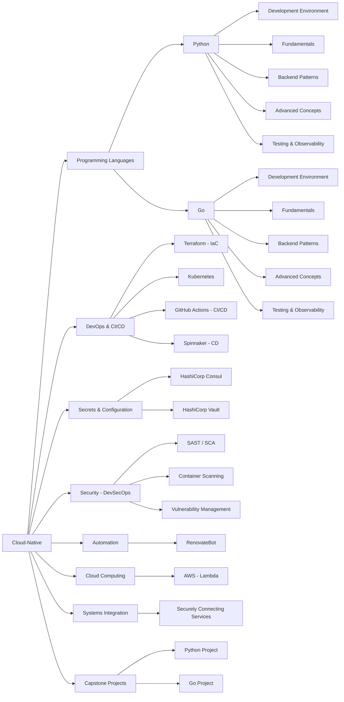

# Learn Cloud-Native Book

This repository contains the content for a comprehensive book on learning and mastering cloud-native technologies. The book aims to guide experienced programmers through the cloud-native stack, bridging their existing knowledge with new concepts, tools, and best practices.

🌐 **Live Site:** [https://castocolina.github.io/learn-cloud/index.html](https://castocolina.github.io/learn-cloud/index.html)

## Status

[](https://github.com/castocolina/learn-cloud/actions/workflows/validation.yml)
[](https://github.com/castocolina/learn-cloud/actions/workflows/validation.yml)
[](https://github.com/castocolina/learn-cloud/actions/workflows/deploy.yml)

## 📚 Book Structure

The book is organized into comprehensive units covering the complete cloud-native technology stack:

- **Unit 1:** Python for Cloud-Native Backend Development
- **Unit 2:** Go for Cloud-Native Backend Development  
- **Unit 3:** DevOps, IaC, and CI/CD
- **Unit 4:** Secrets and Configuration Management
- **Unit 5:** DevSecOps
- **Unit 6:** Automation
- **Unit 7:** The Serverless Ecosystem on AWS
- **Unit 8:** Systems Integration and Security
- **Unit 9:** Capstone Projects

For detailed content breakdown, see [CONTENT.md](CONTENT.md).

## 🚀 Getting Started

### Quick Setup with Automated Script

For a complete development environment setup (system dependencies, NVM, Node.js, and Svelte):

```bash
chmod +x src/bash/setup.sh
./src/bash/setup.sh
```

This automated script will:
- Update system packages (with confirmation)
- Install development dependencies (curl, wget, build-essential, zsh, git, shellcheck, chromium-browser)
- Install/update Node Version Manager (NVM)
- Set up Node.js LTS and pnpm
- Initialize Svelte project with Tailwind CSS and Flowbite
- Start the development server

### Manual Setup

If you prefer manual setup or already have some dependencies installed:

1. **Clone the repository:**
   ```bash
   git clone https://github.com/castocolina/learn-cloud.git
   cd learn-cloud
   ```

2. **Install dependencies:**
   ```bash
   npm install
   # or
   pnpm install
   ```

3. **Serve the content locally:**
   ```bash
   make serve
   # or for Svelte development
   npm run dev
   # or with auto-open
   npm run dev -- --open
   ```

### Svelte Development

This project also includes Svelte components powered by [`sv`](https://github.com/sveltejs/cli):

```bash
# Start Svelte development server
npm run dev

# Build for production
npm run build

# Preview production build
npm run preview
```

> To deploy your app, you may need to install an [adapter](https://svelte.dev/docs/kit/adapters) for your target environment.

### Development Environment

The project uses a `.env` file for consistent execution configuration:

```bash
# Python Environment
PYTHONPATH=src/python              # Enables imports from main Python source
PYTHONPYCACHEPREFIX=tmp/pycache   # Keeps cache files organized

# Pytest Configuration (replaces pytest.ini)
PYTEST_TESTPATHS=src/test/python
PYTEST_ADDOPTS=--verbose --tb=short
PYTEST_CACHE_DIR=tmp/pycache/.pytest_cache
```

**For Scripts & AI Agents:** When creating temporary scripts or executing commands outside Makefile, load environment variables:

```bash
# Shell scripts
set -a; source .env; set +a

# Python scripts - add to imports
import os
from pathlib import Path
env_file = Path('.env')
if env_file.exists():
    for line in env_file.read_text().strip().split('\n'):
        if '=' in line and not line.startswith('#'):
            key, value = line.split('=', 1)
            os.environ.setdefault(key.strip(), value.strip())
```

### Available Make Tasks

```bash
make serve             # Start local development server
make validate-all      # Run comprehensive validation
make validate-html     # Validate and fix HTML issues
make validate-links    # Check all internal/external links
make validate-mermaid  # Validate Mermaid diagrams
make prompt-manager    # Launch AI prompt management system
make prompt-executor   # Run automated prompt execution
```

### Project Organization

```
learn-cloud/
├── src/
│   ├── book/           # Main book content and web application
│   ├── python/         # AI prompt management system
│   └── bash/           # Automation scripts and setup utilities
├── tmp/                # Temporary files and development notes
├── .github/workflows/  # CI/CD automation
├── CONTENT.md          # Detailed book outline and structure
├── AGENTS.md           # Agent rules and project guidelines
├── TECHNICAL-SPECS.md  # Technical architecture specifications
└── VALIDATION-GUIDE.md # Comprehensive validation guide
```

## 🤖 AI-Powered Development

This project uses an advanced AI prompt management system for content generation and maintenance:

### Python AI System
- **Location:** [src/python/](src/python/)
- **Features:** Multi-agent support (Claude + Gemini), intelligent rate limiting, persistent states
- **Usage:** `make prompt-manager` or `make prompt-executor`

### Key Scripts
- **Prompt Manager:** Interactive YAML editor for creating and managing AI prompts
- **Prompt Executor:** Automated execution system with progress tracking and error handling
- **Setup Script:** Automated environment setup in [src/bash/setup.sh](src/bash/setup.sh)

For detailed documentation, see [src/python/README.md](src/python/README.md).

## 🔧 Development Tools

### Quality Assurance
- **HTML Validation:** Comprehensive validation and auto-fixing
- **CSS Standards:** Modern CSS with Grid/Flexbox, responsive design
- **JavaScript:** ES6+ standards, no external frameworks
- **Pre-commit Hooks:** Automated quality checks

### Validation Commands
```bash
make validate-html     # Validate and fix HTML issues
make validate-links    # Check all internal/external links
make validate-mermaid  # Validate Mermaid diagrams
make validate-all      # Run comprehensive validation
```

See [VALIDATION-GUIDE.md](VALIDATION-GUIDE.md) for complete validation procedures.

## 📖 Content Standards

### Writing Philosophy
- **Target Audience:** Experienced programmers new to cloud-native technologies
- **Foundation First:** Build strong conceptual foundations before advanced topics
- **Practical Focus:** Hands-on examples with industry-standard tools
- **Security by Default:** Security considerations integrated throughout

### Technical Standards
- **Modern Technologies:** Recent but stable versions of all tools
- **Production-Ready:** All code examples suitable for production use
- **Best Practices:** Industry-standard patterns and recommendations
- **Comprehensive Coverage:** From basics to advanced implementation

For detailed guidelines, see [CONTENT-STANDARDS.md](CONTENT-STANDARDS.md) and [AGENTS.md](AGENTS.md).

## 🤝 Contributing

This project follows strict quality standards and AI-assisted development workflows:

1. **Content Creation:** Use the AI prompt system for generating new content
2. **Validation:** All changes must pass comprehensive validation checks
3. **Standards:** Follow the guidelines in [AGENTS.md](AGENTS.md) and [TECHNICAL-SPECS.md](TECHNICAL-SPECS.md)
4. **Testing:** Validate across multiple devices and browsers

## 📄 License

This project is open source and available under the MIT License.

---

**Quick Links:**
- 🌐 [Live Book](https://castocolina.github.io/learn-cloud/index.html)
- 📋 [Content Outline](CONTENT.md)
- 🤖 [AI System Documentation](src/python/README.md)
- ✅ [Validation Guide](VALIDATION-GUIDE.md)
- 🔧 [Technical Specifications](TECHNICAL-SPECS.md)

## Mind Map

Here is a high-level overview of the topics covered in this book:


