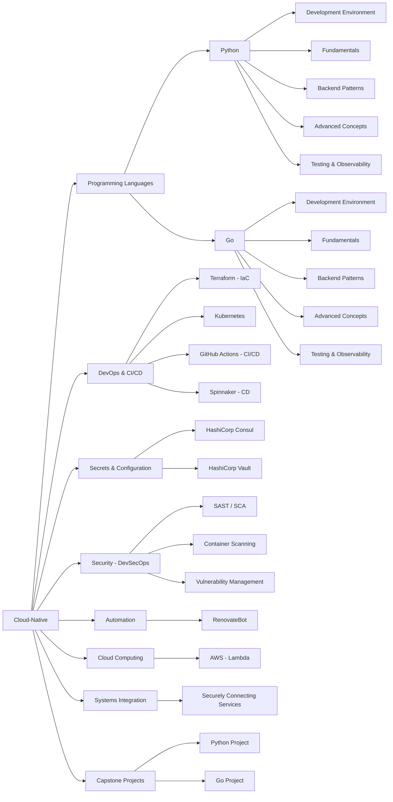

# Learn Cloud-Native Book

This repository contains the content for a comprehensive book on learning and mastering cloud-native technologies. The book aims to guide experienced programmers through the cloud-native stack, bridging their existing knowledge with new concepts, tools, and best practices.

## Status

[](https://github.com/castocolina/learn-cloud/actions/workflows/validation.yml)
[](https://github.com/castocolina/learn-cloud/actions/workflows/validation.yml)
[](https://github.com/castocolina/learn-cloud/actions/workflows/deploy.yml)

## Getting Started

To set up the project locally, follow these steps:

1.  **Clone the repository:**
    ```bash
    git clone https://github.com/castocolina/learn-cloud.git
    cd learn-cloud
    ```

2.  **Install dependencies:**
    ```bash
    npm install
    ```

3.  **Serve the content (for local viewing):**
    You can use a simple HTTP server to view the book content. If you don't have one, you can install `http-server`:
    ```bash
    npm install -g http-server
    http-server . -p 8080
    ```
    Then, open your browser and navigate to `http://localhost:8080`.

## Mind Map

Here is a high-level overview of the topics covered in this book:

